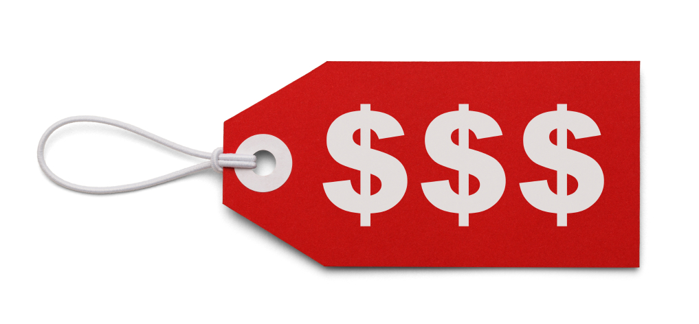
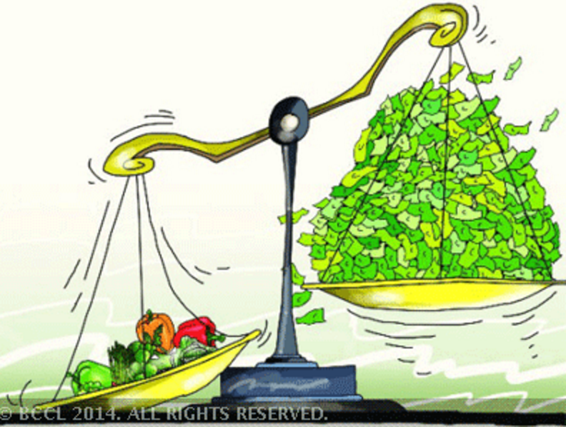

```{r setup, include=FALSE}
options(htmltools.dir.version = FALSE)
knitr::opts_chunk$set(echo=F,
                      message=F,
                      warning=F,
                      fig.retina = 3,
                      fig.align = "center")
library("tidyverse")
library("mosaic")
library("ggrepel")
library("fontawesome")
xaringanExtra::use_tile_view()
xaringanExtra::use_tachyons()
xaringanExtra::use_freezeframe()
xaringanExtra::use_progress_bar()

update_geom_defaults("label", list(family = "Fira Sans Condensed"))
update_geom_defaults("text", list(family = "Fira Sans Condensed"))

set.seed(256)
```

class: title-slide

# 1.6 — Income & Substitution Effects

## ECON 306 • Microeconomic Analysis • Spring 2023

### Ryan Safner<br> Associate Professor of Economics <br> <a href="mailto:safner@hood.edu"><i class="fa fa-paper-plane fa-fw"></i>safner@hood.edu</a> <br> <a href="https://github.com/ryansafner/microS23"><i class="fa fa-github fa-fw"></i>ryansafner/microS23</a><br> <a href="https://microS23.classes.ryansafner.com"> <i class="fa fa-globe fa-fw"></i>microS23.classes.ryansafner.com</a><br>

---

class: inverse

# Outline

### [The (Own) Price Effect](#4)
### [(Real) Income Effect](#10)
### [Substitution Effect](#15)
### [Putting the Effects Together](#18)
### [What About Inferior Goods?](#34)
### [On to Demand Curves](#49)

---

# A Demand Function (Again)

.pull-left[
.smallest[
- A consumer’s .hi[demand] (for good x) depends on .hi-turquoise[current prices & income]:

$$q_x^D = q_x^D(m, p_x, p_y)$$

- .hi-turquoise[How does demand (for x) change?]

1. .hi-purple[Income effects] $\left(\frac{\Delta q_x^D}{\Delta m}\right)$: how $q_x^D$ changes with changes in income
2. .hi-purple[Cross-price effects] $\left(\frac{\Delta q_x^D}{\Delta p_y}\right)$: how $q_x^D$ changes with changes in prices of *other* goods (e.g. $y)$
3. .hi-purple[(Own) Price effects] $\left(\frac{\Delta q_x^D}{\Delta p_x}\right)$: how $q_x^D$ changes with changes in price (of $x)$
]
]
.pull-right[
.center[

]
]
---

class: inverse, center, middle

# The (Own) Price Effect

---

# The (Own) Price Effect

.pull-left[

- .hi-purple[Price effect]: change in optimal consumption of a good associated with a change in its price, holding income and other prices constant

$$\frac{\Delta q_x^D}{\Delta p_x} < 0$$


.hi-purple[The law of demand]: as the price of a good rises, people will tend to buy less of that good (and vice versa)
  - i.e. **the price effect is negative!**

]
.pull-right[
.center[

]
]

---

# Decomposing the Price Effect

The .hi-purple[price effect] (law of demand) is actually the **net result of two effects**

--

1. .hi-green[(Real) income effect]: change in consumption due to change in real purchasing power 

--

2. .hi-orange[Substitution effect]: change in consumption due to change in relative prices

--

.center[
.hi-purple[Price Effect] $=$ .hi-green[Real income effect] $+$ .hi-orange[Substitution Effect]
]

---

class: inverse, center, middle
# (Real) Income Effect

---

# (Real) Income Effect: Demonstration

.pull-left[

- Suppose there is only 1 good to consume, $x$. You have a $100 income, and the price of $x$ is $10. You consume 10 units of $x$

- Suppose the price of $x$ rises to $20. You now consume 5 units of $x$.

- This is the .hi-green[real income effect]
]

.pull-right[

.center[

]

]

---

# (Real) Income Effect: Demonstration

.pull-left[

- .hi-green[Real income effect]: your consumption mix changes because of the change in the price of $x$ changes your .hi-green[real income] or .hi-green[purchasing power] (the amount of goods you can buy)

- Note your **_actual_ (nominal) income** ($100) **never changed!**
]

.pull-right[

.center[

]

]

---

# (Real) Income Effect: Size


.pull-left[

- The *size* of the income effect depends on how large a *portion of your budget* you spend on the good

- **Large-budget items**:
    - e.g. Housing/apartment rent, car prices
    - Price increase/decreases makes you much poorer/wealthier

]

.pull-right[

.center[


]
]

---

# (Real) Income Effect: Size


.pull-left[

- The *size* of the income effect depends on how large a *portion of your budget* you spend on the good

- **Small-budget items**:
    - e.g. pencils, toothpicks, candy
    - Price changes don’t have much of an effect on your wealth or change your behavior much

]

.pull-right[

.center[


]
]

---
class: inverse, center, middle
# Substitution Effect

---

# Substitution Effect: Demonstration

.pull-left[

- Suppose there are 1000’s of goods, none of them a major part of your budget
  - So real income effect is insignificant

- Suppose the price of good $x$ increases

- You would consume *less* of $x$ relative to other goods because $x$ is now *relatively* more expensive

- That’s the .hi-orange[substitution effect]
]

.pull-right[

.center[


]
]

---

# Substitution Effect: Demonstration

.pull-left[

- .hi-orange[Substitution effect]: consumption mix changes because of a change in **relative prices**

- Buy more of the (now) relatively cheaper items

- Buy less of the (now) relatively more expensive item $(x)$
]

.pull-right[

.center[


]
]

---

class: inverse, center, middle
# Putting the Effects Together

---

# Putting the Effects Together

- .hi-green[Real income effect]: change in consumption due to .green[change in real purchasing power]
    - **Could go in different directions**: positive (**normal goods**) or negative (**inferior goods**)
    - Higher price of $x$ means you must buy less $x$, $y$, or *both* (depending on your preferences)

--

- .hi-orange[Substitution effect]: change in consumption due to .orange[change in relative prices]
    - If $x$ gets more expensive relative to $y$, consume $\downarrow x$ (and $\uparrow y$)
    - **Always the same direction:** $(\downarrow$ relatively expensive goods, $\uparrow$ relatively cheaper goods)
    - **This is why demand curves slope downwards!**
    
--

.center[
.hi-purple[Price Effect] $=$ .hi-green[Real income effect] $+$ .hi-orange[Substitution Effect]
]

---

# Real Income and Substitution Effects, Graphically I

.pull-left[

- Original optimal consumption $(A)$

]

.pull-right[

```{r}
bc<-function(x){24-x}
ic<-function(x){144/x}
points<-tribble(
  ~x, ~y, ~letter,
  12, 12, "A"
)
opt<-ggplot(data = tibble(x = c(0,10)), aes(x = x))+
  geom_segment(x = 12, xend = 12, y = 0, yend = 12, linetype = "dashed", size = 0.5)+
  geom_segment(x = 0, xend = 12, y = 12, yend = 12, linetype = "dashed", size = 0.5)+
  geom_function(fun = bc, geom = "line", size = 2, color = "red")+
  geom_label(x = 2, y = bc(2), color = "red", label = "BC")+
  geom_function(fun = ic, geom = "line", size = 2, color = "blue")+
  geom_label(x = 22, y = ic(22), color = "blue", label = expression(u[1]))+
  geom_text_repel(data = subset(points, letter %in% c("A", "C")), aes(x = x, y = y, label = letter), size = 4, seed = 4, box.padding = 0.5)+
  geom_point(data = subset(points, letter %in% c("A")), aes(x = x, y = y), size = 5)+
  scale_x_continuous(breaks = seq(0,24,2),
  #                   labels = c(0, expression("\u2113"^"*"), 24),
                     limits = c(0,25),
                     expand = c(0,0))+
  scale_y_continuous(breaks = seq(0,24,2),
                     #labels = c(0,expression(c^"*"),"24w"),
                     expand = c(0,0),
                     limits = c(0,25))+
  labs(x = "x",
       y = "y",
       caption = expression(paste("Optima with ", u(x,y)==x^{0.5}*y^{0.5}, ", ", m==24, ", ", p[y]==1, sep=" ")))+
  theme_classic(base_family = "Fira Sans Condensed", base_size = 16)
opt
```
]

---

# Real Income and Substitution Effects, Graphically I

.pull-left[

- Original optimal consumption $(A)$

- .purple[**(Total) price effect:** `\\(A \rightarrow C\\)`]

- Let's decompose this into the two effects

]

.pull-right[
```{r}
bc2<-function(x){24-2*x}
ic<-function(x){144/x}
points<-tribble(
  ~x, ~y, ~letter,
  12, 12, "A",
  9, 16, "B",
  6, 12, "C"
)
ic2<-function(x){72/x}
opt2<-ggplot(data = tibble(x = c(0,10)), aes(x = x))+
  geom_segment(x = 12, xend = 12, y = 0, yend = 12, linetype = "dashed", size = 0.5)+
  geom_segment(x = 0, xend = 12, y = 12, yend = 12, linetype = "dashed", size = 0.5)+
  
  geom_segment(x = 6, xend = 6, y = 0, yend = 12, linetype = "dashed", size = 0.5)+
  geom_segment(x = 0, xend = 6, y = 12, yend = 12, linetype = "dashed", size = 0.5)+
  geom_function(fun = bc, geom = "line", size = 2, color = "red")+
  geom_label(x = 2, y = bc(2), color = "red", label = expression(BC[1]))+
  geom_function(fun = ic, geom = "line", size = 2, color = "blue")+
  geom_label(x = 22, y = ic(22), color = "blue", label = expression(u[1]))+
  
  geom_function(fun = bc2, geom = "line", size = 2, color = "darkred")+
  geom_label(x = 2, y = bc2(2), color = "darkred", label = expression(BC[2]))+
  
  # geom_function(fun = bc_sub, geom = "line", size = 2, color = "orange", linetype = "dashed")+
  
    geom_function(fun = ic2, geom = "line", size = 2, color = "darkblue")+
  geom_label(x = 22, y = ic2(22), color = "darkblue", label = expression(u[2]))+
  geom_point(data = subset(points, letter %in% c("A", "C")), aes(x = x, y = y), size = 5)+
  ggrepel::geom_text_repel(data = subset(points, letter %in% c("A", "C")), aes(x = x, y = y, label = letter), size = 4, seed = 4, box.padding = 0.5)+
  annotate("segment", x = 12, xend = 6, y = 2, yend = 2, colour = "purple", size=2, alpha=1, arrow=arrow(length=unit(0.5,"cm"), ends="last", type="closed"))+
  scale_x_continuous(breaks = seq(0,24,2),
  #                   labels = c(0, expression("\u2113"^"*"), 24),
                     limits = c(0,25),
                     expand = c(0,0))+
  scale_y_continuous(breaks = seq(0,24,2),
                     #labels = c(0,expression(c^"*"),"24w"),
                     expand = c(0,0),
                     limits = c(0,25))+
  labs(x = "x",
       y = "y",
       caption = expression(paste("Optima with ", u(x,y)==x^{0.5}*y^{0.5}, ", ", m==24, ", ", p[y]==1, sep=" ")))+
  theme_classic(base_family = "Fira Sans Condensed", base_size = 16)
opt2
```

]

---

# Real Income and Substitution Effects, Graphically II

.pull-left[

- .orange[**Substitution effect:**] what you would choose under the **new exchange rate** to **remain indifferent** as before the change

]

.pull-right[

```{r, fig.retina=3}
opt2
```

]

---

# Real Income and Substitution Effects, Graphically II

.pull-left[

- .orange[**Substitution effect:**] what you would choose under the **new exchange rate** to **remain indifferent** as before the change

- Graphically: shift *new* budget constraint inwards until tangent with *old* indifference curve

- $A \rightarrow B$ on same I.C. $(\downarrow$ $x$, $\uparrow$ $y)$
  - .slate[Note: Point B *must* be a *different* point on the original curve! Why?]

]

.pull-right[
```{r}
bc_sub<-function(x){34-2*x}
se_dom<-ggplot(data = tibble(x = c(0,10)), aes(x = x))+
  geom_function(fun = bc, geom = "line", size = 2, color = "red")+
  geom_label(x = 2, y = bc(2), color = "red", label = expression(BC[1]))+
  geom_function(fun = ic, geom = "line", size = 2, color = "blue")+
  geom_label(x = 22, y = ic(22), color = "blue", label = expression(u[1]))+
  
  geom_function(fun = bc2, geom = "line", size = 2, color = "darkred")+
  geom_label(x = 2, y = bc2(2), color = "darkred", label = expression(BC[2]))+
  
  
  geom_function(fun = bc_sub, geom = "line", size = 2, color = "orange", linetype = "dashed")+
  
  geom_function(fun = ic2, geom = "line", size = 2, color = "darkblue")+
  geom_label(x = 22, y = ic2(22), color = "darkblue", label = expression(u[0]))+
  geom_segment(x = 12, xend = 12, y = 0, yend = 12, linetype = "dashed", size = 0.5)+
  geom_segment(x = 0, xend = 12, y = 12, yend = 12, linetype = "dashed", size = 0.5)+
  
  geom_segment(x = 6, xend = 6, y = 0, yend = 12, linetype = "dashed", size = 0.5)+
  geom_segment(x = 0, xend = 6, y = 12, yend = 12, linetype = "dashed", size = 0.5)+
  
  geom_segment(x = 9, xend = 9, y = 0, yend = 16, linetype = "dashed", size = 0.5)+
  geom_segment(x = 0, xend = 9, y = 16, yend = 16, linetype = "dashed", size = 0.5)+
  geom_point(data = subset(points, letter %in% c("A", "B", "C")), aes(x = x, y = y), size = 5)+
  ggrepel::geom_text_repel(data = subset(points, letter %in% c("A","B", "C")), aes(x = x, y = y, label = letter), size = 4, seed = 4, box.padding = 0.5)+
  #annotate("segment", x = 12, xend = 10, y = 2, yend = 2, colour = "purple", size=2, alpha=1, arrow=arrow(length=unit(0.5,"cm"), ends="last", type="closed"))+
  annotate("segment", x = 12, xend = 9, y = 4, yend = 4, colour = "orange", size=2, alpha=1, arrow=arrow(length=unit(0.5,"cm"), ends="last", type="closed"))+
  scale_x_continuous(breaks = seq(0,24,2),
  #                   labels = c(0, expression("\u2113"^"*"), 24),
                     limits = c(0,25),
                     expand = c(0,0))+
  scale_y_continuous(breaks = seq(0,24,2),
                     #labels = c(0,expression(c^"*"),"24w"),
                     expand = c(0,0),
                     limits = c(0,25))+
  labs(x = "x",
       y = "y",
       caption = expression(paste("Optima with ", u(x,y)==x^{0.5}*y^{0.5}, ", ", m==24, ", ", p[y]==1, sep=" ")))+
  theme_classic(base_family = "Fira Sans Condensed", base_size = 16)
se_dom
```
]

---

# Real Income and Substitution Effects, Graphically III

.pull-left[

- .green[**(Real) income effect:**] change in consumption due to the **change in purchasing power** from the price change

]

.pull-right[

```{r, fig.retina=3}
se_dom
```

]

---

# Real Income and Substitution Effects, Graphically III

.pull-left[

- .green[**(Real) income effect:**] change in consumption due to the **change in purchasing power** from the price change

- $B \rightarrow C$ to new budget constraint (can buy less of $x$ and/or $y$)
]

.pull-right[

```{r, fig.retina=3}
se_dom+
  annotate("segment", x = 9, xend = 6, y = 4, yend = 4, colour = "#047806", size=2, alpha=1, arrow=arrow(length=unit(0.5,"cm"), ends="last", type="closed"))
```

]

---

# Real Income and Substitution Effects, Graphically IV

.pull-left[

- Original optimal consumption $(A)$

]

.pull-right[

```{r}
opt
```

]

---

# Real Income and Substitution Effects, Graphically IV

.pull-left[

- Original optimal consumption $(A)$

- Price of $x$ rises, new optimal consumption at $(C)$

]

.pull-right[

```{r}
opt2
```

]

---

# Real Income and Substitution Effects, Graphically IV

.pull-left[

- Original optimal consumption $(A)$

- Price of $x$ rises, new optimal consumption at $(C)$

- .orange[**Substitution effect:** `\\(A \rightarrow B\\)`] on same I.C. $(\downarrow$ more expensive $x$ and $\uparrow$ $y)$

]

.pull-right[

```{r}
se_dom
```

]

---

# Real Income and Substitution Effects, Graphically IV

.pull-left[

- Original optimal consumption $(A)$

- Price of $x$ rises, new optimal consumption at $(C)$

- .orange[**Substitution effect:** `\\(A \rightarrow B\\)`] on same I.C. $(\downarrow$ more expensive $x$ and $\uparrow$ $y)$

- .green[**(Real) income effect:** `\\(B \rightarrow C\\)`] to new budget constraint (can buy less of $x$ and/or $y$)

]

.pull-right[

```{r}
se_dom+
  annotate("segment", x = 9, xend = 6, y = 6, yend = 6, colour = "#047806", size=2, alpha=1, arrow=arrow(length=unit(0.5,"cm"), ends="last", type="closed"))
```

]

---

# Real Income and Substitution Effects, Graphically IV

.pull-left[

- Original optimal consumption $(A)$

- Price of $x$ rises, new optimal consumption at $(C)$

- .orange[**Substitution effect:** `\\(A \rightarrow B\\)`] on same I.C. $(\downarrow$ more expensive $x$ and $\uparrow$ $y)$

- .green[**(Real) income effect:** `\\(B \rightarrow C\\)`] to new budget constraint (can buy less of $x$ and/or $y$)

- .purple[**(Total) price effect:** `\\(A \rightarrow C\\)`]

]

.pull-right[

```{r}
se_dom+
  annotate("segment", x = 9, xend = 6, y = 6, yend = 6, colour = "#047806", size=2, alpha=1, arrow=arrow(length=unit(0.5,"cm"), ends="last", type="closed"))+
    annotate("segment", x = 12, xend = 6, y = 2, yend = 2, colour = "purple", size=2, alpha=1, arrow=arrow(length=unit(0.5,"cm"), ends="last", type="closed"))
```

]

---

```{r, fig.width=15}
se_dom+
  annotate("segment", x = 9, xend = 6, y = 6, yend = 6, colour = "#047806", size=2, alpha=1, arrow=arrow(length=unit(0.5,"cm"), ends="last", type="closed"))+
    annotate("segment", x = 12, xend = 6, y = 2, yend = 2, colour = "purple", size=2, alpha=1, arrow=arrow(length=unit(0.5,"cm"), ends="last", type="closed"))+
  labs(title = "Change in Consumption From an Increase in Price",
       subtitle = "Normal Good")
```

---

class: inverse, center, middle

# What About Inferior Goods?

---

# Inferior Goods, Graphically I

.pull-left[

- Original optimal consumption $(A)$

]

.pull-right[

```{r}
opt
```
]

---

# Inferior Goods, Graphically I

.pull-left[

- Original optimal consumption $(A)$

- .purple[**(Total) price effect:** `\\(A \rightarrow C\\)`]

- Let's decompose this into the two effects

]

.pull-right[
```{r}
points_inf<-tribble(
  ~x, ~y, ~letter,
  12, 12, "A",
  9, 16, "B",
  10, 4, "C"
)
#ic_inf<-function(x){60/(x-4)-5.5}
#ic_inf<-function(x){60/(x-4)^1.25-2}
#ic_inf<-function(x){60/(x-5)^1.25-4}
# ic_inf<-function(x){32/(x-4)^0.25-14}

#ic_inf<-function(x){48/(x-6)^1.5-2}

ic_inf<-function(x){32/(x-6)-4}

opt_inf<-ggplot(data = tibble(x = c(0,10)), aes(x = x))+
  geom_segment(x = 12, xend = 12, y = 0, yend = 12, linetype = "dashed", size = 0.5)+
  geom_segment(x = 0, xend = 12, y = 12, yend = 12, linetype = "dashed", size = 0.5)+
  
  geom_segment(x = 10, xend = 10, y = 0, yend = 4, linetype = "dashed", size = 0.5)+
  geom_segment(x = 0, xend = 10, y = 4, yend = 4, linetype = "dashed", size = 0.5)+
  geom_function(fun = bc, geom = "line", size = 2, color = "red")+
  geom_label(x = 2, y = bc(2), color = "red", label = expression(BC[1]))+
  geom_function(fun = ic, geom = "line", size = 2, color = "blue")+
  geom_label(x = 22, y = ic(22), color = "blue", label = expression(u[1]))+
  
  geom_function(fun = bc2, geom = "line", size = 2, color = "darkred")+
  geom_label(x = 2, y = bc2(2), color = "darkred", label = expression(BC[2]))+
  
  # geom_function(fun = bc_sub, geom = "line", size = 2, color = "orange", linetype = "dashed")+
  
  geom_function(fun = ic_inf, geom = "line", size = 2, color = "darkblue", xlim=c(8.5,13))+
  geom_label(x = 22, y = ic_inf(22), color = "darkblue", label = expression(u[2]))+
  geom_point(data = subset(points_inf, letter %in% c("A", "C")), aes(x = x, y = y), size = 5)+
  geom_text_repel(data = subset(points_inf, letter %in% c("A", "C")), aes(x = x, y = y, label = letter), size = 4, seed = 4, box.padding = 0.5)+
  annotate("segment", x = 12, xend = 10, y = 2, yend = 2, colour = "purple", size=2, alpha=1, arrow=arrow(length=unit(0.5,"cm"), ends="last", type="closed"))+
  scale_x_continuous(breaks = seq(0,24,2),
  #                   labels = c(0, expression("\u2113"^"*"), 24),
                     limits = c(0,25),
                     expand = c(0,0))+
  scale_y_continuous(breaks = seq(0,24,2),
                     #labels = c(0,expression(c^"*"),"24w"),
                     expand = c(0,0),
                     limits = c(0,25))+
  labs(x = "x",
       y = "y",
       caption = expression(paste("Optima with ", u(x,y)==x^{0.5}*y^{0.5}, ", ", m==24, ", ", p[y]==1, sep=" ")))+
  theme_classic(base_family = "Fira Sans Condensed", base_size = 16)
opt_inf
```

]

---

# Inferior Goods, Graphically II

.pull-left[

- .orange[**Substitution effect:**] what you would choose under the **new exchange rate** to **remain indifferent** as before the change

]

.pull-right[

```{r}
opt_inf
```

]

---

# Inferior Goods, Graphically II

.pull-left[

- .orange[**Substitution effect:**] what you would choose under the **new exchange rate** to **remain indifferent** as before the change

- Graphically: shift *new* budget constraint inwards until tangent with *old* indifference curve

- $A \rightarrow B$ on same I.C. $(\downarrow$ $x$, $\uparrow$ $y)$

]

.pull-right[
```{r}
se_dom_inf<-ggplot(data = tibble(x = c(0,10)), aes(x = x))+
  geom_function(fun = bc, geom = "line", size = 2, color = "red")+
  geom_label(x = 2, y = bc(2), color = "red", label = expression(BC[1]))+
  geom_function(fun = ic, geom = "line", size = 2, color = "blue")+
  geom_label(x = 22, y = ic(22), color = "blue", label = expression(u[1]))+
  
  geom_function(fun = bc2, geom = "line", size = 2, color = "darkred")+
  geom_label(x = 2, y = bc2(2), color = "darkred", label = expression(BC[2]))+
  
  
  geom_function(fun = bc_sub, geom = "line", size = 2, color = "orange", linetype = "dashed")+
  
  geom_function(fun = ic_inf, geom = "line", size = 2, color = "darkblue", xlim=c(8.5,20))+
  geom_label(x = 22, y = ic_inf(22), color = "darkblue", label = expression(u[0]))+
  geom_segment(x = 12, xend = 12, y = 0, yend = 12, linetype = "dashed", size = 0.5)+
  geom_segment(x = 0, xend = 12, y = 12, yend = 12, linetype = "dashed", size = 0.5)+
  
  geom_segment(x = 10, xend = 10, y = 0, yend = 4, linetype = "dashed", size = 0.5)+
  geom_segment(x = 0, xend = 10, y = 4, yend = 4, linetype = "dashed", size = 0.5)+
  
  geom_segment(x = 9, xend = 9, y = 0, yend = 16, linetype = "dashed", size = 0.5)+
  geom_segment(x = 0, xend = 9, y = 16, yend = 16, linetype = "dashed", size = 0.5)+
  geom_point(data = subset(points_inf, letter %in% c("A", "B", "C")), aes(x = x, y = y), size = 5)+
  geom_text_repel(data = subset(points_inf, letter %in% c("A","B", "C")), aes(x = x, y = y, label = letter), size = 4, seed = 4, box.padding = 0.5)+
  #annotate("segment", x = 12, xend = 10, y = 2, yend = 2, colour = "purple", size=2, alpha=1, arrow=arrow(length=unit(0.5,"cm"), ends="last", type="closed"))+
  annotate("segment", x = 12, xend = 9, y = 8, yend = 8, colour = "orange", size=2, alpha=1, arrow=arrow(length=unit(0.5,"cm"), ends="last", type="closed"))+
  scale_x_continuous(breaks = seq(0,24,2),
  #                   labels = c(0, expression("\u2113"^"*"), 24),
                     limits = c(0,25),
                     expand = c(0,0))+
  scale_y_continuous(breaks = seq(0,24,2),
                     #labels = c(0,expression(c^"*"),"24w"),
                     expand = c(0,0),
                     limits = c(0,25))+
  labs(x = "x",
       y = "y",
       caption = expression(paste("Optima with ", u(x,y)==x^{0.5}*y^{0.5}, ", ", m==24, ", ", p[y]==1, sep=" ")))+
  theme_classic(base_family = "Fira Sans Condensed", base_size = 16)
se_dom_inf
```
]

---

# Inferior Goods, Graphically III

.pull-left[

- .green[**(Real) income effect:**] change in consumption due to the **change in purchasing power** from the price change

]

.pull-right[

```{r}
se_dom_inf
```

]

---

# Inferior Goods, Graphically III

.pull-left[

- .green[**(Real) income effect:**] change in consumption due to the **change in purchasing power** from the price change

- $B \rightarrow C$ to new budget constraint (can buy less of $x$ and/or $y$)
]

.pull-right[

```{r}
se_dom_inf+
  annotate("segment", x = 9, xend = 10, y = 6, yend = 6, colour = "#047806", size=2, alpha=1, arrow=arrow(length=unit(0.5,"cm"), ends="last", type="closed"))
```

]

---

# Inferior Goods, Graphically IV

.pull-left[

- Original optimal consumption $(A)$

]

.pull-right[

```{r}
opt
```

]

---

# Inferior Goods, Graphically IV

.pull-left[

- Original optimal consumption $(A)$

- Price of $x$ rises, new optimal consumption at $(C)$

]

.pull-right[

```{r}
opt_inf
```

]

---

# Inferior Goods, Graphically IV

.pull-left[

- Original optimal consumption $(A)$

- Price of $x$ rises, new optimal consumption at $(C)$

- .orange[**Substitution effect:** `\\(A \rightarrow B\\)`] on same I.C. $(\downarrow$ more expensive $x$ and $\uparrow$ $y)$

]

.pull-right[

```{r}
se_dom_inf
```

]

---

# Inferior Goods, Graphically IV

.pull-left[

- Original optimal consumption $(A)$

- Price of $x$ rises, new optimal consumption at $(C)$

- .orange[**Substitution effect:** `\\(A \rightarrow B\\)`] on same I.C. $(\downarrow$ more expensive $x$ and $\uparrow$ $y)$

- .green[**(Real) income effect:** `\\(B \rightarrow C\\)`] to new budget constraint (can buy less $x$ and/or $y$)

]

.pull-right[

```{r}
se_dom_inf+
  annotate("segment", x = 9, xend = 10, y = 6, yend = 6, colour = "#047806", size=2, alpha=1, arrow=arrow(length=unit(0.5,"cm"), ends="last", type="closed"))
```

]

---

# Inferior Goods, Graphically IV

.pull-left[

- Original optimal consumption $(A)$

- Price of $x$ rises, new optimal consumption at $(C)$

- .orange[**Substitution effect:** `\\(A \rightarrow B\\)`] on same I.C. $(\downarrow$ more expensive $x$ and $\uparrow$ $y)$

- .green[**(Real) income effect:** `\\(B \rightarrow C\\)`] to new budget constraint (can buy less $x$ and/or $y$)

- .purple[**(Total) price effect:** `\\(A \rightarrow C\\)`]

]

.pull-right[

```{r}
se_dom_inf+
  annotate("segment", x = 9, xend = 10, y = 6, yend = 6, colour = "#047806", size=2, alpha=1, arrow=arrow(length=unit(0.5,"cm"), ends="last", type="closed"))+
    annotate("segment", x = 12, xend = 10, y = 2, yend = 2, colour = "purple", size=2, alpha=1, arrow=arrow(length=unit(0.5,"cm"), ends="last", type="closed"))

```

]

---

```{r, fig.width = 15}
se_dom_inf+
  annotate("segment", x = 9, xend = 10, y = 6, yend = 6, colour = "#047806", size=2, alpha=1, arrow=arrow(length=unit(0.5,"cm"), ends="last", type="closed"))+
    annotate("segment", x = 12, xend = 10, y = 2, yend = 2, colour = "purple", size=2, alpha=1, arrow=arrow(length=unit(0.5,"cm"), ends="last", type="closed"))+
  labs(title = "Change in Consumption From an Increase in Price",
       caption = "",
       subtitle = "Inferior Good")
```
---

# Violating the Law of Demand

.bg-washed-green.b--dark-green.ba.bw2.br3.shadow-5.ph4.mt5[
.green[**Example**]: What would it take to violate the law of demand?
]

---

# A Giffen Good

.pull-left[

- .hi-purple[Giffen good]: theoretical good that violates law of demand

.smallest[
.center[
.hi-green[(negative) real income effect] $>$ .hi-orange[substitution effect]
]


1. Few substitutes (small .orange[substitution effect])
2. An inferior good (negative .green[real income effect])
3. A large portion of income spent on it (large .green[real income effect]) 
]

- Price increase (decrease) causes person to buy *more* (less)
]

.pull-right[
.center[

]
]

---

# Recap: Real Income and Substitution Effects

.center[
.hi-purple[Price Effect] $=$ .hi-green[Real income effect] $+$ .hi-orange[Substitution Effect]
]

- .hi-orange[Substitution effect]: is always in the direction of the cheaper good

- .hi-green[Real Income effect]: can be positive (normal) or negative (inferior)

- .hi-purple[Law of Demand]/Demand curves slope downwards (.hi-purple[Price effect]) mostly because of the substitution effect
    - Even (inferior) goods with negative real income effects overpowered by substitution effect

- Theoretical **Giffen good** exception: .green[negative R.I.E.] $>$ .orange[S.E.]

---

class: inverse, center, middle
# On To Demand Curves

---

# Deriving a Demand Curve Graphically

.pull-left[

```{r}
points_demand<-tribble(
  ~letter, ~x, ~y,
  "A", 2.5, 5,
  "B", 5, 5,
  "C", 10, 5
)

IC_demand_1=function(x){12.5/x}
IC_demand_2=function(x){25/x}
IC_demand_3=function(x){50/x}
BC_demand_1=function(x){10-2*x}
BC_demand_2=function(x){10-x}
BC_demand_3=function(x){10-0.5*x}

cd_demand=function(x){0.5*20/x}

points_demand_2<-tribble(
  ~letter, ~x, ~y,
  "A", 2.5, 4,
  "B", 5, 2,
  "C", 10, 1
)
```

```{r, fig.retina=3, fig.height=6}
ggplot(data.frame(x=c(0,10)), aes(x=x))+
  stat_function(fun=IC_demand_1, geom="line", size=2, color = "#453781FF")+
  stat_function(fun=BC_demand_1, geom="line", size=2, color = "red")+
    geom_label(aes(x=1,y=IC_demand_1(1)), color = "#453781FF", label=expression(u[1]), size = 6)+
    geom_label(aes(x=4,y=BC_demand_1(4)), color = "red", label=expression(paste(p[x],"=$4")), size = 6)+
  geom_point(data = subset(points_demand, letter=="A"),
             mapping=aes(x=x, y=y),
             size = 3)+
  geom_text_repel(data = subset(points_demand, letter=="A"),
             mapping=aes(x=x, y=y,
             label = letter),
             seed = 2,
             size = 6)+
  # A lines
  geom_segment(aes(x = 0, xend = 2.5, y = 5, yend=5), linetype="dotted", size=1)+
  geom_segment(aes(x = 2.5, xend = 2.5, y = 5, yend=0), linetype="dotted", size=1)+
    scale_x_continuous(breaks=seq(0,20,2),
                     limits=c(0,20),
                     expand=expand_scale(mult=c(0,0.1)))+
  scale_y_continuous(breaks=seq(0,20,2),
                     limits=c(0,20),
                     expand=expand_scale(mult=c(0,0.1)))+
  labs(x = "x",
       y = "y",
       caption = expression(paste("Optima with ", u(x,y)==x^{0.5}*y^{0.5}, ", ", m==20, ", ", p[y]==2, sep=" ")))+
  theme_classic(base_family = "Fira Sans Condensed", base_size=20)
```
]

.pull-right[
```{r, fig.retina=3, fig.height=6}
ggplot(data.frame(x=c(0,10)), aes(x=x))+
  geom_point(data = subset(points_demand_2, letter=="A"),
             mapping=aes(x=x, y=y),
             size = 3)+
  geom_text_repel(data = subset(points_demand_2, letter=="A"),
             mapping=aes(x=x, y=y,
             label = letter),
             seed = 2,
             size = 6)+
    scale_x_continuous(breaks=seq(0,20,2),
                     limits=c(0,20),
                     expand=expand_scale(mult=c(0,0.1)))+
  scale_y_continuous(breaks=seq(0,10,1),
                     limits=c(0,10),
                     expand=expand_scale(mult=c(0,0.1)),
                     labels = function(x){paste("$", x, sep="")})+
  coord_cartesian(clip="off")+
  labs(x = "Quantity of x",
       y = "Price of x",
      caption = expression(paste("Demand function: ", q=frac(m,2*p), " ; Inverse Demand function: ", p==frac(m,2*q), sep="")))+
  theme_classic(base_family = "Fira Sans Condensed", base_size=20)
```

]

.smallest[
- Demand curve for $x$ relates optimal consumption of $x$ ("quantity") as price of $x$ changes
- At $p_x=4$, consumer buys 2 $x$
]

---

# Deriving a Demand Curve Graphically

.pull-left[

```{r, fig.retina=3, fig.height=6}
ggplot(data.frame(x=c(0,10)), aes(x=x))+
  stat_function(fun=IC_demand_1, geom="line", size=2, color = "#453781FF")+
  stat_function(fun=IC_demand_2, geom="line", size=2, color = "#2D708EFF")+
  stat_function(fun=BC_demand_1, geom="line", size=2, color = "red")+
  stat_function(fun=BC_demand_2, geom="line", size=2, color = "red", linetype="dashed")+
    geom_label(aes(x=1,y=IC_demand_1(1)), color = "#453781FF", label=expression(u[1]), size = 6)+
    geom_label(aes(x=1.75,y=IC_demand_2(1.75)), color = "#2D708EFF", label=expression(u[2]), size = 6)+
    geom_label(aes(x=4,y=BC_demand_1(4)), color = "red", label=expression(paste(p[x],"=$4")), size = 6)+
    geom_label(aes(x=8,y=BC_demand_2(8)), color = "red", label=expression(paste(p[x],"=$2")), size = 6)+
  geom_point(data = subset(points_demand, letter %in% c("A","B")),
             mapping=aes(x=x, y=y),
             size = 3)+
  geom_text_repel(data = subset(points_demand, letter %in% c("A","B")),
             mapping=aes(x=x, y=y,
             label = letter),
             seed = 2,
             size = 6)+
  # A lines
  geom_segment(aes(x = 0, xend = 2.5, y = 5, yend=5), linetype="dotted", size=1)+
  geom_segment(aes(x = 2.5, xend = 2.5, y = 5, yend=0), linetype="dotted", size=1)+
  
  # B lines
  geom_segment(aes(x = 2.5, xend = 5, y = 5, yend=5), linetype="dotted", size=1)+
  geom_segment(aes(x = 5, xend = 5, y = 5, yend=0), linetype="dotted", size=1)+
    scale_x_continuous(breaks=seq(0,20,2),
                     limits=c(0,20),
                     expand=expand_scale(mult=c(0,0.1)))+
  scale_y_continuous(breaks=seq(0,20,2),
                     limits=c(0,20),
                     expand=expand_scale(mult=c(0,0.1)))+
  labs(x = "x",
       y = "y",
       caption = expression(paste("Optima with ", u(x,y)==x^{0.5}*y^{0.5}, ", ", m==20, ", ", p[y]==2, sep=" ")))+
  theme_classic(base_family = "Fira Sans Condensed", base_size=20)
```
]

.pull-right[
```{r, fig.retina=3, fig.height=6}
ggplot(data.frame(x=c(0,10)), aes(x=x))+
  geom_point(data = subset(points_demand_2, letter %in% c("A","B")),
             mapping=aes(x=x, y=y),
             size = 3)+
  geom_text_repel(data = subset(points_demand_2, letter %in% c("A","B")),
             mapping=aes(x=x, y=y,
             label = letter),
             seed = 2,
             size = 6)+
    scale_x_continuous(breaks=seq(0,20,2),
                     limits=c(0,20),
                     expand=expand_scale(mult=c(0,0.1)))+
  scale_y_continuous(breaks=seq(0,10,1),
                     limits=c(0,10),
                     expand=expand_scale(mult=c(0,0.1)),
                     labels = function(x){paste("$", x, sep="")})+
  coord_cartesian(clip="off")+
  labs(x = "Quantity of x",
       y = "Price of x",
      caption = expression(paste("Demand function: ", q=frac(m,2*p), " ; Inverse Demand function: ", p==frac(m,2*q), sep="")))+
  theme_classic(base_family = "Fira Sans Condensed", base_size=20)
```

]

.smallest[
- Demand curve for $x$ relates optimal consumption of $x$ ("quantity") as price of $x$ changes
- At $p_x=4$, consumer buys 2 $x$; at $p_x=2$, consumer buys 5 $x$

]
---

# Deriving a Demand Curve Graphically

.pull-left[

```{r, fig.retina=3, fig.height=6}
ggplot(data.frame(x=c(0,10)), aes(x=x))+
  stat_function(fun=IC_demand_1, geom="line", size=2, color = "#453781FF")+
  stat_function(fun=IC_demand_2, geom="line", size=2, color = "#2D708EFF")+
  stat_function(fun=IC_demand_3, geom="line", size=2, color = "#20A387FF")+
  stat_function(fun=BC_demand_1, geom="line", size=2, color = "red")+
  stat_function(fun=BC_demand_2, geom="line", size=2, color = "red", linetype="dashed")+
  stat_function(fun=BC_demand_3, geom="line", size=2, color = "red", linetype="dashed")+
    geom_label(aes(x=1,y=IC_demand_1(1)), color = "#453781FF", label=expression(u[1]), size = 6)+
    geom_label(aes(x=1.75,y=IC_demand_2(1.75)), color = "#2D708EFF", label=expression(u[2]), size = 6)+
    geom_label(aes(x=3,y=IC_demand_3(3)), color = "#20A387FF", label=expression(u[3]), size = 6)+
    geom_label(aes(x=4,y=BC_demand_1(4)), color = "red", label=expression(paste(p[x],"=$4")), size = 6)+
    geom_label(aes(x=8,y=BC_demand_2(8)), color = "red", label=expression(paste(p[x],"=$2")), size = 6)+
    geom_label(aes(x=15,y=BC_demand_3(15)), color = "red", label=expression(paste(p[x],"=$1")), size = 6)+
  geom_point(data = points_demand,
             mapping=aes(x=x, y=y),
             size = 3)+
  geom_text_repel(data = points_demand,
             mapping=aes(x=x, y=y,
             label = letter),
             seed = 2,
             size = 6)+
  # A lines
  geom_segment(aes(x = 0, xend = 2.5, y = 5, yend=5), linetype="dotted", size=1)+
  geom_segment(aes(x = 2.5, xend = 2.5, y = 5, yend=0), linetype="dotted", size=1)+
  
  # B lines
  geom_segment(aes(x = 2.5, xend = 5, y = 5, yend=5), linetype="dotted", size=1)+
  geom_segment(aes(x = 5, xend = 5, y = 5, yend=0), linetype="dotted", size=1)+
  # C lines
  geom_segment(aes(x = 5, xend = 10, y = 5, yend=5), linetype="dotted", size=1)+
  geom_segment(aes(x = 10, xend = 10, y = 5, yend=0), linetype="dotted", size=1)+
  #annotate("segment", x = 20, xend = 10, y = 10, yend = 35, colour = "purple", size=2, alpha=1, arrow=arrow(length=unit(0.5,"cm"), ends="last", type="closed"))+
    scale_x_continuous(breaks=seq(0,20,2),
                     limits=c(0,20),
                     expand=expand_scale(mult=c(0,0.1)))+
  scale_y_continuous(breaks=seq(0,20,2),
                     limits=c(0,20),
                     expand=expand_scale(mult=c(0,0.1)))+
  labs(x = "x",
       y = "y",
       caption = expression(paste("Optima with ", u(x,y)==x^{0.5}*y^{0.5}, ", ", m==20, ", ", p[y]==2, sep=" ")))+
  theme_classic(base_family = "Fira Sans Condensed", base_size=20)
```
]

.pull-right[
```{r, fig.retina=3, fig.height=6}
ggplot(data.frame(x=c(0,10)), aes(x=x))+
  geom_point(data = points_demand_2,
             mapping=aes(x=x, y=y),
             size = 3)+
  geom_text_repel(data = points_demand_2,
             mapping=aes(x=x, y=y,
             label = letter),
             seed = 2,
             size = 6)+
    scale_x_continuous(breaks=seq(0,20,2),
                     limits=c(0,20),
                     expand=expand_scale(mult=c(0,0.1)))+
  scale_y_continuous(breaks=seq(0,10,1),
                     limits=c(0,10),
                     expand=expand_scale(mult=c(0,0.1)),
                     labels = function(x){paste("$", x, sep="")})+
  coord_cartesian(clip="off")+
  labs(x = "Quantity of x",
       y = "Price of x",
      caption = expression(paste("Demand function: ", q=frac(m,2*p), " ; Inverse Demand function: ", p==frac(m,2*q), sep="")))+
  theme_classic(base_family = "Fira Sans Condensed", base_size=20)
```

]

.smallest[
- Demand curve for $x$ relates optimal consumption of $x$ ("quantity") as price of $x$ changes
- At $p_x=4$, consumer buys 2 $x$; at $p_x=2$, consumer buys 5 $x$; at $p_x=1$, consumer buys 10 $x$
]

---

# Deriving a Demand Curve Graphically


.pull-left[

```{r, fig.retina=3, fig.height=6}
ggplot(data.frame(x=c(0,10)), aes(x=x))+
  stat_function(fun=IC_demand_1, geom="line", size=2, color = "#453781FF")+
  stat_function(fun=IC_demand_2, geom="line", size=2, color = "#2D708EFF")+
  stat_function(fun=IC_demand_3, geom="line", size=2, color = "#20A387FF")+
  stat_function(fun=BC_demand_1, geom="line", size=2, color = "red")+
  stat_function(fun=BC_demand_2, geom="line", size=2, color = "red", linetype="dashed")+
  stat_function(fun=BC_demand_3, geom="line", size=2, color = "red", linetype="dashed")+
    geom_label(aes(x=1,y=IC_demand_1(1)), color = "#453781FF", label=expression(u[1]), size = 6)+
    geom_label(aes(x=1.75,y=IC_demand_2(1.75)), color = "#2D708EFF", label=expression(u[2]), size = 6)+
    geom_label(aes(x=3,y=IC_demand_3(3)), color = "#20A387FF", label=expression(u[3]), size = 6)+
    geom_label(aes(x=4,y=BC_demand_1(4)), color = "red", label=expression(paste(p[x],"=$4")), size = 6)+
    geom_label(aes(x=8,y=BC_demand_2(8)), color = "red", label=expression(paste(p[x],"=$2")), size = 6)+
    geom_label(aes(x=15,y=BC_demand_3(15)), color = "red", label=expression(paste(p[x],"=$1")), size = 6)+
  geom_point(data = points_demand,
             mapping=aes(x=x, y=y),
             size = 3)+
  geom_text_repel(data = points_demand,
             mapping=aes(x=x, y=y,
             label = letter),
             seed = 2,
             size = 6)+
  # A lines
  geom_segment(aes(x = 0, xend = 2.5, y = 5, yend=5), linetype="dotted", size=1)+
  geom_segment(aes(x = 2.5, xend = 2.5, y = 5, yend=0), linetype="dotted", size=1)+
  
  # B lines
  geom_segment(aes(x = 2.5, xend = 5, y = 5, yend=5), linetype="dotted", size=1)+
  geom_segment(aes(x = 5, xend = 5, y = 5, yend=0), linetype="dotted", size=1)+
  # C lines
  geom_segment(aes(x = 5, xend = 10, y = 5, yend=5), linetype="dotted", size=1)+
  geom_segment(aes(x = 10, xend = 10, y = 5, yend=0), linetype="dotted", size=1)+
  #annotate("segment", x = 20, xend = 10, y = 10, yend = 35, colour = "purple", size=2, alpha=1, arrow=arrow(length=unit(0.5,"cm"), ends="last", type="closed"))+
    scale_x_continuous(breaks=seq(0,20,2),
                     limits=c(0,20),
                     expand=expand_scale(mult=c(0,0.1)))+
  scale_y_continuous(breaks=seq(0,20,2),
                     limits=c(0,20),
                     expand=expand_scale(mult=c(0,0.1)))+
  labs(x = "x",
       y = "y",
       caption = expression(paste("Optima with ", u(x,y)==x^{0.5}*y^{0.5}, ", ", m==20, ", ", p[y]==2, sep=" ")))+
  theme_classic(base_family = "Fira Sans Condensed", base_size=20)
```
]

.pull-right[
```{r, fig.retina=3, fig.height=6}
ggplot(data.frame(x=c(0,10)), aes(x=x))+
  stat_function(fun=cd_demand, geom="line", size=2, color = "blue")+
  geom_label(aes(x=16,y=cd_demand(16)), color = "blue", label="Demand", size = 6)+
  geom_point(data = points_demand_2,
             mapping=aes(x=x, y=y),
             size = 3)+
  geom_text_repel(data = points_demand_2,
             mapping=aes(x=x, y=y,
             label = letter),
             seed = 2,
             size = 6)+
    scale_x_continuous(breaks=seq(0,20,2),
                     limits=c(0,20),
                     expand=expand_scale(mult=c(0,0.1)))+
  scale_y_continuous(breaks=seq(0,10,1),
                     limits=c(0,10),
                     expand=expand_scale(mult=c(0,0.1)),
                     labels = function(x){paste("$", x, sep="")})+
  coord_cartesian(clip="off")+
  labs(x = "Quantity of x",
       y = "Price of x",
      caption = expression(paste("Demand function: ", q=frac(m,2*p), " ; Inverse Demand function: ", p==frac(m,2*q), sep="")))+
  theme_classic(base_family = "Fira Sans Condensed", base_size=20)
```

]

.smallest[
- Demand curve for $x$ relates optimal consumption of $x$ ("quantity") as price of $x$ changes
- At $p_x=4$, consumer buys 2 $x$; at $p_x=2$, consumer buys 5 $x$; at $p_x=1$, consumer buys 10 $x$
]

---

# From Individual Demand to Market Demand

.pull-left[

- Note so far we have been talking about *an individual person’s* demand

- In principles, you learned about the entire .hi-purple[market demand]

]

.pull-right[

```{r, fig.retina=3}
demand<-function(x){10-x}
demand_2<-function(x){8-x}
colors<-c("Person 1" = "lightblue",
          "Person 2" = "orange",
          "Person 3" = "green",
          "Person 4" = "pink",
          "The Market" = "blue")
demand_3<-function(x){6-2*x}
demand_4<-function(x){4-0.25*x}

d_1<-function(p){10-p}
d_2<-function(p){8-p}
d_3<-function(p){3-0.5*p}
d_4<-function(p){16-4*p}

market_demand<-tribble(
  ~p, ~q,
  0, d_1(0)+d_2(0)+d_3(0)+d_4(0),
  2, d_1(2)+d_2(2)+d_3(2)+d_4(2),
  4, d_1(4)+d_2(4)+d_3(4),
  6, d_1(6)+d_2(6),
  8, d_1(8),
  10, d_1(10)
)


md<-ggplot(data.frame(x=c(0,10)), aes(x=x))+
  stat_function(fun=demand, geom="line", size=1, aes(color = "Person 1"))+
  stat_function(fun=demand_2, geom="line", size=1, aes(color = "Person 2"))+
  stat_function(fun=demand_3, geom="line", size=1, aes(color = "Person 3"))+
  stat_function(fun=demand_4, geom="line", size=1, aes(color = "Person 4"))+
  stat_function(fun=market_demand, geom="line", size=2, aes(color = "Market"))+
  scale_color_manual(values=colors)+
    scale_x_continuous(breaks=seq(0,40,5),
                     limits=c(0,40),
                     expand=expand_scale(mult=c(0,0.1)))+
  scale_y_continuous(breaks=seq(0,10,1),
                     limits=c(0,10),
                     expand=expand_scale(mult=c(0,0.1)),
                     labels = function(x){paste("$", x, sep="")})+
  coord_cartesian(clip="off")+
  labs(x = "Quantity of x",
       y = "Price of x",
       color = "Demand of")+
  theme_classic(base_family = "Fira Sans Condensed", base_size=20)
md
```

]

---

# From Individual Demand to Market Demand

.pull-left[

- Note so far we have been talking about *an individual person’s* demand

- In principles, you learned about the entire .hi-purple[market demand]

- This is simply the sum of all individuals’ demands

]

.pull-right[

```{r, fig.retina=3}
md+geom_path(data = market_demand,
            aes(x = q,
                y = p,
                color = "The Market"),
            size = 2)
```

]

---

# Demand Schedule (For Individual Or Market)

.pull-left[

- .hi[Demand schedule] expresses the quantity of good a person(s) would be willing to buy $(q_D)$ at any given price $(p_x)$
  - Holding constant all other prices $(p_y)$ and income $(m)$! (.hi[“ceterus paribus”])

- Note: .hi-purple[each of these is a consumer's optimum at a given price!]
]

.pull-right[

.tiny[

```{r, echo=F, results="asis"}
tribble(
  ~"price", ~"quantity",
  10, 0,
  9, 1,
  8, 2,
  7, 3,
  6, 4,
  5, 5,
  4, 6,
  3, 7,
  2, 8,
  1, 9,
  0, 10
) %>%
  knitr::kable(., format="html")
```
]
]

---

# Demand Curve

.pull-left[

- .hi[Demand curve] graphically represents the demand schedule

- Also measures a person's .hi-purple[maximum willingness to pay (WTP)] for a given quantity

- .hi[Law of Demand (price effect)] $\implies$ demand curves always slope downwards

]

.pull-right[

```{r, fig.retina=3}
library("mosaic")
demand=function(x){10-x}

ggplot(data.frame(x=c(0,10)), aes(x=x))+
  stat_function(fun=demand, geom="line", size=2, color = "blue")+
  geom_label(aes(x=8,y=demand(8)), color = "blue", label="Demand", size = 6)+
    scale_x_continuous(breaks=seq(0,10,1),
                     limits=c(0,10),
                     expand=expand_scale(mult=c(0,0.1)))+
  scale_y_continuous(breaks=seq(0,10,1),
                     limits=c(0,10),
                     expand=expand_scale(mult=c(0,0.1)),
                     labels = function(x){paste("$", x, sep="")})+
  coord_cartesian(clip="off")+
  labs(x = "Quantity of x",
       y = "Price of x")+
  theme_classic(base_family = "Fira Sans Condensed", base_size=20)
```
]

---

# Demand Function

.pull-left[

- .hi[Demand function] relates quantity to price

.bg-washed-green.b--dark-green.ba.bw2.br3.shadow-5.ph4.mt5[
.green[**Example**]: 
$$q=10-p$$
]
- Not graphable (wrong axes)!

]

.pull-right[

]

---

# Inverse Demand Function

.pull-left[

- .hi[*Inverse* demand function] relates price to quantity
    - Take demand function and solve for $p$

.bg-washed-green.b--dark-green.ba.bw2.br3.shadow-5.ph4.mt5[
.green[**Example**]: 
$$p=10-q$$
]
- Graphable (price on vertical axis)!

]

.pull-right[

```{r, fig.retina=3}
library("mosaic")
demand=function(x){10-x}

d<-ggplot(data.frame(x=c(0,10)), aes(x=x))+
  stat_function(fun=demand, geom="line", size=2, color = "blue")+
  geom_label(aes(x=8,y=demand(8)), color = "blue", label="Demand", size = 6)+
    scale_x_continuous(breaks=seq(0,10,1),
                     limits=c(0,10),
                     expand=expand_scale(mult=c(0,0.1)))+
  scale_y_continuous(breaks=seq(0,10,1),
                     limits=c(0,10),
                     expand=expand_scale(mult=c(0,0.1)),
                     labels = function(x){paste("$", x, sep="")})+
  coord_cartesian(clip="off")+
  labs(x = "Quantity of x",
       y = "Price of x")+
  theme_classic(base_family = "Fira Sans Condensed", base_size=20)
d
```
]

---

# Inverse Demand Function

.pull-left[

- .hi[*Inverse* demand function] relates price to quantity
    - Take demand function and solve for $p$

.bg-washed-green.b--dark-green.ba.bw2.br3.shadow-5.ph4.mt5[
.green[**Example**]: 
$$p=10-q$$
]

- Vertical intercept (.hi["Choke price"]): price where `\\(q_D=0\\)` ($10), just high enough to discourage *any* purchases

]


.pull-right[

```{r, fig.retina=3}
d
```
]

---

# Inverse Demand Function

.pull-left[

- Read two ways:

- Horizontally: at any given price, how many units person wants to buy

- Vertically: at any given quantity, the .hi[maximum willingness to pay (WTP)] for that quantity
    - This way will be very useful later

]


.pull-right[

```{r, fig.retina=3}
d
```
]

---

# Shifts in Demand I

.pull-left[

- Note a  simple (inverse) demand function only relates (own) **price** and **quantity**

.bg-washed-green.b--dark-green.ba.bw2.br3.shadow-5.ph4.mt5[
.green[**Example**]: $q=10-p$ or $p=10-q$
]

- What about all the other .hi-purple["determinants of demand"] like income and other prices?

- They are captured in the vertical intercept (choke price)! 

]

.pull-right[

```{r, fig.retina=3}
d
```

]

---

# Shifts in Demand II

.pull-left[

- A change in one of the .hi-purple["determinants of demand"] will **shift** demand curve!
    1. Change in **income** $m$
    2. Change in **price of other goods** $p_y$
    3. Change in **preferences** or **expectations** about good $x$

- Shows up in (inverse) demand function by a **change in intercept (choke price)**! 

- See my [Visualizing Demand Shifters](https://ryansafner.shinyapps.io/Demand/)

]

.pull-right[

```{r, fig.retina=3}
demand_2=function(x){8-x}

d+stat_function(fun=demand_2, geom="line", size=2, color = "blue", linetype="dashed")+
  geom_label(aes(x=8,y=2), color = "blue", label="Demand (m=$20)", size = 6)+
  geom_label(aes(x=2,y=demand_2(2)), color = "blue", label="Demand (m=$10)", size = 6)

```

]