```{r setup, include=FALSE}
options(htmltools.dir.version = FALSE)
knitr::opts_chunk$set(echo=F,
                      message=F,
                      warning=F,
                      fig.retina = 3,
                      fig.align = "center")
library("tidyverse")
library("mosaic")
library("ggrepel")
library("fontawesome")
xaringanExtra::use_tile_view()
xaringanExtra::use_tachyons()
xaringanExtra::use_freezeframe()

update_geom_defaults("label", list(family = "Fira Sans Condensed"))
update_geom_defaults("text", list(family = "Fira Sans Condensed"))

set.seed(256)
```


class: title-slide

# 4.3 — Pricing Strategies

## ECON 306 • Microeconomic Analysis • Spring 2023

### Ryan Safner<br> Associate Professor of Economics <br> <a href="mailto:safner@hood.edu"><i class="fa fa-paper-plane fa-fw"></i>safner@hood.edu</a> <br> <a href="https://github.com/ryansafner/microS23"><i class="fa fa-github fa-fw"></i>ryansafner/microS23</a><br> <a href="https://microS23.classes.ryansafner.com"> <i class="fa fa-globe fa-fw"></i>microS23.classes.ryansafner.com</a><br>

---

class: inverse
# Outline

### [1<sup>st</sup>-Degree Price Discrimination](#15)

### [3<sup>rd</sup>-Degree Price Discrimination](#20)

### [Is Price Discrimination Good or Bad?](#40)

### [2<sup>nd</sup>-Degree Price Discrimination](#51)

---

# Profit-Seeking Firms

.pull-left[

```{r, fig.retina=3}
library(mosaic)
mc<-function(x){2}
demand<-function(x){10-x}
mr<-function(x){10-2*x}

CS<-tibble(x=c(0,0,8),
           y=c(10,2,2))
#PS<-tibble(x=c(0,0,2),
#           y=c(10,2,2))

#line_colors <- c("Supply" = "red", "Demand" = "blue")
#surplus_colors <-c("Consumer" = "blue", "Producer" = "red")

comp<-ggplot(data.frame(x=c(0,10)), aes(x=x))+
  geom_polygon(data=CS, aes(x=x,y=y), fill="blue",alpha=0.5)+
  stat_function(fun=demand, geom="line", size=2, color = "blue")+
    geom_label(aes(x=9,y=demand(9)), color = "blue", label="Demand", size = 5)+
  stat_function(fun=mc, geom="line", size=2, color = "red")+
    geom_label(aes(x=6,y=mc(6)), color = "red", label=expression(MC(q)==AC(q)), size = 5)+
  geom_segment(x=8, xend=8, y=0, yend=2, size=1, linetype="dotted")+
  geom_text(aes(x=2, y= 5), label="CS", size =7, color = "white")+
    scale_x_continuous(breaks=c(0,8),
                       labels=c(0,expression(q[c])),
                     limits=c(0,10),
                     expand=expand_scale(mult=c(0,0.1)))+
  scale_y_continuous(breaks=c(0,2),
                     labels=c(0,expression(p[c])),
                     limits=c(0,10),
                     expand=expand_scale(mult=c(0,0.1)))+
  guides(fill=F)+
  labs(x = "Quantity",
       y = "Price")+
  theme_classic(base_family = "Fira Sans Condensed", base_size=16)
comp
```

]

.pull-right[

- Any firm with market power seeks to maximize profits

- Wants to (1<sup>st</sup>) **create** a .blue[surplus]

]

---

# Profit-Seeking Firms and Appropriability

.pull-left[

```{r, fig.retina=3}
CS_2<-tibble(x=c(0,0,4),
           y=c(10,6,6))
dwl<-tibble(x=c(4,4,8),
           y=c(6,2,2))
mr<-function(x){10-2*x}

#line_colors <- c("Supply" = "red", "Demand" = "blue")
#surplus_colors <-c("Consumer" = "blue", "Producer" = "red")

monopoly<-ggplot(data.frame(x=c(0,10)), aes(x=x))+
  
  # surpluses
  geom_polygon(data=CS_2, aes(x=x,y=y), fill="blue",alpha=0.5)+
  geom_rect(xmin=0,xmax=4,ymin=2,ymax=6,fill="green", alpha=0.25)+ #profit
  geom_polygon(data=dwl, aes(x=x,y=y), fill="black",alpha=0.5)+ #dwl
  
  # surplus labels
  geom_text(aes(x=2, y= 4), label="Profit", size =5, color = "white")+
  geom_text(aes(x=2, y= 7), label="CS", size =5, color = "white")+
  geom_text(aes(x=5, y= 4), label="DWL", size =5, color = "white")+
  
  # lines 
  stat_function(fun=demand, geom="line", size=2, color = "blue")+
    geom_label(aes(x=9,y=demand(9)), color = "blue", label="Demand", size = 5)+
  stat_function(fun=mr, geom="line", size=2, color = "purple")+
    geom_label(aes(x=4.5,y=mr(4.5)), color = "purple", label=expression(MR(q)), size = 5)+
  stat_function(fun=mc, geom="line", size=2, color = "red")+
    geom_label(aes(x=6,y=mc(6)), color = "red", label=expression(MC(q)==AC(q)), size = 5)+
  
  # optimal dots
  geom_segment(x=0, xend=4, y=6, yend=6, size=1, linetype="dotted")+
  geom_segment(x=8, xend=8, y=0, yend=2, size=1, linetype="dotted")+
  geom_segment(x=4, xend=4, y=0, yend=6, size=1, linetype="dotted")+
  
  #geom_point(x=4,y=6, size=3)+

  scale_x_continuous(breaks=c(0,4,8),
                       labels=c(0,expression(q[m]),expression(q[c])),
                     limits=c(0,10),
                     expand=expand_scale(mult=c(0,0.1)))+
  scale_y_continuous(breaks=c(0,2,6),
                       labels=c(0,expression(p[c]),expression(p[m])),
                     limits=c(0,10),
                     expand=expand_scale(mult=c(0,0.1)))+
  guides(fill=F)+
  labs(x = "Quantity",
       y = "Price")+
  theme_classic(base_family = "Fira Sans Condensed", base_size=16)
monopoly
```

]

.pull-right[

- Any firm with market power seeks to maximize profits

- Wants to (1<sup>st</sup>) **create** a .blue[surplus] .hi-green[and then *appropriate* some of it as profit]
  - i.e. convert .hi-blue[CS] $\rightarrow$ .hi-green[`\\(\pi\\)`]

- Consumers are *still* better off than without the firm because it creates value (.blue[consumer surplus])
  - Just not as *best*-off as under perfect competition

]

---

# Most Firms Create More Value than They Can Capture!

.left-column[

.center[

.smallest[
William Nordhaus

(1941-)

Economics Nobel 2018
]
]
]

.right-column[

> “We conclude that [about 2.2%] of the social returns from technological advances over the 1948-2001 period was captured by producers, indicating that most of the benefits of technological change are passed on to consumers rather than captured by producers,” (p.1)


]

.source[Nordhaus, William, 2004, ["Schumpeterian Profits in the American Economy: Theory and Measurement,"](https://www.nber.org/papers/w10433) *NBER Working Paper* 10433]

---

# Price Discrimination

.pull-left[

- The most obvious way to capture more surplus is to raise prices
  - But **Law of Demand** $\implies$ this would turn many customers away!

- Also, we saw that if a firm wants to sell more units, it has to lower the price on all units!

]

.pull-right[
```{r, fig.retina=3}
demand=function(x){20-2*x}

graph<-ggplot(data.frame(x=c(0,10)), aes(x=x))+
  stat_function(fun=demand, geom="line", size=2, color = "blue")+
    geom_label(aes(x=9,y=demand(9)), color = "blue", label="Demand = Max WTP", size = 5)+
    scale_x_continuous(breaks=seq(0,10,1),
                     limits=c(0,10),
                     expand=expand_scale(mult=c(0,0.1)))+
  scale_y_continuous(breaks=seq(0,20,2),
                     limits=c(0,20),
                     expand=expand_scale(mult=c(0,0.1)),
                     labels = function(x){paste("$", x, sep="")})+
  labs(x = "Quantity (q)",
       y = "Price (p)")+
  theme_classic(base_family = "Fira Sans Condensed", base_size=20)
graph+geom_segment(x=0, xend=2, y=16, yend=16, size=1, linetype="dotted")+
  geom_segment(x=2, xend=2, y=16, yend=0, size=1, linetype="dotted")+
  geom_segment(x=0, xend=3, y=14, yend=14, size=1, linetype="dotted")+
  geom_segment(x=3, xend=3, y=14, yend=0, size=1, linetype="dotted")
```
]

---

# Price Discrimination

.pull-left[
- Instead, if firm could charge **different** customers with *different WTP* **different** prices for **the same goods**, firm could convert more .blue[consumer surplus] into .green[profit]

- .hi[“Price discrimination”] or .hi[“Variable pricing”]

]

.pull-right[
.center[
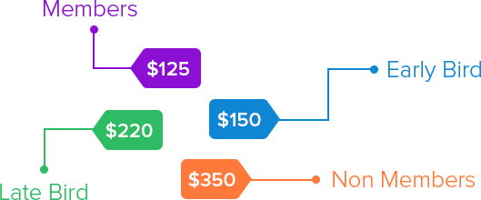
]

]

---

# The Economics of Pricing Strategy I

.pull-left[

- Two conditions are required for a firm to engage in variable pricing:

.hi-purple[1) Firm must have market power]
  - A competitive firm must charge the market price
]

.pull-right[
.center[

]
]

---

# The Economics of Pricing Strategy I

.pull-left[

- Two conditions are required for a firm to engage in variable pricing:

.hi-purple[1) Firm must have market power]
  - A competitive firm must charge the market price

.hi-purple[2) Firms must be able to prevent resale or arbitrage]
  - Clever customers buy in your lower-price market to resell it in your higher-price market

]

.pull-right[
.center[


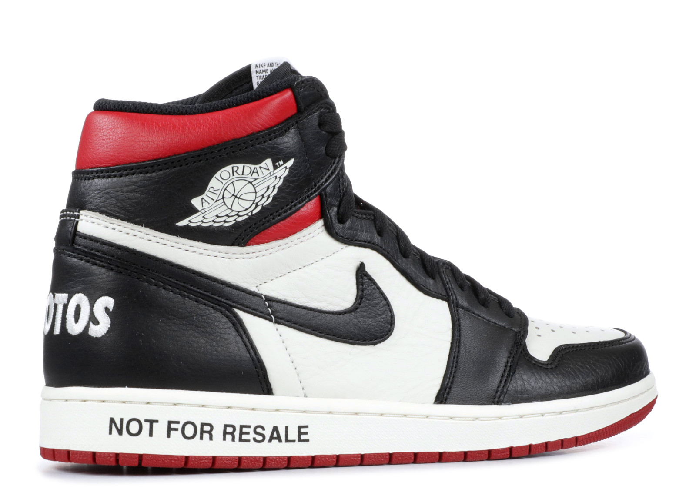
]
]

---

# The Economics of Pricing Strategy II

.pull-left[

- Firm *must acquire information* about the variations in its customers' demands

- Can the firm identify consumers' demands **before** they buy the product?


]

.pull-right[
.center[

]
]

---

# The Economics of Pricing Strategy III

.center[
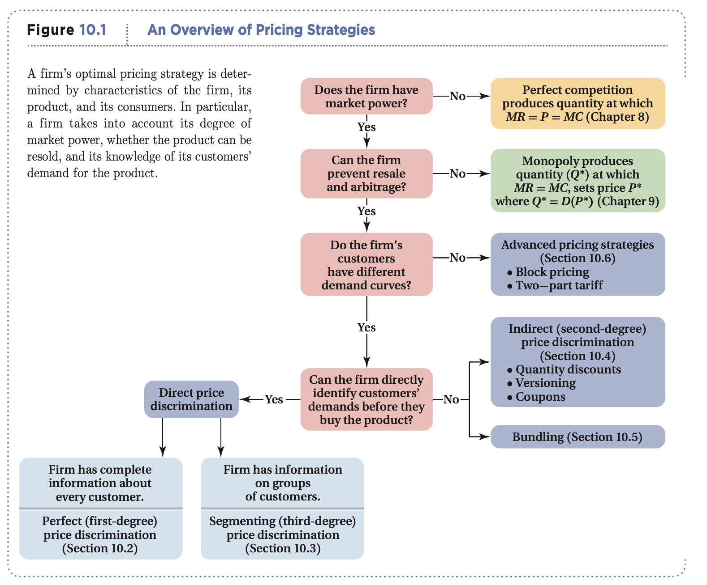

(Goolsbee et al., 2013: 397)
]


---

# The Economics of Pricing Strategy IV

.pull-left[

- With **perfect information** $\implies$ .hi[Perfect] or .hi[1<sup>st</sup>-degree price discrimination]

- .hi-purple[Charge a different price to each customer] (their max WTP)

]

.pull-right[
.center[

]
]

---

# The Economics of Pricing Strategy V

.pull-left[

- With **imperfect information** $\implies$ .hi[3<sup>rd</sup>-degree price discrimination]

- Separate customers into groups (by demand differences) and charge each group a different price

]

.pull-right[
.center[

]
]

---

# The Economics of Pricing Strategy VI

.pull-left[

- .hi[2<sup>nd</sup>-degree price discrimination]: More **indirect** forms of pricing: tying, bundling, quantity-discounts
  - Firm does **not** have enough information to categorize customers into groups
  - Consumers **self-select** into their own group

]

.pull-right[
.center[

]
]

---

class: inverse, center, middle

# 1<sup>st</sup>-Degree Price Discrimination

---

# 1<sup>st</sup>-Degree Price Discrimination I

.pull-left[
.center[
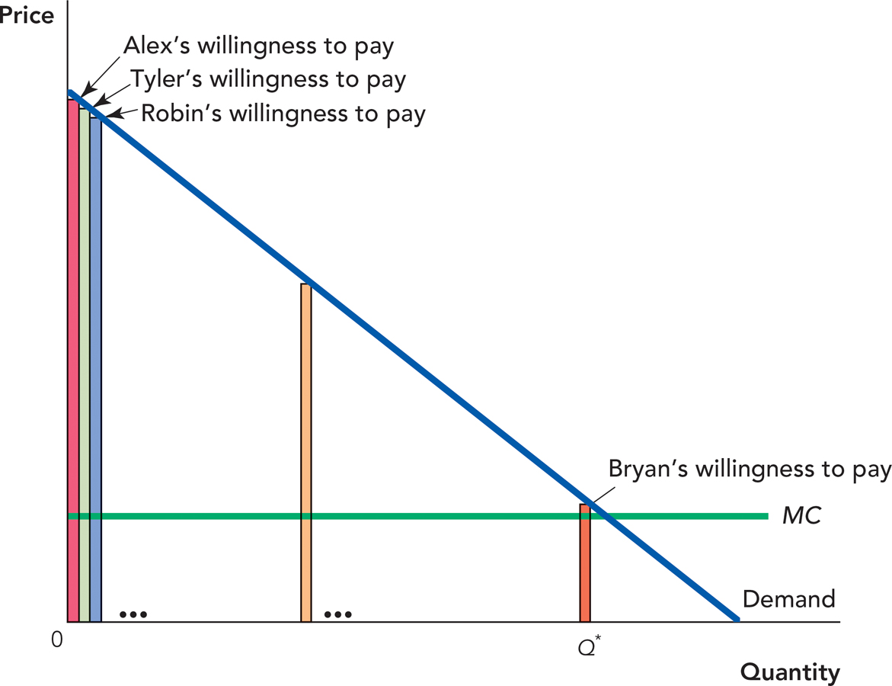
]

]

.pull-right[

- If firm has *perfect information* about every customer's demand before purchase:

- .hi[Perfect] or .hi[1<sup>st</sup>-degree price discrimination]: firm charges *each* customer their maximum willingness to pay
  - “walks” down the market demand curve customer by customer

]

---

# 1<sup>st</sup>-Degree Price Discrimination II

.pull-left[

```{r, fig.retina=3}
library(mosaic)
mc<-function(x){2}
demand<-function(x){10-x}
mr<-function(x){10-2*x}

CS<-tibble(x=c(0,0,8),
           y=c(10,2,2))
#PS<-tibble(x=c(0,0,2),
#           y=c(10,2,2))

#line_colors <- c("Supply" = "red", "Demand" = "blue")
#surplus_colors <-c("Consumer" = "blue", "Producer" = "red")

perfectpd<-ggplot(data.frame(x=c(0,10)), aes(x=x))+
  geom_polygon(data=CS, aes(x=x,y=y), fill="green",alpha=0.5)+
  stat_function(fun=demand, geom="line", size=2, color = "blue")+
    geom_label(aes(x=9,y=demand(9)), color = "blue", label="Demand", size = 5)+
  stat_function(fun=mc, geom="line", size=2, color = "red")+
    geom_label(aes(x=6,y=mc(6)), color = "red", label=expression(MC(q)==AC(q)), size = 5)+
  geom_segment(x=8, xend=8, y=0, yend=2, size=1, linetype="dotted")+
  geom_label(aes(x=3, y= 5), label="Profit", color="green", size =5)+
  scale_x_continuous(breaks=c(0,4,8),
                       labels=c(0,expression(q[m]),expression(q[c])),
                     limits=c(0,10),
                     expand=expand_scale(mult=c(0,0.1)))+
  scale_y_continuous(breaks=c(0,2,6),
                       labels=c(0,expression(p[c]),expression(p[m])),
                     limits=c(0,10),
                     expand=expand_scale(mult=c(0,0.1)))+
  guides(fill=F)+
  labs(x = "Quantity",
       y = "Price")+
  theme_classic(base_family = "Fira Sans Condensed", base_size=20)
perfectpd
```

]

.pull-right[

- Firm converts *all* consumer surplus into profit!

- Produces the competitive amount $(q_c)$!

]

---

# 1<sup>st</sup>-Degree Price Discrimination: Example

.pull-left[
.center[
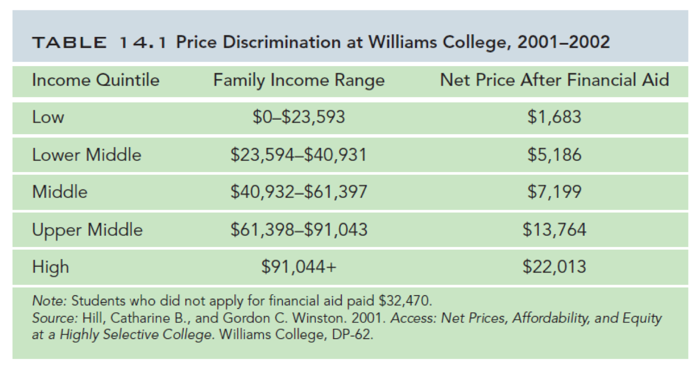
]
]

.pull-right[
.center[

]
]

---

# Big Data and Perfect Price Discrimination

.center[

]

---

class: inverse, center, middle

# 3<sup>rd</sup>-Degree Price Discrimination

---

# 3<sup>rd</sup>-Degree Price Discrimination I

.pull-left[

- Firms almost never have perfect information about their customers

- But they can often separate customers by .hi-purple[observable characteristics] into .hi-purple[different groups] with similar demands *before purchasing*

]

.pull-right[
.center[

]
]

---

# 3<sup>rd</sup>-Degree Price Discrimination I

.pull-left[

- Firms .hi[segment] the market or engage in .hi[3<sup>rd</sup>-degree price discrimination] by charging different prices to different *groups* of customers

- By far the most common type of price-discrimination
]

.pull-right[
.center[

]
]

---

# 3<sup>rd</sup>-Degree Price Discrimination II

.pull-left[

.center[
.smallest[
Business Travelers (Less Elastic)
]
]
```{r, fig.align="center", fig.height=5.5}
demand_i=function(x){10-2*x}
mr_i=function(x){10-4*x}

inelastic<-ggplot(data.frame(x=c(0,10)), aes(x=x))+
  stat_function(fun=demand_i, geom="line", size=2, color = "blue")+
  geom_label(aes(x=4.5, y=demand_i(4.5)), color="blue", label="Demand")+
  stat_function(fun=mr_i, geom="line", size=2, color = "purple")+
  geom_label(aes(x=2.25, y=mr_i(2.25)), color="purple", label="MR(q)")+
  stat_function(fun=mc, geom="line", size=2, color = "red")+
  geom_label(aes(x=8, y=mc(8)), color="red", label="MC(q)=AC(q)")+
    scale_x_continuous(breaks=NULL,
                     limits=c(0,10),
                     expand=expand_scale(mult=c(0,0.1)))+
  scale_y_continuous(breaks=NULL,
                     limits=c(0,10),
                     expand=expand_scale(mult=c(0,0.1)))+
  labs(x = "Tickets",
       y = "Price")+
  theme_classic(base_family = "Fira Sans Condensed", base_size=20)
inelastic
```
]

.pull-right[

.center[
.smallest[
Vacationers (More Elastic)
]
]

```{r, fig.align="center", fig.height=5.5}
demand_e=function(x){8-0.5*x}
mr_e=function(x){8-x}

elastic<-ggplot(data.frame(x=c(0,10)), aes(x=x))+
  stat_function(fun=demand_e, geom="line", size=2, color = "blue")+
  geom_label(aes(x=9, y=demand_e(9)), color="blue", label="Demand")+
  stat_function(fun=mr_e, geom="line", size=2, color = "purple")+
  geom_label(aes(x=7, y=mr_e(7)), color="purple", label="MR(q)")+
  stat_function(fun=mc, geom="line", size=2, color = "red")+
  geom_label(aes(x=8, y=mc(8)), color="red", label="MC(q)=AC(q)")+
    scale_x_continuous(breaks=NULL,
                     limits=c(0,10),
                     expand=expand_scale(mult=c(0,0.1)))+
  scale_y_continuous(breaks=NULL,
                     limits=c(0,10),
                     expand=expand_scale(mult=c(0,0.1)))+
  labs(x = "Tickets",
       y = "Price")+
  theme_classic(base_family = "Fira Sans Condensed", base_size=20)
elastic
```
]
.smallest[
Consider airlines: different groups of travelers have different demands & price elasticities
]
---

# 3<sup>rd</sup>-Degree Price Discrimination II

.pull-left[

.center[
.smallest[
Business Travelers (Less Elastic)
]
]
```{r, fig.align="center", fig.height=5.5}
inelastic+
  geom_segment(x=0, xend=2.25, y=5.5, yend=5.5, size =1 ,linetype= "dashed")+
  geom_segment(x=2.25, xend=2.25, y=5.5, yend=0, size =1 ,linetype= "dashed")+
  geom_rect(xmin=0,xmax=2.25,ymin=2,ymax=5.5, fill="green", alpha=0.5)
```
]

.pull-right[

.center[
.smallest[
Vacationers (More Elastic)
]
]
```{r, fig.align="center", fig.height=5.5}
elastic+
  geom_segment(x=0, xend=5, y=5.5, yend=5.5, size =1 ,linetype= "dashed")+
  geom_segment(x=5, xend=5, y=5.5, yend=0, size =1 ,linetype= "dashed")+
  geom_rect(xmin=0,xmax=5,ymin=2,ymax=5.5, fill="green", alpha=0.5)
```
]
.smallest[
The firm could charge a **single price** to all travelers and earn some .hi-green[profit]
]
---

# 3<sup>rd</sup>-Degree Price Discrimination II

.pull-left[

.center[
.smallest[
Business Travelers (Less Elastic)
]
]
```{r, fig.align="center", fig.height=5.5}
inelastic+
  geom_segment(x=0, xend=2.25, y=5.5, yend=5.5, size =1 ,linetype= "dashed")+
  geom_segment(x=2.25, xend=2.25, y=5.5, yend=0, size =1 ,linetype= "dashed")+
  geom_rect(xmin=0,xmax=2.25,ymin=2,ymax=5.5, fill="green", alpha=0.5)+
  geom_segment(x=0, xend=2, y=6, yend=6, size =1 ,linetype= "dashed")+
  geom_segment(x=2, xend=2, y=6, yend=0, size =1 ,linetype= "dashed")+
  geom_rect(xmin=0,xmax=2,ymin=2,ymax=6, fill="darkgreen", alpha=0.5)
```
]

.pull-right[

.center[
.smallest[
Vacationers (More Elastic)
]
]
```{r, fig.align="center", fig.height=5.5}
elastic+
  geom_segment(x=0, xend=5, y=5.5, yend=5.5, size =1 ,linetype= "dashed")+
  geom_segment(x=5, xend=5, y=5.5, yend=0, size =1 ,linetype= "dashed")+
  geom_rect(xmin=0,xmax=5,ymin=2,ymax=5.5, fill="green", alpha=0.5)+
  geom_segment(x=0, xend=6, y=5, yend=5, size =1 ,linetype= "dashed")+
  geom_segment(x=6, xend=6, y=5, yend=0, size =1 ,linetype= "dashed")+
  geom_rect(xmin=0,xmax=6,ymin=2,ymax=5, fill="darkgreen", alpha=0.5)
```
]

.smallest[
With **different prices**: raise price on inelastic travelers, lower price on elastic travelers, earn .hi-green[*more* profit]! 
]

---

# 3<sup>rd</sup>-Degree Price Discrimination: Examples I

.pull-left[
.center[

]
]

.pull-right[
.center[

]
]

---

# 3<sup>rd</sup>-Degree Price Discrimination: Examples II

.center[

]

---

# 3<sup>rd</sup>-Degree Price Discrimination: Examples II

.center[
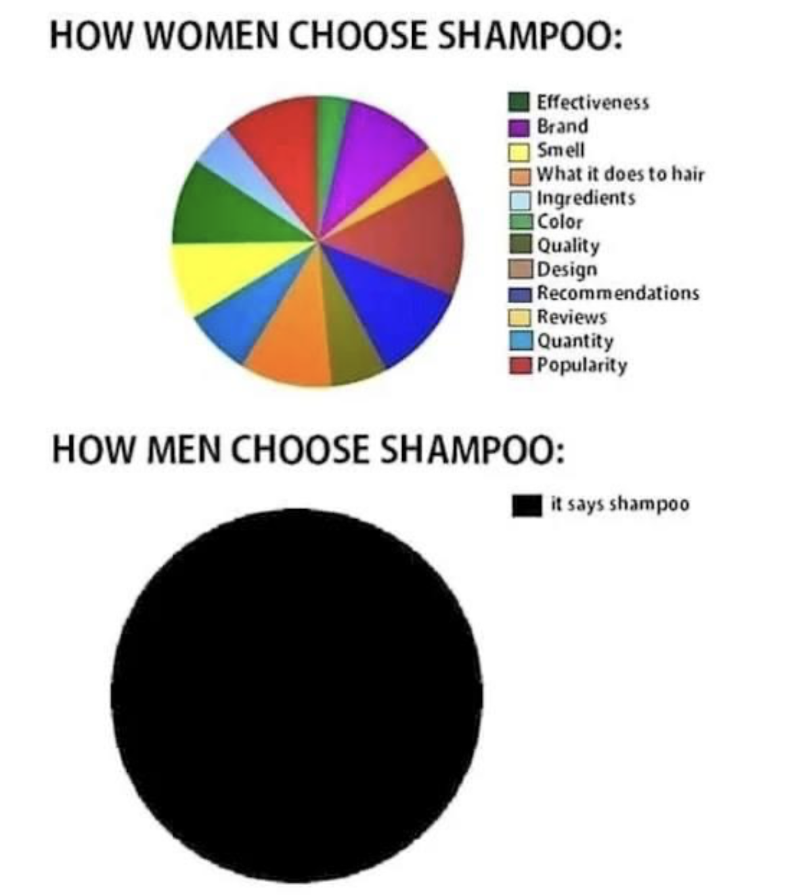
]

---

# 3<sup>rd</sup>-Degree Price Discrimination: Examples III

.center[
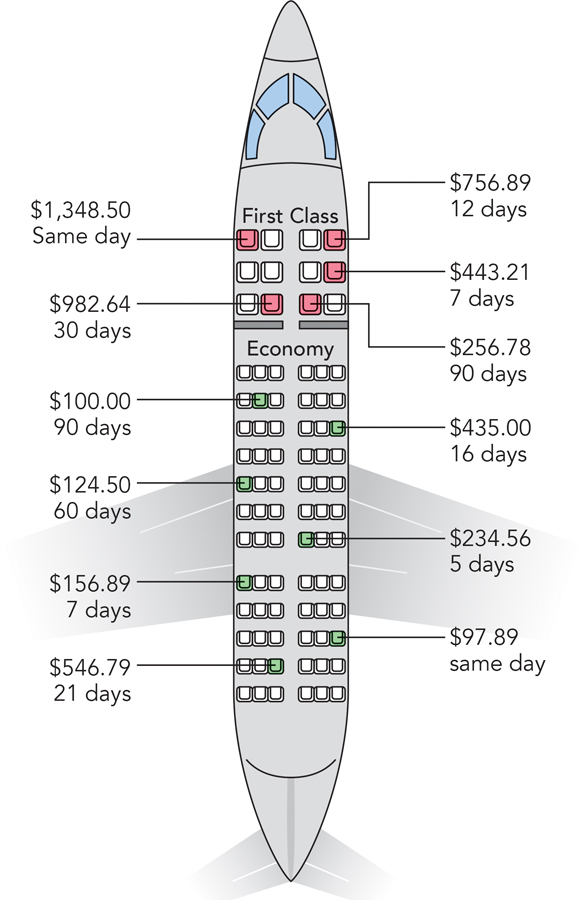
]

---

# 3<sup>rd</sup>-Degree Price Discrimination: Examples IV

.pull-left[
.center[

]
]

--

.pull-right[
.center[

]
]

---

# Sales

.pull-left[

- .hi-purple[Price-inelastic] buyers will buy something (a necessity?) now regardless of whether or not it is “on sale”

- .hi-purple[Price-elastic] buyers will be attracted to buying something when price is lower

- Stores lower prices on rare occasions to attract price-sensitive shoppers (will lose profits on price-insensitive shoppers who buy during the sale!)
  - Black Friday: many price-insensitive shoppers stay away to avoid crowds! Better for the stores!
]

.pull-right[
.center[

]
]


---

# Coupons

.pull-left[

- .hi-purple[Coupons] also are designed to bring in more price-elastic shoppers
  - Often lower income, very sensitive to price, worth the hassle of collecting & using coupons

- Store sells at higher price (to capture profit from price-insensitive shoppers who can’t be bothered with coupons) and brings in profits from price-sensitive shoppers who use coupons to pay lower price

]

.pull-right[
.center[

]
]

---

# Pricing and Markup

.pull-left[
.smallest[
- How much should each segment be charged?

- Firm treats each segment as a *different* market
  1. Find q*: $MR(q)=MC(q)$ 
  2. Raise p* to maximum WTP (Demand)

- Lerner index implies optimal markup for each segment, again:
$$\underbrace{\frac{p-MC(q)}{p}}_{\text{Markup % of Price}}=-\frac{1}{\epsilon}$$
]
]

.pull-right[
.center[

]
]
---

# 3<sup>rd</sup>-Degree Price Discrimination: Numerical Example

.bg-washed-green.b--dark-green.ba.bw2.br3.shadow-5.ph4.mt5[
.green[**Example**]: Suppose you run a bar in downtown Frederick, and estimate the nightly demands for beer from undergraduates $(U)$ and graduates $(G)$ to be:

$$\begin{align*}
q_U&=18-4p_U\\
q_G&=12-p_G\\
\end{align*}$$

Assume the only cost of producing a beer is a constant marginal (and average) cost of $2.

]

1. If your bar had to charge a uniform price for beer, how much profit would the bar earn?

2. If you could price discriminate, how much profit would the bar earn?

---

# 3<sup>rd</sup>-Degree Price Discrimination: Numerical Example

```{r, fig.width = 15}
mc=function(x){2}
demand_u=function(x){4.5-0.25*x}
demand_g=function(x){12-1*x}
mr_u=function(x){4.5-0.5*x}
mr_g=function(x){12-2*x}

a<-ggplot(data = tibble(x = 1:10), aes(x = x))+
  stat_function(fun = demand_u, geom = "line", size = 2, color = "blue")+
  geom_label(x = 14, y = demand_u(14), color = "blue", label = "Demand", size =3)+
  stat_function(fun = mc, geom = "line", size = 2, color = "red")+
  geom_label(x = 16, y = mc(16), color = "red", label = "MC(q)=AC(q)", size =3)+
  stat_function(fun = mr_u, geom = "line", size = 2, color = "purple")+
    geom_label(x = 7, y = mr_u(7), color = "purple", label = "MR(q)", size =3)+

  labs(x = "Quantity",
       y = "Price",
       title = "Undergraduate")+
  scale_x_continuous(breaks = seq(0,18,1),
                     limits = c(0,19),
                     expand = c(0,0))+
  scale_y_continuous(breaks = seq(0,12,1),
                     limits = c(0,13),
                     expand = c(0,0),
                     labels = scales::dollar)+
  theme_classic(base_family = "Fira Sans Condensed", base_size = 14)

s<-ggplot(data = tibble(x = 1:10), aes(x = x))+
  stat_function(fun = demand_g, geom = "line", size = 2, color = "blue")+
  geom_label(x = 11, y = demand_g(11), color = "blue", label = "Demand", size = 3)+
  stat_function(fun = mc, geom = "line", size = 2, color = "red")+
  geom_label(x = 16, y = mc(16), color = "red", label = "MC(q)=AC(q)", size = 3)+
  stat_function(fun = mr_g, geom = "line", size = 2, color = "purple")+
    geom_label(x = 5.5, y = mr_g(5.5), color = "purple", label = "MR(q)", size = 3)+

  labs(x = "Quantity",
       y = "Price",
       title = "Graduate")+
   scale_x_continuous(breaks = seq(0,18,1),
                     limits = c(0,19),
                     expand = c(0,0))+
  scale_y_continuous(breaks = seq(0,12,1),
                     limits = c(0,13),
                     expand = c(0,0),
                     labels = scales::dollar)+
 theme_classic(base_family = "Fira Sans Condensed", base_size = 14)

library(patchwork)
a | s
```

---

# 3<sup>rd</sup>-Degree Price Discrimination: Numerical Example

```{r, fig.width = 15}
mc=function(x){2}
demand_u=function(x){4.5-0.25*x}
demand_g=function(x){12-1*x}
mr_u=function(x){4.5-0.5*x}
mr_g=function(x){12-2*x}

cs_u1<-tribble(
  ~x, ~y,
  0, 4.5,
  0, 4,
  2, 4
)

dwl_u1<-tribble(
  ~x, ~y,
  2, 2,
  2, 4,
  10, 2
)

cs_g1<-tribble(
  ~x, ~y,
  0, 12,
  0, 4,
  8, 4
)

dwl_g1<-tribble(
  ~x, ~y,
  8, 2,
  8, 4,
  10, 2
)

a<-ggplot(data = tibble(x = 1:10), aes(x = x))+
  geom_rect(xmin = 0, xmax = 2, ymin = 4, ymax = 2, fill = "green", alpha = 0.25)+
  #geom_polygon(data = cs_u1, aes(x=x,y=y), fill = "blue", alpha = 0.25)+
  #geom_polygon(data = dwl_u1, aes(x=x,y=y), fill = "black", alpha = 0.5)+
  stat_function(fun = demand_u, geom = "line", size = 2, color = "blue")+
  geom_label(x = 14, y = demand_u(14), color = "blue", label = "Demand", size =3)+
  stat_function(fun = mc, geom = "line", size = 2, color = "red")+
  geom_label(x = 16, y = mc(16), color = "red", label = "MC(q)=AC(q)", size =3)+
  stat_function(fun = mr_u, geom = "line", size = 2, color = "purple")+
    geom_label(x = 7, y = mr_u(7), color = "purple", label = "MR(q)", size =3)+

  geom_segment(x = 0, y = 4, xend = 2, yend = 4, linetype = "dotted", size = 1)+
  geom_segment(x = 2, y = 4, xend = 2, yend = 0, linetype = "dotted", size = 1)+
  labs(x = "Quantity",
       y = "Price",
       title = "Undergraduate")+
  scale_x_continuous(breaks = seq(0,18,1),
                     limits = c(0,19),
                     expand = c(0,0))+
  scale_y_continuous(breaks = seq(0,12,1),
                     limits = c(0,13),
                     expand = c(0,0),
                     labels = scales::dollar)+
  theme_classic(base_family = "Fira Sans Condensed", base_size = 14)

s<-ggplot(data = tibble(x = 1:10), aes(x = x))+
 geom_rect(xmin = 0, xmax = 8, ymin = 4, ymax = 2, fill = "green", alpha = 0.25)+
  #geom_polygon(data = cs_g1, aes(x=x,y=y), fill = "blue", alpha = 0.25)+
  #geom_polygon(data = dwl_g1, aes(x=x,y=y), fill = "black", alpha = 0.5)+
  stat_function(fun = demand_g, geom = "line", size = 2, color = "blue")+
  geom_label(x = 11, y = demand_g(11), color = "blue", label = "Demand", size = 3)+
  stat_function(fun = mc, geom = "line", size = 2, color = "red")+
  geom_label(x = 16, y = mc(16), color = "red", label = "MC(q)=AC(q)", size = 3)+
  stat_function(fun = mr_g, geom = "line", size = 2, color = "purple")+
    geom_label(x = 5.5, y = mr_g(5.5), color = "purple", label = "MR(q)", size = 3)+

  geom_segment(x = 0, y = 4, xend = 8, yend = 4, linetype = "dotted", size = 1)+
  geom_segment(x = 8, y = 4, xend = 8, yend = 0, linetype = "dotted", size = 1)+
  labs(x = "Quantity",
       y = "Price",
       title = "Graduate")+
   scale_x_continuous(breaks = seq(0,18,1),
                     limits = c(0,19),
                     expand = c(0,0))+
  scale_y_continuous(breaks = seq(0,12,1),
                     limits = c(0,13),
                     expand = c(0,0),
                     labels = scales::dollar)+
 theme_classic(base_family = "Fira Sans Condensed", base_size = 14)

library(patchwork)
a | s
```

- Charging a single price: $4, .green[total profit of $20] <!--(.blue[$32.50 of CS], **[$10 of DWL])-->

---

# 3<sup>rd</sup>-Degree Price Discrimination: Numerical Example

```{r, fig.width = 15}
mc=function(x){2}
demand_u=function(x){4.5-0.25*x}
demand_g=function(x){12-1*x}
mr_u=function(x){4.5-0.5*x}
mr_g=function(x){12-2*x}

cs_u2<-tribble(
  ~x, ~y,
  0, 4.5,
  0, 3.25,
  5, 3.25
)

dwl_u2<-tribble(
  ~x, ~y,
  5, 2,
  5, 3.25,
  10, 2
)

cs_g2<-tribble(
  ~x, ~y,
  0, 12,
  0, 7,
  5, 7
)

dwl_g2<-tribble(
  ~x, ~y,
  5, 2,
  5, 7,
  10, 2
)
a<-ggplot(data = tibble(x = 1:10), aes(x = x))+
  geom_rect(xmin = 0, xmax = 5, ymin = 2, ymax = 3.25, fill = "green", alpha = 0.25)+
  #geom_polygon(data = cs_u2, aes(x=x,y=y), fill = "blue", alpha = 0.25)+
  #geom_polygon(data = dwl_u2, aes(x=x,y=y), fill = "black", alpha = 0.5)+
  stat_function(fun = demand_u, geom = "line", size = 2, color = "blue")+
  geom_label(x = 14, y = demand_u(14), color = "blue", label = "Demand", size =3)+
  stat_function(fun = mc, geom = "line", size = 2, color = "red")+
  geom_label(x = 16, y = mc(16), color = "red", label = "MC(q)=AC(q)", size =3)+
  stat_function(fun = mr_u, geom = "line", size = 2, color = "purple")+
    geom_label(x = 7, y = mr_u(7), color = "purple", label = "MR(q)", size =3)+

  geom_segment(x = 0, y = 3.25, xend = 5, yend = 3.25, linetype = "dotted", size = 1)+
  geom_segment(x = 5, y = 3.25, xend = 5, yend = 0, linetype = "dotted", size = 1)+
  labs(x = "Quantity",
       y = "Price",
       title = "Undergraduate")+
  scale_x_continuous(breaks = seq(0,18,1),
                     limits = c(0,19),
                     expand = c(0,0))+
  scale_y_continuous(breaks = seq(0,12,1),
                     limits = c(0,13),
                     expand = c(0,0),
                     labels = scales::dollar)+
  theme_classic(base_family = "Fira Sans Condensed", base_size = 14)

s<-ggplot(data = tibble(x = 1:10), aes(x = x))+
 geom_rect(xmin = 0, xmax = 5, ymin = 7, ymax = 2, fill = "green", alpha = 0.25)+
  #geom_polygon(data = cs_g2, aes(x=x,y=y), fill = "blue", alpha = 0.25)+
  #geom_polygon(data = dwl_g2, aes(x=x,y=y), fill = "black", alpha = 0.5)+
  stat_function(fun = demand_g, geom = "line", size = 2, color = "blue")+
  geom_label(x = 11, y = demand_g(11), color = "blue", label = "Demand", size = 3)+
  stat_function(fun = mc, geom = "line", size = 2, color = "red")+
  geom_label(x = 16, y = mc(16), color = "red", label = "MC(q)=AC(q)", size = 3)+
  stat_function(fun = mr_g, geom = "line", size = 2, color = "purple")+
    geom_label(x = 5.5, y = mr_g(5.5), color = "purple", label = "MR(q)", size = 3)+

  geom_segment(x = 0, y = 7, xend = 5, yend = 7, linetype = "dotted", size = 1)+
  geom_segment(x = 5, y = 7, xend = 5, yend = 0, linetype = "dotted", size = 1)+
  labs(x = "Quantity",
       y = "Price",
       title = "Graduate")+
   scale_x_continuous(breaks = seq(0,18,1),
                     limits = c(0,19),
                     expand = c(0,0))+
  scale_y_continuous(breaks = seq(0,12,1),
                     limits = c(0,13),
                     expand = c(0,0),
                     labels = scales::dollar)+
 theme_classic(base_family = "Fira Sans Condensed", base_size = 14)

library(patchwork)
a | s
```

- Charging $3.25 to Undergrads; $7.00 to grads; .green[total profit of $31.25] 
<!--(.blue[$15.625 of CS], **[$15.625 of DWL])-->

---

# 3<sup>rd</sup>-Degree Price Discrimination: Numerical Example

```{r, fig.width = 15}
a3<-a+
  geom_label(x = 5, y = 3.75, label = "L = 0.385, e =-2.60")

s3<-s+
  geom_label(x = 5, y = 7.5, label = "L = 0.714, e =-1.40")

a3 | s3
```

- Charging $3.25 to Undergrads; $7.00 to grads; .green[total profit of $31.25]

---

# Ways to Segment Markets

.pull-left[
- By customer characteristics
  - Age
  - Gender

- Past purchase behavior
  - repeat customers (more price sensitive)

- By location
  - local demand characteristics
]

.pull-right[
.center[

]
]
---

class: inverse, center, middle

# Is Price Discrimination Good or Bad?

---

# Is Price Discrimination Good or Bad? I

.pull-left[

- Ideal competitive market, $q^*$ where $p^c=MC$
]

.pull-right[

```{r, fig.retina=3}
comp
```

]

---

# Is Price Discrimination Good or Bad? I

.pull-left[

- Ideal competitive market, $q^c$ where $p^c=MC$

- A pure monopolist would produce less $q^m$ at higher $p^m$
  - reduce .blue[consumer surplus] and create **deadweight loss**

- Transfer of some surplus from consumers to producers


]

.pull-right[

```{r, fig.retina=3}
monopoly
```

]


---

# Is Price Discrimination Good or Bad? I

.pull-left[

- A price-discriminating monopolist transfers MORE surplus from consumers to producers

- But encourages monopolist to produce more than the pure monopoly level and reduce deadweight loss!
  - At best, also produces at competitive output level! 
]

.pull-right[

```{r, fig.retina=3}
perfectpd
```

]

---

# Is Price Discrimination Good or Bad? II

.pull-left[

- Price-discrimination creates incentives for innovation and risk-taking

- Firms with high fixed costs of investment earn greater profits with price discrimination, can recover their fixed costs

- Might not invest or produce if they had to charge a uniform price
]

.pull-right[
.center[

]
]

---

# Is Price Discrimination Good or Bad? III

.pull-left[

- As with markups in general, price discrimination has everything to do with .hi[price elasticity of demand]

- If you are paying too much and losing consumer surplus, the real “problem” is that .hi-purple[your demand is not very elastic]
  - fewer options, a particular brand, or a necessity, limited time, etc

- If you want to pay less, .hi-purple[buy generic] (more elastic)

]

.pull-right[
.center[

]
]

---

# How to Be a Savvy Consumer

.pull-left[
.smallest[
- Realize that any “sales” and “discounts” are calculated to make *the store* more money

- You *can* also be better off as a consumer too

- Think about your .blue[consumer surplus]!

- If you were *already* planning to buy the product, a fall in price is **a good deal** for you
  - Your demand is less elastic

- If you *weren’t* going to buy the product before, and now you do, the sale was effective for the store, and you likely don’t get much surplus
  - Your demand is more elastic

]
]

.pull-right[
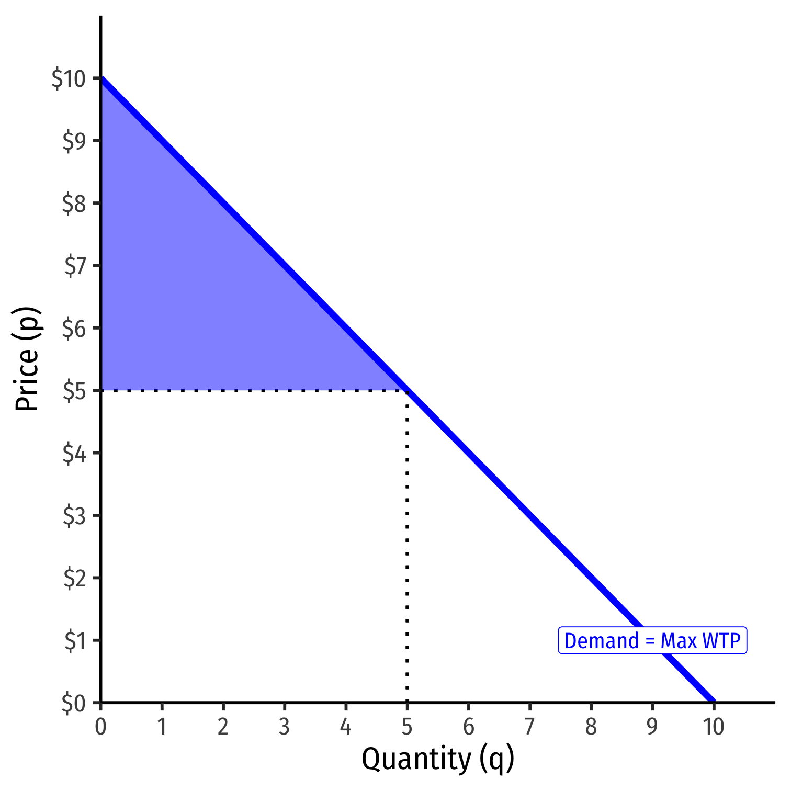
]

---

# Behavioral Economics

.center[
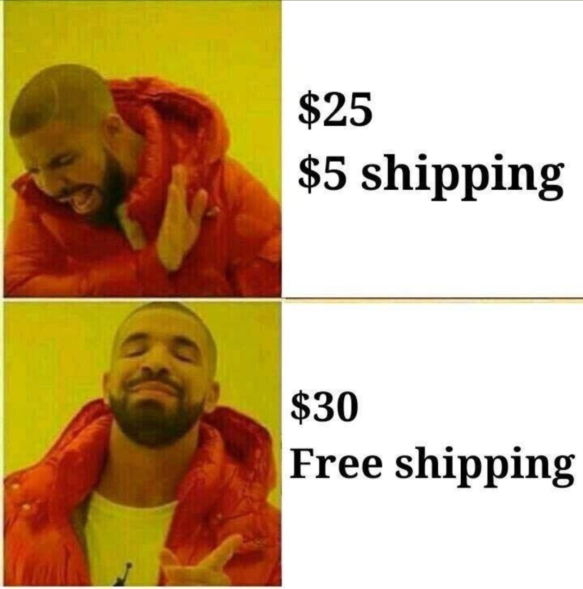
]

---

# Price Discrimination vs. Price Differences

.pull-left[

- .hi[Price discrimination] is selling *identical* goods to people at different prices

- But not everytime people pay different prices means it is price discrimination

- Sometimes it is truly different goods that people are paying different prices for
  - If *costs* to firm are *different* for different versions (color, size, etc.), it is a *different* good, *not* price discrimination

]

.pull-right[
.center[

]

]

---

# Price Discrimination vs. Price Differences

.pull-left[

- .hi-green[Example]: bottled sparkling water often higher price than Coca Cola

- Could be because sparkling water drinkers have less elastic demand than Coke drinkers

- Or could be that it is more expensive to package sparkling water (economies of scale with greater number of Coke drinkers)

]

.pull-right[
.center[
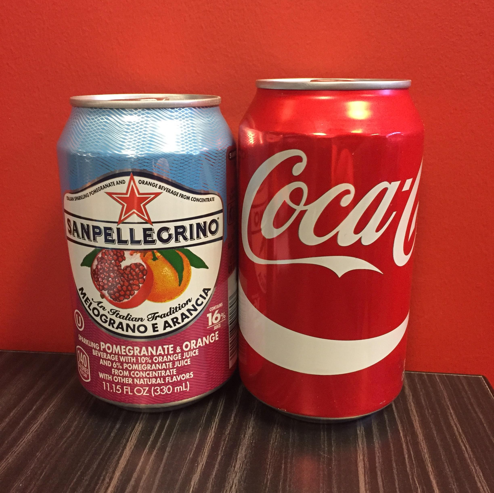
]

]

---

# Price Discrimination vs. Price Differences

.pull-left[

- The best way to tell the difference is to see what happens if demand changes price elasticity (and costs do not change)
  - Price discrimination requires market power, firm with market power marks up price based on $\frac{1}{\epsilon}$
  - Competitive firm only sets $p=MC$, so change in elasticity has no effect on price

- See [today’s class notes](/content/4.3-content) for a graphical demonstration
]

.pull-right[
.center[

]

]

---

class: inverse, center, middle

# 2<sup>nd</sup>-Degree Price Discrimination

---

# 2<sup>nd</sup>-Degree Price Discrimination I

.pull-left[
.center[

]

]

.pull-right[

- If firm *cannot* identify customers' demands or types before purchase

- .hi[Indirect] or .hi[2<sup>nd</sup>-degree price discrimination]: firm offers difference price-quantity bundles and allows customers **self-select** (based on preferences)

]

---
# 2<sup>nd</sup>-Degree Price Discrimination: Block Pricing

.pull-left[

- .hi-purple[Block Pricing/Nonlinear pricing]: offer different prices for different quantities that consumers can choose

- .hi-purple[quantity discounting]: higher quantities offered at lower prices

]

.pull-right[
.center[
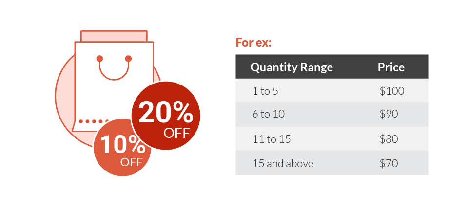
]
]

---

# 2<sup>nd</sup>-Degree Price Discrimination: Block Pricing

.pull-left[

- .hi-green[Example:] instead of one profit-maximizing monopoly price of $p_m$ for $q_m$ units, offer:
]


.pull-right[
```{r}

cs_x<-tribble(
  ~x, ~y,
  0, 10,
  0, 6,
  4, 6
)
dwl_x<-tribble(
  ~x, ~y,
  4, 6,
  4, 2,
  8, 2
)

ggplot(data.frame(x=c(0,10)), aes(x=x))+
  geom_polygon(data=cs_x, aes(x=x,y=y), fill="blue",alpha=0.5)+
  geom_polygon(data=dwl_x, aes(x=x,y=y), fill="black",alpha=0.5)+
  geom_rect(xmin=0,xmax=4, ymin=2,ymax=6,fill="green", alpha=0.5)+
  stat_function(fun=demand, geom="line", size=2, color = "blue")+
    geom_label(aes(x=9,y=demand(9)), color = "blue", label="Demand", size = 5)+
  stat_function(fun=mr, geom="line", size=2, color = "purple")+
    geom_label(aes(x=9,y=mr(9)), color = "blue", label="MR(q)", size = 5)+
  stat_function(fun=mc, geom="line", size=2, color = "red")+
    geom_label(aes(x=6,y=mc(6)), color = "red", label=expression(MC(q)==AC(q)), size = 5)+
  geom_segment(x=8, xend=8, y=0, yend=2, size=1, linetype="dotted")+
  geom_segment(x=0, xend=4, y=6, yend=6, size=1, linetype="dotted")+
  geom_segment(x=4, xend=4, y=6, yend=0, size=1, linetype="dotted")+
  geom_text(aes(x=2, y= 4), label="Profit", size =5, color = "white")+
  geom_text(aes(x=2, y= 7), label="CS", size =5, color = "white")+
  geom_text(aes(x=5, y= 4), label="DWL", size =5, color = "white")+
  scale_x_continuous(breaks=c(0,4,8),
                       labels=c(0,expression(q[m]),expression(q[c])),
                     limits=c(0,10),
                     expand=expand_scale(mult=c(0,0.1)))+
  scale_y_continuous(breaks=c(0,2,6),
                       labels=c(0,expression(p[c]),expression(p[m])),
                     limits=c(0,10),
                     expand=expand_scale(mult=c(0,0.1)))+
  guides(fill=F)+
  labs(x = "Quantity",
       y = "Price")+
  theme_classic(base_family = "Fira Sans Condensed", base_size=14)
```
]

---

# 2<sup>nd</sup>-Degree Price Discrimination: Block Pricing

.pull-left[

- .hi-green[Example:] instead of one profit-maximizing monopoly price of $p_m$ for $q_m$ units, offer:
  - $p_1$/unit for $q_1$ units
  - $p_2$/unit for $q_2$ units
  - $p_3$/unit for $q_3$ units
  - $p_4$/unit for $q_4$ units

- Converts **DWL** into .blue[CS] and captures more of it as .green[Profit]

]

.pull-right[
```{r}

cs_y1<-tribble(
  ~x, ~y,
  0, 10,
  0, 8,
  2, 8
)

cs_y2<-tribble(
  ~x, ~y,
  2, 8,
  2, 6,
  4, 6
)

cs_y3<-tribble(
  ~x, ~y,
  4, 6,
  4, 4,
  6, 4
)

cs_y4<-tribble(
  ~x, ~y,
  6, 4,
  6, 2,
  8, 2
)

ggplot(data.frame(x=c(0,10)), aes(x=x))+
  geom_polygon(data=cs_y1, aes(x=x,y=y), fill="blue",alpha=0.5)+
  geom_polygon(data=cs_y2, aes(x=x,y=y), fill="blue",alpha=0.5)+
  geom_polygon(data=cs_y3, aes(x=x,y=y), fill="blue",alpha=0.5)+
  geom_polygon(data=cs_y4, aes(x=x,y=y), fill="blue",alpha=0.5)+
  geom_rect(xmin=0,xmax=2, ymin=2,ymax=8,fill="green", alpha=0.5)+
  geom_rect(xmin=2,xmax=4, ymin=2,ymax=6,fill="green", alpha=0.5)+
  geom_rect(xmin=4,xmax=6, ymin=2,ymax=4,fill="green", alpha=0.5)+
  stat_function(fun=demand, geom="line", size=2, color = "blue")+
    geom_label(aes(x=9,y=demand(9)), color = "blue", label="Demand", size = 5)+
  stat_function(fun=mr, geom="line", size=2, color = "purple")+
    geom_label(aes(x=9,y=mr(9)), color = "blue", label="MR(q)", size = 5)+
  stat_function(fun=mc, geom="line", size=2, color = "red")+
    geom_label(aes(x=6,y=mc(6)), color = "red", label=expression(MC(q)==AC(q)), size = 5)+
  geom_segment(x=8, xend=8, y=0, yend=2, size=1, linetype="dotted")+
  
  geom_segment(x=0, xend=2, y=8, yend=8, size=1, linetype="dotted")+
  geom_segment(x=2, xend=2, y=8, yend=0, size=1, linetype="dotted")+

  geom_segment(x=0, xend=4, y=6, yend=6, size=1, linetype="dotted")+
  geom_segment(x=4, xend=4, y=6, yend=0, size=1, linetype="dotted")+
  
  geom_segment(x=0, xend=6, y=4, yend=4, size=1, linetype="dotted")+
  geom_segment(x=6, xend=6, y=4, yend=0, size=1, linetype="dotted")+
  
  #geom_text(aes(x=2, y= 4), label="Profit", size =5, color = "white")+
  #geom_text(aes(x=2, y= 7), label="CS", size =5, color = "white")+
  scale_x_continuous(breaks=c(0,2,4,6,8),
                       labels=c(0,expression(q[1]),expression(q[2]), expression(q[3]),expression(q[4])),
                     limits=c(0,10),
                     expand=expand_scale(mult=c(0,0.1)))+
  scale_y_continuous(breaks=c(0,2,4,6,8),
                       labels=c(0,expression(p[4]),expression(p[3]), expression(p[2]),expression(p[1])),
                     limits=c(0,10),
                     expand=expand_scale(mult=c(0,0.1)))+
  guides(fill=F)+
  labs(x = "Quantity",
       y = "Price")+
  theme_classic(base_family = "Fira Sans Condensed", base_size=14)
```
]

---

# 2<sup>nd</sup>-Degree Price Discrimination: Versioning

.pull-left[
.smallest[
- .hi-purple[Versioning]: offer different prices for different *qualities* of a good (instead of *quantity*)
  - Higher (lower) prices offered for higher (lower) quality/more (fewer) features

- Must make versions .hi[incentive-compatible] so that each type of consumer chooses version that matches their preferences
  - key: add/remove quality/features across versions to make those that have higher WTP buy more expensive version rather than cheaper version (and vice versa)
]
]

.pull-right[
.center[

]
]

---

# 2<sup>nd</sup>-Degree Price Discrimination: Versioning

.pull-left[
.center[

]
]

.pull-right[
.center[

]
]

---

# 2<sup>nd</sup>-Degree Price Discrimination: Versioning

.pull-left[
.center[
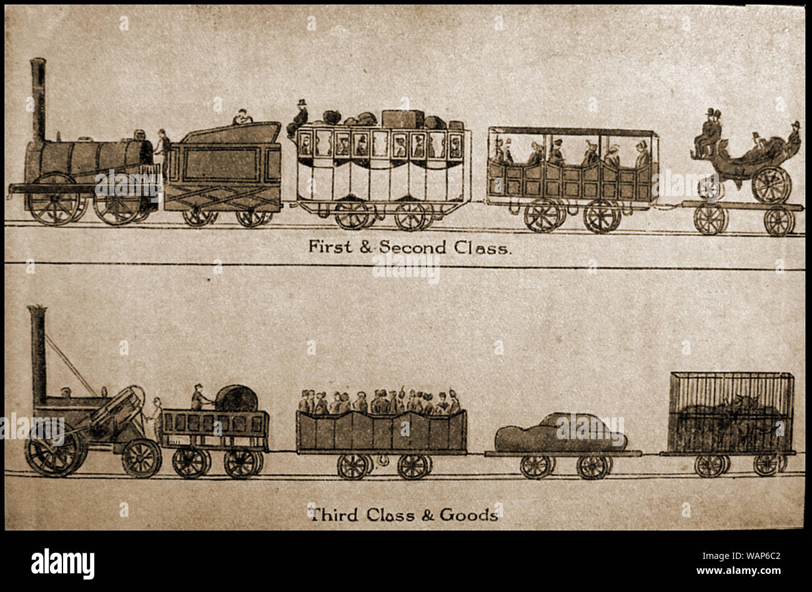
]
]

.pull-right[

.quitesmall[
> “It is not because of the few thousand francs which would have to be spent to put a roof over the third-class carriage or to upholster the third-class seats that some company or other has open carriages with wooden benches ... What the company is trying to do is prevent the passengers who can pay the second-class fare from traveling third class; it hits the poor, not because it wants to hurt them, but to frighten the rich ... And it is again for the same reason that the companies, having proved almost cruel to the third-class passengers and mean to the second-class ones, become lavish in dealing with first-class customers. Having refused the poor what is necessary, they give the rich what is superfluous.” — Jules Dupuit

]
]

---

# Tying I

.pull-left[

- Firms often .hi[tie] multiple goods together, where you must buy both goods in order to consume the product
  - One good often the “base” and the other are “refills” that you may need to buy more of

- This is actually a method of .hi-purple[*intertemporal* price-discrimination]!

]

.pull-right[
.center[


 
]

]

---

# Tying II

.pull-left[

- Companies often **sell printers at marginal cost** (no markup) and sell the **ink/refills at a much higher markup**

- **Reduce arbitrage**:
  - printer requires specific ink
  - ink only words with that specific printer

]

.pull-right[

.center[

]
]

---

# Tying II

.pull-left[

- Segment the market into:

1. .hi-purple[High-volume users]: buy more ink over time; pay more per sheet printed

2. .hi-purple[Low-volume users]: buy less ink; pay less per sheet printed

- **Indirect** price-discrimination: firms **don't know** what kind of user you are in advance

]

.pull-right[

.center[

]
]

---

# Tying: Good or Bad?

.pull-left[

- Again, a tradeoff:

- Increased profits and reduced consumer surplus, reduced deadweight loss

- Spreads fixed cost of research & development over more users

]

.pull-right[
.center[

]
]

---
 
 # Tying: Good or Bad?

.pull-left[

- If printers & ink were **not** tied:
  - **printers** would be **more expensive**
  - **ink** would be  **cheaper**

- High-volume users would keep buying ink and save money (vs. tied)

- Low-volume users might not buy the (now expensive) printer at all!

]

.pull-right[
.center[

]
]

---

# Bundling I

.pull-left[

- Firms often .hi[bundle] products together as a single package, and refuse to offer individual parts of the package

- Often, consumers do not want all products in the bundle

- Or, if they were able to buy just part of the bundle, they would *not* buy the other parts
]


.pull-right[
.center[

]
]

---

# Bundling II

.pull-left[

.bg-washed-green.b--dark-green.ba.bw2.br3.shadow-5.ph4.mt5[
.green[**Example**]: Consider two consumers, each have different reservation prices to buy components in Microsoft Office bundle

]

|    | Amy's WTP | Ben's WTP |
|----|-----|-----|
| MS Word | $70 | $40 |
| MS Excel | $50 | $60 |

]

.pull-right[
.smallest[
- Microsoft could charge separate prices for MS Word and MS Excel
]
]

---

# Bundling II

.pull-left[

.bg-washed-green.b--dark-green.ba.bw2.br3.shadow-5.ph4.mt5[
.green[**Example**]: Consider two consumers, each have different reservation prices to buy components in Microsoft Office bundle

]

|    | Amy's WTP | Ben's WTP |
|----|-----|-----|
| MS Word | $70 | $40 |
| MS Excel | $50 | $60 |

]

.pull-right[
.smallest[
- Microsoft could charge separate prices for MS Word and MS Excel

- MS Word: both would buy at $40, generating $80 of revenues
]
]

---

# Bundling II

.pull-left[

.bg-washed-green.b--dark-green.ba.bw2.br3.shadow-5.ph4.mt5[
.green[**Example**]: Consider two consumers, each have different reservation prices to buy components in Microsoft Office bundle

]

|    | Amy's WTP | Ben's WTP |
|----|-----|-----|
| MS Word | $70 | $40 |
| MS Excel | $50 | $60 |

]

.pull-right[
.smallest[
- Microsoft could charge separate prices for MS Word and MS Excel

- MS Word: both would buy at $40, generating $80 of revenues

- MS Excel: both would buy at $50, generating $100 of revenues
]
]

---

# Bundling II

.pull-left[

.bg-washed-green.b--dark-green.ba.bw2.br3.shadow-5.ph4.mt5[
.green[**Example**]: Consider two consumers, each have different reservation prices to buy components in Microsoft Office bundle

]

|    | Amy's WTP | Ben's WTP |
|----|-----|-----|
| MS Word | $70 | $40 |
| MS Excel | $50 | $60 |

]

.pull-right[
.smallest[
- Microsoft could charge separate prices for MS Word and MS Excel

- MS Word: both would buy at $40, generating $80 of revenues

- MS Excel: both would buy at $50, generating $100 of revenues

- Total revenues of individual sales: $180
]

]

---

# Bundling II

.pull-left[

.bg-washed-green.b--dark-green.ba.bw2.br3.shadow-5.ph4.mt5[
.green[**Example**]: Consider two consumers, each have different reservation prices to buy components in Microsoft Office bundle

]

|    | Amy's WTP | Ben's WTP |
|----|-----|-----|
| MS Word | $70 | $40 |
| MS Excel | $50 | $60 |
| Bundle | $120 | $100 |

]

.pull-right[
.smallest[
- Microsoft could charge separate prices for MS Word and MS Excel

- MS Word: both would buy at $40, generating $80 of revenues

- MS Excel: both would buy at $50, generating $100 of revenues

- Total revenues of individual sales: $180

- Microsoft can instead add their individual reservation prices and bundle products together to force both consumers to buy both products

- .hi-purple[Bundle]: both buy at $100, generating $200 revenue
]
]

---

# Bundling: Good or Bad?

.pull-left[

- Again, a tradeoff:

- Increased profits and reduced consumer surplus, reduced deadweight loss

- Spreads fixed cost of research & development over more users

- Goods with high fixed costs and low marginal costs (software, TV, music) increase profits from bundling
  - increases innovation and investment in these industries

]

.pull-right[
.center[

]
]