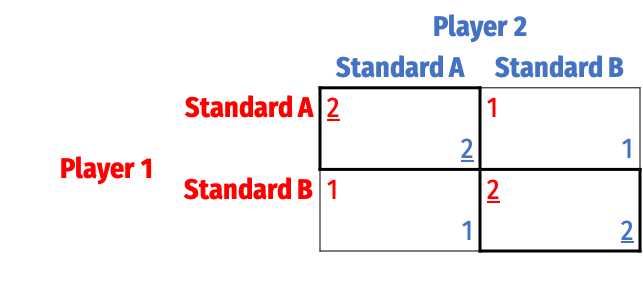
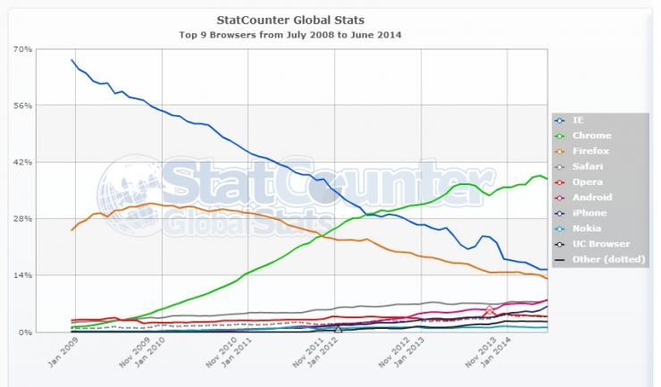
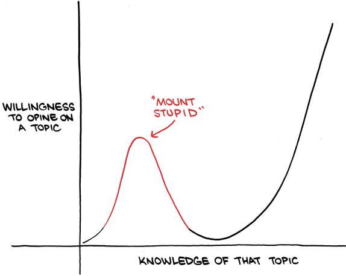
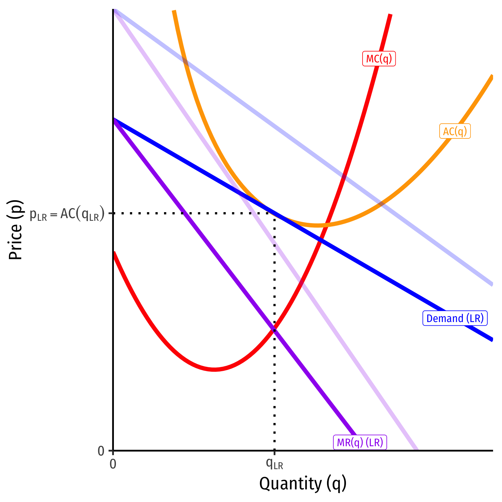

```{r setup, include=FALSE}
options(htmltools.dir.version = FALSE)
knitr::opts_chunk$set(echo=F,
                      message=F,
                      warning=F,
                      fig.retina = 3,
                      fig.align = "center")
library("tidyverse")
library("mosaic")
library("ggrepel")
library("fontawesome")
xaringanExtra::use_tile_view()
xaringanExtra::use_tachyons()
xaringanExtra::use_freezeframe()

update_geom_defaults("label", list(family = "Fira Sans Condensed"))
update_geom_defaults("text", list(family = "Fira Sans Condensed"))

set.seed(256)
```


class: title-slide

# 4.5 — Contestable Markets & Wrap Up

## ECON 306 • Microeconomic Analysis • Spring 2023

### Ryan Safner<br> Associate Professor of Economics <br> <a href="mailto:safner@hood.edu"><i class="fa fa-paper-plane fa-fw"></i>safner@hood.edu</a> <br> <a href="https://github.com/ryansafner/microS23"><i class="fa fa-github fa-fw"></i>ryansafner/microS23</a><br> <a href="https://microS23.classes.ryansafner.com"> <i class="fa fa-globe fa-fw"></i>microS23.classes.ryansafner.com</a><br>

---

class: inverse

# Outline

### [Game Theory: Some Generalizations](#3)
### [Contestable Markets](#17)
### [Wrapping Up the Semester](#39)

---

class: inverse, center, middle

# Game Theory: Some Generalizations

---

# Game Theory: Some Generalizations

.pull-left[
.center[


.smallest[
See my [game theory course](https://gamef21.classes.ryansafner.com) for more
]
]
]

.pull-right[

There's a *lot* more to game theory than a one-shot prisoners' dilemma:

- one shot vs. repeated game

- discrete vs. continuous strategies

- perfect vs. imperfect vs. incomplete/asymmetric information

- simultaneous vs. sequential games

]

---

# Solution Concepts

.pull-left[
.center[

]
]

.pull-right[

.smallest[
- We use various .hi-purple[“solution concepts”] to allow us to predict an .hi-purple[equilibrium] of a game

- .hi[Nash Equilibrium] is the primary solution concept
  - Note it has *many* variants depending on type of game!

- Recall, .hi[Nash Equilibrium]: no players want to change their strategy given what everyone else is playing
  - All players are playing a best response to each other
]
]

---

# Solution Concepts: Nash Equilibrium

.pull-left[
.center[

]
]

.pull-right[

- Important about Nash equilibrium:

1. N.E. $\neq$ the “*best*” or *optimal* outcome
  - Recall the Prisoners' Dilemma!

2. Game may have *multiple* N.E.

3. Game may have *no* N.E. (in “pure” strategies)

]

---

# Example: Coordination Game

.pull-left[
.center[

]
]

.pull-right[

- A .hi-purple[Coordination Game]
  - No dominant strategies

]

---

# Example: Coordination Game

.pull-left[
.center[

]
]

.pull-right[

- .hi-purple[Two Nash equilibria]: (.red[A],.blue[A]) and (.red[B],.blue[B])
  - Either just as good
  - Coordination is most important

]

---

# Example: Coordination Game

.pull-left[
.center[

]
]

.pull-right[

- Two general methods to solve for Nash equilibria:

.hi-purple[1) Cell-by-Cell Inspection]: look in each cell, does either player want to deviate?
  - .hi-purple[If no: a Nash equilibrium]
  - If yes: *not a Nash equilibrium*

]

---

# Example: Coordination Game

.pull-left[
.center[

]
]

.pull-right[

- Two general methods to solve for Nash equilibria:

.hi-purple[2) Best-Response Analysis]: take the perspective of each player. If the other player plays a particular strategy, what is your strategy(s) that gets you the highest payoff?
  - Ties are allowed
  - .hi-purple[Any cell where both players are playing a best response is a Nash Equilibrium]

]

---

# Example: Coordination Game

.pull-left[
.center[


.red[Player 1's] best responses
]
]

.pull-right[

- Two general methods to solve for Nash equilibria:

.hi-purple[2) Best-Response Analysis]: take the perspective of each player. If the other player plays a particular strategy, what is your strategy(s) that gets you the highest payoff?
  - Ties are allowed
  - .hi-purple[Any cell where both players are playing a best response is a Nash Equilibrium]

]

---

# Example: Coordination Game

.pull-left[
.center[


.blue[Player 2's] best responses
]
]

.pull-right[

- Two general methods to solve for Nash equilibria:

.hi-purple[2) Best-Response Analysis]: take the perspective of each player. If the other player plays a particular strategy, what is your strategy(s) that gets you the highest payoff?
  - Ties are allowed
  - .hi-purple[Any cell where both players are playing a best response is a Nash Equilibrium]

]

---

# Example: Coordination Game

.pull-left[
.center[


.hi-purple[N.E.]: each player is playing a best response
]
]

.pull-right[

- Two general methods to solve for Nash equilibria:

.hi-purple[2) Best-Response Analysis]: take the perspective of each player. If the other player plays a particular strategy, what is your strategy(s) that gets you the highest payoff?
  - Ties are allowed
  - .hi-purple[Any cell where both players are playing a best response is a Nash Equilibrium]

]

---

# A Change in the Game

.pull-left[
.center[

]
]

.pull-right[

- Two Nash equilibria again: (.red[A],.blue[A]) and (.red[B],.blue[B])

- But here (.red[A],.blue[A]) $\succ$ (.red[B],.blue[B])!

]

---

# A Change in the Game

.pull-left[
.center[

]
]

.pull-right[
- .hi-purple[Path Dependence]: early choices may affect later ability to choose or switch

- .hi-purple[Lock-in]: the switching cost of moving from one equilibrium to another becomes prohibitive

- Suppose we are currently in equilibrium (B,B)

- .hi-purple[Inefficient lock-in]:
  - Standard A is superior to B
  - But too costly to switch from B to A

]

---

class: inverse, center, middle

# Contestable Markets

---

# Is Monopoly a Nash Equilibrium?

.pull-left[

- Now that we understand Nash equilibrium...

- Are outcomes of other market structures Nash equilibria?

]

.pull-right[

.center[


]
]

---

# Is Monopoly a Nash Equilibrium?

.pull-left[

- Now that we understand Nash equilibrium...

- Are outcomes of other market structures Nash equilibria?

- **Perfect competition**: no firm wants to raise or lower price given the market price $\checkmark$

]

.pull-right[

.center[


]
]

---

# Is Monopoly a Nash Equilibrium?

.pull-left[

- **Monopolist** maximizes $\pi$ by setting $q^*$: $MR=MC$ and $p^*=Demand(q^*)$

- This is *an* equilibrium, but is it the *only* equilibrium?

- We've assumed just a *single* player in the model

- .hi-purple[What about *potential* competition?]

]

.pull-right[

.center[


]
]

---

# Contestable Markets I

.pull-left[

- Model the market as an .hi-purple[entry game], with two players:

1. .hi-red[**Incumbent**] which sets its price $\color{red}{p_I}$

2. .hi-blue[**Entrant**] decides to **stay out** or **enter** the market, setting its price $\color{blue}{p_E}$

- Price competition between 2 firms with similar products $\implies$ .hi-purple[consumers buy only from firm with lower price]

]

.pull-right[

.center[


]
]

---

# Contestable Markets II

.pull-left[
.smallest[
- Suppose both firms have identical costs: 
$$\begin{align*}
C(q)&=cq\\
MC(q)&=c\\ \end{align*}$$

- If .hi-red[Incumbent] sets $\color{red}{p_I}>c$
  - .hi-blue[Entrant] would enter and set $\color{blue}{p_E}=\color{red}{p_I}-\epsilon$<sup>.magenta[†]</sup>
]

]

.pull-right[
.center[

]
]

.footnote[<sup>.magenta[†]</sup> For arbitrary `\\(\epsilon>0\\)`, think `\\(\epsilon =\\)` “one penny”]

---

# Contestable Markets II

.pull-left[
.smallest[
- .hi-green[Case I]: Suppose both firms have identical costs: 
$$\begin{align*}
C(q)&=cq\\
MC(q)&=c\\ \end{align*}$$

- If .hi-red[Incumbent] sets $\color{red}{p_I}>c$
  - .hi-blue[Entrant] would enter and set $\color{blue}{p_E}=\color{red}{p_I}-\epsilon$<sup>.magenta[†]</sup>
  - .hi-red[Incumbent] foresees this possibility, and wants to lower its price $\color{red}{p_I}<\color{blue}{p_E}$
  - This potential undercutting would continue logically until...

]

]

.pull-right[
.center[

]
]

.footnote[<sup>.magenta[†]</sup> For arbitrary `\\(\epsilon>0\\)`, think `\\(\epsilon =\\)` “one penny”]

---

# Contestable Markets II

.pull-left[

- .hi-purple[Nash Equilibrium]: $\big(\color{red}{p_I}=c$, .blue[Stay Out] $\big)$

- .hi-purple[A market with a single firm, but the **competitive outcome**!]
  - $p^*=MC$, $\color{green}{\pi=0}$
  - competitive $q^*$
  - max .hi-blue[Consumer Surplus], no DWL
]

.pull-right[

```{r, fig.retina=3} 
# Demand function, format: p=d-eq
a<-10
b<-2
f<-5
c<-2

Demand=function(x){a-b*x}
MR=function(x){a-2*b*x}
MC=function(x){c}
AC=function(x){f/x+c}

q_choke=a/b
q_PC<-(a-c)/(b)

CS<-data.frame(x=c(0,0,q_PC),
               y=c(Demand(q_PC),a,Demand(q_PC)))

points<-tribble(
  ~x, ~y, ~lab,
  q_PC, c, "Nash Eq."
)

line_colors <- c("Demand" = "blue", "MR" = "purple", "MC" = "red", "AC" = "orange")
surplus_colors <-c("Consumer" = "blue", "Profit" = "green", "DWL" = "black")

# make plot 

ggplot(data.frame(x=c(0,q_choke)), aes(x=x))+
  
  # curves 
  stat_function(fun=Demand, geom="line", size=2, aes(color="Demand"))+
  stat_function(fun=MR, geom="line", size=2, aes(color="MR"))+
  stat_function(fun=MC, geom="line", size=2, aes(color="MC"))+
  # surpluses
  geom_polygon(data=CS, aes(x=x,y=y, fill="Consumer"), alpha=0.5)+ #CS

  # labels 
  geom_segment(x=q_PC,y=0,xend=q_PC,yend=c,linetype=3)+
  geom_point(data = points,
             aes(x = x, y = y),
             size=4)+ 
  ggrepel::geom_text_repel(data = points,
                           aes(x = x, y = y, label = lab),
                           box.padding = 0.5,
                           seed = 2,
                           nudge_y = 0.75,
                           #nudge_x = 0.5
                           )+
  annotate(geom = "label", x = 4.5, y = Demand(4.5), label = "Demand",
           color = "blue") +
  annotate(geom = "label", x = 2.25, y = MR(2.25), label = "MR",
           color = "purple") +
  annotate(geom = "label", x = 4.5, y = c, label = "MC",
           color = "red") +
  # annotate(geom = "label", x = 1.3, y = 5, label = "Consumer Surplus",
   #        color = "blue") +
  scale_x_continuous(breaks = c(0,q_PC),
                     labels = c(0,expression(q[p=MC])),
                     expand=c(0,0))+
  scale_y_continuous(breaks = c(0,c),
                     labels = c(0,expression(c)),
                     limits = c(0,a),
                     expand=c(0,0))+
  scale_colour_manual("Curves", values = line_colors)+
  scale_fill_manual("Surpluses", values = surplus_colors, guide = guide_legend(override.aes = list(alpha = 0.5)))+
  guides(color = F, fill = F)+
  labs(x = "Quantity (q)",
       y = "Price (p)")+
  theme_classic(base_family = "Fira Sans Condensed", base_size=18)
```
]

---

# Contestable Markets II

.pull-left[

- .hi-green[Case II]: What if the .hi-blue[Entrant] has *higher costs* than the .hi-red[Incumbent]: $\color{blue}{c_E}>\color{red}{c_I}$?
  - Or alternatively, there are **sunk costs** (.red[Incumbent] has already incurred)

]

.pull-right[
]

---

# Contestable Markets II

.pull-left[

- .hi-green[Case II]: What if the .hi-blue[Entrant] has *higher costs* than the .hi-red[Incumbent]: $\color{blue}{c_E}>\color{red}{c_I}$?
  - Or alternatively, there are **sunk costs** (.red[Incumbent] has already incurred)

- .hi-purple[Nash equilibrium]: $\big(\color{red}{p_I}=\color{blue}{c_E-\epsilon}$, .blue[Stay Out] $\big)$

- One firm again, with some inefficiency
  - But not as bad as monopoly!
]

.pull-right[

```{r, fig.retina=3} 
a<-10
b<-2
f<-5
c<-2
d<-4.5
e<-4

Demand=function(x){a-b*x}
MR=function(x){a-2*b*x}
MCi=function(x){c}
MCe=function(x){d}
AC=function(x){f/x+c}

q_choke=a/b
q_PC<-(a-c)/(b)

q_star<-(a-e)/b
q_monopoly<-(a-c)/(2*b)

CS<-data.frame(x=c(0,0,q_star),
               y=c(Demand(q_star),a,Demand(q_star)))
DWL<-data.frame(x=c(q_star,q_star,q_PC),
               y=c(c,e,c))

points2<-tribble(
  ~x, ~y, ~lab,
  q_PC, c, "Comp. Eq.",
  q_monopoly, Demand(q_monopoly), "Monopoly",
  q_star, Demand(q_star), "Nash. Eq."
)

line_colors <- c("Demand" = "blue", "MR" = "purple", "MCi" = "red", "MCe" = "red4")
surplus_colors <-c("Consumer" = "blue", "Profit" = "green", "DWL" = "black")

# make plot 

library("ggplot2")
ggplot(data.frame(x=c(0,q_choke)), aes(x=x))+
  
  # curves 
  stat_function(fun=Demand, geom="line", size=2, aes(color="Demand"))+
  stat_function(fun=MR, geom="line", size=2, aes(color="MR"))+
  stat_function(fun=MCi, geom="line", size=2, aes(color="MCi"))+
  stat_function(fun=MCe, geom="line", size=2, aes(color="MCe"))+
  # surpluses
  geom_polygon(data=CS, aes(x=x,y=y, fill="Consumer"), alpha=0.5)+ #CS
  geom_rect(aes(xmin=0,xmax=q_star,ymin=c,ymax=e,fill="Profit"),alpha=0.25) + # Profits
  geom_polygon(data=DWL, aes(x=x,y=y, fill="DWL"), alpha=0.5)+ #CS
  # labels 
  
  # P.C. point 
  geom_segment(aes(x=q_PC,y=0),xend=q_PC,yend=c,linetype=3)+
  # N.E. point 
  geom_segment(aes(x=q_star,y=0),xend=q_star,yend=e,linetype=3)+
  geom_segment(aes(x=0,y=e),xend=q_star,yend=e,linetype=3)+
  # Monopoly point 
  geom_segment(aes(x=q_monopoly,y=0),xend=q_monopoly,yend=Demand(q_monopoly),linetype=3)+
  geom_segment(aes(x=0,y=Demand(q_monopoly)),xend=q_monopoly,yend=Demand(q_monopoly),linetype=3)+
    geom_point(data = points2,
             aes(x = x, y = y),
             size=4)+ 
  ggrepel::geom_text_repel(data = points2,
                           aes(x = x, y = y, label = lab),
                           box.padding = 0.5,
                           seed = 2,
                           nudge_y = 0.75,
                           #nudge_x = 0.5
                           )+

  annotate(geom = "label", x = 4.5, y = Demand(4.5), label = "Demand",
           color = "blue") +
  annotate(geom = "label", x = 2.25, y = MR(2.25), label = "MR",
           color = "purple") +
  annotate(geom = "label", x = 4.5, y = c, label = expression(c[I]),
           color = "red") +
  annotate(geom = "label", x = 4.5, y = d, label = expression(c[E]),
           color = "red4") +
  #annotate(geom = "label", x = 1.25, y = 6, label = "Consumer Surplus",
  #         color = "blue") +
  #annotate(geom = "label", x = 1.25, y = 3, label = "Profit",
  #         color = "green") +
  #annotate(geom = "label", x = 3.2, y = 3, label = "DWL",
  #         color = "black") +
  scale_x_continuous(breaks = c(0,q_monopoly,q_star,q_PC),
                     labels = c(0,expression(q[m]),expression(q[NE]),expression(q[p=MC])),
                     expand=c(0,0))+
  scale_y_continuous(breaks = c(0,c,d,e,Demand(q_monopoly)),
                     labels = c(0,expression(C[I]),expression(c[E]),expression(p[I]==c[E]-epsilon),expression(p[m])),
                     limits = c(0,a),
                     expand=c(0,0))+
  theme_light()+
  scale_colour_manual("Curves", values = line_colors)+
  scale_fill_manual("Surpluses", values = surplus_colors, guide = guide_legend(override.aes = list(alpha = 0.5)))+
  guides(color = F, fill = F)+
  labs(x = "Quantity (q)",
       y = "Price (p)")+
  theme_classic(base_family = "Fira Sans Condensed", base_size=18)
```
]

---

# Contestable Markets: Recap

.pull-left[
- .hi-purple[Markets are **contestable** if]:
  1. There are no barriers to entry or exit
  2. Firms have similar technologies (i.e. similar cost structure)
  3. There are no sunk costs
  
- Generalizes "prefect competition" model in more realistic way, also game-theoretic
]

.pull-right[
.center[

]
]

---

# Contestable Markets: Summary

.left-column[

.center[


William Baumol

(1922--2017)

]
]

.right-column[

> "This means that...an incumbent, even if he can threaten retaliation after entry, dare not offer profit-making opportunities to potential entrants because an entering firm can hit and run, gathering in the available profits and departing when the going gets rough." 

]

.source[Baumol, William, J, 1982, "Contestable Markets: An Uprising in the Theory of Industry Structure," *American Economic Review,* 72(1): 1-15]

---
# Implications for Competition

.pull-left[
.center[

]
]

.pull-right[

- Regulation & antitrust (once) focus(ed) on *number* of firms

- .hi-turquoise[Perfect competition as “gold standard”, only market arrangement that is socially efficient]:
  - .hi-purple[Allocatively efficient]: $p=MC$, $DWL=0$
  - .hi-purple[Productively efficient]: $p=AC_{min}$
]

---

# Implications for Competition

.pull-left[
.center[

]
]

.pull-right[

- But number of firms is **endogenous** and **can evolve over time**!
  - Function of how firms mutually interact strategically

- A more **dynamic** situation: firms respond over time

]

---

# Implications for Competition

.pull-left[
.center[

]
]

.pull-right[

- Perfect competition **not** the *only* socially efficient market-structure
  - Market with number of firms (even 1) may be efficient .hi[if it is contestable]

- .hi-purple[Regulation and antitrust should consider whether a market is *contestable*, not just the *number* of firms]
  - Free entry
  - No sunk costs
]

---
# Implications for Competition

.pull-left[
.center[

]
]

.pull-right[

- Firms engaging in egregious monopolistic behavior $(\downarrow q$, $\uparrow p>MC$, $\pi>0$) largely persist because of .hi-purple[barriers to entry]
  - Attempts to make market **uncontestable**

- Business activities or political dealings with the goal to raise $\color{blue}{c_E}>\color{red}{c_I}$
  - Lower your own costs, or raise your rivals'!

]

---

# Monopoly Or Contestable Market?

.center[

]

---

# Contestable Markets

.pull-left[
.center[

]
]

.pull-right[

> "Of far greater concern to Microsoft is the competition from new and emerging technologies, some of which are currently visible and others of which certainly are not. This array of known, emerging, and wholly unknown competitors places enormous pressure on Microsoft to price competitively and innovate aggressively." (Schmalensee 1999)

]

---

# Contestable Markets

.center[

]

---

class: inverse, center, middle

# Wrapping Up the Semester

---

# So What's the Point of All Our Models?

.pull-left[
- In perfect competition (model):
  - price-taking firms set price equal to marginal cost
  - long run economic profits are zero
  - allocative efficiency: consumer and producer surplus maximized

- This is a *tendency* .hi[only because of **free entry and exit**]

]

.pull-right[
.center[

]
]

---

# So What's the Point of All Our Models?

.pull-left[

- .hi-turquoise[Don't judge real markets by their similarity to the perfect competition model]

- Judge them more on their level of contestability, look for barriers to entry

> “All models are wrong, but some are useful” — George Box

]

.pull-right[
.center[

]
]

---

# So What's the Point of All Our Models?

.pull-left[

.quitesmall[
> "...In that Empire, the Art of Cartography attained such Perfection that the map of a single Province occupied the entirety of a City, and the map of the Empire, the entirety of a Province.  In time, those Unconscionable Maps no longer satisfied, and the Cartographers Guilds struck a Map of the Empire whose size was that of the Empire, and which coincided point for point with it. The following Generations, who were not so fond of the Study of Cartography as their Forebears had been, saw that that vast Map was Useless... — Suarez Miranda, *Viajes de varones prudentes*, Libro IV, Cap. XLV, Lerida, 1658"

]

.source[Jorge Luis Borges, 1946, *On Exactitude in Science*]
]

.pull-right[
.center[

]
]

---

# The Two Major Models of Economics as a “Science”

.pull-left[

## Optimization

- Agents have .hi[objectives] they value

- Agents face .hi[constraints]

- Make .hi[tradeoffs] to maximize objectives within constraints

.center[

]
]

--

.pull-right[

## Equilibrium

- Agents .hi[compete] with others over **scarce** resources

- Agents .hi[adjust] behaviors based on prices

- .hi[Stable outcomes] when adjustments stop

.center[

]

]

---

# Why A Little Knowledge Can Be a Bad Thing

.pull-left[
.bg-washed-red.b--dark-red.ba.bw2.br3.shadow-5.ph4.mt5[
.red[**Caution**:] Two types of (advanced) mistakes:
]
1. Believing the model accurately *describes* reality (100%) and ignoring the model’s flaws

2. Believing the model is ideal, and reality *should* be *corrected* to better match the model
]

.pull-right[
.center[

]
.source[Source: [SMBC](https://www.smbc-comics.com/?id=2475)]
]

---

# I’m Not An Idiot

.pull-left[

- I know you most of you took this class as a business requirement...

- ...and will forget all the advanced tools in under a week

- They were/are meant to familiarize you with how economists model the world

- If you ever need to solve a problem, they are a tool may apply
]

.pull-right[
.center[

]
]

---

# Economics Uses, but Is Not Limited to, Math

```{r, fig.width=12}
red_pink <- "#e64173"
blue <- "#2b59c3"

venn_colors <- c(red_pink, blue)
venn_lines <- rep("solid", 10)
# Locations of circles
venn_df <- tibble(
  x  = c( 0.0,   2.0),
  y  = c( 0.0,   0.0),
  r  = c( 2.0,   2.0),
  l  = c( "Math \n Modeling", "Thinking Like \n an Economist"),
  xl = c( -1.0,    3.0),
  yl = c( 0.0,   0.0))
# Venn
ggplot(data = venn_df, aes(x0 = x, y0 = y, r = r, fill = l, color = l)) +
ggforce::geom_circle(aes(linetype = l), alpha = 0.3, size = 0.75) +
theme_void() +
theme(legend.position = "none") +
scale_fill_manual(values = venn_colors) +
scale_color_manual(values = venn_colors) +
scale_linetype_manual(values = venn_lines) +
  geom_text(aes(x = xl, y = yl, label = l), size = 8, family = "Fira Sans Condensed") +
coord_equal()
```

---
# But Remembering the Takeaways Will Serve You

.pull-left[

.quitesmall[
Even if you aren’t going to be an economist, remember:

1. People respond to incentives

2. We all have to face tradeoffs (including in politics)

3. Everyone makes choices on the margin

4. People *tend* to adjust to each other towards a (predictable) equilibrium

5. Incentives and institutions matter (beware the nirvana fallacy)

6. Role of (potential) competition (over time) & free entry

7. Markets are a discovery process via prices, profit & loss 

8. Beware, rent-seeking is everywhere and cleverly hidden
]
]

.pull-right[
.center[

]
]

---

# Economics Is Broader Than You Think

.center[

]
