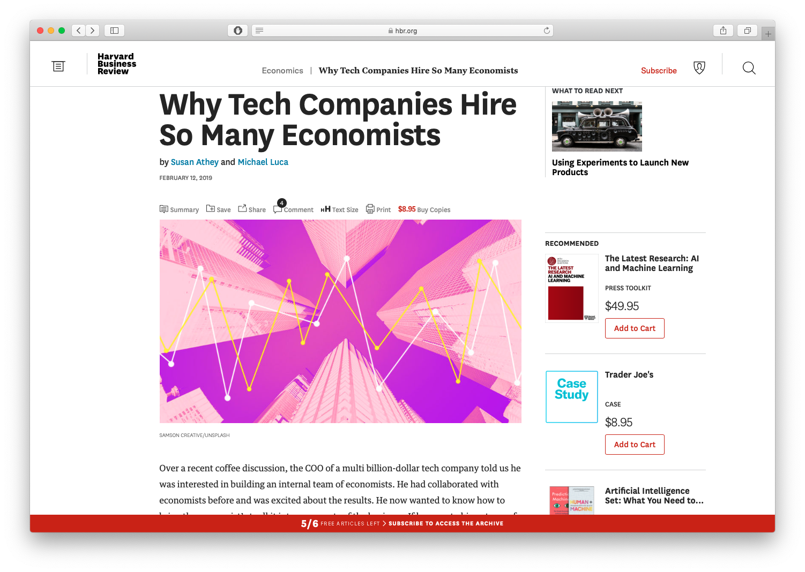
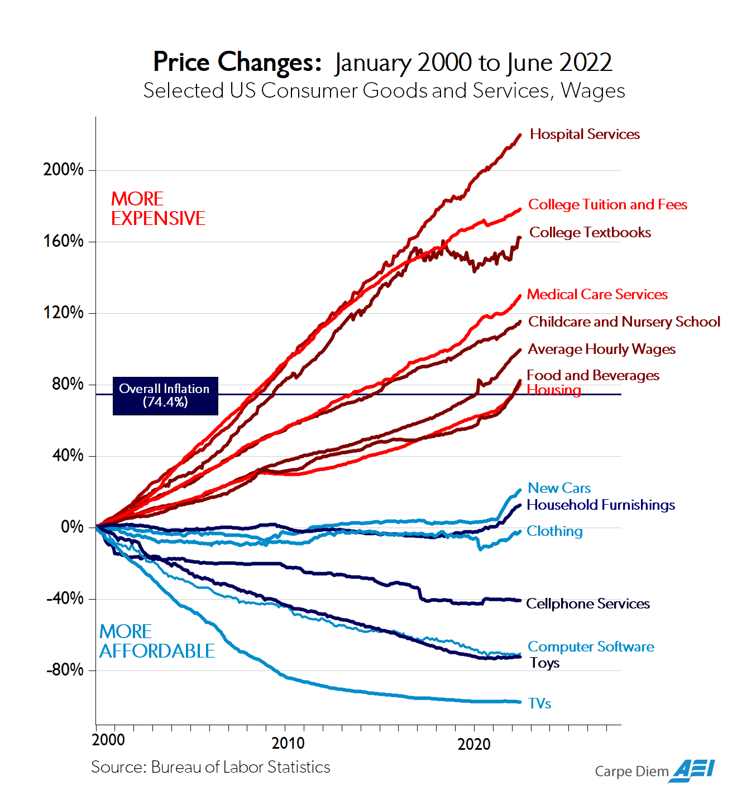
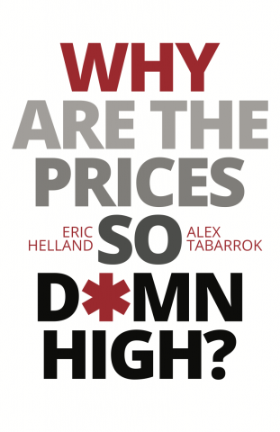

```{r setup, include=FALSE}
options(htmltools.dir.version = FALSE)
knitr::opts_chunk$set(echo=F,
                      message=F,
                      warning=F,
                      fig.retina = 3,
                      fig.align = "center")
library("tidyverse")
library("mosaic")
library("ggrepel")
library("fontawesome")
xaringanExtra::use_tile_view()
xaringanExtra::use_tachyons()
xaringanExtra::use_freezeframe()
xaringanExtra::use_progress_bar()

update_geom_defaults("label", list(family = "Fira Sans Condensed"))
update_geom_defaults("text", list(family = "Fira Sans Condensed"))

set.seed(256)
```

class: title-slide

# 1.2 — Budget Constraint

## ECON 306 • Microeconomic Analysis • Spring 2023

### Ryan Safner<br> Associate Professor of Economics <br> <a href="mailto:safner@hood.edu"><i class="fa fa-paper-plane fa-fw"></i>safner@hood.edu</a> <br> <a href="https://github.com/ryansafner/microS23"><i class="fa fa-github fa-fw"></i>ryansafner/microS23</a><br> <a href="https://microS23.classes.ryansafner.com"> <i class="fa fa-globe fa-fw"></i>microS23.classes.ryansafner.com</a><br>

---

class: inverse

# Outline

### [Rational Choice Theory](#4)
### [The Budget Constraint](#17)
### [Opportunity Cost](#31)
### [Changes in Market Conditions](#41)

---

# The Two Major Models of Economics as a “Science”

.pull-left[

## Optimization

- Agents have .hi[objectives] they value

- Agents face .hi[constraints]

- Make .hi[tradeoffs] to maximize objectives within constraints

.center[

]
]

.pull-right[

## Equilibrium

- Agents .hi[compete] with others over **scarce** resources

- Agents .hi[adjust] behaviors based on prices

- .hi[Stable outcomes] when adjustments stop

.center[

]
]

---

class: inverse, center, middle

# Rational Choice Theory

---

# The Logic of Choice: Ends and Means

.pull-left[
- Each of us acts .hi-purple[purposefully]

- We have .hi[ends], goals, desires, objectives
  - *Anything* you value!

- We use .hi[means] in the world that we *believe* will achieve our ends
  - .hi-purple[“utility”] when we .hi[consume] services, or
  - if scarce physical object: .hi[“economic good”] or .hi[resource]

]

.pull-right[


]

---

# The Logic of Choice: Purpose

.pull-left[

- Acting with .hi-purple[purpose] distinguishes humans from everything else in the universe

- Artificial intelligence researchers face .hi-turquoise[“the frame problem”]
  - Perception requires motivational goals to determine how to filter reality

]

.pull-right[

.center[

]
]

---

# Causal Inference I

.pull-left[
- Machine learning and artificial intelligence are “dumb”
  - Data can never “speak for itself!”

- With the right models and research designs, we *can* say “X causes Y” and quantify it!

- Economists are in a unique position to make *causal* claims that mere statistics cannot
]

.pull-right[

]

.source[For more, see [my blog post](https://ryansafner.com/post/econometrics-data-science-and-causal-inference/), and Pearl & MacKenzie (2018), *The Book of Why*]
---

# Causal Inference II

.pull-left[
.center[

[Harvard Business Review](https://hbr.org/2019/02/why-tech-companies-hire-so-many-economists)
]
]
.pull-right[

.smallest[
“First, the field of economics has spent decades developing a toolkit aimed at investigating empirical relationships, focusing on techniques to help understand which correlations speak to a causal relationship and which do not. This comes up all the time — does Uber Express Pool grow the full Uber user base, or simply draw in users from other Uber products? Should eBay advertise on Google, or does this simply syphon off people who would have come through organic search anyway? Are African-American Airbnb users rejected on the basis of their race? These are just a few of the countless questions that tech companies are grappling with, investing heavily in understanding the extent of a causal relationship.”
]
]

---

# The Law of Demand

.pull-left[
- Perhaps the most fundamental economic “law” is the .hi[law of demand]: 
  - **inverse relationship between price and quantity consumed**
  - i.e. demand curves slope downwards

- We investigate its source, and derive more useful properties

- First, we will need to develop a more rigorous framework

]

.pull-right[
.center[

]
]

---
# Rational Choice Theory

.pull-left[

- How do people decide:
  - which products to buy
  - which activities to dedicate time to
  - how much to save or invest
  - how to plan for the future

- .hi[Rational choice theory]: assume that people .hi-purple[optimize within constraints]

- A model of behavior we can extend to most scenarios
]

.pull-right[

.center[

]
]

---

# Rational Choice Theory: Beyond Consumers

.pull-left[

- Often called .hi[“Consumer Theory”] in textbooks, but realize:

- .hi-turquoise[*Everyone* is “a consumer”]
  - "Goods and services" are *anything* that you value!
  - Producers demand productive inputs

- We are really modeling how **individuals** make choices in almost *any* context!
]

.pull-right[

.center[

]
]

---

# Consumption Bundles

.pull-left[

- Imagine a (very strange) supermarket sells $x$ and $y$

- Your choices: amounts of $\{x, y\}$ to consume as a .hi-purple[bundle]

]

.pull-right[
.center[

]
]

---

# Consumption Bundles: Graphically

.pull-left[

- We can represent bundles graphically

- We’ll stick with 2 goods $(x, y)$ in 2-dimensions<sup>.magenta[†]</sup>

.bg-washed-green.b--dark-green.ba.bw2.br3.shadow-5.ph4.mt5[
.hi-green[Example]:
- $x$: 2 units
- $y$: 3 units
]
]

.pull-right[
```{r, echo=F, message = F, warning = F, fig.retina=3, fig.align="center"}
df <- tribble(
  ~x, ~y,
  2, 3
)

ggplot(df, aes(x = x,
               y = y))+
  geom_point(size =3)+
  geom_text(aes(x=2,y=3.5), label="(2,3)", size=7)+
  geom_segment(x=0, xend=2, y=3, yend=3, linetype="dotted", size =1)+
  geom_segment(x=2, xend=2, y=0, yend=3, linetype="dotted", size =1)+
  scale_x_continuous(breaks = seq(0,10,1), 
                     limits = c(0,10),
                     expand = c(0,0))+
  scale_y_continuous(breaks = seq(0,10,1), 
                     limits = c(0,10),
                     expand=c(0,0))+
  theme_classic(base_family = "Fira Sans Condensed", base_size=20)
```
]

.footnote[<sup>.magenta[†]</sup> See [appendix](https://micros23.classes.ryansafner.com/resources/appendices/1.2-appendix) in today's class page to extend to *n* goods!]

---

class: inverse, center, middle
# The Budget Constraint

---

# Affordability

.pull-left[

- If you had $100 to spend, what bundles of goods $\{x, y\}$ would you buy?

- Only those bundles that are .hi-purple[affordable]

- Denote prices of each good as $\{\color{#e64173}{p_x}, \color{#e64173}{p_y}\}$

- Let $\color{#e64173}{m}$ be the amount of income a person has

]

.pull-right[
.center[

]
]

---

# Affordability

.pull-left[

- If you had $100 to spend, what bundles of goods $\{x, y\}$ would you buy?

- Only those bundles that are .hi-purple[affordable]

- Denote prices of each good as $\{\color{#e64173}{p_x}, \color{#e64173}{p_y}\}$

- Let $\color{#e64173}{m}$ be the amount of income a person has

- A bundle $\{x, y\}$ is .hi-purple[affordable] at given prices $\{p_x,p_y\}$ when:

$$p_x x+p_y y \leq m$$
]

.pull-right[
.center[

]
]

---

# The Budget Set

.pull-left[

- The set of *all* affordable bundles that a consumer can choose is called the .hi[budget set] or .hi[choice set]

$$p_x x+p_y y \leq m$$

]

.pull-right[
.center[

]
]

---

# The Budget Set & the Budget Constraint

.pull-left[

- The set of *all* affordable bundles that a consumer can choose is called the .hi[budget set] or .hi[choice set]

$$p_x x+p_y y \leq m$$

- The .hi[budget *constraint*] is the set of all bundles that spend *all income* $m$:<sup>.hi[†]</sup>

$$p_x x+p_y y = m$$

]

.pull-right[
.center[

]
]

.footnote[<sup>.hi[†]</sup> Note the difference (the in/equality): budget *constraint* is the **subset** of the *budget set* that *spends all income*.]

---

# The Budget Constraint, Graphically

.pull-left[

- For 2 goods, $(x, y)$

$$p_xx+p_yy=m$$

]

---

# The Budget Constraint, Graphically

.pull-left[

- For 2 goods, $(x, y)$

$$p_xx+p_yy=m$$

- Solve for $y$ to graph

$$y=\frac{m}{p_y}-\frac{p_x}{p_y}x$$

]

.pull-right[
```{r BC-setup}
library("mosaic")
px<-2.5
py<-5
m<-20

ends<-tribble(
  ~x, ~y,
  0, (m/py),
  (m/px), 0
)
BC=function(x){(m/py)-(px/py)*x}
line_colors <- c("BC" = "blue")
```

```{r BC-plot0, fig.retina=3, fig.align="center", fig.width=6}
ggplot(data.frame(x=c(0,m/px)), aes(x=x))+
  scale_x_continuous(breaks = NULL)+
  scale_y_continuous(breaks = NULL)+
  labs(x = "x",
       y = "y")+
  theme_classic(base_family = "Fira Sans Condensed", base_size=20)
```
]

---

# The Budget Constraint, Graphically

.pull-left[
- For 2 goods, $(x, y)$

$$p_xx+p_yy=m$$

- Solve for $y$ to graph

$$y=\frac{m}{p_y}-\frac{p_x}{p_y}x$$

- $y$-intercept: $\frac{m}{p_y}$
- $x$-intercept: $\frac{m}{p_x}$
]

.pull-right[

```{r BC-plot1, echo=F, message = F, warning = F, fig.retina=3, fig.align="center", fig.width=6}
ggplot(data.frame(x=c(0,m/px)), aes(x=x))+
  geom_point(data = ends,
             mapping = aes(x = x,
                           y = y),
             size=3)+
  #stat_function(fun=BC, geom="line", size=1, aes(color="BC"))+
  scale_x_continuous(breaks = c(0,(m/px)),
                     labels = c(0,expression(m/p[x])),
                     expand=expand_scale(mult=c(0,0.1)))+
  scale_y_continuous(breaks = c(0,(m/py)),
                     labels = c(0,expression(m/p[y])),
                     expand=expand_scale(mult=c(0,0.1)))+
   coord_cartesian(clip = 'off')+ # show points on edge
  labs(x = "x",
       y = "y")+
  theme_classic(base_family = "Fira Sans Condensed", base_size=20)
```
]

---

# The Budget Constraint, Graphically

.pull-left[

- For 2 goods, $(x, y)$

$$p_xx+p_yy=m$$

- Solve for $y$ to graph

$$y=\frac{m}{p_y}-\frac{p_x}{p_y}x$$

- $y$-intercept: $\frac{m}{p_y}$
- $x$-intercept: $\frac{m}{p_x}$
- slope: $-\frac{p_x}{p_y}$

]

.pull-right[
```{r BC-plot2, echo=F, message = F, warning = F, fig.retina=3, fig.align="center", fig.width=6}
ggplot(data.frame(x=c(0,m/px)), aes(x=x))+
  geom_point(data = ends,
             mapping = aes(x = x,
                           y = y))+
  stat_function(fun=BC, geom="line", size=2, aes(color="BC"))+
  scale_x_continuous(breaks = c(0,(m/px)),
                     labels = c(0,expression(m/p[x])),
                     expand=expand_scale(mult=c(0,0.1)))+
  scale_y_continuous(breaks = c(0,(m/py)),
                     labels = c(0,expression(m/p[y])),
                     expand=expand_scale(mult=c(0,0.1)))+
  scale_colour_manual("Curves", values = line_colors, guide=F)+
  labs(x = "x",
       y = "y")+
  theme_classic(base_family = "Fira Sans Condensed", base_size=20)
```
]

---

# The Budget Constraint, Graphically

.pull-left[

- For 2 goods, $(x, y)$

$$p_xx+p_yy=m$$

- Solve for $y$ to graph

$$y=\frac{m}{p_y}-\frac{p_x}{p_y}x$$

- $y$-intercept: $\frac{m}{p_y}$
- $x$-intercept: $\frac{m}{p_x}$
- slope: $-\frac{p_x}{p_y}$

]

.pull-right[
```{r BC-plot3, fig.retina=3, fig.align="center", fig.width=6}
fill<-tribble(
  ~x, ~y,
  0, (m/py),
  (m/px), 0,
  0,0
)

ggplot(data.frame(x=c(0,m/px)), aes(x=x))+
  geom_polygon(data=fill, aes(x=x, y=y),fill="green", alpha=0.4)+
  stat_function(fun=BC, geom="line", size=2, aes(color="BC"))+
  annotate("text", x = (0.5*(m/px)+1.75), y = BC(0.5*(m/px)), label = expression(paste("slope =", - p[x]/p[y])), color="blue", size =7)+
  geom_label(x = 2, y = BC(2), color = "blue", label = "Budget \n Constraint")+
  geom_label(x = 2, y = 1, color = "green", label = "Budget Set")+
  scale_x_continuous(breaks = c(0,(m/px)),
                     labels = c(0,expression(m/p[x])),
                     expand=expand_scale(mult=c(0,0.1)))+
  scale_y_continuous(breaks = c(0,(m/py)),
                     labels = c(0,expression(m/p[y])),
                     expand=expand_scale(mult=c(0,0.1)))+
  scale_colour_manual("Curves", values = line_colors, guide=F)+
  labs(x = "x",
       y = "y")+
  theme_classic(base_family = "Fira Sans Condensed", base_size=20)
```
]

---

# The Budget Constraint: Example

.bg-washed-green.b--dark-green.ba.bw2.br3.shadow-5.ph4.mt5[
.hi-green[**Example**]: Suppose you have an income of $50 to spend on lattes $(l)$ and burritos $(b)$. The price of lattes is $5 and the price of burritos is $10. 

Let $l$ be on the horizontal axis and $b$ be on the vertical axis.

1. Write an equation for the budget constraint (in graphable form).

2. Graph the budget constraint.
]

---

# Interpreting the Budget Constraint

.pull-left[
.smaller[
- Points .hi-blue[on the line] spend all income
  - A: \\($5(0x)+$10(5y) = $50\\) 
  - B: \\($5(10x)+$10(0y) = $50\\)
  - C: \\($5(2x)+$10(4y) = $50\\) 
  - D: \\($5(6x)+$10(2y) = $50\\)
]

]

.pull-right[

```{r BC2-setup}
library("mosaic")
points<-tribble(
  ~letter, ~x, ~y,
  "A", 0, 5,
  "B", 10, 0,
  "C", 2, 4,
  "D", 6, 2,
  "E", 3, 2,
  "F", 6, 4
)
BC1=function(x){5-0.5*x}
line_colors <- c("BC" = "blue")
```

```{r BC2-plot1, fig.retina=3, fig.align="center", fig.width=6}
fill1<-tribble(
  ~x, ~y,
  0, 5,
  10, 0,
  0,0
)

ggplot(data.frame(x=c(0,10)), aes(x=x))+
  geom_polygon(data=fill1, aes(x=x, y=y),fill="green", alpha=0.4)+
  geom_point(data = subset(points, letter %in% c("A", "B", "C", "D")),
             aes(x = x, y = y), size=4, color = "blue")+
  stat_function(fun=BC1, geom="line", size=2, aes(color="BC"))+
  geom_text_repel(data = subset(points, letter %in% c("A", "B", "C", "D")),
                  aes(x=x , y = y, label = letter),
                  color="blue", size=6,
                  seed = 2,
                  point.padding=0.25)+
  scale_x_continuous(breaks=seq(0,10,1),
                     limits=c(0,10),
                     expand=expand_scale(mult=c(0,0.1)))+
  scale_y_continuous(breaks=seq(0,10,1),
                     limits=c(0,10),
                     expand=expand_scale(mult=c(0,0.1)))+
  scale_colour_manual("Curves", values = line_colors, guide=F)+
  labs(x = "x",
       y = "y")+
  theme_classic(base_family = "Fira Sans Condensed", base_size=20)
```
]

---

# Interpreting the Budget Constraint

.pull-left[

.smaller[
- Points .hi-blue[on the line] spend all income
  - A: \\($5(0x)+$10(5y) = $50\\) 
  - B: \\($5(10x)+$10(0y) = $50\\)
  - C: \\($5(2x)+$10(4y) = $50\\) 
  - D: \\($5(6x)+$10(2y) = $50\\)

- Points .hi-green[beneath] line are .hi-green[affordable] but don't use all income
  - E: \\($5(3x)+$10(2y) = $35\\) 

]
]

.pull-right[

```{r BC2-plot2, fig.retina=3, fig.align="center", fig.width=6}
ggplot(data.frame(x=c(0,10)), aes(x=x))+
  geom_polygon(data=fill1, aes(x=x, y=y),fill="green", alpha=0.4)+
  geom_point(data = subset(points, letter %in% c("A", "B", "C", "D")),
             aes(x = x, y = y), size=4, color = "blue")+
  geom_text_repel(data = subset(points, letter %in% c("A", "B", "C", "D")),
                  aes(x=x , y = y, label = letter),
                  color="blue", size=6,
                  seed = 2,
                  point.padding=0.25)+
  geom_point(data = subset(points, letter=="E"),
             aes(x = x, y = y), size=4, color = "green")+
  geom_text_repel(data = subset(points, letter=="E"),
                  aes(x=x , y = y, label = letter),
                  color="green", size=6,
                  seed = 2,
                  point.padding=0.25)+
  stat_function(fun=BC1, geom="line", size=2, aes(color="BC"))+
  scale_x_continuous(breaks=seq(0,10,1),
                     limits=c(0,10),
                     expand=expand_scale(mult=c(0,0.1)))+
  scale_y_continuous(breaks=seq(0,10,1),
                     limits=c(0,10),
                     expand=expand_scale(mult=c(0,0.1)))+
  scale_colour_manual("Curves", values = line_colors, guide=F)+
  labs(x = "x",
       y = "y")+
  theme_classic(base_family = "Fira Sans Condensed", base_size=20)
```
]

---

# Interpreting the Budget Constraint

.pull-left[

.smaller[
- Points .hi-blue[on the line] spend all income
  - A: \\($5(0x)+$10(5y) = $50\\) 
  - B: \\($5(10x)+$10(0y) = $50\\)
  - C: \\($5(2x)+$10(4y) = $50\\) 
  - D: \\($5(6x)+$10(2y) = $50\\)

- Points .hi-green[beneath] line are .hi-green[affordable] but don't use all income
  - E: \\($5(3x)+$10(2y) = $35\\) 

- Points .hi-red[above] line are .hi-red[unaffordable] (now)
  - F: \\($5(6x)+$10(4y) = $70\\) 
]
]

.pull-right[

```{r BC2-plot3, fig.retina=3, fig.align="center", fig.width=6}
ggplot(data.frame(x=c(0,10)), aes(x=x))+
  geom_polygon(data=fill1, aes(x=x, y=y),fill="green", alpha=0.4)+
  geom_point(data = subset(points, letter %in% c("A", "B", "C", "D")),
             aes(x = x, y = y), size=4, color = "blue")+
  geom_text_repel(data = subset(points, letter %in% c("A", "B", "C", "D")),
                  aes(x=x , y = y, label = letter),
                  color="blue", size=6,
                  seed = 2,
                  point.padding=0.25)+
  geom_point(data = subset(points, letter=="E"),
             aes(x = x, y = y), size=4, color = "green")+
  geom_text_repel(data = subset(points, letter=="E"),
                  aes(x=x , y = y, label = letter),
                  color="green", size=6,
                  seed = 2,
                  point.padding=0.25)+
  geom_point(data = subset(points, letter=="F"),
             aes(x = x, y = y), size=4, color = "red")+
  geom_text_repel(data = subset(points, letter=="F"),
                  aes(x=x , y = y, label = letter),
                  color="red", size=6,
                  point.padding=0.25)+
  stat_function(fun=BC1, geom="line", size=2, aes(color="BC"))+
  scale_x_continuous(breaks=seq(0,10,1),
                     limits=c(0,10),
                     expand=expand_scale(mult=c(0,0.1)))+
  scale_y_continuous(breaks=seq(0,10,1),
                     limits=c(0,10),
                     expand=expand_scale(mult=c(0,0.1)))+
  scale_colour_manual("Curves", values = line_colors, guide=F)+
  labs(x = "x",
       y = "y")+
  theme_classic(base_family = "Fira Sans Condensed", base_size=20)
```
]

---

class: inverse, center, middle
# Opportunity Cost

---

# Interpretting the Slope

.pull-left[

- **Slope**: .hi-purple[tradeoff] between $x$ and $y$ at market prices
  - Market .hi-purple[“exchange rate”]: $\frac{p_x}{p_y}y:1x$

- .hi-purple[*Relative* price] of $x$, or the .hi-purple[opportunity cost] of $x$:

> Consuming 1 more unit of $x$ requires giving up $\frac{p_x}{p_y}$ units of $y$

]

.pull-right[
```{r BC-slope-plot, fig.retina=3, fig.align="center", fig.width=6}
ggplot(data.frame(x=c(0,m/px)), aes(x=x))+
  geom_point(data = ends,
             mapping = aes(x = x,
                           y = y))+
  stat_function(fun=BC, geom="line", size=2, aes(color="BC"))+
  annotate("text", x = (0.5*(m/px)+1.75), y = BC(0.5*(m/px)), label = expression(paste("slope =", - p[x]/p[y])), color="blue", size =7)+
  scale_x_continuous(breaks = c(0,(m/px)),
                     labels = c(0,expression(m/p[x])),
                     expand=expand_scale(mult=c(0,0.1)))+
  scale_y_continuous(breaks = c(0,(m/py)),
                     labels = c(0,expression(m/p[y])),
                     expand=expand_scale(mult=c(0,0.1)))+
  scale_colour_manual("Curves", values = line_colors, guide=F)+
  labs(x = "x",
       y = "y")+
  theme_classic(base_family = "Fira Sans Condensed", base_size=20)
```
]

---

# Opportunity Cost

.pull-left[

- .hi[Opportunity cost]: value of next best foregone opportunity

- Even though we use money for prices, when you consume x, you’re really giving up .hi-turquoise[the opportunity to consume y]!

]

.pull-right[
```{r, ref.label="BC-slope-plot", fig.retina=3, fig.align="center", fig.width=6}
```
]

---

# The Parable of the Broken Window

.left-column[
.center[


Frederic Bastiat

1801-1850
]
]

.right-column[

- *That Which is Seen and That Which is Not Seen*

]

---

# The Parable of the Broken Window

.left-column[
.center[


Frederic Bastiat

1801-1850
]
]

.right-column[

- *That Which is Seen and That Which is Not Seen*

- “That which is seen”
    - The broken window
    - Resources diverted into glassmaking
]

---

# The Parable of the Broken Window

.left-column[
.center[


Frederic Bastiat

1801-1850
]
]

.right-column[

- *That Which is Seen and That Which is Not Seen*

- “That which is seen”
    - The broken window
    - Resources diverted into glassmaking

- “That which is not seen”
    - Opportunity cost of fixing the window
    - Resources diverted *away* from other opportunities
]

---

# Applying the Parable of the Broken Window

.pull-left[

- What does it mean to say that **“spending money 'stimulates' the economy”?**

]

.pull-right[

.center[

]
]

---

# Applying the Parable of the Broken Window

.pull-left[

- What does it mean to say that **“spending money 'stimulates' the economy”?**

- Scarce resources used in one industry can **not** be used in other industries

- .hi-purple[Every (visible) decision to spend on X yields more X, and destroys an (invisible) opportunity to spend on Y]

]

.pull-right[

.center[

]
]

---

# Could It Be Opportunity Cost (of Skilled Labor)?

.pull-left[
.center[


]

.source[Source: Perry, Mark, 2022, [“Chart of the Day...Or Century?”](https://www.aei.org/carpe-diem/chart-of-the-day-or-century-8/) *American Enterprise Institute*]

]

.pull-right[
.center[

]
]
---

# Could It Be Opportunity Cost (of Skilled Labor)?

.left-column[
.center[

]
]

.right-column[
.smaller[
> “The Baumol effect is easy to explain but difficult to grasp. In 1826, when Beethoven’s String Quartet No. 14 was first played, it took four people 40 minutes to produce a performance. In 2010, it still took four people 40 minutes to produce a performance. Stated differently, in the nearly 200 years between 1826 and 2010, there was no growth in string quartet labor productivity. In 1826 it took 2.66 labor hours to produce one unit of output, and it took 2.66 labor hours to produce one unit of output in 2010.”

]

.source[Sources: Helland, Eric and Alexander Tabarrok, 2019, [“Why Are The Prices So Damn High?”](https://www.mercatus.org/publications/healthcare/why-are-prices-so-damn-high) *Mercatus Center*

Good summaries on [Marginal Revolution](https://marginalrevolution.com/?s=d*mn)
]
]

---

# Could It Be Opportunity Cost (of Skilled Labor)?

.left-column[
.center[

]
]

.right-column[
.smallest[
> “Fortunately, most other sectors of the economy have experienced substantial growth in labor productivity since 1826...In 1826 the average hourly wage for a production worker was $1.14. In 2010 the average hourly wage for a production worker was $26.44, approximately 23 times higher in real (inflation-adjusted) terms. .hi[Growth in average labor productivity has a surprising implication: it makes the output of slow productivity-growth sectors (relatively) more expensive.] In 1826, the average wage of $1.14 meant that the 2.66 hours needed to produce a performance of Beethoven’s String Quartet No. 14 had an opportunity cost of just $3.02. At a wage of $26.44, the 2.66 hours of labor in music production had an opportunity cost of $70.33. .hi[Thus, in 2010 it was 23 times...more expensive to produce a performance of Beethoven’s String Quartet No. 14 than in 1826.]”

]

.source[Sources: Helland, Eric and Alexander Tabarrok, 2019, [“Why Are The Prices So Damn High?”](https://www.mercatus.org/publications/healthcare/why-are-prices-so-damn-high) *Mercatus Center*

Good summaries on [Marginal Revolution](https://marginalrevolution.com/?s=d*mn)]

]


---

# Could It Be Opportunity Cost (of Skilled Labor)?

.left-column[
.center[

]
]

.right-column[
.smallest[
> “In other words, one had to give up more other goods and services to produce a music performance in 2010 than one did in 1826. Why? Simply because in 2010, society was better at producing other goods and services than in 1826.”

]

.source[Sources: Helland, Eric and Alexander Tabarrok, 2019, [“Why Are The Prices So Damn High?”](https://www.mercatus.org/publications/healthcare/why-are-prices-so-damn-high) *Mercatus Center*

Good summaries on [Marginal Revolution](https://marginalrevolution.com/?s=d*mn)]

]

---
# Could It Be Opportunity Cost (of Skilled Labor)?

.left-column[
.center[

]
]

.right-column[
.smaller[
> “The 23 times increase in the relative price of the string quartet is the driving force of Baumol’s cost disease. The focus on relative prices tells us that the cost disease is misnamed. The cost disease is not a disease but a blessing. To be sure, it would be better if productivity increased in all industries, but that is just to say that more is better. There is nothing negative about productivity growth, even if it is unbalanced.”

]

.source[Sources: Helland, Eric and Alexander Tabarrok, 2019, [“Why Are The Prices So Damn High?”](https://www.mercatus.org/publications/healthcare/why-are-prices-so-damn-high) *Mercatus Center*

Good summaries on [Marginal Revolution](https://marginalrevolution.com/?s=d*mn)]

]

---

class: inverse, center, middle
# Changes in Market Conditions

---

# Changes in Market Conditions

.pull-left[

$$\begin{aligned}
\color{#e64173}{m} &= \color{#e64173}{p_x} x + \color{#e64173}{p_y} y\\
y &= \frac{\color{#e64173}{m}}{\color{#e64173}{p_y}}-\frac{\color{#e64173}{p_x}}{\color{#e64173}{p_y}}x\\
\end{aligned}$$

- Budget constraint is a function of specific .hi-purple[parameters]
  - $\color{#e64173}{m}$: income
  - $\color{#e64173}{p_x}, \color{#e64173}{p_y}$: market prices

- Economic analysis: .hi-turquoise[how changes in constraints affect people's choices]
  - “incentives”

]

.pull-right[

.center[

]
]

---


# Changes in Income, $m$

.pull-left[

- Changes in .hi-purple[income] .ul[shift] the budget constraint

.bg-washed-green.b--dark-green.ba.bw2.br3.shadow-5.ph4.mt5[
.hi-green[**Example**]: 

- Income .hi-green[increases] $m_1 \rightarrow m_2$
- Income .hi-red[decreases] $m_1 \rightarrow m_3$

]

- Slope unchanged (no change in prices!)

- .hi-green[Gain]/.hi-red[loss] **of affordable bundles**

]

.pull-right[
```{r m-change-setup}
m2 <- 40
ends2<-tribble(
  ~x, ~y,
  0, (m2/py),
  (m2/px), 0
)
ends_betw1<-tribble(
  ~x, ~y,
  0, (m/py),
  0, (m2/py),
  (m2/px), 0,
  (m/px), 0
)

BC2=function(x){(m2/py)-(px/py)*x}
#line_colors <- c("BC" = "blue")

m3 <- 10
ends3<-tribble(
  ~x, ~y,
  0, (m3/py),
  (m3/px), 0
)
ends_betw2<-tribble(
  ~x, ~y,
  0, (m/py),
  0, (m3/py),
  (m3/px), 0,
  (m/px), 0
)

BC3=function(x){(m3/py)-(px/py)*x}
```

```{r BC-m-change-plot, fig.retina=3, fig.align="center", fig.width=6}
ggplot(data.frame(x=c(0,m/px)), aes(x=x))+
  geom_polygon(data=ends_betw1, aes(x=x, y=y),fill="green", alpha=0.4)+
  geom_polygon(data=ends_betw2, aes(x=x, y=y),fill="red", alpha=0.4)+
  stat_function(fun=BC, geom="line", size=2, aes(color="BC"))+
  stat_function(fun=BC2, geom="line", linetype="dashed", size=2, color = "blue")+
  stat_function(fun=BC3, geom="line", linetype="dashed", size=2, color = "blue")+
  
  #annotate("segment", x = 5, xend = 8, y = 2.5, yend = 5, colour = "purple", size=2, alpha=1, arrow=arrow(length=unit(0.5,"cm"), ends="last", type="closed"))+
  
  #annotate("segment", x = 5, xend = 0, y = 2.5, yend = 1.25, colour = "purple", size=2, alpha=1, arrow=arrow(length=unit(0.5,"cm"), ends="last", type="closed"))+

  annotate(geom = "text", x = 6, y = 4, color = "white", label = expression("" %up% m), size = 7)+
  annotate(geom = "text", x = 3, y = 1.5, color = "white", label = expression("" %down% m), size = 7)+
  scale_x_continuous(breaks = c(0,(m3/px), (m/px), (m2/px)),
                     labels = c(0,expression(m[3]/p[x]),expression(m[1]/p[x]), expression(m[2]/p[x])),
                     limits = c(0, (m2/px)),
                     expand=expand_scale(mult=c(0,0.1)))+
  scale_y_continuous(breaks = c(0,(m3/py), (m/py), (m2/py)),
                     labels = c(0,expression(m[3]/p[y]),expression(m[1]/p[y]), expression(m[2]/p[y])),
                     limits = c(0, (m2/py)),
                     expand=expand_scale(mult=c(0,0.1)))+
  scale_colour_manual("Curves", values = line_colors, guide=F)+
  labs(x = "x",
       y = "y")+
  theme_classic(base_family = "Fira Sans Condensed", base_size=20)
```

]

---

# Changes in Income, $m$: Example

.bg-washed-green.b--dark-green.ba.bw2.br3.shadow-5.ph4.mt5[
.hi-green[Example]: Continuing the lattes and burritos example, (income is $50, lattes are $5, burritos are $10), suppose your income doubles to $100.

1. Find the equation of the new budget constraint (in graphable form).

2. Graph the new budget constraint.
]

---

# Changes in Relative Prices, $p_x$ or $p_y$

.pull-left[

- Change in .hi-purple[*relative* prices] .ul[rotate] the budget constraint

.bg-washed-green.b--dark-green.ba.bw2.br3.shadow-5.ph4.mt5[
.hi-green[**Example**]:

- Price of $x$ .hi-green[increases] $p_x \rightarrow p_x'$
- Price of $x$ .hi-red[decreases] $p_x \rightarrow p_x''$

]

- Change in slope: `\\(-\frac{p_x'}{p_y}\\)`, `\\(-\frac{p_x''}{p_y}\\)`

- .hi-green[Gain]/.hi-red[loss] **of affordable bundles**
]

.pull-right[
```{r x-change-setup}
px2 <- 5
px3 <- 1.25
ends_betw2<-tribble(
  ~x, ~y,
  0, (m/py),
  (m/px), 0,
  (m/px2), 0
)

ends_betw3<-tribble(
  ~x, ~y,
  0, (m/py),
  (m/px), 0,
  (m/px3), 0
)

BC4=function(x){(m/py)-(px2/py)*x}
BC5=function(x){(m/py)-(px3/py)*x}
#line_colors <- c("BC" = "blue")
```

```{r BC-x-change-plot, fig.retina=3, fig.align="center", fig.width=6}
ggplot(data.frame(x=c(0,m/px)), aes(x=x))+
  geom_polygon(data=ends_betw2, aes(x=x, y=y),fill="red", alpha=0.4)+
  geom_polygon(data=ends_betw3, aes(x=x, y=y),fill="green", alpha=0.4)+
  stat_function(fun=BC, geom="line", size=2, aes(color="BC"))+
  stat_function(fun=BC4, geom="line", linetype="dashed", size=2, aes(color="BC"))+
  stat_function(fun=BC5, geom="line", linetype="dashed", size=2, aes(color="BC"))+
  
  annotate(geom = "text", x = 7, y = 1.5, color = "white", label = expression("" %down% p[x]), size = 7)+
  annotate(geom = "text", x = 3.75, y = 1.5, color = "white", label = expression("" %up% p[x]), size = 7)+

  scale_x_continuous(breaks = c(0,(m/px2), (m/px), (m/px3)),
                     labels = c(0,expression(m/p[x]*minute),expression(m/p[x]), expression(m/p[x]*minute*minute)),
                     limits = c(0, (m2/px)),
                     expand=expand_scale(mult=c(0,0.1)))+
  scale_y_continuous(breaks = c(0,(m/py)),
                     labels = c(0,expression(m/p[y])),
                     limits = c(0, (m2/py)),
                     expand=expand_scale(mult=c(0,0.1)))+
  scale_colour_manual("Curves", values = line_colors, guide=F)+
  labs(x = "x",
       y = "y")+
  theme_classic(base_family = "Fira Sans Condensed", base_size=20)
```
]

---

# Changes in Relative Prices, $p_x$ or $p_y$

.pull-left[

- Change in .hi-purple[*relative* prices] .ul[rotate] the budget constraint

.bg-washed-green.b--dark-green.ba.bw2.br3.shadow-5.ph4.mt5[
.hi-green[**Example**]:

- Price of $y$ .hi-green[increases] $p_y \rightarrow p_y'$
- Price of $y$ .hi-red[decreases] $p_y \rightarrow p_y''$

]

- Change in slope: `\\(-\frac{p_x}{p_y'}\\)`, `\\(-\frac{p_x}{p_y''}\\)`

- .hi-green[Gain]/.hi-red[loss] **of affordable bundles**
]

.pull-right[
```{r y-change-setup}
py2 <- 2.5
ends_betw4<-tribble(
  ~x, ~y,
  0, (m/py),
  0, (m/py2),
  (m/px), 0
)
py3 <- 10

ends_betw5<-tribble(
  ~x, ~y,
  0, (m/py),
  0, (m/py3),
  (m/px), 0
)

BC6=function(x){(m/py2)-(px/py2)*x}
BC7=function(x){(m/py3)-(px/py3)*x}

#line_colors <- c("BC" = "blue")
```

```{r BC-y-change-plot, fig.retina=3, fig.align="center", fig.width=6}
ggplot(data.frame(x=c(0,m/px)), aes(x=x))+
  geom_polygon(data=ends_betw4, aes(x=x, y=y),fill="green", alpha=0.4)+
  geom_polygon(data=ends_betw5, aes(x=x, y=y),fill="red", alpha=0.4)+
  stat_function(fun=BC, geom="line", size=2, aes(color="BC"))+
  stat_function(fun=BC6, geom="line", linetype="dashed", size=2, aes(color="BC"))+
  stat_function(fun=BC7, geom="line", linetype="dashed", size=2, aes(color="BC"))+
  
  annotate(geom = "text", x = 2.5, y = 1.75, color = "white", label = expression("" %up% p[y]), size = 7)+
  annotate(geom = "text", x = 2.5, y = 3.75, color = "white", label = expression("" %down% p[y]), size = 7)+
  scale_x_continuous(breaks = c(0,(m/px)),
                     labels = c(0,expression(m/p[x])),
                     limits = c(0, (m2/px)),
                     expand=expand_scale(mult=c(0,0.1)))+
  scale_y_continuous(breaks = c(0,(m/py3), (m/py),(m/py2)),
                     labels = c(0,expression(m/p[y]*minute), expression(m/p[y]),expression(m/p[y]*minute*minute)),
                     limits = c(0, (m2/py)),
                     expand=expand_scale(mult=c(0,0.1)))+
  scale_colour_manual("Curves", values = line_colors, guide=F)+
  labs(x = "x",
       y = "y")+
  theme_classic(base_family = "Fira Sans Condensed", base_size=20)
```
]

---

# Economics is About (Changes in) *Relative* Prices

.pull-left[

- .hi-purple[Economic analysis is about (changes in) *relative* prices]

- Budget constraint slope (opportunity cost of $x)$ is $-\frac{p_x}{p_y}$

- Only .hi-turquoise[“real”] changes in .ul[*relative*] prices (from changes in market conditions) change consumer constraints (and alter behavior)

- i.e. not “the price of $x$,” its about “the price of x *relative to the price of y*”!

]

.pull-right[

.center[

]
]

---

# Economics is About (Changes in) *Relative* Prices

.pull-left[

- .hi-turquoise[“Nominal”] prices are often meaningless!
  - Need to make *comparisons* between prices of different goods

.bg-washed-green.b--dark-green.ba.bw2.br3.shadow-5.ph4.mt5[
.hi-green[Example]: Imagine yourself in a strange country. All you know is that the price of bread, in local currency, is “6”...
]
]
.pull-right[

.center[

]
]

---

# Changes in Relative Prices: Example

.bg-washed-green.b--dark-green.ba.bw2.br3.shadow-5.ph4.mt5[
**Example**: Continuing the lattes and burritos example (income is $50, lattes are $5, burritos are $10).

1. Suppose the price of lattes doubles from $5 to $10. Find the equation of the new budget constraint and graph it.

2. Return to the original price of lattes ($5) and suppose the price of burritos falls from $10 to $5. Find the equation of the new budget constraint and graph it.
]

---

# Budget Constraint and the Law of Demand

.pull-left[

- Recall the .hi[law of demand]

- We can derive it right off the budget constraint!
  - As $\uparrow p_x$, person can consume less $x$
  - As $\downarrow p_x$, person can consume more $x$

- Notice I have made **no assumptions** about rationality, preferences, utility, etc to get this!

]

.pull-right[
```{r, ref.label="BC-x-change-plot"}
```

]

---

# Markets Do Not Require Individual Rationality

.pull-left[
- A lot of griping about "rationality" and whether people are truly "rational"
  - [Behavioral economics](https://en.wikipedia.org/wiki/Behavioral_economics), for example

- The law of demand does not require rational people! (utility-maximizers, etc)
  - or markets, for that matter, it's the direct result of .hi[scarcity]

- This is important: .hi-turquoise[markets don't *require* rational people, they *make* people rational!]
]

.pull-right[
.center[

]
]
