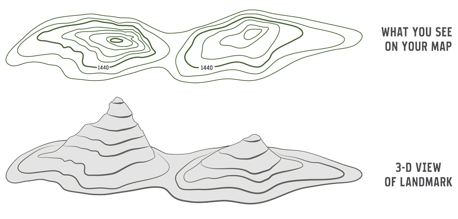

```{r setup, include=FALSE}
options(htmltools.dir.version = FALSE)
knitr::opts_chunk$set(echo=F,
                      message=F,
                      warning=F,
                      fig.retina = 3,
                      fig.align = "center")
library("tidyverse")
library("mosaic")
library("ggrepel")
library("fontawesome")
xaringanExtra::use_tile_view()
xaringanExtra::use_tachyons()
xaringanExtra::use_freezeframe()
xaringanExtra::use_progress_bar()

update_geom_defaults("label", list(family = "Fira Sans Condensed"))
update_geom_defaults("text", list(family = "Fira Sans Condensed"))

set.seed(256)
```

class: title-slide

# 1.3 — Preferences

## ECON 306 • Microeconomic Analysis • Spring 2023

### Ryan Safner<br> Associate Professor of Economics <br> <a href="mailto:safner@hood.edu"><i class="fa fa-paper-plane fa-fw"></i>safner@hood.edu</a> <br> <a href="https://github.com/ryansafner/microS23"><i class="fa fa-github fa-fw"></i>ryansafner/microS23</a><br> <a href="https://microS23.classes.ryansafner.com"> <i class="fa fa-globe fa-fw"></i>microS23.classes.ryansafner.com</a><br>

---

class: inverse

# Outline

### [Preferences](#3)
### [Indifference Curves](#10)
### [Marginal Rate of Substitution](#26)
### [Utility](#32)
### [Marginal Utility](#43)

---

class: inverse, center, middle

# Preferences

---

# Preferences I

.pull-left[

- Which bundles are **preferred** over others?

.bg-washed-green.b--dark-green.ba.bw2.br3.shadow-5.ph4.mt5[
.green[**Example**:] Between two bundles of $(x,y)$: 

$$a=(4,12) \text{ or } b=(6,12)$$
]

]

.pull-right[
.center[

]
]

---

# Preferences II

.pull-left[

- We will allow **three possible answers**:

]

.pull-right[
.center[

]
]

---

# Preferences II

.pull-left[

- We will allow **three possible answers**:

.content-box-blue[

1. .blue[`\\(a \succ b\\)`: (Strictly) prefer `\\(a\\)` over `\\(b\\)`]
]

]

.pull-right[
.center[

]
]

---

# Preferences II

.pull-left[

- We will allow **three possible answers**:

.content-box-blue[

1. .blue[`\\(a \succ b\\)`: (Strictly) prefer `\\(a\\)` over `\\(b\\)`]

2. .blue[`\\(a \prec b\\)`: (Strictly) prefer `\\(b\\)` over `\\(a\\)`]

]

]

.pull-right[
.center[

]
]

---

# Preferences II

.pull-left[

- We will allow **three possible answers**:

.content-box-blue[

1. .blue[`\\(a \succ b\\)`: (Strictly) prefer `\\(a\\)` over `\\(b\\)`]

2. .blue[`\\(a \prec b\\)`: (Strictly) prefer `\\(b\\)` over `\\(a\\)`]

3. .blue[`\\(a \sim b\\)`: Indifferent between `\\(a\\)` and `\\(b\\)`]
]
]

.pull-right[
.center[

]
]

---

# Preferences II

.pull-left[

- We will allow **three possible answers**:

.content-box-blue[

1. .blue[`\\(a \succ b\\)`: (Strictly) prefer `\\(a\\)` over `\\(b\\)`]

2. .blue[`\\(a \prec b\\)`: (Strictly) prefer `\\(b\\)` over `\\(a\\)`]

3. .blue[`\\(a \sim b\\)`: Indifferent between `\\(a\\)` and `\\(b\\)`]
]

- .hi[*Preferences*] **are a list of all such comparisons between all bundles**

See appendix in [today's class page](/resources/appendices/1.3-appendix) for more.
]

.pull-right[
.center[

]
]

---

class: inverse, center, middle
# Indifference Curves

---

# Mapping Preferences Graphically I

.pull-left[
- For each bundle, we now have 3 pieces of information: 
    - amount of $x$
    - amount of $y$
    - preference compared to other bundles
    
- How to represent this information graphically? 
]

.pull-right[
.center[

]
]

---

# Mapping Preferences Graphically II

.pull-left[

- Cartographers have the answer for us

- On a map, **contour lines** link areas of **equal height**

- We will use .hi[“indifference curves”] to link bundles of **equal preference**

]

.pull-right[

.center[

]
]

---

# Mapping Preferences Graphically III

.pull-left[

.center[

3-D “Mount Utility”
```{r, fig.retina=3, fig.height=5.5}
library("plotly")
x_vec = seq(0,10,1)
y_vec = seq(0,10,1)
x_matrix = matrix(c(x_vec), nrow = 10, ncol = 1)
y_matrix = matrix(c(y_vec), nrow = 1, ncol = 10)
z_matrix = matrix(c(sqrt(x_matrix %*% y_matrix)),nrow=10,ncol=10)

plot_ly(x = x_vec,
           y = y_vec,
           z = z_matrix) %>%
  add_surface() %>%
  layout(scene = list(xaxis = list(title="X"),
                      yaxis = list(title="Y"),
                      zaxis = list(title="Utility")))
```
]
]
.pull-right[
.center[
2-D Indifference Curve Contours

```{r, fig.retina=3, fig.height=5.5}
library("mosaic")
library("viridis")

IC_10=function(x){100/x}
IC_9=function(x){81/x}
IC_8=function(x){64/x}
IC_7=function(x){49/x}
IC_6=function(x){36/x}
IC_5=function(x){25/x}
IC_4=function(x){16/x}
IC_3=function(x){9/x}
IC_2=function(x){4/x}
IC_1=function(x){1/x}


ggplot(data.frame(x=c(0,10)), aes(x=x))+
  stat_function(fun=IC_10, geom="line", size=2, color = "#FDE725FF")+
  stat_function(fun=IC_9, geom="line", size=2, color = "#B8DE29FF")+
  stat_function(fun=IC_8, geom="line", size=2, color = "#73D055FF")+
  stat_function(fun=IC_7, geom="line", size=2, color = "#3CBB75FF")+
  stat_function(fun=IC_6, geom="line", size=2, color = "#20A387FF")+
  stat_function(fun=IC_5, geom="line", size=2, color = "#238A8DFF")+
  stat_function(fun=IC_4, geom="line", size=2, color = "#2D708EFF")+
  stat_function(fun=IC_3, geom="line", size=2, color = "#39568CFF")+
  stat_function(fun=IC_2, geom="line", size=2, color = "#453781FF")+
  stat_function(fun=IC_1, geom="line", size=2, color = "#481567FF")+
    scale_x_continuous(breaks=seq(0,10,1),
                     limits=c(0,10),
                     expand=expand_scale(mult=c(0,0.1)))+
  scale_y_continuous(breaks=seq(0,10,1),
                     limits=c(0,10),
                     expand=expand_scale(mult=c(0,0.1)))+
  #scale_colour_manual("Curves", values = line_colors, guide=F)+
  labs(x = "x",
       y = "y")+
  theme_classic(base_family = "Fira Sans Condensed", base_size=20)
```

]
]
---

# Indifference Curves: Example

.pull-left[

.bg-washed-green.b--dark-green.ba.bw2.br3.shadow-5.ph4.mt5[
.green[**Example**]: Suppose you are hunting for an apartment. You value *both* the size of the apartment and the number of friends that live nearby. 
]
]
.pull-right[

```{r IC-ex-0, fig.retina=3, fig.align="center", fig.width=6}
IC=function(x){1200/x}
line_colors <- c("IC" = "blue")

apts<-tribble(
  ~letter, ~x, ~y,
  "A", 1, 1200,
  "B", 3, 400,
  "C", 6, 200,
)

ggplot(data.frame(x=c(0,10)), aes(x=x))+
  #geom_point(data = subset(apts, letter=="A"),
  #           mapping=aes(x=x, y=y))+
  scale_x_continuous(breaks=seq(0,10,1),
                     limits=c(0,10),
                     expand=expand_scale(mult=c(0,0.1)))+
  scale_y_continuous(breaks=seq(0,2000,200),
                     limits=c(0,2000),
                     expand=expand_scale(mult=c(0,0.1)))+
  scale_colour_manual("Curves", values = line_colors, guide=F)+
  labs(x = "Friends Nearby",
       y = expression(ft^2))+
  theme_classic(base_family = "Fira Sans Condensed", base_size=20)
```

]

---

# Indifference Curves: Example

.pull-left[

.bg-washed-green.b--dark-green.ba.bw2.br3.shadow-5.ph4.mt5[
.green[**Example**]: Suppose you are hunting for an apartment. You value *both* the size of the apartment and the number of friends that live nearby. 

- Apt. *A* has 1 friend nearby and is 1,200 $ft^2$
]
]
.pull-right[

```{r IC-ex-1, fig.retina=3, fig.align="center", fig.width=6}
ggplot(data.frame(x=c(0,10)), aes(x=x))+
  geom_point(data = subset(apts, letter=="A"),
             mapping=aes(x=x, y=y),
             size = 2)+
  geom_text_repel(data = subset(apts, letter=="A"),
             mapping=aes(x=x, y=y,
             label = letter),
             seed = 2,
             size = 6)+
  scale_x_continuous(breaks=seq(0,10,1),
                     limits=c(0,10),
                     expand=expand_scale(mult=c(0,0.1)))+
  scale_y_continuous(breaks=seq(0,2000,200),
                     limits=c(0,2000),
                     expand=expand_scale(mult=c(0,0.1)))+
  scale_colour_manual("Curves", values = line_colors, guide=F)+
  labs(x = "Friends Nearby",
       y = expression(ft^2))+
  theme_classic(base_family = "Fira Sans Condensed", base_size=20)
```

]

---

# Indifference Curves: Example

.pull-left[

.bg-washed-green.b--dark-green.ba.bw2.br3.shadow-5.ph4.mt5[
.green[**Example**]: Suppose you are hunting for an apartment. You value *both* the size of the apartment and the number of friends that live nearby. 

- Apt. *A* has 1 friend nearby and is 1,200 $ft^2$
    - Apts that are larger and/or have more friends $\succ A$
]
]
.pull-right[

```{r IC-ex-2, fig.retina=3, fig.align="center", fig.width=6}
ggplot(data.frame(x=c(0,10)), aes(x=x))+
  geom_point(data = subset(apts, letter=="A"),
             mapping=aes(x=x, y=y),
             size =2)+
  geom_text_repel(data = subset(apts, letter=="A"),
             mapping=aes(x=x, y=y,
             label = letter),
             seed = 2,
             size = 6)+
  geom_rect(aes(xmin=1, xmax=10, ymin=1200, ymax=2000), fill="green", alpha=0.2)+
  scale_x_continuous(breaks=seq(0,10,1),
                     limits=c(0,10),
                     expand=expand_scale(mult=c(0,0.1)))+
  scale_y_continuous(breaks=seq(0,2000,200),
                     limits=c(0,2000),
                     expand=expand_scale(mult=c(0,0.1)))+
  scale_colour_manual("Curves", values = line_colors, guide=F)+
  labs(x = "Friends Nearby",
       y = expression(ft^2))+
  theme_classic(base_family = "Fira Sans Condensed", base_size=20)
```

]

---

# Indifference Curves: Example

.pull-left[

.bg-washed-green.b--dark-green.ba.bw2.br3.shadow-5.ph4.mt5[
.green[**Example**]: Suppose you are hunting for an apartment. You value *both* the size of the apartment and the number of friends that live nearby. 

- Apt. *A* has 1 friend nearby and is 1,200 $ft^2$
    - Apts that are larger and/or have more friends $\succ A$
    - Apts that are smaller and/or have fewer friends $\prec A$
]
]
.pull-right[

```{r IC-ex-3, fig.retina=3, fig.align="center", fig.width=6}
ggplot(data.frame(x=c(0,10)), aes(x=x))+
  geom_point(data = subset(apts, letter=="A"),
             mapping=aes(x=x, y=y),
             size =2)+
  geom_text_repel(data = subset(apts, letter=="A"),
             mapping=aes(x=x, y=y,
             label = letter),
             seed = 2,
             size =6)+
  geom_rect(aes(xmin=1, xmax=10, ymin=1200, ymax=2000), fill="green", alpha=0.2)+
  geom_rect(aes(xmin=0, xmax=1, ymin=0, ymax=1200), fill="red", alpha=0.2)+
  scale_x_continuous(breaks=seq(0,10,1),
                     limits=c(0,10),
                     expand=expand_scale(mult=c(0,0.1)))+
  scale_y_continuous(breaks=seq(0,2000,200),
                     limits=c(0,2000),
                     expand=expand_scale(mult=c(0,0.1)))+
  scale_colour_manual("Curves", values = line_colors, guide=F)+
  labs(x = "Friends Nearby",
       y = expression(ft^2))+
  theme_classic(base_family = "Fira Sans Condensed", base_size=20)
```

]

---

# Indifference Curves: Example

.pull-left[

.bg-washed-green.b--dark-green.ba.bw2.br3.shadow-5.ph4.mt5[
.green[**Example**]:
.smaller[
- Apt. *A* has 1 friend nearby and is 1,200 $ft^2$

- *B* has *more* friends but *less* $ft^2$
]
]
]
.pull-right[

```{r IC-ex-4, fig.retina=3, fig.align="center", fig.width=6}
ggplot(data.frame(x=c(0,10)), aes(x=x))+
  geom_point(data = subset(apts, letter %in% c("A","B")),
             mapping=aes(x=x, y=y),
             size =2)+
  geom_text_repel(data = subset(apts, letter %in% c("A","B")),
             mapping=aes(x=x, y=y,
             label = letter),
             seed = 2,
             size =6)+
  scale_x_continuous(breaks=seq(0,10,1),
                     limits=c(0,10),
                     expand=expand_scale(mult=c(0,0.1)))+
  scale_y_continuous(breaks=seq(0,2000,200),
                     limits=c(0,2000),
                     expand=expand_scale(mult=c(0,0.1)))+
  scale_colour_manual("Curves", values = line_colors, guide=F)+
  labs(x = "Friends Nearby",
       y = expression(ft^2))+
  theme_classic(base_family = "Fira Sans Condensed", base_size=20)
```

]

---

# Indifference Curves: Example

.pull-left[

.bg-washed-green.b--dark-green.ba.bw2.br3.shadow-5.ph4.mt5[
.green[**Example**]:
.smaller[
- Apt. *A* has 1 friend nearby and is 1,200 $ft^2$

- *B* has *more* friends but *less* $ft^2$

- *C* has *still more* friends but *less* $ft^2$
]
]
]
.pull-right[

```{r IC-ex-5, fig.retina=3, fig.align="center", fig.width=6}
ggplot(data.frame(x=c(0,10)), aes(x=x))+
  geom_point(data = apts,
             mapping=aes(x=x, y=y),
             size =2)+
  geom_text_repel(data = apts,
             mapping=aes(x=x, y=y,
             label = letter),
             seed = 2,
             size =6)+
  scale_x_continuous(breaks=seq(0,10,1),
                     limits=c(0,10),
                     expand=expand_scale(mult=c(0,0.1)))+
  scale_y_continuous(breaks=seq(0,2000,200),
                     limits=c(0,2000),
                     expand=expand_scale(mult=c(0,0.1)))+
  scale_colour_manual("Curves", values = line_colors, guide=F)+
  labs(x = "Friends Nearby",
       y = expression(ft^2))+
  theme_classic(base_family = "Fira Sans Condensed", base_size=20)
```

]

---

# Indifference Curves: Example

.pull-left[

.bg-washed-green.b--dark-green.ba.bw2.br3.shadow-5.ph4.mt5[
.green[**Example**]:

.smaller[
- Apt. *A* has 1 friend nearby and is 1,200 $ft^2$

- *B* has *more* friends but *less* $ft^2$

- *C* has *still more* friends but *less* $ft^2$

- $A \sim B \sim C$: on same .hi[indifference curve]
]
]
]
.pull-right[

```{r IC-ex-6, fig.retina=3, fig.align="center", fig.width=6}
ggplot(data.frame(x=c(0,10)), aes(x=x))+
  stat_function(fun=IC, geom="line", size=2, aes(color="IC"))+
  geom_point(data = apts,
             mapping=aes(x=x, y=y),
             size = 3)+
  geom_text_repel(data = apts,
             mapping=aes(x=x, y=y,
             label = letter),
             seed = 2,
             size = 6)+
  scale_x_continuous(breaks=seq(0,10,1),
                     limits=c(0,10),
                     expand=expand_scale(mult=c(0,0.1)))+
  scale_y_continuous(breaks=seq(0,2000,200),
                     limits=c(0,2000),
                     expand=expand_scale(mult=c(0,0.1)))+
  scale_colour_manual("Curves", values = line_colors, guide=F)+
  labs(x = "Friends Nearby",
       y = expression(ft^2))+
  theme_classic(base_family = "Fira Sans Condensed", base_size=20)
```

]

---

# Indifference Curves: Example

.pull-left[

- .hi-blue[Indifferent] between all apartments on the **same** curve
]

.pull-right[

```{r IC-ex-8, fig.retina=3, fig.align="center", fig.width=6}
ggplot(data.frame(x=c(0,10)), aes(x=x))+
  stat_function(fun=IC, geom="line", size=2, aes(color="IC"))+
  geom_point(data = apts,
             mapping=aes(x=x, y=y),
             size = 3)+
  geom_text_repel(data = apts,
             mapping=aes(x=x, y=y,
             label = letter),
             seed = 2,
             size = 6)+
  scale_x_continuous(breaks=seq(0,10,1),
                     limits=c(0,10),
                     expand=expand_scale(mult=c(0,0.1)))+
  scale_y_continuous(breaks=seq(0,2000,200),
                     limits=c(0,2000),
                     expand=expand_scale(mult=c(0,0.1)))+
  scale_colour_manual("Curves", values = line_colors, guide=F)+
  labs(x = "Friends Nearby",
       y = expression(ft^2))+
  theme_classic(base_family = "Fira Sans Condensed", base_size=20)
```

]

---

# Indifference Curves: Example

.pull-left[

- .hi-blue[Indifferent] between all apartments on the **same** curve

- Apts **above** curve are .hi-green[preferred over] apts on curve
  - $D \succ A \sim B \sim C$
  - On a .hi-green[higher curve]
]

.pull-right[

```{r IC-ex-10, fig.retina=3, fig.align="center", fig.width=6}
apts2<-tribble(
  ~letter, ~x, ~y,
  "A", 1, 1200,
  "B", 3, 400,
  "C", 6, 200,
  "D", 3, 1200
)


fill<-tibble(fx=seq(0,10,0.1),
             fymin=1200/fx,
             ymax=rep(2000,length(fx))
)

IC2=function(x){3600/x}
line_colors <- c("IC1" = "blue", "IC2" = "green")

ggplot(data.frame(x=c(0,10)), aes(x=x))+
  stat_function(fun=IC, geom="line", size=2, aes(color="IC1"))+
  stat_function(fun=IC2, geom="line", size=2, aes(color="IC2"))+
  geom_ribbon(data=fill,aes(x=fx,ymin=fymin,ymax=ymax),fill="green", alpha=0.4)+
  geom_point(data = apts2,
             mapping=aes(x=x, y=y),
             size = 3)+
  geom_text_repel(data = apts2,
             mapping=aes(x=x, y=y,
             label = letter),
             seed = 2,
             size = 6)+
  scale_x_continuous(breaks=seq(0,10,1),
                     limits=c(0,10),
                     expand=expand_scale(mult=c(0,0.1)))+
  scale_y_continuous(breaks=seq(0,2000,200),
                     limits=c(0,2000),
                     expand=expand_scale(mult=c(0,0.1)))+
  scale_colour_manual("Curves", values = line_colors, guide=F)+
  labs(x = "Friends Nearby",
       y = expression(ft^2))+
  theme_classic(base_family = "Fira Sans Condensed", base_size=20)
```

]

---

# Indifference Curves: Example

.pull-left[

- .hi-blue[Indifferent] between all apartments on the **same** curve

- Apts **above** curve are .hi-green[preferred over] apts on curve
  - $D \succ A \sim B \sim C$
  - On a .hi-green[higher curve]
- Apts **below** curve are .hi-red[less preferred] than apts on curve
  - $E \prec A \sim B \sim C$
  - On a .hi-red[lower curve]
]

.pull-right[

```{r IC-ex-11, fig.retina=3, fig.align="center", fig.width=6}
apts3<-tribble(
  ~letter, ~x, ~y,
  "A", 1, 1200,
  "B", 3, 400,
  "C", 6, 200,
  "D", 3, 1200,
  "E", 1, 400
)

fill2<-tibble(fx=seq(0,10,0.1),
             fymin=rep(0, length(fx)),
             ymax=1200/fx
)

IC2=function(x){3600/x}
IC3=function(x){400/x}

line_colors <- c("IC1" = "blue", "IC2" = "green", "IC3" = "red")

ggplot(data.frame(x=c(0,10)), aes(x=x))+
  stat_function(fun=IC, geom="line", size=2, aes(color="IC1"))+
  stat_function(fun=IC2, geom="line", size=2, aes(color="IC2"))+
  stat_function(fun=IC3, geom="line", size=2, aes(color="IC3"))+
  geom_ribbon(data=fill,aes(x=fx,ymin=fymin,ymax=ymax),fill="green", alpha=0.4)+
  geom_ribbon(data=fill2,aes(x=fx,ymin=fymin,ymax=ymax),fill="red", alpha=0.4)+
  geom_rect(aes(xmin=0,xmax=0.6,ymin=0,ymax=2000), fill="red", alpha=0.2)+
  geom_point(data = apts3,
             mapping=aes(x=x, y=y),
             size = 3)+
  geom_text_repel(data = apts3,
             mapping=aes(x=x, y=y,
             label = letter),
             seed = 2,
             size = 6)+
  scale_x_continuous(breaks=seq(0,10,1),
                     limits=c(0,10),
                     expand=expand_scale(mult=c(0,0.1)))+
  scale_y_continuous(breaks=seq(0,2000,200),
                     limits=c(0,2000),
                     expand=expand_scale(mult=c(0,0.1)))+
  scale_colour_manual("Curves", values = line_colors, guide=F)+
  labs(x = "Friends Nearby",
       y = expression(ft^2))+
  theme_classic(base_family = "Fira Sans Condensed", base_size=20)
```

]

---

# Curves Never Cross!

.pull-left[

- .hi-purple[Indifference curves can never cross]: preferences are .hi[transitive]
  - If I prefer $A \succ B$, and $B \succ C$, I must prefer $A \succ C$

]
.pull-right[

```{r IC-as-4, fig.retina=3, fig.align="center", fig.width=6}

points_as4<-tribble(
  ~letter, ~x, ~y,
  "A", 2.125, 570,
  "B", 6, 200,
  "C", 8, 425
)

IC_as4=function(x){(400/x)+375}


ggplot(data.frame(x=c(0,10)), aes(x=x))+
  stat_function(fun=IC, geom="line", size=2, color="blue")+
  stat_function(fun=IC_as4, geom="line", size=2, color="orange")+
  geom_point(data = points_as4,
             mapping=aes(x=x, y=y),
             size = 3)+
  geom_text_repel(data = points_as4,
             mapping=aes(x=x, y=y,
             label = letter),
             seed = 2,
             size = 6)+
  scale_x_continuous(breaks=seq(0,10,1),
                     limits=c(0,10),
                     expand=expand_scale(mult=c(0,0.1)))+
  scale_y_continuous(breaks=seq(0,2000,200),
                     limits=c(0,2000),
                     expand=expand_scale(mult=c(0,0.1)))+
  scale_colour_manual(guide=F)+
  labs(x = "Friends Nearby",
       y = expression(ft^2))+
  theme_classic(base_family = "Fira Sans Condensed", base_size=20)
```

]

---

# Curves Never Cross!

.pull-left[

- .hi-purple[Indifference curves can never cross]: preferences are .hi[transitive]
  - If I prefer $A \succ B$, and $B \succ C$, I must prefer $A \succ C$

- Suppose two curves crossed:
  - .blue[`\\(A \sim B\\)`]
  - .orange[`\\(B \sim C\\)`]
  - But .orange[`\\(C\\)`] $\succ$ .blue[`\\(B\\)`]!
  - Doesn't make sense (not transitive)!

]
.pull-right[

```{r IC-as-41, fig.retina=3, fig.align="center", fig.width=6}

points_as4<-tribble(
  ~letter, ~x, ~y,
  "A", 2.125, 570,
  "B", 6, 200,
  "C", 8, 425
)

IC_as4=function(x){(400/x)+375}


ggplot(data.frame(x=c(0,10)), aes(x=x))+
  stat_function(fun=IC, geom="line", size=2, color="blue")+
  stat_function(fun=IC_as4, geom="line", size=2, color="orange")+
  geom_point(data = points_as4,
             mapping=aes(x=x, y=y),
             size = 3)+
  geom_text_repel(data = points_as4,
             mapping=aes(x=x, y=y,
             label = letter),
             seed = 2,
             size = 6)+
  scale_x_continuous(breaks=seq(0,10,1),
                     limits=c(0,10),
                     expand=expand_scale(mult=c(0,0.1)))+
  scale_y_continuous(breaks=seq(0,2000,200),
                     limits=c(0,2000),
                     expand=expand_scale(mult=c(0,0.1)))+
  scale_colour_manual(guide=F)+
  labs(x = "Friends Nearby",
       y = expression(ft^2))+
  theme_classic(base_family = "Fira Sans Condensed", base_size=20)
```

]

---

class: inverse, center, middle
# Marginal Rate of Substitution

---

# Marginal Rate of Substitution I

.pull-left[
- If I find another apt with *1 fewer friend* nearby, how many *more $ft^2$* would you need to keep you *satisfied?*

]

.pull-right[
.center[

]
]

---

# Marginal Rate of Substitution I

.pull-left[
- If I find another apt with *1 fewer friend* nearby, how many *more $ft^2$* would you need to keep you *satisfied?*

- .hi[Marginal Rate of Substitution (MRS)]: rate at which you trade away one good for more of the other and remain *indifferent*

- Think of this as the .hi-purple[relative value] you place on good $x$:

> “I am willing to give up $(MRS)$ units of $y$ to consume 1 more unit of $x$ and stay satisfied.”

]

.pull-right[
.center[

]
]

---

# Marginal Rate of Substitution II

.center[

]

---

# Marginal Rate of Substitution II

.pull-left[

- MRS $=$ .hi[slope of the indifference curve]

$$MRS_{x,y}=-\frac{\Delta y}{\Delta x} = \frac{rise}{run}$$

- Amount of $y$ given up for 1 more $x$

- Note: slope (MRS) changes along the curve!

]
.pull-right[

```{r MRS, fig.retina=3, fig.align="center", fig.width=6}

IC_mrs=function(x){10/x}

ggplot(data.frame(x=c(0,10)), aes(x=x))+
  geom_segment(aes(x=1, xend=1, y=IC_mrs(1), yend=IC_mrs(2)), linetype="dashed", color="red", size=1)+
  geom_segment(aes(x=1, xend=2, y=IC_mrs(2), yend=IC_mrs(2)), linetype="dashed", color="red", size=1)+
  geom_segment(aes(x=4, xend=4, y=IC_mrs(4), yend=IC_mrs(5)), linetype="dashed", color="red", size=1)+
  geom_segment(aes(x=4, xend=5, y=IC_mrs(5), yend=IC_mrs(5)), linetype="dashed", color="red", size=1)+
  geom_segment(aes(x=8, xend=8, y=IC_mrs(8), yend=IC_mrs(9)), linetype="dashed", color="red", size=1)+
  geom_segment(aes(x=8, xend=9, y=IC_mrs(9), yend=IC_mrs(9)), linetype="dashed", color="red", size=1)+
  stat_function(fun=IC_mrs, geom="line", size=2, color="blue")+
  scale_x_continuous(breaks=seq(0,10,1),
                     limits=c(0,10),
                     expand=expand_scale(mult=c(0,0.1)))+
  scale_y_continuous(breaks=seq(0,10,1),
                     limits=c(0,10),
                     expand=expand_scale(mult=c(0,0.1)))+
  labs(x = "x",
       y = "y")+
  theme_classic(base_family = "Fira Sans Condensed", base_size=20)
```

]

---

# MRS vs. Budget Constraint Slope

.pull-left[

- [Budget constraint](/content/1.2-content) (slope) from before measured the **market’s** tradeoff between $x$ and $y$ based on market prices

- **MRS** here measures your **personal** evaluation of $x$ vs. $y$ based on your preferences

- [.hi-turquoise[Foreshadowing]](/content/1.4-content): what if these two rates are *different*? Are you truly optimizing?
]

.pull-right[
.center[

]
]

---

class: inverse, center, middle
# Utility

---

# So Where are the Numbers?

.pull-left[
- Long ago (1890s), utility considered a real, measurable, cardinal scale<sup>.hi[†]</sup>

- Utility thought to be lurking in people's brains
    - Could be understood from first principles: calories, water, warmth, etc
    
- Obvious problems
]

.pull-right[
.center[

]
]

.footnote[<sup>.hi[†]</sup> [“Neuroeconomics”](https://en.wikipedia.org/wiki/Neuroeconomics) & cognitive scientists are re-attempting a scientific approach to measure utility]

---

# Utility Functions?

.pull-left[

- More plausibly .hi-turquoise[infer people's preferences from their actions]!
  - “Actions speak louder than words”

- .hi-purple[Principle of Revealed Preference]: if a person chooses $x$ over $y$, and both are affordable, then they must prefer $x \succeq y$
	
- Flawless? Of course not. But extremely useful approximation!
  - People tend not to leave money on the table
]

.pull-right[

.center[

]
]

---

# Utility Functions!

.pull-left[

- A .hi[utility function] $u(\cdot)$<sup>.hi[†]</sup> *represents* preference relations $(\succ , \prec , \sim)$

- Assign utility numbers to bundles, such that, for any bundles $a$ and $b$:
$$a \succ b \iff u(a)>u(b)$$
]

.pull-right[

.center[

]
]

.footnote[<sup>.hi[†]</sup> The `\\(\cdot\\)` is a placeholder for whatever goods we are considering (e.g. `\\(x\\)`, `\\(y\\)`, burritos, lattes, etc)]

---

# Utility Functions, Pural I

.pull-left[
.bg-washed-green.b--dark-green.ba.bw2.br3.shadow-5.ph4.mt5[
.hi-green[Example]: Imagine three alternative bundles of $(x, y)$:
$$\begin{aligned}
a&=(1,2)\\
b&=(2,2)\\
c&=(4,3)\\
\end{aligned}$$
]
]

--

.pull-right[
- Let $u(\cdot)$ assign each bundle a utility of:

| $u(\cdot)$ |
|------------|
| $u(a)=1$   | 
| $u(b)=2$   |
| $u(c)=3$   |

]

--

- .hi-turquoise[Does this mean that bundle `\\(c\\)` is 3 times the utility of `\\(a\\)`?]

---

# Utility Functions, Pural II

.pull-left[
.bg-washed-green.b--dark-green.ba.bw2.br3.shadow-5.ph4.mt5[
.hi-green[Example]: Imagine three alternative bundles of $(x, y)$:
$$\begin{aligned}
a&=(1,2)\\
b&=(2,2)\\
c&=(4,3)\\
\end{aligned}$$
]
]


.pull-left[
- Now consider a *2*<sup>*nd*</sup> function $v(\cdot)$:

| $u(\cdot)$ | $v(\cdot)$ |
|------------|------------|
| $u(a)=1$   | $v(a)=3$   |
| $u(b)=2$   | $v(b)=5$   |
| $u(c)=3$   | $v(c)=7$   |

]

---

# Utility Functions, Pural III

.pull-left[
- Utility numbers have an .hi-purple[ordinal] meaning only, **not cardinal**

- Both are valid utility functions:<sup>.hi[†]</sup>
    - $u(c)>u(b)>u(a)$ ✅
    - $v(c)>v(b)>v(a)$ ✅
    - because $c \succ b \succ a$

- .hi-purple[Only the .ul[ranking] of utility numbers matters!]

]

.pull-right[

.center[

]
]

.footnote[<sup>.hi[†]</sup> See the Mathematical Appendix in [Today's Class Page](resources/appendices/1.3-appendix/#utility-functions-and-pmts) for why.]

---

# Utility Functions and Indifference Curves I

.pull-left[
- Two tools to represent preferences: .hi[indifference curves] and .hi[utility functions]

- Indifference curve: all **equally preferred** bundles $\iff$ **same utility level**

- Each indifference curve represents one level (or contour) of utility surface (function)

]

.pull-right[

.center[

]
]

---

# Utility Functions and Indifference Curves II

.pull-left[

.center[

3-D Utility Function: $u(x,y)=\sqrt{xy}$
```{r, fig.retina=3, fig.height=5.5}
library("plotly")
x_vec = seq(0,10,1)
y_vec = seq(0,10,1)
x_matrix = matrix(c(x_vec), nrow = 10, ncol = 1)
y_matrix = matrix(c(y_vec), nrow = 1, ncol = 10)
z_matrix = matrix(c(sqrt(x_matrix %*% y_matrix)),nrow=10,ncol=10)

plot_ly(x = x_vec,
           y = y_vec,
           z = z_matrix) %>%
  add_surface() %>%
  layout(scene = list(xaxis = list(title="X"),
                      yaxis = list(title="Y"),
                      zaxis = list(title="Utility")))
```
]
]
.pull-right[
.center[
2-D Indifference Curve Contours: $y=\frac{u^2}{x}$

```{r, fig.retina=3, fig.height=5.5}
library("mosaic")
library("viridis")

IC_10=function(x){100/x}
IC_9=function(x){81/x}
IC_8=function(x){64/x}
IC_7=function(x){49/x}
IC_6=function(x){36/x}
IC_5=function(x){25/x}
IC_4=function(x){16/x}
IC_3=function(x){9/x}
IC_2=function(x){4/x}
IC_1=function(x){1/x}


ggplot(data.frame(x=c(0,10)), aes(x=x))+
  stat_function(fun=IC_10, geom="line", size=2, color = "#FDE725FF")+
  stat_function(fun=IC_9, geom="line", size=2, color = "#B8DE29FF")+
  stat_function(fun=IC_8, geom="line", size=2, color = "#73D055FF")+
  stat_function(fun=IC_7, geom="line", size=2, color = "#3CBB75FF")+
  stat_function(fun=IC_6, geom="line", size=2, color = "#20A387FF")+
  stat_function(fun=IC_5, geom="line", size=2, color = "#238A8DFF")+
  stat_function(fun=IC_4, geom="line", size=2, color = "#2D708EFF")+
  stat_function(fun=IC_3, geom="line", size=2, color = "#39568CFF")+
  stat_function(fun=IC_2, geom="line", size=2, color = "#453781FF")+
  stat_function(fun=IC_1, geom="line", size=2, color = "#481567FF")+
    geom_label(aes(x=9,y=IC_10(9)), color = "#FDE725FF", label="u=10", size = 6)+
    geom_label(aes(x=9,y=IC_9(9)), color = "#B8DE29FF", label="u=9", size = 6)+
    geom_label(aes(x=9,y=IC_8(9)), color = "#73D055FF", label="u=8", size = 6)+
    geom_label(aes(x=9,y=IC_7(9)), color = "#3CBB75FF", label="u=7", size = 6)+
    geom_label(aes(x=9,y=IC_6(9)), color = "#20A387FF", label="u=6", size = 6)+
    geom_label(aes(x=9,y=IC_5(9)), color = "#238A8DFF", label="u=5", size = 6)+
    geom_label(aes(x=9,y=IC_4(9)), color = "#2D708EFF", label="u=4", size = 6)+
    geom_label(aes(x=9,y=IC_3(9)), color = "#39568CFF", label="u=3", size = 6)+
    geom_label(aes(x=9,y=IC_2(9)), color = "#453781FF", label="u=2", size = 6)+
    geom_label(aes(x=9,y=IC_1(9)), color = "#481567FF", label="u=1", size = 6)+
    scale_x_continuous(breaks=seq(0,10,1),
                     limits=c(0,10),
                     expand=expand_scale(mult=c(0,0.1)))+
  scale_y_continuous(breaks=seq(0,10,1),
                     limits=c(0,10),
                     expand=expand_scale(mult=c(0,0.1)))+
  #scale_colour_manual("Curves", values = line_colors, guide=F)+
  labs(x = "x",
       y = "y")+
  theme_classic(base_family = "Fira Sans Condensed", base_size=20)
```

]
]

---

class: inverse, center, middle
# Marginal Utility

---

# MRS and Marginal Utility I

.pull-left[

- Recall: .hi[marginal rate of substitution `\\(MRS_{x,y}\\)`] is slope of the indifference curve
  - Amount of $y$ given up for 1 more $x$

- How to calculate MRS?
  - Recall it changes (not a straight line)!
  - We can calculate it using something from the **utility function**

]
.pull-right[

```{r, ref.label = "MRS"}

```

]

---

# MRS and Marginal Utility II

.pull-left[

- .hi[Marginal utility]: change in utility from a marginal increase in consumption

]
.pull-right[

```{r, ref.label = "MRS"}

```

]

---

# MRS and Marginal Utility II

.pull-left[

- .hi[Marginal utility]: change in utility from a marginal increase in consumption

.bg-washed-green.b--dark-green.ba.bw2.br3.shadow-5.ph4.mt5[
.green[**Marginal utility of `\\(x\\)`**]: $MU_x = \frac{\Delta u(x,y)}{\Delta x}$
]

]
.pull-right[

```{r, ref.label = "MRS"}

```

]

---

# MRS and Marginal Utility II

.pull-left[

- .hi[Marginal utility]: change in utility from a marginal increase in consumption

.bg-washed-green.b--dark-green.ba.bw2.br3.shadow-5.ph4.mt5[
.green[**Marginal utility of `\\(x\\)`**]: $MU_x = \frac{\Delta u(x,y)}{\Delta x}$
]

.bg-washed-green.b--dark-green.ba.bw2.br3.shadow-5.ph4.mt5[
.green[**Marginal utility of `\\(y\\)`**]: $MU_y = \frac{\Delta u(x,y)}{\Delta y}$
]

]
.pull-right[

```{r, ref.label = "MRS"}

```

]

---

# MRS and Marginal Utility II

.pull-left[

- .hi[Marginal utility]: change in utility from a marginal increase in consumption

.bg-washed-red.b--dark-red.ba.bw2.br3.shadow-5.ph4.mt5[

- .hi-red[Math (calculus)]: “*marginal*” $\iff$ “*derivative with respect to*”

$$MU_x = \frac{\partial \, u(x,y)}{\partial \, x}$$

]

- I will always derive marginal utility functions for you

]
.pull-right[

```{r, ref.label = "MRS"}

```

]

---

# MRS and Marginal Utility: Example

.bg-washed-green.b--dark-green.ba.bw2.br3.shadow-5.ph4.mt5[
.green[**Example**:] For an example utility function:

$$u(x,y) = x^2+y^3$$

- Marginal utility of $x$: $\quad MU_x = 2x$
- Marginal utility of $y$: $\quad MU_y = 3y^2$

]

- Again, I will always derive marginal utility functions for you


---

# MRS Equation and Marginal Utility

.pull-left[

- Relationship between $MU$ and $MRS$:

$$\underbrace{\frac{\Delta y}{\Delta x}}_{MRS} = -\frac{MU_{x}}{MU_{y}}$$

- See proof in [today's class notes](/content/1.3-content/#derivation-of-mrs-equation-as-ratio-of-marginal-utilities)

> “I am willing to give up $\frac{MU_x}{MU_y}$ units of $y$ to consume 1 more unit of $x$ and stay satisfied.”

]
.pull-right[

```{r, ref.label = "MRS"}

```

]

---

# Important Insights About Value

.pull-left[

> “I am willing to give up $\frac{MU_x}{MU_y}$ units of $y$ to consume 1 more unit of $x$ and stay satisfied.”

- We can't measure $MU$'s, but we *can* measure $MRS_{x,y}$ and infer the **ratio** of $MU$'s!
  - .hi-green[Example]: if $MRS_{x,y} = 5$, a unit of good $x$ gives 5 times the marginal utility of good $y$ at the margin

]
.pull-right[

```{r, ref.label = "MRS"}

```

]

---
# Important Insights About Value

.pull-left[

- Value is .hi-purple[subjective]
  - Each of us has our own preferences that determine our ends or objectives
  - Choice is .hi-turquoise[forward looking]: a comparison of your .hi-turquoise[expectations] about opportunities
  
- .hi[Preferences are not comparable across individuals]
  - Only individuals know what they give up at the moment of choice
]

.pull-right[
.center[

]
]

---

# Important Insights About Value

.pull-left[

- Value inherently comes from the fact that we must make .hi-purple[tradeoffs]
    - Making one choice means *having to give up* pursuing others!
    - The choice we pursue at the moment must be worth the sacrifice of others! (i.e. highest marginal utility)
]

.pull-right[
.center[

]
]

---

# Diminishing Marginal Utility

.pull-left[

.hi-purple[The Law of Diminishing Marginal Utility]: each marginal unit of a good consumed tends to provide less marginal utility than the previous unit, all else equal

- As you consume more $x$: 
  - $\downarrow MU_x$
  - $\downarrow MRS_{x,y}$: willing to give up *fewer* units of $y$ for $x$
]

.pull-right[

.center[

]
]

---

# Special Case: Substitutes

.pull-left[

.bg-washed-green.b--dark-green.ba.bw2.br3.shadow-5.ph4.mt5[
.green[**Example**]: Consider 1-Liter bottles of coke and 2-Liter bottles of coke 
]

- Always willing to substitute between Two 1-L bottles for One 2-L bottle

- .hi[Perfect substitutes]: goods that can be substituted at same fixed rate and yield same utility

- `\\(MRS_{1L,2L}=-0.5\\)` (a constant!)

]

.pull-right[
```{r, echo=F, fig.retina=3, fig.align="center"}
ggplot(data.frame(x=c(0,5)), aes(x=x))+
  geom_segment(aes(x=0, xend=2, y=1, yend=0), size=2, color="#453781FF")+
  geom_segment(aes(x=0, xend=4, y=2, yend=0), size=2, color="#20A387FF")+
  geom_label(aes(x=1, y=0.5), size=6, color="#453781FF", label="u=1")+
  geom_label(aes(x=1, y=1.5), size=6, color="#20A387FF", label="u=2")+
  scale_x_continuous(breaks=seq(0,5,1),
                     limits=c(0,5),
                     expand=expand_scale(mult=c(0,0.1)))+
  scale_y_continuous(breaks=seq(0,5,1),
                     limits=c(0,5),
                     expand=expand_scale(mult=c(0,0.1)))+
  labs(x = "1-Liter Bottles",
       y = "2-Liter Bottles")+
  theme_classic(base_family = "Fira Sans Condensed", base_size=20)
```
]

---

# Special Case: Complements

.pull-left[

.bg-washed-green.b--dark-green.ba.bw2.br3.shadow-5.ph4.mt5[
.green[**Example**]: Consider hot dogs and hot dog buns 
]

- Always consume together in fixed proportions (in this case, 1 for 1)

- .hi[Perfect complements]: goods that can be consumed together in same fixed proportion and yield same utility

- `\\(MRS_{H,B}=\\)` ?

]

.pull-right[
```{r, echo=F, fig.retina=3, fig.align="center"}
ggplot(data.frame(x=c(0,5)), aes(x=x))+
  geom_segment(aes(x=1, xend=1, y=5, yend=1), size=2, color="#453781FF")+
  geom_segment(aes(x=1, xend=5, y=1, yend=1), size=2, color="#453781FF")+
  geom_segment(aes(x=2, xend=2, y=5, yend=2), size=2, color="#20A387FF")+
  geom_segment(aes(x=2, xend=5, y=2, yend=2), size=2, color="#20A387FF")+
  geom_label(aes(x=4, y=1), size=6, color="#453781FF", label="u=1")+
  geom_label(aes(x=4, y=2), size=6, color="#20A387FF", label="u=2")+
  scale_x_continuous(breaks=seq(0,5,1),
                     limits=c(0,5),
                     expand=expand_scale(mult=c(0,0.1)))+
  scale_y_continuous(breaks=seq(0,5,1),
                     limits=c(0,5),
                     expand=expand_scale(mult=c(0,0.1)))+
  labs(x = "Hot Dogs",
       y = "Buns")+
  theme_classic(base_family = "Fira Sans Condensed", base_size=20)
```
]

---

# Cobb-Douglas Utility Functions

.pull-left[

- A very common functional form in economics is .hi[Cobb-Douglas]

$$u(x,y)=x^ay^b$$

- Extremely useful, you will see it often!
    - Lots of nice, useful properties (we'll see later)
    - See the appendix in [today's class page](resources/appendices/1.3-appendix/#cobb-douglas-functions)
]

.pull-right[
```{r, fig.retina=3, fig.height=5.5}
ggplot(data.frame(x=c(0,10)), aes(x=x))+
  stat_function(fun=IC_8, geom="line", size=2, color = "#73D055FF")+
  stat_function(fun=IC_6, geom="line", size=2, color = "#20A387FF")+
  stat_function(fun=IC_4, geom="line", size=2, color = "#2D708EFF")+
  stat_function(fun=IC_2, geom="line", size=2, color = "#453781FF")+
    geom_label(aes(x=9,y=IC_8(9)), color = "#73D055FF", label="u=64/x", size = 6)+
    geom_label(aes(x=9,y=IC_6(9)), color = "#20A387FF", label="u=36/x", size = 6)+
    geom_label(aes(x=9,y=IC_4(9)), color = "#2D708EFF", label="u=16/x", size = 6)+
    geom_label(aes(x=9,y=IC_2(9)), color = "#453781FF", label="y=4/x", size = 6)+
    scale_x_continuous(breaks=seq(0,10,1),
                     limits=c(0,10),
                     expand=expand_scale(mult=c(0,0.1)))+
  scale_y_continuous(breaks=seq(0,10,1),
                     limits=c(0,10),
                     expand=expand_scale(mult=c(0,0.1)))+
  #scale_colour_manual("Curves", values = line_colors, guide=F)+
  labs(x = "x",
       y = "y",
       title = "Indifference curves for u(x,y)=xy")+
  theme_classic(base_family = "Fira Sans Condensed", base_size=20)
```

]

---

# Practice

.bg-washed-green.b--dark-green.ba.bw2.br3.shadow-5.ph4.mt5[
.smallest[
.green[**Example**]: Suppose you can consume apples $(a)$ and broccoli $(b)$, and earn utility according to:

$$\begin{align*}
u(a,b)&=2ab\\
MU_a&=2b\\
MU_b&=2a\\
\end{align*}$$

1. Put $a$ on the horizontal axis and $b$ on the vertical axis. Write an equation for $MRS_{a,b}$.

2. Would you prefer a bundle of $(1, 4)$ or $(2, 2)$?

3. Suppose you are currently consuming 1 apple and 4 broccoli.
      a. How many units of broccoli are you willing to give up to eat 1 more apple and remain indifferent?
      b. How much *more* utility would you get if you were to eat 1 more apple?

4. Repeat question 3, but for when you are consuming 2 of each good.
]
]