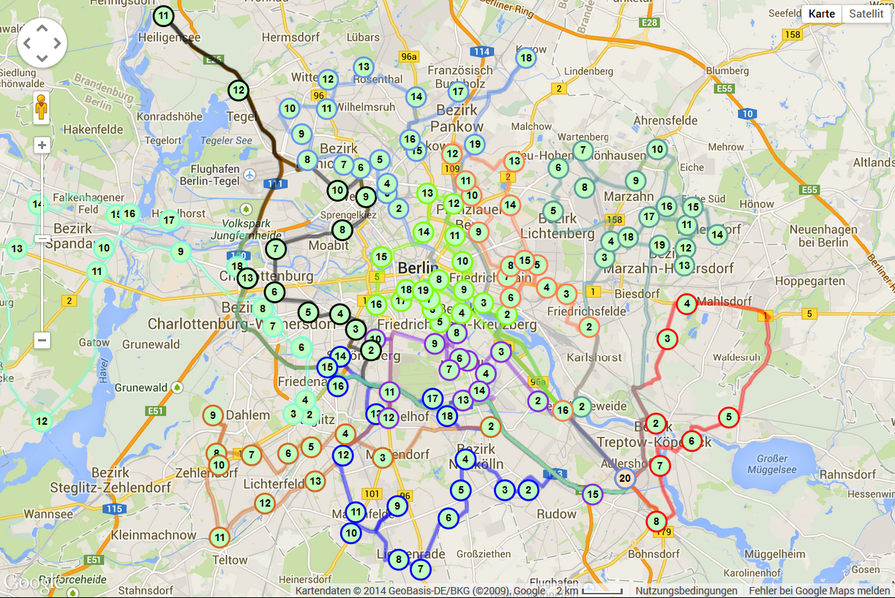

```{r setup, include=FALSE}
options(htmltools.dir.version = FALSE)
knitr::opts_chunk$set(echo=F,
                      message=F,
                      warning=F,
                      fig.retina = 3,
                      fig.align = "center")
library("tidyverse")
library("mosaic")
library("ggrepel")
library("fontawesome")
xaringanExtra::use_tile_view()
xaringanExtra::use_tachyons()
xaringanExtra::use_freezeframe()
xaringanExtra::use_progress_bar()

update_geom_defaults("label", list(family = "Fira Sans Condensed"))
update_geom_defaults("text", list(family = "Fira Sans Condensed"))

set.seed(256)
```

class: title-slide

# 1.4 — Utility Maximization

## ECON 306 • Microeconomic Analysis • Spring 2023

### Ryan Safner<br> Associate Professor of Economics <br> <a href="mailto:safner@hood.edu"><i class="fa fa-paper-plane fa-fw"></i>safner@hood.edu</a> <br> <a href="https://github.com/ryansafner/microS23"><i class="fa fa-github fa-fw"></i>ryansafner/microS23</a><br> <a href="https://microS23.classes.ryansafner.com"> <i class="fa fa-globe fa-fw"></i>microS23.classes.ryansafner.com</a><br>

---

class: inverse, center, middle

# Constrained Optimization

---

# Constrained Optimization I

.pull-left[

- We model most situations as a .hi[constrained optimization problem]:

- People .hi[optimize]: make tradeoffs to achieve their .hi-purple[objective] *as best as they can*

- Subject to .hi-turquoise[constraints]: limited resources (income, time, attention, etc) 

]

.pull-right[
.center[

]
]

---

# Constrained Optimization II

.pull-left[

- One of the most generally useful mathematical models

- *Endless applications*: how we model nearly every decision-maker

> consumer, business firm, politician, judge, bureaucrat, voter, dictator, pirate, drug cartel, drug addict, parent, child, etc

- .hi-purple[Key economic skill: recognizing how to apply the model to a situation]

]

.pull-right[
.center[

]
]

---

# Remember!

.center[

]

---

# Constrained Optimization III

.pull-left[

- All constrained optimization models have three moving parts: 

]

.pull-right[
.center[

]
]

---

# Constrained Optimization III

.pull-left[

- All constrained optimization models have three moving parts: 

1. **Choose:** .hi-purple[ < some alternative >]

]

.pull-right[
.center[

]
]

---

# Constrained Optimization III

.pull-left[

- All constrained optimization models have three moving parts: 

1. **Choose:** .hi-purple[ < some alternative >]

2. **In order to maximize:** .hi-green[< some objective >]

]

.pull-right[
.center[

]
]

---

# Constrained Optimization III

.pull-left[

- All constrained optimization models have three moving parts: 

1. **Choose:** .hi-purple[ < some alternative >]

2. **In order to maximize:** .hi-green[< some objective >]

3. **Subject to:** .hi-red[< some constraints >]

]

.pull-right[
.center[

]
]

---

# Constrained Optimization: Example I

.pull-left[

.bg-washed-green.b--dark-green.ba.bw2.br3.shadow-5.ph4.mt5[
.hi-green[**Example**:] A Hood student picking courses hoping to achieve the highest GPA while getting an Econ major.

1. **Choose:**

2. **In order to maximize:**

3. **Subject to:**

]
]
.pull-right[
.center[

]
]

---

# Constrained Optimization: Example II

.pull-left[

.bg-washed-green.b--dark-green.ba.bw2.br3.shadow-5.ph4.mt5[
.hi-green[**Example**:] How should FedEx plan its delivery route?

1. **Choose:**

2. **In order to maximize:**

3. **Subject to:**

]
]
.pull-right[
.center[

]
]

---

# Constrained Optimization: Example III

.pull-left[

.bg-washed-green.b--dark-green.ba.bw2.br3.shadow-5.ph4.mt5[
.hi-green[**Example**:] The U.S. government wants to remain economically competitive but reduce emissions by 25%. 

1. **Choose:**

2. **In order to maximize:**

3. **Subject to:**

]
]
.pull-right[
.center[

]
]

---

# Constrained Optimization: Example IV

.pull-left[

.bg-washed-green.b--dark-green.ba.bw2.br3.shadow-5.ph4.mt5[
.hi-green[**Example**:] How do elected officials make decisions in politics? 

1. **Choose:**

2. **In order to maximize:**

3. **Subject to:**

]
]
.pull-right[
.center[

]
]

---

# The Utility Maximization Problem

.pull-left[

- The individual's .hi[utility maximization problem] we've been modeling, finally, is:

1. **Choose:** .hi-purple[ < a consumption bundle >]

2. **In order to maximize:** .hi-green[< utility >]

3. **Subject to:** .hi-red[< income and market prices >]

]

.pull-right[
.center[

]
]

---

# The Utility Maximization Problem: Tools

.pull-left[
.smallest[
- We now have the tools to understand individual choices:

- .hi-red[Budget constraint]: individual’s **constraints** of income and market prices
  - How .red[market] trades off between goods
  - .red[Marginal cost] (of good $x$, in terms of $y)$
  
- .hi-green[Utility function]: individual’s **objective** to maximize, based on their preferences
  - How .green[individual] trades off between goods
  - .green[Marginal benefit] (of good $x$, in terms of $y)$
]
]
.pull-right[
.center[

]
]

---

# The Utility Maximization Problem: Verbally

.pull-left[

- The .hi[individual's constrained optimization problem]: 

> choose a bundle of goods to maximize utility, subject to income and market prices
]

.pull-right[
.center[

]
]

---

# The Utility Maximization Problem: Mathematically

.pull-left[

$$\max_{x,y \geq0} u(x,y)$$
$$s.t. p_xx+p_yy=m$$

- This requires calculus to solve.<sup>.magenta[†]</sup> We will look at **graphs** instead!
]

.pull-right[
.center[

]
]

.footnote[<sup>.magenta[†]</sup> See the [mathematical appendix](/content/1.4-content/#solving-the-constrained-optimization-problem-with-calculus) in today's class notes on how to solve it with calculus, and an example.]

---

# The Individual's Optimum: Graphically

.pull-left[

- .hi[Graphical solution]: **Highest indifference curve _tangent_ to budget constraint**
  - Bundle A!
]

.pull-right[

```{r, fig.retina=3}
library("mosaic")

points<-tribble(
  ~letter, ~x, ~y,
  "A", 10, 5,
  "B", 4, 8,
  "C", 16, 2,
  "D", 8, 8
)

IC_8=function(x){64/x}
IC_7=function(x){50/x}
IC_6=function(x){32/x}
BC=function(x){10-0.5*x}

opt<-ggplot(data.frame(x=c(0,10)), aes(x=x))+
  stat_function(fun=IC_8, geom="line", size=2, color = "#73D055FF")+
  stat_function(fun=IC_7, geom="line", size=2, color = "#3CBB75FF")+
  stat_function(fun=IC_6, geom="line", size=2, color = "#20A387FF")+
  stat_function(fun=BC, geom="line", size=2, color = "red")+
    geom_label(aes(x=5,y=IC_8(5)), color = "#73D055FF", label=expression(u==sqrt(64)), size = 4)+
    geom_label(aes(x=3.5,y=IC_7(3.5)), color = "#3CBB75FF", label=expression(u==sqrt(50)), size = 4)+
    geom_label(aes(x=2,y=IC_6(2)), color = "#20A387FF", label=expression(u==sqrt(32)), size = 4)+
    geom_label(aes(x=2,y=BC(2)), color = "red", label="BC", size = 6)+
  geom_point(data = points,
             mapping=aes(x=x, y=y),
             size = 3)+
  geom_text_repel(data = points,
             mapping=aes(x=x, y=y,
             label = letter),
             size = 6,
             seed = 2)+
  geom_segment(aes(x = 0, xend = 10, y = 5, yend=5), linetype="dotted", size=1)+
  geom_segment(aes(x = 10, xend = 10, y = 5, yend=0), linetype="dotted", size=1)+
    scale_x_continuous(breaks=seq(0,20,2),
                     limits=c(0,20),
                     expand=expand_scale(mult=c(0,0.1)))+
  scale_y_continuous(breaks=seq(0,20,2),
                     limits=c(0,20),
                     expand=expand_scale(mult=c(0,0.1)))+
  #scale_colour_manual("Curves", values = line_colors, guide=F)+
  labs(x = "x",
       y = "y",
       caption = expression(paste(u(x,y)== sqrt(xy), ", ", m, " = $20, ", p[x]," = $1, ", p[y]," = $2", sep=" ")))+
  theme_classic(base_family = "Fira Sans Condensed", base_size=20)
opt
```
]

---

# The Individual's Optimum: Graphically

.pull-left[

- .hi[Graphical solution]: **Highest indifference curve _tangent_ to budget constraint**
  - Bundle A!

- B or C spend all income, but a better combination exists

]

.pull-right[

```{r, fig.retina=3}
opt
```
]

---

# The Individual's Optimum: Graphically

.pull-left[

- .hi[Graphical solution]: **Highest indifference curve _tangent_ to budget constraint**
  - Bundle A!

- B or C spend all income, but a better combination exists

- D is higher utility, but *not affordable* at current income & prices
]

.pull-right[

```{r, fig.retina=3}
opt
```
]

---

# The Individual's Optimum: Why Not B? 

.pull-left[
.smallest[
$$\begin{align*}
\color{#7CAE96}{\text{indiff. curve slope}} &> \color{#D7250E}{\text{budget constr. slope}} \\
\end{align*}$$
]
]

.pull-right[

```{r, fig.retina=3}
ggplot(data.frame(x=c(0,10)), aes(x=x))+
  stat_function(fun=IC_6, geom="line", size=2, color = "#20A387FF")+
  stat_function(fun=BC, geom="line", size=2, color = "red")+
    geom_label(aes(x=2,y=IC_6(2)), color = "#20A387FF", label=expression(u==sqrt(32)), size = 4)+
    geom_label(aes(x=2,y=BC(2)), color = "red", label="BC", size = 6)+
  geom_point(data = subset(points, letter=="B"),
             mapping=aes(x=x, y=y),
             size = 3)+
  geom_text_repel(data = subset(points, letter=="B"),
             mapping=aes(x=x, y=y,
             label = letter),
             size = 6,
             seed = 2)+
  geom_segment(aes(x = 0, xend = 8, y = 16, yend=0), linetype="dashed", size=1.5)+
    scale_x_continuous(breaks=seq(0,20,2),
                     limits=c(0,20),
                     expand=expand_scale(mult=c(0,0.1)))+
  scale_y_continuous(breaks=seq(0,20,2),
                     limits=c(0,20),
                     expand=expand_scale(mult=c(0,0.1)))+
  #scale_colour_manual("Curves", values = line_colors, guide=F)+
  labs(x = "x",
       y = "y",
       caption = expression(paste(u(x,y)== sqrt(xy), ", ", m, " = $20, ", p[x]," = $1, ", p[y]," = $2", sep=" ")))+
  theme_classic(base_family = "Fira Sans Condensed", base_size=20)
```
]

---

# The Individual's Optimum: Why Not B? 

.pull-left[

.smallest[
$$\begin{align*}
\color{#7CAE96}{\text{indiff. curve slope}} &> \color{#D7250E}{\text{budget constr. slope}} \\
\color{#7CAE96}{\frac{MU_x}{MU_y}} &> \color{#D7250E}{\frac{p_x}{p_y}} \\
\color{#7CAE96}{2} &> \color{#D7250E}{0.5} \\\end{align*}$$

- .hi-green[Consumer] views MB of $x$ is 2 units of $y$
  - Consumer’s “exchange rate:” .hi-green[2Y:1X]

- .hi-red[Market]-determined MC of $x$ is 0.5 units of $y$
  - Market exchange rate is .hi-red[0.5Y:1X]
]
]

.pull-right[

```{r, fig.retina=3}
ggplot(data.frame(x=c(0,10)), aes(x=x))+
  stat_function(fun=IC_6, geom="line", size=2, color = "#20A387FF")+
  stat_function(fun=BC, geom="line", size=2, color = "red")+
    geom_label(aes(x=2,y=IC_6(2)), color = "#20A387FF", label=expression(u==sqrt(32)), size = 4)+
    geom_label(aes(x=2,y=BC(2)), color = "red", label="BC", size = 6)+
  geom_point(data = subset(points, letter=="B"),
             mapping=aes(x=x, y=y),
             size = 3)+
  geom_text_repel(data = subset(points, letter=="B"),
             mapping=aes(x=x, y=y,
             label = letter),
             size = 6,
             seed = 2)+
  geom_segment(aes(x = 0, xend = 8, y = 16, yend=0), linetype="dashed", size=1.5)+
    scale_x_continuous(breaks=seq(0,20,2),
                     limits=c(0,20),
                     expand=expand_scale(mult=c(0,0.1)))+
  scale_y_continuous(breaks=seq(0,20,2),
                     limits=c(0,20),
                     expand=expand_scale(mult=c(0,0.1)))+
  #scale_colour_manual("Curves", values = line_colors, guide=F)+
  labs(x = "x",
       y = "y",
       caption = expression(paste(u(x,y)== sqrt(xy), ", ", m, " = $20, ", p[x]," = $1, ", p[y]," = $2", sep=" ")))+
  theme_classic(base_family = "Fira Sans Condensed", base_size=20)
```
]

---

# The Individual's Optimum: Why Not B? 

.pull-left[
.smallest[
$$\begin{align*}
\color{#7CAE96}{\text{indiff. curve slope}} &> \color{D7250E}{\text{budget constr. slope}} \\
\color{#7CAE96}{\frac{MU_x}{MU_y}} &> \color{#D7250E}{\frac{p_x}{p_y}} \\
\color{#7CAE96}{2} &> \color{#D7250E}{0.5} \\\end{align*}$$

- .hi-green[Consumer] views MB of $x$ is 2 units of $y$
  - Consumer’s “exchange rate:” .hi-green[2Y:1X]

- .hi-red[Market]-determined MC of $x$ is 0.5 units of $y$
  - Market exchange rate is .hi-red[0.5Y:1X]

- Can .hi-purple[spend less on y, more on x] for .hi-purple[more utility!]

]
]
.pull-right[

```{r, fig.retina=3}
ggplot(data.frame(x=c(0,10)), aes(x=x))+
  stat_function(fun=IC_6, geom="line", size=2, color = "#20A387FF")+
  stat_function(fun=IC_7, geom="line", size=2, color = "#3CBB75FF")+
  stat_function(fun=BC, geom="line", size=2, color = "red")+
    geom_label(aes(x=2,y=IC_6(2)), color = "#20A387FF", label=expression(u==sqrt(32)), size = 4)+
    geom_label(aes(x=2,y=BC(2)), color = "red", label="BC", size = 6)+
    geom_label(aes(x=3.5,y=IC_7(3.5)), color = "#3CBB75FF", label=expression(u==sqrt(50)), size = 4)+
  annotate("segment", x = 4, xend = 10, y = 8, yend = 5, colour = "purple", size=2, alpha=1, arrow=arrow(length=unit(0.5,"cm"), ends="last", type="closed"))+
  geom_point(data = subset(points, letter %in% c("A","B")),
             mapping=aes(x=x, y=y),
             size = 3)+
  geom_text_repel(data = subset(points, letter %in% c("A","B")),
             mapping=aes(x=x, y=y,
             label = letter),
             size = 6,
             seed = 2)+
  geom_segment(aes(x = 0, xend = 8, y = 16, yend=0), linetype="dashed", size=1.5)+
    scale_x_continuous(breaks=seq(0,20,2),
                     limits=c(0,20),
                     expand=expand_scale(mult=c(0,0.1)))+
  scale_y_continuous(breaks=seq(0,20,2),
                     limits=c(0,20),
                     expand=expand_scale(mult=c(0,0.1)))+
  #scale_colour_manual("Curves", values = line_colors, guide=F)+
  labs(x = "x",
       y = "y",
       caption = expression(paste(u(x,y)== sqrt(xy), ", ", m, " = $20, ", p[x]," = $1, ", p[y]," = $2", sep=" ")))+
  theme_classic(base_family = "Fira Sans Condensed", base_size=20)
```
]

---

# The Individual's Optimum: Why Not C? 

.pull-left[

.smallest[
$$\begin{align*}
\color{#7CAE96}{\text{indiff. curve slope}} &< \color{#D7250E}{\text{budget constr. slope}} \\
 \\\end{align*}$$
]
]

.pull-right[

```{r, fig.retina=3}
ggplot(data.frame(x=c(0,10)), aes(x=x))+
  stat_function(fun=IC_6, geom="line", size=2, color = "#20A387FF")+
  stat_function(fun=BC, geom="line", size=2, color = "red")+
    geom_label(aes(x=2,y=IC_6(2)), color = "#20A387FF", label=expression(u==sqrt(32)), size = 4)+
    geom_label(aes(x=2,y=BC(2)), color = "red", label="BC", size = 6)+
  geom_point(data = subset(points, letter=="C"),
             mapping=aes(x=x, y=y),
             size = 3)+
  geom_text_repel(data = subset(points, letter=="C"),
             mapping=aes(x=x, y=y,
             label = letter),
             size = 6,
             seed = 2)+
  geom_segment(aes(x = 0, xend = 20, y = 4, yend=1.5), linetype="dashed", size=1.5)+
    scale_x_continuous(breaks=seq(0,20,2),
                     limits=c(0,20),
                     expand=expand_scale(mult=c(0,0.1)))+
  scale_y_continuous(breaks=seq(0,20,2),
                     limits=c(0,20),
                     expand=expand_scale(mult=c(0,0.1)))+
  #scale_colour_manual("Curves", values = line_colors, guide=F)+
  labs(x = "x",
       y = "y",
       caption = expression(paste(u(x,y)== sqrt(xy), ", ", m, " = $20, ", p[x]," = $1, ", p[y]," = $2", sep=" ")))+
  theme_classic(base_family = "Fira Sans Condensed", base_size=20)
```
]

---

# The Individual's Optimum: Why Not C? 

.pull-left[

.smallest[
$$\begin{align*}
\color{#7CAE96}{\text{indiff. curve slope}} &< \color{#D7250E}{\text{budget constr. slope}} \\
\color{#7CAE96}{\frac{MU_x}{MU_y}} &< \color{#D7250E}{\frac{p_x}{p_y}} \\
\color{#7CAE96}{0.125} &< \color{#D7250E}{0.5} \\\end{align*}$$

- .hi-green[Consumer] views MB of $x$ is 0.125 units of $y$
  - Consumer’s “exchange rate:” .hi-green[0.125Y:1X]

- .hi-red[Market]-determined MC of $x$ is 0.5 units of $y$
  - Market exchange rate is .hi-red[0.5Y:1X]
]
]
.pull-right[

```{r, fig.retina=3}
ggplot(data.frame(x=c(0,10)), aes(x=x))+
  stat_function(fun=IC_6, geom="line", size=2, color = "#20A387FF")+
  stat_function(fun=BC, geom="line", size=2, color = "red")+
    geom_label(aes(x=2,y=IC_6(2)), color = "#20A387FF", label=expression(u==sqrt(32)), size = 4)+
    geom_label(aes(x=2,y=BC(2)), color = "red", label="BC", size = 6)+
  geom_point(data = subset(points, letter=="C"),
             mapping=aes(x=x, y=y),
             size = 3)+
  geom_text_repel(data = subset(points, letter=="C"),
             mapping=aes(x=x, y=y,
             label = letter),
             size = 6,
             seed = 2)+
  geom_segment(aes(x = 0, xend = 20, y = 4, yend=1.5), linetype="dashed", size=1.5)+
    scale_x_continuous(breaks=seq(0,20,2),
                     limits=c(0,20),
                     expand=expand_scale(mult=c(0,0.1)))+
  scale_y_continuous(breaks=seq(0,20,2),
                     limits=c(0,20),
                     expand=expand_scale(mult=c(0,0.1)))+
  #scale_colour_manual("Curves", values = line_colors, guide=F)+
  labs(x = "x",
       y = "y",
       caption = expression(paste(u(x,y)== sqrt(xy), ", ", m, " = $20, ", p[x]," = $1, ", p[y]," = $2", sep=" ")))+
  theme_classic(base_family = "Fira Sans Condensed", base_size=20)
```
]

---

# The Individual's Optimum: Why Not C? 

.pull-left[

.smallest[
$$\begin{align*}
\color{#7CAE96}{\text{indiff. curve slope}} &< \color{#D7250E}{\text{budget constr. slope}} \\
\color{#7CAE96}{\frac{MU_x}{MU_y}} &< \color{#D7250E}{\frac{p_x}{p_y}} \\
\color{#7CAE96}{0.125} &< \color{#D7250E}{0.5} \\\end{align*}$$

- .hi-green[Consumer] views MB of $x$ is 0.125 units of $y$
  - Consumer’s “exchange rate:” .hi-green[0.125Y:1X]

- .hi-red[Market]-determined MC of $x$ is 0.5 units of $y$
  - Market exchange rate is .hi-red[0.5Y:1X]

- Can .hi-purple[spend less on y, more on x] for .hi-purple[more utility!]

]
]

.pull-right[

```{r, fig.retina=3}
ggplot(data.frame(x=c(0,10)), aes(x=x))+
  stat_function(fun=IC_6, geom="line", size=2, color = "#20A387FF")+
  stat_function(fun=IC_7, geom="line", size=2, color = "#3CBB75FF")+
  stat_function(fun=BC, geom="line", size=2, color = "red")+
    geom_label(aes(x=2,y=IC_6(2)), color = "#20A387FF", label=expression(u==sqrt(32)), size = 4)+
    geom_label(aes(x=2,y=BC(2)), color = "red", label="BC", size = 6)+
    geom_label(aes(x=3.5,y=IC_7(3.5)), color = "#3CBB75FF", label=expression(u==sqrt(50)), size = 4)+
  annotate("segment", x = 16, xend = 10, y = 2, yend = 5, colour = "purple", size=2, alpha=1, arrow=arrow(length=unit(0.5,"cm"), ends="last", type="closed"))+
  geom_point(data = subset(points, letter %in% c("A","C")),
             mapping=aes(x=x, y=y),
             size = 3)+
  geom_text_repel(data = subset(points, letter %in% c("A","C")),
             mapping=aes(x=x, y=y,
             label = letter),
             size = 6,
             seed = 2)+
  geom_segment(aes(x = 0, xend = 20, y = 4, yend=1.5), linetype="dashed", size=1.5)+
    scale_x_continuous(breaks=seq(0,20,2),
                     limits=c(0,20),
                     expand=expand_scale(mult=c(0,0.1)))+
  scale_y_continuous(breaks=seq(0,20,2),
                     limits=c(0,20),
                     expand=expand_scale(mult=c(0,0.1)))+
  #scale_colour_manual("Curves", values = line_colors, guide=F)+
  labs(x = "x",
       y = "y",
       caption = expression(paste(u(x,y)== sqrt(xy), ", ", m, " = $20, ", p[x]," = $1, ", p[y]," = $2", sep=" ")))+
  theme_classic(base_family = "Fira Sans Condensed", base_size=20)
```
]

---

# The Individual's Optimum: Why A?

.pull-left[
.smallest[
$$\begin{align*}
\color{#7CAE96}{\text{indiff. curve slope}} &= \color{#D7250E}{\text{budget constr. slope}} \\\end{align*}$$
]

]

.pull-right[

```{r, fig.retina=3}
ggplot(data.frame(x=c(0,10)), aes(x=x))+
  stat_function(fun=IC_7, geom="line", size=2, color = "#3CBB75FF")+
  stat_function(fun=BC, geom="line", size=2, color = "red")+
    geom_label(aes(x=2,y=BC(2)), color = "red", label="BC", size = 6)+
    geom_label(aes(x=3.5,y=IC_7(3.5)), color = "#3CBB75FF", label=expression(u==sqrt(50)), size = 4)+
  geom_point(data = subset(points, letter=="A"),
             mapping=aes(x=x, y=y),
             size = 3)+
  geom_text_repel(data = subset(points, letter=="A"),
             mapping=aes(x=x, y=y,
             label = letter),
             size = 6,
             seed = 2)+
  geom_segment(aes(x = 0, xend = 10, y = 5, yend=5), linetype="dotted", size=1)+
  geom_segment(aes(x = 10, xend = 10, y = 5, yend=0), linetype="dotted", size=1)+
    scale_x_continuous(breaks=seq(0,20,2),
                     limits=c(0,20),
                     expand=expand_scale(mult=c(0,0.1)))+
  scale_y_continuous(breaks=seq(0,20,2),
                     limits=c(0,20),
                     expand=expand_scale(mult=c(0,0.1)))+
  #scale_colour_manual("Curves", values = line_colors, guide=F)+
  labs(x = "x",
       y = "y",
       caption = expression(paste(u(x,y)== sqrt(xy), ", ", m, " = $20, ", p[x]," = $1, ", p[y]," = $2", sep=" ")))+
  theme_classic(base_family = "Fira Sans Condensed", base_size=20)
```
]

---

# The Individual's Optimum: Why A?

.pull-left[

.smallest[
$$\begin{align*}
\color{#7CAE96}{\text{indiff. curve slope}} &= \color{#D7250E}{\text{budget constr. slope}} \\
\color{#7CAE96}{\frac{MU_x}{MU_y}} &= \color{#D7250E}{\frac{p_x}{p_y}} \\
\color{#7CAE96}{0.5} &= \color{#D7250E}{0.5} \\\end{align*}$$

- .hi-green[Marginal benefit] = .hi-red[Marginal cost]
  - .hi-green[Consumer] exchanges at same rate as .hi-red[market]

- .hi-purple[*No other combination* of (x,y) *exists* that could increase utility!]<sup>.magenta[†]</sup>

]

.footnote[<sup>.magenta[†]</sup> At *current* income and market prices!]
]

.pull-right[

```{r, fig.retina=3}
ggplot(data.frame(x=c(0,10)), aes(x=x))+
  stat_function(fun=IC_7, geom="line", size=2, color = "#3CBB75FF")+
  stat_function(fun=BC, geom="line", size=2, color = "red")+
    geom_label(aes(x=2,y=BC(2)), color = "red", label="BC", size = 6)+
    geom_label(aes(x=3.5,y=IC_7(3.5)), color = "#3CBB75FF", label=expression(u==sqrt(50)), size = 4)+
  geom_point(data = subset(points, letter=="A"),
             mapping=aes(x=x, y=y),
             size = 3)+
  geom_text_repel(data = subset(points, letter=="A"),
             mapping=aes(x=x, y=y,
             label = letter),
             size = 6,
             seed = 2)+
  geom_segment(aes(x = 0, xend = 10, y = 5, yend=5), linetype="dotted", size=1)+
  geom_segment(aes(x = 10, xend = 10, y = 5, yend=0), linetype="dotted", size=1)+
    scale_x_continuous(breaks=seq(0,20,2),
                     limits=c(0,20),
                     expand=expand_scale(mult=c(0,0.1)))+
  scale_y_continuous(breaks=seq(0,20,2),
                     limits=c(0,20),
                     expand=expand_scale(mult=c(0,0.1)))+
  #scale_colour_manual("Curves", values = line_colors, guide=F)+
  labs(x = "x",
       y = "y",
       caption = expression(paste(u(x,y)== sqrt(xy), ", ", m, " = $20, ", p[x]," = $1, ", p[y]," = $2", sep=" ")))+
  theme_classic(base_family = "Fira Sans Condensed", base_size=20)
```
]

---

# The Individual's Optimum: Two Equivalent Rules

.pull-left[

## Rule 1

$$\frac{MU_x}{MU_y}  =  \frac{p_x}{p_y}$$

- Easier for calculation (slopes)

]

.pull-right[

```{r, fig.retina=3}
ggplot(data.frame(x=c(0,10)), aes(x=x))+
  stat_function(fun=IC_7, geom="line", size=2, color = "#3CBB75FF")+
  stat_function(fun=BC, geom="line", size=2, color = "red")+
    geom_label(aes(x=2,y=BC(2)), color = "red", label="BC", size = 6)+
    geom_label(aes(x=3.5,y=IC_7(3.5)), color = "#3CBB75FF", label=expression(u==sqrt(50)), size = 4)+
  geom_point(data = subset(points, letter=="A"),
             mapping=aes(x=x, y=y),
             size = 3)+
  geom_text_repel(data = subset(points, letter=="A"),
             mapping=aes(x=x, y=y,
             label = letter),
             size = 6,
             seed = 2)+
  geom_segment(aes(x = 0, xend = 10, y = 5, yend=5), linetype="dotted", size=1)+
  geom_segment(aes(x = 10, xend = 10, y = 5, yend=0), linetype="dotted", size=1)+
    scale_x_continuous(breaks=seq(0,20,2),
                     limits=c(0,20),
                     expand=expand_scale(mult=c(0,0.1)))+
  scale_y_continuous(breaks=seq(0,20,2),
                     limits=c(0,20),
                     expand=expand_scale(mult=c(0,0.1)))+
  #scale_colour_manual("Curves", values = line_colors, guide=F)+
  labs(x = "x",
       y = "y",
       caption = expression(paste(u(x,y)== sqrt(xy), ", ", m, " = $20, ", p[x]," = $1, ", p[y]," = $2", sep=" ")))+
  theme_classic(base_family = "Fira Sans Condensed", base_size=20)
```
]

---

# The Individual's Optimum: Two Equivalent Rules

.pull-left[

## Rule 1

$$\frac{MU_x}{MU_y}  =  \frac{p_x}{p_y}$$

- Easier for calculation (slopes)

## Rule 2

$$\frac{MU_x}{p_x}  =  \frac{MU_y}{p_y}$$

- Easier for intuition (next slide)

]

.pull-right[

```{r, fig.retina=3}
ggplot(data.frame(x=c(0,10)), aes(x=x))+
  stat_function(fun=IC_7, geom="line", size=2, color = "#3CBB75FF")+
  stat_function(fun=BC, geom="line", size=2, color = "red")+
    geom_label(aes(x=2,y=BC(2)), color = "red", label="BC", size = 6)+
    geom_label(aes(x=3.5,y=IC_7(3.5)), color = "#3CBB75FF", label=expression(u==sqrt(50)), size = 4)+
  geom_point(data = subset(points, letter=="A"),
             mapping=aes(x=x, y=y),
             size = 3)+
  geom_text_repel(data = subset(points, letter=="A"),
             mapping=aes(x=x, y=y,
             label = letter),
             size = 6,
             seed = 2)+
  geom_segment(aes(x = 0, xend = 10, y = 5, yend=5), linetype="dotted", size=1)+
  geom_segment(aes(x = 10, xend = 10, y = 5, yend=0), linetype="dotted", size=1)+
    scale_x_continuous(breaks=seq(0,20,2),
                     limits=c(0,20),
                     expand=expand_scale(mult=c(0,0.1)))+
  scale_y_continuous(breaks=seq(0,20,2),
                     limits=c(0,20),
                     expand=expand_scale(mult=c(0,0.1)))+
  #scale_colour_manual("Curves", values = line_colors, guide=F)+
  labs(x = "x",
       y = "y",
       caption = expression(paste(u(x,y)== sqrt(xy), ", ", m, " = $20, ", p[x]," = $1, ", p[y]," = $2", sep=" ")))+
  theme_classic(base_family = "Fira Sans Condensed", base_size=20)
```
]

---

# The Individual's Optimum: The Equimarginal Rule

$$\frac{MU_x}{p_x}  =  \frac{MU_y}{p_y} = \cdots = \frac{MU_n}{p_n}$$

- .hi[Equimarginal Rule]: consumption is optimized where the **marginal utility per dollar spent** is **equalized** across all $n$ possible goods/decisions

- Always choose an option that gives higher marginal utility (e.g. if $MU_x < MU_y)$, consume more $y$!
  - But each option has a different price, so weight each option by its price, hence $\frac{MU_x}{p_x}$
    

---

# An Optimum, By Definition

.pull-left[

- Any .hi[optimum] in economics: no better alternatives exist under current constraints

- No possible change in your consumption that would increase your utility

]

.pull-right[
.center[

]
]

---

# Practice I

.smaller[
.bg-washed-green.b--dark-green.ba.bw2.br3.shadow-5.ph4.mt5[
.green[**Example**]: 	You can get utility from consuming bags of Almonds $(a)$ and bunches of Bananas $(b)$, according to the utility function:

$$\begin{align*}
u(a,b)&=ab\\
MU_a&=b	\\
MU_b&=a \\ \end{align*}$$

You have an income of $50, the price of Almonds is $10, and the price of Bananas is $2. Put Almonds on the horizontal axis and Bananas on the vertical axis.

1. What is your utility-maximizing bundle of Almonds and Bananas?
2. How much utility does this provide? [Does the answer to this matter?]
]
]
---

# Practice II, Cobb-Douglas!

.smaller[
.bg-washed-green.b--dark-green.ba.bw2.br3.shadow-5.ph4.mt5[
.green[**Example**]: 	You can get utility from consuming Burgers $(b)$ and Fries $(f)$, according to the utility function:

$$\begin{align*}
u(b,f)&=\sqrt{bf} \\
MU_b&=0.5b^{-0.5}f^{0.5}	\\
MU_f&=0.5b^{0.5}f^{-0.5} \\ \end{align*}$$

You have an income of $20, the price of Burgers is $5, and the price of Fries is $2. Put Burgers on the horizontal axis and Fries on the vertical axis.

1. What is your utility-maximizing bundle of Burgers and Fries?
2. How much utility does this provide?
]
]