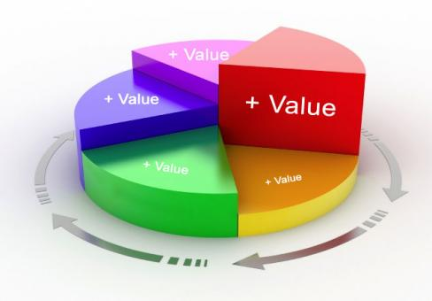
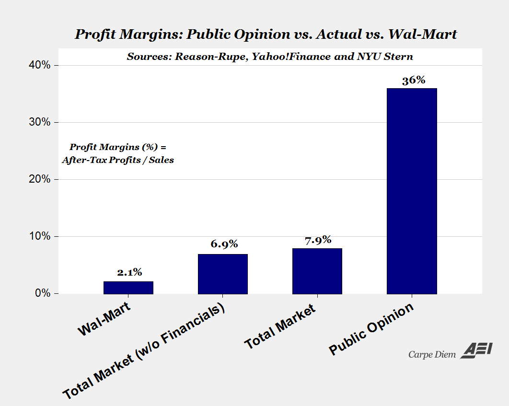

```{r setup, include=FALSE}
options(htmltools.dir.version = FALSE)
knitr::opts_chunk$set(echo=F,
                      message=F,
                      warning=F,
                      fig.retina = 3,
                      fig.align = "center")
library("tidyverse")
library("mosaic")
library("ggrepel")
library("fontawesome")
xaringanExtra::use_tile_view()
xaringanExtra::use_tachyons()
xaringanExtra::use_freezeframe()

update_geom_defaults("label", list(family = "Fira Sans Condensed"))
update_geom_defaults("text", list(family = "Fira Sans Condensed"))

set.seed(256)
```

class: title-slide

# 2.1 — Production and Firms

## ECON 306 • Microeconomic Analysis • Spring 2023

### Ryan Safner<br> Associate Professor of Economics <br> <a href="mailto:safner@hood.edu"><i class="fa fa-paper-plane fa-fw"></i>safner@hood.edu</a> <br> <a href="https://github.com/ryansafner/microS23"><i class="fa fa-github fa-fw"></i>ryansafner/microS23</a><br> <a href="https://microS23.classes.ryansafner.com"> <i class="fa fa-globe fa-fw"></i>microS23.classes.ryansafner.com</a><br>

---
class: inverse

# Outline

### [Production, Specialization, & Comparative Advantage](#7)
### [What Do Firms Do?](#33)

---

# Producer Behavior

.pull-left[

- How do **producers** decide:
  - which products to produce
  - in what quantity
  - using which inputs
  - and sold at what price?

- Answers to these questions are building blocks for .hi-red[supply curves]
]

.pull-right[

.center[

]
]

---

# The Basics of Production

.pull-left[

- Nearly all goods must be **produced** before we can exchange & consume them

- .hi[Consumption] is the **using up** of value to gain utility
  - .hi-purple[Consumption is the ultimate goal of all economic activity]
]

.pull-right[

.center[

]
]

---

# The Basics of Production

.pull-left[

- .hi[Production] is the **creation** of value, by transforming *lower*-valued goods (resources, inputs, etc) into *higher*-valued goods (outputs, consumer products, etc)

- Iron Ore $\rightarrow$ Steel $\rightarrow$ Buildings, Bridges, Ovens, Water Bottles
]

.pull-right[

.center[

]
]

---

# It's Demand all the Way Down!

.pull-left[

- .hi-red[Supply] is actually .hi-blue[Demand] in disguise!

- An .hi[(opportunity) cost] to buy (scarce) inputs for production because **other people** .hi-blue[demand] those same inputs to consume or produce **other valuable things**!
  - Price necessary to **pull them out of other valuable productive uses** in the economy!
]

.pull-right[

.center[

]
]

---

class: inverse, center, middle

# What Do Firms Do?

---

# The Firm

.pull-left[
- In modern market economies, most production takes place in an organization known as a .hi[firm]
  - A legal fiction for particular purposes

- It does not *have* to be this way, and for most of history it was not this way!
    - Craft guilds
    - Independent artisans
    - Independent contractors

]

.pull-right[

.center[

]
]

---

# If Markets Are So Great, Why Do Firms Exist?

.pull-left[
.smallest[
- Firms exist in the forms they do because they are .hi-turquoise[an efficient response to particular problems of economic organization]

- Lots of interesting & Nobel-prize winning analysis

- For now, we'll sidestep these and just *assume* firms exist. Learn more in my .hi[Industrial Organization] course:
  - [Why Are There Firms?](https://ios20.classes.ryansafner.com/class/3.1-class/)
  - [The Firm as Nexus of Contracts](https://ios20.classes.ryansafner.com/class/3.2-class/)
  - [Asset Specificity and Vertical Integration](https://ios20.classes.ryansafner.com/class/3.3-class/)
  - [Contractual Restraints & Property Rights](https://ios20.classes.ryansafner.com/class/3.4-class/)

]
]

.pull-right[

.center[

]
]

---

# What Do Firms Do? I

.pull-left[

- We'll assume “the firm” is the agent to model:

- So what do firms do? 

- How would we set up an optimization model:

1. **Choose:** .hi-blue[ < some alternative >]

2. **In order to maximize:** .hi-green[< some objective >]

3. **Subject to:** .hi-red[< some constraints >]

]

.pull-right[

.center[

]
]

---

# What Do Firms Do? II

.pull-left[
.smaller[
- Firms convert some goods to other goods: 
]
]

.pull-right[
.center[

]
]

---

# What Do Firms Do? II

.pull-left[
.smaller[
- Firms convert some goods to other goods: 

- **Inputs**: $x_1, x_2, \cdots, x_n$
  - <span class="green">**Examples**: worker efforts, warehouse space, electricity, loans, oil, cardboard, fertilizer, computers, software programs, etc<span>
  ]
]

.pull-right[
.center[

]
]

---
# What Do Firms Do? II

.pull-left[
.smaller[
- Firms convert some goods to other goods: 

- **Inputs**: $x_1, x_2, \cdots, x_n$
  - <span class="green">**Examples**: worker efforts, warehouse space, electricity, loans, oil, cardboard, fertilizer, computers, software programs, etc<span>
  
- **Output**: $q$
  - <span class="green">**Examples**: gas, cars, legal services, mobile apps, vegetables, consulting advice, financial reports, etc<span>
]
]

.pull-right[
.center[

]
]

---

# What Do Firms Do? III

.pull-left[
- .hi[Technology] or a .hi[production function]: rate at which firm can convert specified **inputs** $(x_1, x_2, \cdots, x_n)$ into **output** $(q)$
$$q=f(x_1, x_2, \cdots, x_n)$$

]

.pull-right[
.center[

]
]

---

# Production Function as Recipe

.pull-left[
.center[The production function


]
]

.pull-right[
.center[The production algorithm


]

]

---

# Factors of Production I

$$q=A \,f(t,l,k)$$

.pull-left[
.smaller[
- Economists typically classify inputs, called the .hi[“factors of production” (FOP)]:

```{r,results="asis"}
tribble(
  ~"Factor", ~"Owned By", ~"Earns",
  "Land (t)", "Landowners", "Rent",
  "Labor (l)", "Laborers", "Wages",
  "Capital (k)", "Capitalists", "Interest",
) %>%
  knitr::kable(., format="html")
```
]
.smallest[
- $A$: .b["total factor productivity"] (ideas/knowledge/institutions)

]
]
.pull-right[
.center[

]

]

---

# Factors of Production II

$$q=f(l,k)$$

.pull-left[

- We will assume just two inputs: labor $l$ and capital $k$

```{r,results="asis"}
tribble(
  ~"Factor", ~"Owned By", ~"Earns",
  "Labor (l)", "Laborers", "Wages",
  "Capital (k)", "Capitalists", "Interest"
) %>%
  knitr::kable(., format="html")
```

]

.pull-right[
.center[

]

]

---

# What Does a Firm Maximize?

.pull-left[

- We assume firms .hi-purple[maximize profit `\\((\pi)\\)`]

- Not true for all firms
    - <span class="green">**Examples**: non-profits, charities, civic associations, government agencies, criminal organizations, etc</span>

- Even profit-seeking firms may also want to maximize *additional* things
    - <span class="green">**Examples**: goodwill, sustainability, social responsibility, etc </span>

]

.pull-right[

.center[

]
]

---

# Profits Have a Bad Rap These Days

.center[

]

---

# What is Profit?

.pull-left[

- In economics, .hi-purple[profit] is simply **benefits minus (opportunity) costs**

]

.pull-right[
.center[

]
]

---

# What is Profit?

.pull-left[

- In economics, .hi-purple[profit] is simply **benefits minus (opportunity) costs**

- Suppose firm sells **output** $q$ at price $p$

]

.pull-right[
.center[

]
]


---

# What is Profit?

.pull-left[

- In economics, .hi-purple[profit] is simply **benefits minus (opportunity) costs**

- Suppose firm sells **output** $q$ at price $p$

- It can buy each **input** $x_i$ at an associated price $p_i$, i.e.
    - labor $l$ at wage rate $w$
    - capital $k$ at rental rate $r$

]

.pull-right[
.center[

]
]

---

# What is Profit?

.pull-left[

- In economics, .hi-purple[profit] is simply **benefits minus (opportunity) costs**

- Suppose firm sells **output** $q$ at price $p$

- It can buy each **input** $x_i$ at an associated price $p_i$, i.e.
    - labor $l$ at wage rate $w$
    - capital $k$ at rental rate $r$

- The profit of selling $q$ units and using inputs $l,k$ is:

]

.pull-right[
.center[

]
]

---

# Who Gets the Profits? I

.pull-left[
$$\pi=\underbrace{pq}_{revenues}-\underbrace{(wl+rk)}_{costs}$$

]

.pull-right[
.center[

]
]

---

# Reminder from Macroeconomics: “The Circular Flow”

.center[

]

---

# Who Gets the Profits? I

.pull-left[
$$\pi=\underbrace{pq}_{revenues}-\underbrace{(wl+rk)}_{costs}$$

- .hi-purple[The firm's costs are all of the factor-owner's incomes!]
    - Landowners, laborers, creditors are all paid rent, wages, and interest, respectively

]

.pull-right[
.center[

]
]

---

# Who Gets the Profits? I

.pull-left[
$$\pi=\underbrace{pq}_{revenues}-\underbrace{(wl+rk)}_{costs}$$

- Profits are the .hi-purple[residual value] leftover after paying all factors

- Profits are income for the .hi[residual claimant(s)] of the production process (i.e. **owner(s)** of a firm):
    - Entrepreneurs
    - Shareholders

]

.pull-right[
.center[

]
]

---

# Who Gets the Profits? II

.pull-left[
$$\pi=\underbrace{pq}_{revenues}-\underbrace{(wl+rk)}_{costs}$$

- Residual claimants have incentives to maximize firm's profits, as this *maximizes their own income*

- Entrepreneurs and shareholders are the only participants in production that are *not* guaranteed an income!
    - Starting and owning a firm is inherently **risky**!

]

.pull-right[
.center[

]
]
---

# People Overestimate Profits

.center[

]

.source[Source: [American Enterprise Institute](https://www.aei.org/carpe-diem/the-public-thinks-the-average-company-makes-a-36-profit-margin-which-is-about-5x-too-high-part-ii/)]

---

# Profits and Entrepreneurship: A Preview

.pull-left[

- In markets, production must face the .hi[profit test]:
    - <span class="hi-purple">Is consumer's willingness to pay $>$ opportunity cost of inputs?</span>

- Profits are an indication that **value is being created for society**

- Losses are an indication that **value is being destroyed for society**

- Survival in markets *requires* firms continually create value & earn profits
]

.pull-right[

.center[

]
]

---

# The Firm's Optimization Problem I

.pull-left[

- So what do firms do? 

1. **Choose:** .hi-blue[ < some alternative >]

2. **In order to maximize:** .hi-green[< profits >]

3. **Subject to:** .hi-red[< technology >]

- We've so far assumed they maximize profits and they are limited by their technology

]

.pull-right[

.center[

]
]

---

# The Firm's Optimization Problem II

.pull-left[
- What do firms **choose**? (Not an easy answer)

- Prices?
    - Depends on the market the firm is operating in!
    - Study of <span class="hi">industrial organization</span>
    
- Essential question: .hi-turquoise[how competitive is a market?] This will influence what firms (can) do
]

.pull-right[
.center[

]
]

---

# Industrial Organization: A Roadmap I

.pull-left[

- Begin with one extreme case: .hi[“perfect competition”]
  - Firms can choose to sell as much $q^*$ as they want
  - Firms are constrained to sell at the (exogenous) market price $\bar{p}$

- Appropriate for settings with *many* firms, each small relative to market
]

.pull-right[

.center[

]
]
---

# Interlude

.pull-left[

- After we find firm's .hi-purple[optimal decisions] in this market (and have Exam 2), we will then finally look at .hi-purple[Unit III: Market Equilibrium]

- Put .red[Supply] and .blue[Demand] together
]

.pull-right[

```{r fig.retina=3}
library(mosaic)
update_geom_defaults("label", list(family = "Fira Sans Condensed"))

Demand=function(x){10-x}
Supply=function(x){x}

eq<-tribble(
  ~letter, ~x, ~y,
  "Eq.", 5, 5
)

CS<-tibble(x=c(0,0,5),
           y=c(5,10,5))

PS<-tibble(x=c(0,0,5),
           y=c(0,5,5))

p<-ggplot(data.frame(x=c(0,10)), aes(x=x))+
  stat_function(fun=Demand, geom="line", size=2, color = "blue")+
  stat_function(fun=Supply, geom="line", size=2, color = "red")+
  geom_label(aes(x=9,y=Demand(9)), color = "blue", label="Demand", size = 6)+
  geom_label(aes(x=9,y=Supply(9)), color = "red", label="Supply", size = 6)+
  geom_segment(aes(x=0, xend=5, y=5, yend=5),size=1, linetype="dotted")+
  geom_segment(aes(x=5, xend=5, y=5, yend=0),size=1, linetype="dotted")+
  geom_polygon(data=CS, aes(x=x,y=y), fill="blue", alpha=0.5)+ #CS
  geom_polygon(data=PS, aes(x=x,y=y), fill="red", alpha=0.5)+ #PS
  geom_label(aes(x=1.5, y= 3), label="PS", color="red", size =6)+
  geom_label(aes(x=1.5, y= 7), label="CS", color="blue", size =6)+
  geom_point(data = eq,
             mapping=aes(x=x, y=y),
             size = 4)+
  geom_text_repel(data = eq,
             mapping=aes(x=x, y=y,
             label = letter),
             size = 6)+
    scale_x_continuous(breaks=seq(0,10,1),
                     limits=c(0,10),
                     expand=expand_scale(mult=c(0,0.1)))+
  scale_y_continuous(breaks=seq(0,10,1),
                     limits=c(0,10),
                     expand=expand_scale(mult=c(0,0.1)))+
  guides(fill=F)+
  labs(x = "Quantity",
       y = "Price")+
  theme_classic(base_family = "Fira Sans Condensed", base_size=20)
p

```

]

---

# Interlude

.pull-left[

- We've seen how **consumers** cause and respond to market changes
  - e.g. $(\Delta p_x$, $\Delta p_y$, $\Delta m$)
  
- We're about to explore how **producers** cause and respond to market changes

- Finally we can explain all of these market changes with Supply and Demand .hi[equilibrium models]

- Discuss how markets work, why they are good & efficient, and when they fail
]

.pull-right[

```{r fig.retina=3}
p
```

]

---

# Industrial Organization: A Roadmap II

.pull-left[
- Examine another extreme case: .hi[monopoly] of a single seller
    - Appropriate for some markets

- .hi-purple[“Imperfect competition”]: models of .hi[monopolistic competition] & .hi[oligopoly]
    - In latter case, firms act **strategically**, so we will need <span class="hi-purple">game theory</span>
    
- Firms can choose *both* $q^*$ & $p^*$ to maximize $\pi$

]

.pull-right[

.center[

]
]