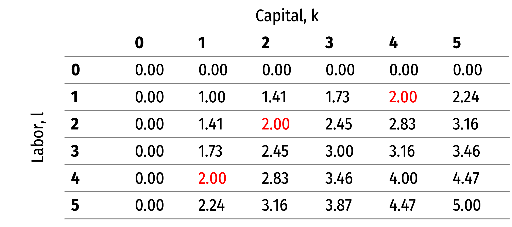
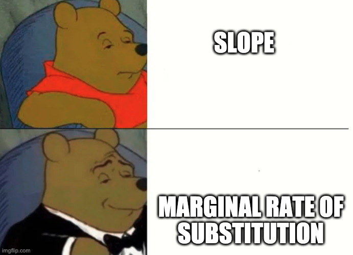
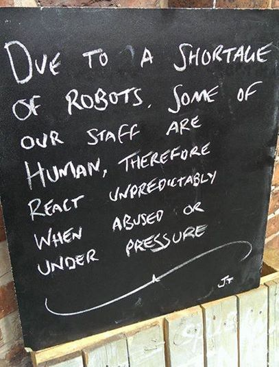

```{r setup, include=FALSE}
options(htmltools.dir.version = FALSE)
knitr::opts_chunk$set(echo=F,
                      message=F,
                      warning=F,
                      fig.retina = 3,
                      fig.align = "center")
library("tidyverse")
library("mosaic")
library("ggrepel")
library("fontawesome")
xaringanExtra::use_tile_view()
xaringanExtra::use_tachyons()
xaringanExtra::use_freezeframe()

update_geom_defaults("label", list(family = "Fira Sans Condensed"))
update_geom_defaults("text", list(family = "Fira Sans Condensed"))

set.seed(256)
```

class: title-slide

# 2.2 — Production Technology

## ECON 306 • Microeconomic Analysis • Spring 2023

### Ryan Safner<br> Associate Professor of Economics <br> <a href="mailto:safner@hood.edu"><i class="fa fa-paper-plane fa-fw"></i>safner@hood.edu</a> <br> <a href="https://github.com/ryansafner/microS23"><i class="fa fa-github fa-fw"></i>ryansafner/microS23</a><br> <a href="https://microS23.classes.ryansafner.com"> <i class="fa fa-globe fa-fw"></i>microS23.classes.ryansafner.com</a><br>

---

class: inverse

# Outline

### [Production in the Short Run](#5)
### [The Firm's Problem: Long Run](#14)
### [Isoquants and MRTS](#21)
### [Isocost Lines](#34)


---

# The “Runs” of Production 

.pull-left[

- “Time”-frame usefully divided between short vs. long run analysis

- .hi[Short run]: at least one factor of production is .hi-purple[fixed] (too costly to change)
$$q=f(\bar{k},l)$$
  - Assume **capital** is fixed (i.e. number of factories, storefronts, etc)
  - Short-run decisions only about using **labor**
    
]

.pull-right[
.center[

]

]

---


# The “Runs” of Production 

.pull-left[

- “Time”-frame usefully divided between short vs. long run analysis

- .hi[Long run]: all factors of production are .hi-purple[variable] (can be changed)
$$q=f(k,l)$$

]

.pull-right[
.center[

]

]

---

class: inverse, center, middle

# Production in the Short Run

---

# Production in the Short Run: Example

.pull-left[
.bg-washed-green.b--dark-green.ba.bw2.br3.shadow-5.ph4.mt5[
.smaller[
.green[**Example**:] Consider a firm with the production function
$$q=k^{0.5}l^{0.5}$$

- Suppose in the short run, the firm has 4 units of capital.
]
]

.smallest[
1. Derive the short run production function.
2. What is the total product (output) that can be made with 4 workers?
3. What is the total product (output) that can be made with 5 workers?

]
]
--

.pull-right[

```{r, fig.retina=3}
library("mosaic")
prod_1=function(x){2*sqrt(x)}

pf<-ggplot(data.frame(x=c(0,6)), aes(x=x))+
  stat_function(fun=prod_1, geom="line", size=2, color="red")+
  geom_label(aes(x=5,y=prod_1(5)), color = "red", label="Total Product", size = 6)+
    scale_x_continuous(breaks=seq(0,6,1),
                     limits=c(0,6),
                     expand=expand_scale(mult=c(0,0.1)))+
  scale_y_continuous(breaks=seq(0,6,1),
                     limits=c(0,6),
                     expand=expand_scale(mult=c(0,0.1)))+
  scale_colour_manual("I.C. equations", values = colors)+
  guides(color = F)+
  labs(x = "Input (l)",
       y = "Output (q)",
       caption = expression(paste("Technology: ", q(l,bar(k))==2*sqrt(l))))+
  theme_classic(base_family = "Fira Sans Condensed", base_size=20)
pf
```

]

---

# Marginal Products

.pull-left[
- The .hi[marginal product] of an input is the *additional* output produced by *one more unit* of that input (*holding all other inputs constant*)

- Like marginal utility

- Similar to marginal utilities, I will give you the marginal product equations

]

.pull-right[
```{r, fig.retina=3}
pf+ # 1 to 2
  geom_segment(x=1,xend=1,y=0,yend=prod_1(1), linetype="dotted", size =1)+
  geom_segment(x=0,xend=1,y=prod_1(1),yend=prod_1(1), linetype="dotted", size =1)+
  geom_segment(x=2,xend=2,y=0,yend=prod_1(2), linetype="dotted", size =1)+
  geom_segment(x=0,xend=2,y=prod_1(2),yend=prod_1(2), linetype="dotted", size =1)+
  annotate("segment", x = 1, xend = 2, y = 1, yend = 1, color = "purple", size=2, alpha=0.9, arrow=arrow(length=unit(0.5,"cm"), ends="last", type="closed"))+
  annotate("segment", x = 1, xend = 1, y = 2, yend = prod_1(2), color = "purple", size=2, alpha=0.9, arrow=arrow(length=unit(0.5,"cm"), ends="last", type="closed"))

```
]

---

# Marginal Product of Labor

.pull-left[

- .hi[Marginal product of labor `\\((MP_l)\\)`]: additional output produced by adding one more unit of labor (holding $k$ constant)
$$MP_l = \frac{\Delta q}{\Delta l}$$

- $MP_l$ is slope of $TP$ at each value of $l$! 
  - Note: via calculus: $\frac{\partial q}{\partial l}$
]

.pull-right[

```{r, fig.retina=3, fig.height=3.5}
ggplot(data.frame(x=c(0,6)), aes(x=x))+
  stat_function(fun=prod_1, geom="line", size=2, color="red")+
  geom_label(aes(x=5,y=prod_1(5)), color = "red", label=expression(TP==2*sqrt(l)), size = 6)+
    scale_x_continuous(breaks=seq(0,6,1),
                     limits=c(0,6),
                     expand=expand_scale(mult=c(0,0.1)))+
  scale_y_continuous(breaks=seq(0,6,1),
                     limits=c(0,6),
                     expand=expand_scale(mult=c(0,0.1)))+
  scale_colour_manual("I.C. equations", values = colors)+
  guides(color = F)+
  labs(x = "Input (l)",
       y = "Output (q)")+
  theme_classic(base_family = "Fira Sans Condensed", base_size=20)
```

```{r, fig.retina=3, fig.height=3.5}
mp=function(x){1/sqrt(x)}

ggplot(data.frame(x=c(0,10)), aes(x=x))+
  stat_function(fun=mp, geom="line", size=2, color="blue")+
  geom_label(aes(x=1,y=mp(1)), color = "blue", label=expression(MP[l]==frac(1,sqrt(l))), size = 4)+
    scale_x_continuous(breaks=seq(0,6,1),
                     limits=c(0,6),
                     expand=expand_scale(mult=c(0,0.1)))+
  scale_y_continuous(breaks=seq(0,6,1),
                     limits=c(0,6),
                     expand=expand_scale(mult=c(0,0.1)))+
  scale_colour_manual("I.C. equations", values = colors)+
  guides(color = F)+
  labs(x = "Input (l)",
       y = "Output per Worker (q/l)")+
  theme_classic(base_family = "Fira Sans Condensed", base_size=20)
```

]

---

# Marginal Product of Capital

.pull-left[

- .hi[Marginal product of capital `\\((MP_k)\\)`]: additional output produced by adding one more unit of capital (holding $l$ constant)
$$MP_k = \frac{\Delta q}{\Delta k}$$

- $MP_k$ is slope of $TP$ at each value of $k$! 
  - Note: via calculus: $\frac{\partial q}{\partial k}$

- Note we don't consider capital in the short run!

]

.pull-right[

```{r, fig.retina=3, fig.height=3.5}
ggplot(data.frame(x=c(0,6)), aes(x=x))+
  stat_function(fun=prod_1, geom="line", size=2, color="red")+
  geom_label(aes(x=5,y=prod_1(5)), color = "red", label=expression(TP==2*sqrt(k)), size = 6)+
    scale_x_continuous(breaks=seq(0,6,1),
                     limits=c(0,6),
                     expand=expand_scale(mult=c(0,0.1)))+
  scale_y_continuous(breaks=seq(0,6,1),
                     limits=c(0,6),
                     expand=expand_scale(mult=c(0,0.1)))+
  scale_colour_manual("I.C. equations", values = colors)+
  guides(color = F)+
  labs(x = "Input (k)",
       y = "Output (q)")+
  theme_classic(base_family = "Fira Sans Condensed", base_size=20)
```

```{r, fig.retina=3, fig.height=3.5}
mp=function(x){1/sqrt(x)}

ggplot(data.frame(x=c(0,10)), aes(x=x))+
  stat_function(fun=mp, geom="line", size=2, color="blue")+
  geom_label(aes(x=1,y=mp(1)), color = "blue", label=expression(MP[k]==frac(1,sqrt(k))), size = 4)+
    scale_x_continuous(breaks=seq(0,6,1),
                     limits=c(0,6),
                     expand=expand_scale(mult=c(0,0.1)))+
  scale_y_continuous(breaks=seq(0,6,1),
                     limits=c(0,6),
                     expand=expand_scale(mult=c(0,0.1)))+
  scale_colour_manual("I.C. equations", values = colors)+
  guides(color = F)+
  labs(x = "Input (k)",
       y = "Output per Machine (q/k)")+
  theme_classic(base_family = "Fira Sans Condensed", base_size=20)
```

]

---

# Diminishing Returns

.pull-left[

- .hi-purple[Law of Diminishing Returns]: adding more of one factor of production **holding all others constant** will result in successively lower increases in output

- In order to increase output, firm will need to increase *all* factors!


]

.pull-right[

```{r, fig.retina=3, fig.height=3.5}
ggplot(data.frame(x=c(0,6)), aes(x=x))+
  stat_function(fun=prod_1, geom="line", size=2, color="red")+
  geom_label(aes(x=5,y=prod_1(5)), color = "red", label=expression(TP==2*sqrt(l)), size = 6)+
# 1 to 2
  geom_segment(x=1,xend=1,y=0,yend=prod_1(1), linetype="dotted", size =1)+
  geom_segment(x=0,xend=1,y=prod_1(1),yend=prod_1(1), linetype="dotted", size =1)+
  geom_segment(x=2,xend=2,y=0,yend=prod_1(2), linetype="dotted", size =1)+
  geom_segment(x=0,xend=2,y=prod_1(2),yend=prod_1(2), linetype="dotted", size =1)+
  annotate("segment", x = 1, xend = 2, y = 1, yend = 1, color = "purple", size=2, alpha=0.9, arrow=arrow(length=unit(0.5,"cm"), ends="last", type="closed"))+
  annotate("segment", x = 1, xend = 1, y = 2, yend = prod_1(2), color = "purple", size=2, alpha=0.9, arrow=arrow(length=unit(0.5,"cm"), ends="last", type="closed"))+
    scale_x_continuous(breaks=seq(0,6,1),
                     limits=c(0,6),
                     expand=expand_scale(mult=c(0,0.1)))+
  scale_y_continuous(breaks=seq(0,6,1),
                     limits=c(0,6),
                     expand=expand_scale(mult=c(0,0.1)))+
  scale_colour_manual("I.C. equations", values = colors)+
  guides(color = F)+
  labs(x = "Input (l)",
       y = "Output (q)")+
  theme_classic(base_family = "Fira Sans Condensed", base_size=20)
```

```{r, fig.retina=3, fig.height=3.5}
mp=function(x){1/sqrt(x)}

ggplot(data.frame(x=c(0,10)), aes(x=x))+
  stat_function(fun=mp, geom="line", size=2, color="blue")+
  geom_label(aes(x=1,y=mp(1)), color = "blue", label=expression(MP[l]==frac(1,sqrt(l))), size = 4)+
    scale_x_continuous(breaks=seq(0,6,1),
                     limits=c(0,6),
                     expand=expand_scale(mult=c(0,0.1)))+
  scale_y_continuous(breaks=seq(0,6,1),
                     limits=c(0,6),
                     expand=expand_scale(mult=c(0,0.1)))+
  scale_colour_manual("I.C. equations", values = colors)+
  guides(color = F)+
  labs(x = "Input (l)",
       y = "Output per Worker (q/l)")+
  theme_classic(base_family = "Fira Sans Condensed", base_size=20)
```
]

---

# Diminishing Returns

.pull-left[

- .hi-purple[Law of Diminishing Returns]: adding more of one factor of production **holding all others constant** will result in successively lower increases in output

- In order to increase output, firm will need to increase *all* factors!

.center[

]

]

.pull-right[

```{r, fig.retina=3, fig.height=3.5}
ggplot(data.frame(x=c(0,6)), aes(x=x))+
  stat_function(fun=prod_1, geom="line", size=2, color="red")+
  geom_label(aes(x=5,y=prod_1(5)), color = "red", label=expression(TP==2*sqrt(l)), size = 6)+
# 1 to 2
  geom_segment(x=1,xend=1,y=0,yend=prod_1(1), linetype="dotted", size =1)+
  geom_segment(x=0,xend=1,y=prod_1(1),yend=prod_1(1), linetype="dotted", size =1)+
  geom_segment(x=2,xend=2,y=0,yend=prod_1(2), linetype="dotted", size =1)+
  geom_segment(x=0,xend=2,y=prod_1(2),yend=prod_1(2), linetype="dotted", size =1)+
  annotate("segment", x = 1, xend = 2, y = 1, yend = 1, color = "purple", size=2, alpha=0.9, arrow=arrow(length=unit(0.5,"cm"), ends="last", type="closed"))+
  annotate("segment", x = 1, xend = 1, y = 2, yend = prod_1(2), color = "purple", size=2, alpha=0.9, arrow=arrow(length=unit(0.5,"cm"), ends="last", type="closed"))+
  
  # 2 to 3
    geom_segment(x=3,xend=3,y=0,yend=prod_1(3), linetype="dotted", size =1)+
  geom_segment(x=0,xend=3,y=prod_1(3),yend=prod_1(3), linetype="dotted", size =1)+
  annotate("segment", x = 2, xend = 3, y = 1, yend = 1, color = "purple", size=2, alpha=0.9, arrow=arrow(length=unit(0.5,"cm"), ends="last", type="closed"))+
  annotate("segment", x = 2, xend = 2, y = 3, yend = prod_1(3), color = "purple", size=2, alpha=0.9, arrow=arrow(length=unit(0.3,"cm"), ends="last", type="closed"))+
  scale_x_continuous(breaks=seq(0,6,1),
                     limits=c(0,6),
                     expand=expand_scale(mult=c(0,0.1)))+
  scale_y_continuous(breaks=seq(0,6,1),
                     limits=c(0,6),
                     expand=expand_scale(mult=c(0,0.1)))+
  scale_colour_manual("I.C. equations", values = colors)+
  guides(color = F)+
  labs(x = "Input (l)",
       y = "Output (q)")+
  theme_classic(base_family = "Fira Sans Condensed", base_size=20)
```

```{r, fig.retina=3, fig.height=3.5}
mp=function(x){1/sqrt(x)}

ggplot(data.frame(x=c(0,10)), aes(x=x))+
  stat_function(fun=mp, geom="line", size=2, color="blue")+
  geom_label(aes(x=1,y=mp(1)), color = "blue", label=expression(MP[l]==frac(1,sqrt(l))), size = 4)+
    scale_x_continuous(breaks=seq(0,6,1),
                     limits=c(0,6),
                     expand=expand_scale(mult=c(0,0.1)))+
  scale_y_continuous(breaks=seq(0,6,1),
                     limits=c(0,6),
                     expand=expand_scale(mult=c(0,0.1)))+
  scale_colour_manual("I.C. equations", values = colors)+
  guides(color = F)+
  labs(x = "Input (l)",
       y = "Output per Worker (q/l)")+
  theme_classic(base_family = "Fira Sans Condensed", base_size=20)
```
]

---

# Average Product of Labor (and Capital)

.pull-left[

- .hi[Average product of labor `\\((AP_l)\\)`]: total output per worker
$$AP_l = \frac{q}{l}$$

- A measure of *labor productivity*

- .hi[Average product of capital `\\((AP_k)\\)`]: total output per unit of capital
$$AP_k = \frac{q}{k}$$
]

.pull-right[

```{r, fig.retina=3, fig.height=3.5}
ggplot(data.frame(x=c(0,6)), aes(x=x))+
  stat_function(fun=prod_1, geom="line", size=2, color="red")+
  geom_label(aes(x=5,y=prod_1(5)), color = "red", label=expression(TP==2*sqrt(l)), size = 6)+
    scale_x_continuous(breaks=seq(0,6,1),
                     limits=c(0,6),
                     expand=expand_scale(mult=c(0,0.1)))+
  scale_y_continuous(breaks=seq(0,6,1),
                     limits=c(0,6),
                     expand=expand_scale(mult=c(0,0.1)))+
  scale_colour_manual("I.C. equations", values = colors)+
  guides(color = F)+
  labs(x = "Input (l)",
       y = "Output (q)")+
  theme_classic(base_family = "Fira Sans Condensed", base_size=20)
```

```{r, fig.retina=3, fig.height=3.5}
ap=function(x){2/sqrt(x)}

ggplot(data.frame(x=c(0,10)), aes(x=x))+
  stat_function(fun=ap, geom="line", size=2, color="purple")+
  geom_label(aes(x=1,y=ap(1)), color = "purple", label=expression(AP[l]==frac(2,sqrt(l))), size = 4)+
    scale_x_continuous(breaks=seq(0,6,1),
                     limits=c(0,6),
                     expand=expand_scale(mult=c(0,0.1)))+
  scale_y_continuous(breaks=seq(0,6,1),
                     limits=c(0,6),
                     expand=expand_scale(mult=c(0,0.1)))+
  scale_colour_manual("I.C. equations", values = colors)+
  guides(color = F)+
  labs(x = "Input (l)",
       y = "Output per Worker (q/l)")+
  theme_classic(base_family = "Fira Sans Condensed", base_size=20)
```

]

---

class: inverse, center, middle

# The Firm's Problem: Long Run

---

# The Long Run

.pull-left[

- In the long run, *all* factors of production are .hi-purple[variable]

$$q=f(k,l)$$

- Can build more factories, open more storefronts, rent more space, invest in machines, etc.

- So the firm can choose both $l$ *and* $k$

]

.pull-right[

.center[

]
]

---

# The Firm's Problem

.pull-left[
.smallest[
- Based on what we've discussed, we can fill in a constrained optimization model for the firm
  - .hi-turquoise[But don't write this one down just yet!]

- The **firm's problem** is: 

1. **Choose:** .hi-blue[ < inputs and output >]

2. **In order to maximize:** .hi-green[< profits >]

3. **Subject to:** .hi-red[< technology >]

- It's actually much easier to break this into **2 stages**. See today’s [class notes](/content/2.2-content) page for an example using only one stage.
]
]

.pull-right[

.center[

]
]

---

# The Firm's Two Problems

.pull-left[
.smallest[
1<sup>st</sup> Stage: .hi[firm's profit maximization problem]: 

1. **Choose:** .hi-blue[ < output >]

2. **In order to maximize:** .hi-green[< profits >]

- We'll cover this later...first we'll explore: 
]
]
.pull-right[

.center[

]
]

---

# The Firm's Two Problems

.pull-left[
.smallest[
1<sup>st</sup> Stage: .hi[firm's profit maximization problem]: 

1. **Choose:** .hi-blue[ < output >]

2. **In order to maximize:** .hi-green[< profits >]

- We'll cover this later...first we'll explore: 

2<sup>nd</sup> Stage: .hi[firm's cost minimization problem]: 

1. **Choose:** .hi-blue[ < inputs >]

2. **In order to _minimize_:** .hi-green[< cost >]

3. **Subject to:** .hi-red[< producing the optimal output >]

- Minimizing costs $\iff$ maximizing profits
]
]

.pull-right[

.center[

]
]

---

# Long Run Production

.pull-left[
.green[**Example**]: $q=\sqrt{lk}$

.center[

]
]

.pull-right[
- Many input-combinations yield the same output!

- So how does the firm choose the *optimal* combination?
]
---

# Mapping Input-Combination Choices Graphically

.pull-left[

.center[

3-D Production Function
```{r, fig.retina=3, fig.height=5.5}
library("plotly")
x_vec = seq(0,10,1)
y_vec = seq(0,10,1)
x_matrix = matrix(c(x_vec), nrow = 10, ncol = 1)
y_matrix = matrix(c(y_vec), nrow = 1, ncol = 10)
z_matrix = matrix(c(sqrt(x_matrix %*% y_matrix)),nrow=10,ncol=10)

plot_ly(x = x_vec,
           y = y_vec,
           z = z_matrix) %>%
  add_surface() %>%
  layout(scene = list(xaxis = list(title="Labor"),
                      yaxis = list(title="Capital"),
                      zaxis = list(title="Output")))
```
]
]
.pull-right[
.center[
2-D Isoquant Contours

```{r, fig.retina=3, fig.height=5.5}
library("mosaic")
library("viridis")

IC_10=function(x){100/x}
IC_9=function(x){81/x}
IC_8=function(x){64/x}
IC_7=function(x){49/x}
IC_6=function(x){36/x}
IC_5=function(x){25/x}
IC_4=function(x){16/x}
IC_3=function(x){9/x}
IC_2=function(x){4/x}
IC_1=function(x){1/x}


ggplot(data.frame(x=c(0,10)), aes(x=x))+
  stat_function(fun=IC_10, geom="line", size=2, color = "#FDE725FF")+
  stat_function(fun=IC_9, geom="line", size=2, color = "#B8DE29FF")+
  stat_function(fun=IC_8, geom="line", size=2, color = "#73D055FF")+
  stat_function(fun=IC_7, geom="line", size=2, color = "#3CBB75FF")+
  stat_function(fun=IC_6, geom="line", size=2, color = "#20A387FF")+
  stat_function(fun=IC_5, geom="line", size=2, color = "#238A8DFF")+
  stat_function(fun=IC_4, geom="line", size=2, color = "#2D708EFF")+
  stat_function(fun=IC_3, geom="line", size=2, color = "#39568CFF")+
  stat_function(fun=IC_2, geom="line", size=2, color = "#453781FF")+
  stat_function(fun=IC_1, geom="line", size=2, color = "#481567FF")+
    scale_x_continuous(breaks=seq(0,10,1),
                     limits=c(0,10),
                     expand=expand_scale(mult=c(0,0.1)))+
  scale_y_continuous(breaks=seq(0,10,1),
                     limits=c(0,10),
                     expand=expand_scale(mult=c(0,0.1)))+
  #scale_colour_manual("Curves", values = line_colors, guide=F)+
  labs(x = "Labor",
       y = "Capital")+
  theme_classic(base_family = "Fira Sans Condensed", base_size=20)
```

]
]

---

class: inverse, center, middle

# Isoquants and MRTS

---

# Isoquant Curves

.pull-left[

- We can draw an .hi-blue[isoquant] indicating all combinations of $l$ and $k$ that yield the same $q$

]

.pull-right[

```{r, fig.retina=3}
library(ggrepel)
iq_points<-tribble(
  ~"letter", ~x, ~y,
  "A", 1, 4,
  "B", 2, 2,
  "C", 4, 1,
  "D", 2, 4,
  "E", 1, 2
)

iq_8=function(x){8/x}
iq_4=function(x){4/x}
iq_2=function(x){2/x}

ggplot(data.frame(x=c(0,5)), aes(x=x))+
  stat_function(fun=iq_4, geom="line", size=2, color = "blue")+
  geom_label(x=4.5, y=iq_4(4.5), label=expression(q==2.00), color = "blue")+
  geom_point(data = subset(iq_points, letter %in% c("A","B","C")),
                           aes(x=x,y=y), size =3)+
  geom_text_repel(data = subset(iq_points, letter %in% c("A","B","C")),
                  aes(x=x,y=y, label=letter), seed = 2,size =4)+
    scale_x_continuous(breaks=seq(0,5,1),
                     limits=c(0,5),
                     expand=expand_scale(mult=c(0,0.1)))+
  scale_y_continuous(breaks=seq(0,5,1),
                     limits=c(0,5),
                     expand=expand_scale(mult=c(0,0.1)))+
  #scale_colour_manual("Curves", values = line_colors, guide=F)+
  labs(x = "Labor",
       y = "Capital")+
  theme_classic(base_family = "Fira Sans Condensed", base_size=20)
```

]

---


# Isoquant Curves

.pull-left[

- We can draw an .hi-blue[isoquant] indicating all combinations of $l$ and $k$ that yield the same $q$

- Combinations *above* curve yield .hi-green[more output]; on a .hi-green[higher curve]
  - $D > A = B = C$

]

.pull-right[

```{r, fig.retina=3}
ggplot(data.frame(x=c(0,5)), aes(x=x))+
  stat_function(fun=iq_8, geom="line", size=2, color = "green")+
  geom_label(x=4.5, y=iq_8(4.5), label=expression(q==2.82), color = "green")+
  stat_function(fun=iq_4, geom="line", size=2, color = "blue")+
  geom_label(x=4.5, y=iq_4(4.5), label=expression(q==2.00), color = "blue")+
  geom_point(data = subset(iq_points, letter %in% c("A","B","C","D")),
                           aes(x=x,y=y), size =3)+
  geom_text_repel(data = subset(iq_points, letter %in% c("A","B","C","D")),
                  aes(x=x,y=y, label=letter), seed =2, size =4)+
    scale_x_continuous(breaks=seq(0,5,1),
                     limits=c(0,5),
                     expand=expand_scale(mult=c(0,0.1)))+
  scale_y_continuous(breaks=seq(0,5,1),
                     limits=c(0,5),
                     expand=expand_scale(mult=c(0,0.1)))+
  #scale_colour_manual("Curves", values = line_colors, guide=F)+
  labs(x = "Labor",
       y = "Capital")+
  theme_classic(base_family = "Fira Sans Condensed", base_size=20)
```

]

---

# Isoquant Curves

.pull-left[

- We can draw an .hi-blue[isoquant] indicating all combinations of $l$ and $k$ that yield the same $q$

- Combinations *above* curve yield .hi-green[more output]; on a .hi-green[higher curve]
  - $D > A = B = C$

- Combinations *below* the curve yield .hi-red[less output]; on a .hi-red[lower curve]
  - $E < A = B = C$
]

.pull-right[

```{r, fig.retina=3}
ggplot(data.frame(x=c(0,5)), aes(x=x))+
  stat_function(fun=iq_8, geom="line", size=2, color = "green")+
  geom_label(x=4.5, y=iq_8(4.5), label=expression(q==2.82), color = "green")+
  stat_function(fun=iq_4, geom="line", size=2, color = "blue")+
  geom_label(x=4.5, y=iq_4(4.5), label=expression(q==2.00), color = "blue")+
  stat_function(fun=iq_2, geom="line", size=2, color = "red")+
  geom_label(x=4.5, y=iq_2(4.5), label=expression(q==1.41), color = "red")+
  geom_point(data = iq_points, aes(x=x,y=y), size =3)+
  geom_text_repel(data = iq_points, aes(x=x,y=y, label=letter), seed = 2, size =4)+
    scale_x_continuous(breaks=seq(0,5,1),
                     limits=c(0,5),
                     expand=expand_scale(mult=c(0,0.1)))+
  scale_y_continuous(breaks=seq(0,5,1),
                     limits=c(0,5),
                     expand=expand_scale(mult=c(0,0.1)))+
  #scale_colour_manual("Curves", values = line_colors, guide=F)+
  labs(x = "Labor",
       y = "Capital")+
  theme_classic(base_family = "Fira Sans Condensed", base_size=20)
```

]

---

# Marginal Rate of *Technical* Substitution I

.pull-left[
- If your firm uses fewer workers, how much more capital would it need to produce the same amount?

]

.pull-right[
.center[

]
]

---

# Marginal Rate of *Technical* Substitution I

.pull-left[
- If your firm uses fewer workers, how much more capital would it need to produce the same amount?

- .hi[Marginal Rate of Technical Substitution (MRTS)]: rate at which firm trades off one input for another to *yield same output*

- Firm's .hi-purple[relative value] of using $l$ in production based on its tech:

> “We could give up (MRTS) units of k to use 1 more unit of l to produce the same output.”

]

.pull-right[
.center[

]
]

---

# Marginal Rate of *Technical* Substitution II

.center[

]

---

# Marginal Rate of *Technical* Substitution II

.pull-left[

- MRTS is the slope of the isoquant
$$MRTS_{l,k}=-\frac{\Delta k}{\Delta l} = \frac{rise}{run}$$

- Amount of $k$ given up for 1 more $l$

- Note: slope (MRTS) changes along the curve!

- .hi-purple[Law of diminishing returns]!

]
.pull-right[

```{r MRS, fig.retina=3, fig.align="center", fig.width=6}

IC_mrs=function(x){10/x}

p<-ggplot(data.frame(x=c(0,10)), aes(x=x))+
  stat_function(fun=IC_mrs, geom="line", size=2, color="blue")+
  geom_segment(aes(x=1, xend=1, y=IC_mrs(1), yend=IC_mrs(2)), linetype="dashed", color="red", size=1)+
  geom_segment(aes(x=1, xend=2, y=IC_mrs(2), yend=IC_mrs(2)), linetype="dashed", color="red", size=1)+
  geom_segment(aes(x=4, xend=4, y=IC_mrs(4), yend=IC_mrs(5)), linetype="dashed", color="red", size=1)+
  geom_segment(aes(x=4, xend=5, y=IC_mrs(5), yend=IC_mrs(5)), linetype="dashed", color="red", size=1)+
  geom_segment(aes(x=8, xend=8, y=IC_mrs(8), yend=IC_mrs(9)), linetype="dashed", color="red", size=1)+
  geom_segment(aes(x=8, xend=9, y=IC_mrs(9), yend=IC_mrs(9)), linetype="dashed", color="red", size=1)+
  scale_x_continuous(breaks=seq(0,10,1),
                     limits=c(0,10),
                     expand=expand_scale(mult=c(0,0.1)))+
  scale_y_continuous(breaks=seq(0,10,1),
                     limits=c(0,10),
                     expand=expand_scale(mult=c(0,0.1)))+
  labs(x = "Labor",
       y = "Capital")+
  theme_classic(base_family = "Fira Sans Condensed", base_size=20)
p
```

]

---

# MRTS and Marginal Products 

.pull-left[

- Relationship between $MP$ and $MRTS$:

$$\begin{align*}
\underbrace{\frac{\Delta k}{\Delta l}}_{MRTS} &= -\frac{MP_l}{MP_k}\\ \end{align*}$$

- See proof in [today's class notes](/content/2.2-content)

- Sound familiar? 🧐

]
.pull-right[

```{r, echo=F, fig.retina=3, fig.align="center", fig.width=6}
p
```

]

---

# Special Case I: Perfect Substitutes

.pull-left[

.bg-washed-green.b--dark-green.ba.bw2.br3.shadow-5.ph4.mt5[
.green[**Example**]: Consider Bank Tellers `\\((l)\\)` and ATMs `\\((k)\\)` 
]
- Suppose 1 ATM can do the work of 2 bank tellers

- .hi[Perfect substitutes]: inputs that can be substituted at same fixed rate and yield same output

- $MRTS_{l,k}=-0.5$ (a constant!)

]

.pull-right[
```{r, echo=F, fig.retina=3, fig.align="center"}
ggplot(data.frame(x=c(0,5)), aes(x=x))+
  geom_segment(aes(x=0, xend=2, y=1, yend=0), size=2, color="#453781FF")+
  geom_segment(aes(x=0, xend=4, y=2, yend=0), size=2, color="#20A387FF")+
  geom_label(aes(x=1, y=0.5), size=6, color="#453781FF", label="q=1")+
  geom_label(aes(x=1, y=1.5), size=6, color="#20A387FF", label="q=2")+
  scale_x_continuous(breaks=seq(0,5,1),
                     limits=c(0,5),
                     expand=expand_scale(mult=c(0,0.1)))+
  scale_y_continuous(breaks=seq(0,5,1),
                     limits=c(0,5),
                     expand=expand_scale(mult=c(0,0.1)))+
  labs(x = "Bank Tellers (l)",
       y = "ATMs (k)")+
  theme_classic(base_family = "Fira Sans Condensed", base_size=20)
```
]

---

# Special Case II: Perfect Complements

.pull-left[

.bg-washed-green.b--dark-green.ba.bw2.br3.shadow-5.ph4.mt5[
.green[**Example**]: Consider buses `\\((k)\\)` and bus drivers `\\((l)\\)`
]
- Must combine together in fixed proportions (1:1)

- .hi[Perfect complements]: inputs must be used together in same fixed proportion to produce output

- $MRTS_{l,k}$: ?

]

.pull-right[
```{r, echo=F, fig.retina=3, fig.align="center"}
ggplot(data.frame(x=c(0,5)), aes(x=x))+
  geom_segment(aes(x=1, xend=1, y=5, yend=1), size=2, color="#453781FF")+
  geom_segment(aes(x=1, xend=5, y=1, yend=1), size=2, color="#453781FF")+
  geom_segment(aes(x=2, xend=2, y=5, yend=2), size=2, color="#20A387FF")+
  geom_segment(aes(x=2, xend=5, y=2, yend=2), size=2, color="#20A387FF")+
  geom_label(aes(x=4, y=1), size=6, color="#453781FF", label="q=1")+
  geom_label(aes(x=4, y=2), size=6, color="#20A387FF", label="q=2")+
  scale_x_continuous(breaks=seq(0,5,1),
                     limits=c(0,5),
                     expand=expand_scale(mult=c(0,0.1)))+
  scale_y_continuous(breaks=seq(0,5,1),
                     limits=c(0,5),
                     expand=expand_scale(mult=c(0,0.1)))+
  labs(x = "Bus Drivers (l)",
       y = "Buses (k)")+
  theme_classic(base_family = "Fira Sans Condensed", base_size=20)
```
]

---

# Common Case: Cobb-Douglas Production Functions

.pull-left[

- Again: very common functional form in economics is .hi[Cobb-Douglas]

$$q=A \, k^al^b$$

- Where $a, b >0$
  - often $a+b=1$

- $A$ is total factor productivity
]

.pull-right[
```{r, fig.retina=3, fig.height=5.5}
ggplot(data.frame(x=c(0,10)), aes(x=x))+
  stat_function(fun=IC_8, geom="line", size=2, color = "#73D055FF")+
  stat_function(fun=IC_6, geom="line", size=2, color = "#20A387FF")+
  stat_function(fun=IC_4, geom="line", size=2, color = "#2D708EFF")+
  stat_function(fun=IC_2, geom="line", size=2, color = "#453781FF")+
    geom_label(aes(x=9,y=IC_8(9)), color = "#73D055FF", label="q=64/l", size = 6)+
    geom_label(aes(x=9,y=IC_6(9)), color = "#20A387FF", label="q=36/l", size = 6)+
    geom_label(aes(x=9,y=IC_4(9)), color = "#2D708EFF", label="q=16/l", size = 6)+
    geom_label(aes(x=9,y=IC_2(9)), color = "#453781FF", label="q=4/l", size = 6)+
    scale_x_continuous(breaks=seq(0,10,1),
                     limits=c(0,10),
                     expand=expand_scale(mult=c(0,0.1)))+
  scale_y_continuous(breaks=seq(0,10,1),
                     limits=c(0,10),
                     expand=expand_scale(mult=c(0,0.1)))+
  #scale_colour_manual("Curves", values = line_colors, guide=F)+
  labs(x = "Labor (l)",
       y = "Capital (k)",
       title = "Isoquant curves for q=lk")+
  theme_classic(base_family = "Fira Sans Condensed", base_size=20)
```

]

---

# Practice

.smallest[
.bg-washed-green.b--dark-green.ba.bw2.br3.shadow-5.ph4.mt5[
.green[**Example**]: Suppose a firm has the following production function:
$$q=2lk$$

Where its marginal products are:

$$\begin{align*}
MP_l&=2k\\
MP_k&=2l\\
\end{align*}$$

1. Put $l$ on the horizontal axis and $k$ on the vertical axis. Write an equation for $MRTS_{l,k}$.

2. Would input combinations of $(1, 4)$ and $(2, 2)$ be on the same isoquant?

3. Sketch a graph of the isoquant from part 2. 
]
]

---

class: inverse, center, middle

# Isocost Lines

---

# Isocost Lines

.pull-left[
.smallest[
- If your firm can choose among *many* input combinations to produce $q$, which combinations are optimal?

- Those combination that are .hi-purple[cheapest]

- Denote prices of each input as:
    - $w$: price of labor (wage)
    - $r$: price of capital

- Let $C$ be .hi[total cost] of using inputs $(l,k)$ at market prices $(w,r)$ to produce $q$ units of output:

$$C(w,r,q)=wl+rk$$
]
]

.pull-right[
.center[

]
]

---

# The Isocost Line, Graphically

.pull-left[

$$wl+rk=C$$

]

---

# The Isocost Line, Graphically

.pull-left[

$$wl+rk=C$$

- Solve for $k$ to graph

$$k=\frac{C}{r}-\frac{w}{r}l$$

]

.pull-right[
```{r BC-setup}
library("mosaic")
w<-2.5
r<-5
C<-20

ends<-tribble(
  ~x, ~y,
  0, (C/r),
  (C/w), 0
)
BC=function(x){(C/r)-(w/r)*x}
line_colors <- c("BC" = "blue")
```

```{r BC-plot0, fig.retina=3, fig.align="center", fig.width=6}
ggplot(data.frame(x=c(0,C/w)), aes(x=x))+
  scale_x_continuous(breaks = NULL)+
  scale_y_continuous(breaks = NULL)+
  labs(x = "Labor",
       y = "Capital")+
  theme_classic(base_family = "Fira Sans Condensed", base_size=20)
```
]

---

# The Isocost Line, Graphically

.pull-left[

$$wl+rk=C$$

- Solve for $k$ to graph

$$k=\frac{C}{r}-\frac{w}{r}l$$

- Vertical-intercept: $\frac{C}{r}$
- Horizontal-intercept: $\frac{C}{w}$
]

.pull-right[

```{r BC-plot1, echo=F, message = F, warning = F, fig.retina=3, fig.align="center", fig.width=6}
ggplot(data.frame(x=c(0,C/w)), aes(x=x))+
  geom_point(data = ends,
             mapping = aes(x = x,
                           y = y),
             size=3)+
  #stat_function(fun=BC, geom="line", size=1, aes(color="BC"))+
  scale_x_continuous(breaks = c(0,(C/w)),
                     labels = c(0,expression(C/w)),
                     expand=expand_scale(mult=c(0,0.1)))+
  scale_y_continuous(breaks = c(0,(C/r)),
                     labels = c(0,expression(C/r)),
                     expand=expand_scale(mult=c(0,0.1)))+
   coord_cartesian(clip = 'off')+ # show points on edge
  labs(x = "Labor",
       y = "Capital")+
  theme_classic(base_family = "Fira Sans Condensed", base_size=20)
```
]

---

# The Isocost Line, Graphically

.pull-left[

$$wl+rk=C$$

- Solve for $k$ to graph

$$k=\frac{C}{r}-\frac{w}{r}l$$

- Vertical-intercept: $\frac{C}{r}$
- Horizontal-intercept: $\frac{C}{w}$
- slope: $-\frac{w}{r}$

]

.pull-right[
```{r BC-plot2, echo=F, message = F, warning = F, fig.retina=3, fig.align="center", fig.width=6}
ggplot(data.frame(x=c(0,C/w)), aes(x=x))+
  geom_point(data = ends,
             mapping = aes(x = x,
                           y = y),
             size=3)+
  stat_function(fun=BC, geom="line", size=2, color="blue")+
  annotate("text", x = (0.5*(C/w)+1.75), y = BC(0.5*(C/w)), label = expression(paste("slope =", - w/r)), color="blue", size =7)+
  scale_x_continuous(breaks = c(0,(C/w)),
                     labels = c(0,expression(C/w)),
                     expand=expand_scale(mult=c(0,0.1)))+
  scale_y_continuous(breaks = c(0,(C/r)),
                     labels = c(0,expression(C/r)),
                     expand=expand_scale(mult=c(0,0.1)))+
   coord_cartesian(clip = 'off')+ # show points on edge
  labs(x = "Labor",
       y = "Capital")+
  theme_classic(base_family = "Fira Sans Condensed", base_size=20)
```
]

---

# The Isocost Line: Example

.bg-washed-green.b--dark-green.ba.bw2.br3.shadow-5.ph4.mt5[
.green[**Example**]: Suppose your firm has a purchasing budget of $50. Market wages are $5/worker-hour and the mark rental rate of capital is $10/machine-hour. Let $l$ be on the horizontal axis and $k$ be on the vertical axis.

1. Write an equation for the isocost line (in graphable form).

2. Graph the isocost line.
]

---

# Interpreting the Isocost Line

.pull-left[
.smallest[
- Points .blue[on] the line are same total cost
  - A: \\($5(0l)+$10(5k) = $50\\) 
  - B: \\($5(10l)+$10(0k) = $50\\)
  - C: \\($5(2l)+$10(4k) = $50\\) 
  - D: \\($5(6l)+$10(2k) = $50\\)
]
]

.pull-right[

```{r BC2-setup}
library("mosaic")
points<-tribble(
  ~letter, ~x, ~y,
  "A", 0, 5,
  "B", 10, 0,
  "C", 2, 4,
  "D", 6, 2,
  "E", 3, 2,
  "F", 6, 4
)
BC1=function(x){5-0.5*x}
line_colors <- c("BC" = "blue")
```

```{r BC2-plot1, fig.retina=3, fig.align="center", fig.width=6}
fill1<-tribble(
  ~x, ~y,
  0, 5,
  10, 0,
  0,0
)

ggplot(data.frame(x=c(0,10)), aes(x=x))+
  geom_polygon(data=fill1, aes(x=x, y=y),fill="green", alpha=0.4)+
  geom_point(data = subset(points, letter %in% c("A", "B", "C", "D")),
             aes(x = x, y = y), size=4, color = "blue")+
  stat_function(fun=BC1, geom="line", size=2, aes(color="BC"))+
  geom_text_repel(data = subset(points, letter %in% c("A", "B", "C", "D")),
                  aes(x=x , y = y, label = letter),
                  color="blue", size=6, seed =2,
                  point.padding=0.25)+
  scale_x_continuous(breaks=seq(0,10,1),
                     limits=c(0,10),
                     expand=expand_scale(mult=c(0,0.1)))+
  scale_y_continuous(breaks=seq(0,10,1),
                     limits=c(0,10),
                     expand=expand_scale(mult=c(0,0.1)))+
  scale_colour_manual("Curves", values = line_colors, guide=F)+
  labs(x = "Labor",
       y = "Capital")+
  theme_classic(base_family = "Fira Sans Condensed", base_size=20)
```
]

---

# Interpreting the Isocost Line

.pull-left[
.smallest[
- Points .blue[on] the line are same total cost
  - A: \\($5(0l)+$10(5k) = $50\\) 
  - B: \\($5(10l)+$10(0k) = $50\\)
  - C: \\($5(2l)+$10(4k) = $50\\) 
  - D: \\($5(6l)+$10(2k) = $50\\)

- Points .green[beneath] the line are .green[cheaper] (but may produce less)
  - E: \\($5(3l)+$10(2k) = $35\\) 

]
]

.pull-right[

```{r BC2-plot2, fig.retina=3, fig.align="center", fig.width=6}
ggplot(data.frame(x=c(0,10)), aes(x=x))+
  geom_polygon(data=fill1, aes(x=x, y=y),fill="green", alpha=0.4)+
  geom_point(data = subset(points, letter %in% c("A", "B", "C", "D")),
             aes(x = x, y = y), size=4, color = "blue")+
  geom_text_repel(data = subset(points, letter %in% c("A", "B", "C", "D")),
                  aes(x=x , y = y, label = letter),
                  color="blue", size=6, seed =2,
                  point.padding=0.25)+
  geom_point(data = subset(points, letter=="E"),
             aes(x = x, y = y), size=4, color = "green")+
  geom_text_repel(data = subset(points, letter=="E"),
                  aes(x=x , y = y, label = letter),
                  color="green", size=6, seed =2,
                  point.padding=0.25)+
  stat_function(fun=BC1, geom="line", size=2, aes(color="BC"))+
  scale_x_continuous(breaks=seq(0,10,1),
                     limits=c(0,10),
                     expand=expand_scale(mult=c(0,0.1)))+
  scale_y_continuous(breaks=seq(0,10,1),
                     limits=c(0,10),
                     expand=expand_scale(mult=c(0,0.1)))+
  scale_colour_manual("Curves", values = line_colors, guide=F)+
  labs(x = "Labor",
       y = "Capital")+
  theme_classic(base_family = "Fira Sans Condensed", base_size=20)
```
]

---

# Interpreting the Isocost Line

.pull-left[
.smallest[
- Points .blue[on] the line are same total cost
  - A: \\($5(0l)+$10(5k) = $50\\) 
  - B: \\($5(10l)+$10(0k) = $50\\)
  - C: \\($5(2l)+$10(4k) = $50\\) 
  - D: \\($5(6l)+$10(2k) = $50\\)

- Points .green[beneath] the line are .green[cheaper] (but may produce less)
  - E: \\($5(3l)+$10(2k) = $35\\) 

- Points .red[above] the line are .red[more expensive] (and may produce more)
  - F: \\($5(6l)+$10(4k) = $70\\) 
]
]

.pull-right[

```{r BC2-plot3, fig.retina=3, fig.align="center", fig.width=6}
ggplot(data.frame(x=c(0,10)), aes(x=x))+
  geom_polygon(data=fill1, aes(x=x, y=y),fill="green", alpha=0.4)+
  geom_point(data = subset(points, letter %in% c("A", "B", "C", "D")),
             aes(x = x, y = y), size=4, color = "blue")+
  geom_text_repel(data = subset(points, letter %in% c("A", "B", "C", "D")),
                  aes(x=x , y = y, label = letter),
                  color="blue", size=6, seed =2,
                  point.padding=0.25)+
  geom_point(data = subset(points, letter=="E"),
             aes(x = x, y = y), size=4, color = "green")+
  geom_text_repel(data = subset(points, letter=="E"),
                  aes(x=x , y = y, label = letter),
                  color="green", size=6, seed = 2,
                  point.padding=0.25)+
  geom_point(data = subset(points, letter=="F"),
             aes(x = x, y = y), size=4, color = "red")+
  geom_text_repel(data = subset(points, letter=="F"),
                  aes(x=x , y = y, label = letter),
                  color="red", size=6, seed = 2,
                  point.padding=0.25)+
  stat_function(fun=BC1, geom="line", size=2, aes(color="BC"))+
  scale_x_continuous(breaks=seq(0,10,1),
                     limits=c(0,10),
                     expand=expand_scale(mult=c(0,0.1)))+
  scale_y_continuous(breaks=seq(0,10,1),
                     limits=c(0,10),
                     expand=expand_scale(mult=c(0,0.1)))+
  scale_colour_manual("Curves", values = line_colors, guide=F)+
  labs(x = "Labor",
       y = "Capital")+
  theme_classic(base_family = "Fira Sans Condensed", base_size=20)
```
]

---

# Interpretting the Slope

.pull-left[

- **Slope**: .hi-purple[tradeoff] between $l$ and $k$ at market prices
  - Market .hi-purple[“exchange rate”] between $l$ and $k$

- .hi-purple[*Relative* price] of $l$ or the .hi-purple[opportunity cost] of $l$:

> Hiring 1 more unit of $l$ requires giving up $\left(\frac{w}{r}\right)$ units of $k$

]

.pull-right[
```{r BC-slope-plot, fig.retina=3, fig.align="center", fig.width=6}
ggplot(data.frame(x=c(0,C/w)), aes(x=x))+
  geom_point(data = ends,
             mapping = aes(x = x,
                           y = y),
             size=3)+
  stat_function(fun=BC, geom="line", size=2, color="blue")+
  annotate("text", x = (0.5*(C/w)+1.75), y = BC(0.5*(C/w)), label = expression(paste("slope =", - w/r)), color="blue", size =7)+
  scale_x_continuous(breaks = c(0,(C/w)),
                     labels = c(0,expression(C/w)),
                     expand=expand_scale(mult=c(0,0.1)))+
  scale_y_continuous(breaks = c(0,(C/r)),
                     labels = c(0,expression(C/r)),
                     expand=expand_scale(mult=c(0,0.1)))+
   coord_cartesian(clip = 'off')+ # show points on edge
  labs(x = "Labor",
       y = "Capital")+
  theme_classic(base_family = "Fira Sans Condensed", base_size=20)
```
]

---

# Changes in Relative Factor Prices I

.pull-left[
.smallest[
- Changes in .hi-purple[relative factor prices]: *rotate* the line

.hi-green[**Example**]: An increase in the price of $l$

- Slope changes: $-\frac{w'}{r}$
]

.center[

]
]


.pull-right[
```{r x-change-setup}
w2 <- 5
ends_betw2<-tribble(
  ~x, ~y,
  0, (C/r),
  (C/w), 0,
  (C/w2), 0
)

BC3=function(x){(C/r)-(w2/r)*x}
#line_colors <- c("BC" = "blue")
```

```{r BC-x-change-plot, fig.retina=3, fig.align="center", fig.width=6}
ggplot(data.frame(x=c(0,C/w)), aes(x=x))+
  stat_function(fun=BC, geom="line", size=2, aes(color="BC"))+
  stat_function(fun=BC3, geom="line", linetype="dashed", size=2, aes(color="BC"))+
  scale_x_continuous(breaks = c(0,(C/w2), (C/w)),
                     labels = c(0,expression(C/w*minute),expression(C/w)),
                     limits = c(0, (C/w)),
                     expand=expand_scale(mult=c(0,0.1)))+
  scale_y_continuous(breaks = c(0,(C/r)),
                     labels = c(0,"C/r"),
                     limits = c(0, (C/r)),
                     expand=expand_scale(mult=c(0,0.1)))+
  scale_colour_manual("Curves", values = line_colors, guide=F)+
  labs(x = "Labor",
       y = "Capital")+
  theme_classic(base_family = "Fira Sans Condensed", base_size=20)
```
]

---

# Changes in Relative Factor Prices II

.pull-left[
.smallest[
- Changes in .hi-purple[relative factor prices]: *rotate* the line

.hi-green[**Example**]: An increase in the price of $k$

- Slope changes: $-\frac{w}{r'}$
]

.center[

]
]


.pull-right[
```{r y-change-setup}
r2 <- 7.5
ends_betw3<-tribble(
  ~x, ~y,
  0, (C/r),
  0, (C/r2),
  (C/w), 0
)

BC4=function(x){(C/r2)-(w/r2)*x}
#line_colors <- c("BC" = "blue")
```

```{r BC-y-change-plot, fig.retina=3, fig.align="center", fig.width=6}
ggplot(data.frame(x=c(0,C/w)), aes(x=x))+
  stat_function(fun=BC, geom="line", size=2, aes(color="BC"))+
  stat_function(fun=BC4, geom="line", linetype="dashed", size=2, aes(color="BC"))+
  scale_x_continuous(breaks = c(0,(C/w)),
                     labels = c(0,expression(C/w)),
                     limits = c(0, (C/w)),
                     expand=expand_scale(mult=c(0,0.1)))+
  scale_y_continuous(breaks = c(0,(C/r2),(C/r)),
                     labels = c(0,expression(C/r*minute),expression(C/r)),
                     limits = c(0, (C/r)),
                     expand=expand_scale(mult=c(0,0.1)))+
  scale_colour_manual("Curves", values = line_colors, guide=F)+
  labs(x = "Labor",
       y = "Capital")+
  theme_classic(base_family = "Fira Sans Condensed", base_size=20)
```
]
