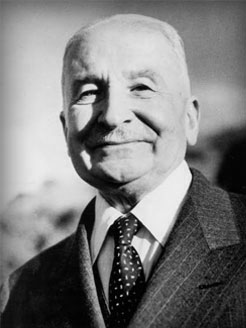
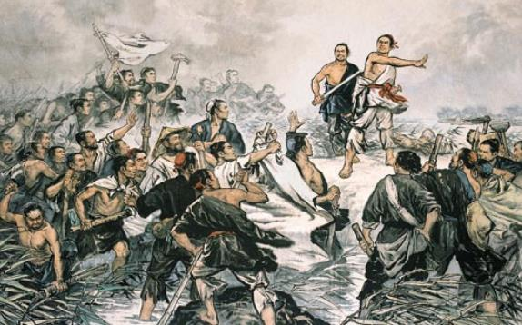

```{r setup, include=FALSE}
options(htmltools.dir.version = FALSE)
knitr::opts_chunk$set(echo=F,
                      message=F,
                      warning=F,
                      fig.retina = 3,
                      fig.align = "center")
library("tidyverse")
library("mosaic")
library("ggrepel")
library("fontawesome")
xaringanExtra::use_tile_view()
xaringanExtra::use_tachyons()
xaringanExtra::use_freezeframe()

update_geom_defaults("label", list(family = "Fira Sans Condensed"))
update_geom_defaults("text", list(family = "Fira Sans Condensed"))

set.seed(256)
```


class: title-slide

# 2.4 — Costs of Production

## ECON 306 • Microeconomic Analysis • Spring 2023

### Ryan Safner<br> Associate Professor of Economics <br> <a href="mailto:safner@hood.edu"><i class="fa fa-paper-plane fa-fw"></i>safner@hood.edu</a> <br> <a href="https://github.com/ryansafner/microS23"><i class="fa fa-github fa-fw"></i>ryansafner/microS23</a><br> <a href="https://microS23.classes.ryansafner.com"> <i class="fa fa-globe fa-fw"></i>microS23.classes.ryansafner.com</a><br>

---

class: inverse

# Outline

### [Opportunity Costs in Production](#6)
### [Costs in the Short Run](#22)
### [Costs in the Long Run](#44)

---

# Recall: The Firm's Two Problems

.pull-left[
.smallest[
1<sup>st</sup> Stage: .hi[firm's profit maximization problem]: 

1. **Choose:** .hi-blue[ < output >]

2. **In order to maximize:** .hi-green[< profits >]

2<sup>nd</sup> Stage: .hi[firm's cost minimization problem]: 

1. **Choose:** .hi-blue[ < inputs >]

2. **In order to _minimize_:** .hi-green[< cost >]

3. **Subject to:** .hi-red[< producing the optimal output >]

- Minimizing costs $\iff$ maximizing profits
]
]

.pull-right[

.center[

]
]

---

# Production for Sale in a *Competitive* Market

.pull-left[

- We assume (for now) the firm is in a .hi[competitive] industry:

1. Firms’ products are .hi-purple[perfect substitutes]

2. Firms are .hi-purple[“price-takers”], no one firm can affect the *market price*

3. Market .hi-purple[entry and exit are free]<sup>.magenta[†]</sup>
]

.pull-right[

.center[

]
]

.footnote[<sup>.magenta[†]</sup> Remember this — it turns out to be the .hi-purple[most important feature] that distinguishes different types of industries!]

---

# Profit

.pull-left[

- Recall that profit is:
$$\pi=\underbrace{pq}_{revenues}-\underbrace{(wl+rk)}_{costs}$$

- We’ll first take a closer look at .hi[costs] today

- Next class we’ll put costs together with revenues to find optimal $q^*$ that maximizes $\pi$ (the first stage problem)

]

.pull-right[
.center[

]
]

---

class: inverse, center, middle

# Opportunity Costs in Production

---

# Production Costs are Opportunity Costs

.pull-left[

- Remember, .hi[economic costs] are broader than the common conception of “cost”
  - .hi-purple[Accounting cost]: monetary cost
  - .hi[Economic cost]: value of next best alternative use of resources given up (i.e. .hi[opportunity cost])

]

.pull-right[
.center[


]
]

---

# Production Costs are Opportunity Costs

.pull-left[

- This leads to the difference between:
  - .hi-purple[Accounting profit]: revenues minus accounting costs
  - .hi[Economic profit]: revenues minus accounting + .ul[opportunity] costs

- A really difficult concept to think about!
]

.pull-right[
.center[


]
]

---

# Production Costs are Opportunity Costs

.pull-left[

- Another helpful perspective:
  - .hi-purple[Accounting cost]: what you **historically** paid for a resource
  - .hi[Economic cost]: what you can **currently** get in the market for a selling a resource (it’s value in *alternative* uses)

]

.pull-right[
.center[


]
]

---

# A Reminder: It's Demand all the Way Down!

.pull-left[

- .hi-red[Supply] is actually .hi-blue[Demand] in disguise!

- An .hi[(opportunity) cost] to buy (scarce) inputs for production because **other people** .hi-blue[demand] those same inputs to consume or produce **other valuable things**!
  - Price necessary to **pull them out of other valuable productive uses** in the economy!
]

.pull-right[

.center[

]
]

---

# Production Costs are Opportunity Costs

.pull-left[

- Because resources are scarce, and have rivalrous uses, .hi-turquoise[how do we know we are using resources efficiently??]

- In functioning markets, .hi-purple[the market price measures the opportunity cost of using a resource for an alternative use]

- Firms not only pay for direct use of a resource, but also indirectly compensate society for *“pulling the resource out”* of alternate uses in the economy!

]

.pull-right[
.center[


]
]

---

# Production Costs are Opportunity Costs

.pull-left[
- Every choice incurs an opportunity cost

.bg-washed-green.b--dark-green.ba.bw2.br3.shadow-5.ph4.mt5[
.green[**Examples**]:
.smallest[
- If you start a business, you may give up your salary at your current job
- If you invest in a factory, you give up other investment opportunities
- If you use an office building you own, you cannot rent it to other people
- If you hire a skilled worker, you must pay them a high enough salary to deter them from working for other firms
]
]
]

.pull-right[
.center[

]
]


---

# Opportunity Cost is Hard for People

.center[

]

---

# Opportunity Costs vs. Sunk Costs

.pull-left[

- Opportunity cost is a *forward-looking* concept

- Choices made in the *past* with *non-recoverable* costs are called .hi[sunk costs]

- Sunk costs *should not* enter into future decisions

- Many people have difficulty letting go of unchangeable past decisions: .hi-purple[sunk cost fallacy]

]

.pull-left[
.center[

]
]

---

# Sunk Costs: Examples

.pull-left[
.center[

]
]

--

.pull-right[
.center[

]
]

---

# Sunks Costs: Examples

.center[

]

---

# Common Sunk Costs in Business

.pull-left[

- Licensing fees, long-term lease contracts

- Specific capital (with no alternative use): uniforms, menus, signs

- Research & Development spending

- Advertising spending

]

.pull-right[

.center[

]
]
---

# The Accounting vs. Economic Point of View I

.pull-left[

- Helpful to consider two points of view:

1. .hi-purple[“Accounting point of view”]: are you taking in more cash than you are spending?

2. .hi[“Economic point of view”]: is your product you making the *best social* use of your resources
  - i.e. are there higher-valued uses of your resources you are keeping them out of?

]

.pull-right[
.center[


]
]

---
# The Accounting vs. Economic Point of View II

.pull-left[
.smaller[
- .hi-turquoise[Implications for society]: are consumers *best* off with you using scarce resources (with alternative uses!) to produce your current product?

- Remember: .hi-turquoise[this is an .ul[*economics*] course, not a *business* course]!
  - .hi-purple[Economists are pro-market, *not* pro-business!]
  - What might be good/bad for **one** business might have bad/good *consequences* for society!
]
]

.pull-right[
.center[


]
]

---

# Consumer Sovereignty in a Market Economy

.left-column[
.center[


.smallest[
Ludwig von Mises

1881—1973
]
]
]

.right-column[
.quitesmall[

> “The direction of all economic affairs is in the market society a task of the entrepreneurs. Theirs is the control of production. They are at the helm and steer the ship. A superficial observer would believe that they are supreme. But they are not. They are bound to obey unconditionally the captain's orders. .hi[The captain is the consumer.] Neither the entrepreneurs nor the farmers nor the capitalists determine what has to be produced. The consumers do that. If a businessman does not strictly obey the orders of the public as they are conveyed to him by the structure of market prices, he suffers losses, he goes bankrupt, and is thus removed from his eminent position at the helm. Other men who did better in satisfying the demand of the consumers replace him.”

> “The consumers patronize those shops in which they can buy what they want at the cheapest price. .hi[Their buying and their abstention from buying decides who should own and run the plants and the land. They make poor people rich and rich people poor. They determine precisely what should be produced, in what quality, and in what quantities,]” (p.270).

]


.source[von Mises, Ludwig, 1949, *Human Action*]

]

---

class: inverse, center, middle
# Costs in the Short Run

---

# Costs in the Short Run
 
- .hi[Total cost function, `\\(C(q)\\)`] relates output $q$ to the total cost of production $C$<sup>.magenta[†]</sup>

$$C(q)=f+VC(q)$$

--

- Two kinds of short run costs:

**1.** .hi[Fixed costs, `\\(f\\)`] are costs that do not vary with output
  - Only true in the short run! (Consider this the cost of maintaining your capital)

--

**2.** .hi[Variable costs, `\\(VC(q)\\)`] are costs that vary with output (notice the variable in them!)
  - Typically, the more production of $q$, the higher the cost
  - e.g. firm is hiring *additional* labor

.source[<sup>.magenta[†]</sup> Assuming that (i) firms are always choosing input combinations that minimize total cost and (ii) input prices are constant. See more in [today’s appendix](/resources/appendices/2.4-appendix.html).]
---

# Fixed vs. Variable costs: Examples

.pull-left[
.center[

]
]

.pull-right[
.bg-washed-green.b--dark-green.ba.bw2.br3.shadow-5.ph4.mt5[.hi-green[Example]: Airlines

**Fixed costs**: the aircraft, regulatory approval

**Variable costs**: providing one more flight
]
]
---

# Fixed vs. Variable costs: Examples

.pull-left[
.center[

]
]

.pull-right[
.bg-washed-green.b--dark-green.ba.bw2.br3.shadow-5.ph4.mt5[.hi-green[Example]: Car Factory

**Fixed costs**: the factory, machines in the factory

**Variable costs**: producing one more car
]
]

---

# Fixed vs. Variable costs: Examples

.pull-left[
.center[

]
]

.pull-right[
.bg-washed-green.b--dark-green.ba.bw2.br3.shadow-5.ph4.mt5[.hi-green[Example]: Starbucks

**Fixed costs**: the retail space, espresso machines

**Variable costs**: selling one more cup of coffee
]
]

---

# Fixed vs. Sunk costs

.pull-left[
.smallest[
- Diff. between .hi[fixed] vs. .hi-purple[sunk] costs?

- .hi-purple[Sunk costs] are a *type* of .hi[fixed cost] that are *not* avoidable or recoverable

- Many .hi[fixed costs] can be avoided or changed in the long run

- Common .hi[fixed], but *not* .hi-purple[sunk], costs:
  - rent for office space, durable equipment, operating permits (that are renewed)

- When deciding to *stay* in business, .hi[fixed costs] matter, .hi-purple[sunk costs] do not!
]
]

.pull-right[
.center[

]
]
---

# Cost Functions: Example

.bg-washed-green.b--dark-green.ba.bw2.br3.shadow-5.ph4.mt5[
.green[**Example**]: Suppose your firm has the following total cost function:

$$C(q)=q^2+q+10$$

]

1. Write a function for the fixed costs, $f$.

2. Write a function for the variable costs, $VC(q)$.

---

# Cost Functions: Example, Visualized

.pull-left[

.tiny[
| $q$ | $f$ | $VC(q)$ | $C(q)$ |
|----:|----:|--------:|-------:|
| $0$ | $10$ | $0$ | $10$ |
| $1$ | $10$ | $2$ | $12$ |
| $2$ | $10$ | $6$ | $16$ |
| $3$ | $10$ | $12$ | $22$ |
| $4$ | $10$ | $20$ | $30$ |
| $5$ | $10$ | $30$ | $40$ |
| $6$ | $10$ | $42$ | $52$ |
| $7$ | $10$ | $56$ | $66$ |
| $8$ | $10$ | $72$ | $82$ |
| $9$ | $10$ | $90$ | $100$ |
| $10$ | $10$ | $110$ | $120$ |

]
]

.pull-right[

```{r, fig.retina=3}
library(mosaic)
fixed_cost<-10
variable_cost<-function(x){x^2+x}
total_cost<-function(x){x^2+x+10}

ggplot(data.frame(x=c(0,10)), aes(x=x))+
  geom_hline(yintercept=10, size=2, color="pink")+
    geom_label(aes(x=10,y=10), color = "pink", label=expression(f), size = 6)+
  stat_function(fun=total_cost, geom="line", size=2, color = "red")+
    geom_label(aes(x=9,y=total_cost(9)), color = "red", label=expression(C(q)), size = 6)+
  stat_function(fun=variable_cost, geom="line", size=2, color = "orange")+
    geom_label(aes(x=8,y=variable_cost(8)), color = "orange", label=expression(VC(q)), size = 6)+
    scale_x_continuous(breaks=seq(0,10,1),
                     limits=c(0,10),
                     expand=expand_scale(mult=c(0,0.1)))+
  scale_y_continuous(breaks=seq(0,120,10),
                     limits=c(0,120),
                     expand=expand_scale(mult=c(0,0.1)),
                     labels = scales::dollar)+
  #scale_colour_manual("Curves", values = line_colors, guide=F)+
  labs(x = "Output, q",
       y = "Costs",
       caption = expression(paste(C(q)==q^2+q+10)))+
  theme_classic(base_family = "Fira Sans Condensed", base_size=16)
```
]

---

# Average Costs

- .hi[Average Fixed Cost]: fixed cost per unit of output:

$$AFC(q)=\frac{f}{q}$$

--

- .hi[Average Variable Cost]: variable cost per unit of output:

$$AVC(q)=\frac{VC(q)}{q}$$

--

- .hi[Average (Total) Cost]: (total) cost per unit of output:

$$AC(q)=\frac{C(q)}{q}$$

---

# Marginal Cost

- .hi[Marginal Cost] is the change in total cost for each additional unit of output produced:

$$MC(q) = \frac{\Delta C(q)}{\Delta q}$$

- Calculus: first derivative of the cost function

- .hi-purple[Marginal cost is the *primary* cost that matters in making decisions]
  - All other costs are driven by marginal costs
  - This is the main cost that firms can “see”

---

# The Importance of Marginal Cost

.center[


[Dazexiang Rebellion against the Qin Dynasty (209 B.C.)](https://en.wikipedia.org/wiki/Dazexiang_uprising)
]

---

# Average and Marginal Costs: Visualized

.center[
```{r, fig.width=14}
mc<-function(x){2*x+1}
avc<-function(x){x+1}
ac<-function(x){x+1+10/x}
afc<-function(x){10/x}

ggplot(data.frame(x=c(0,10)), aes(x=x))+
  stat_function(fun=mc, geom="line", size=2, color = "red")+
    geom_label(aes(x=5,y=mc(5)), color = "red", label=expression(MC(q)==2*q+1), size = 6)+
  stat_function(fun=avc, geom="line", size=2, color = "brown")+
    geom_label(aes(x=9,y=avc(9)), color = "brown", label=expression(AVC(q)==q+1), size = 6)+
  stat_function(fun=afc, geom="line", size=2, color = "pink")+
    geom_label(aes(x=9,y=afc(9)), color = "pink", label=expression(AFC(q)==frac(10,q)), size = 6)+
  stat_function(fun=ac, geom="line", size=2, color = "orange")+
    geom_label(aes(x=9,y=ac(9)), color = "orange", label=expression(AC(q)==q+1+frac(10,q)), size = 6)+
    scale_x_continuous(breaks=seq(0,10,1),
                     limits=c(0,10),
                     expand=expand_scale(mult=c(0,0.1)))+
  scale_y_continuous(breaks=seq(0,12,1),
                     limits=c(0,12),
                     expand=expand_scale(mult=c(0,0.1)),
                     labels = scales::dollar)+
  #scale_colour_manual("Curves", values = line_colors, guide=F)+
  labs(x = "Output, q",
       y = "Per-Unit Costs",
       caption = expression(paste(C(q)==q^2+q+10)))+
  theme_light(base_family = "Fira Sans Condensed", base_size=20)
```
]

---

# Relationship Between Marginal and Average

.pull-left[
.smallest[
- Mathematical relationship between a marginal & an average value

- If .red[marginal] $<$ .orange[average], then .orange[average] $\downarrow$

]
]

.pull-right[
```{r, fig.retina=3}
library(mosaic)
marginal<-function(x){3*x^2-8*x+8}
average<-function(x){x^2-4*x+8+10/x}
averagev<-function(x){x^2-4*x+8}

ggplot(data.frame(x=c(0,10)), aes(x=x))+
  stat_function(fun=marginal, geom="line", size=2, color = "red")+
    geom_label(aes(x=3.5,y=marginal(3.5)), color = "red", label=expression(MC(q)), size = 6)+
  stat_function(fun=averagev, geom="line", size=2, color = "brown")+
    geom_label(aes(x=5,y=averagev(5)), color = "brown", label=expression(AVC(q)), size = 6)+
  stat_function(fun=average, geom="line", size=2, color = "orange")+
    geom_label(aes(x=5.5,y=average(5.5)), color = "orange", label=expression(AC(q)), size = 6)+
  annotate("segment", x = 1.5, xend = 1.5, y = marginal(1.5), yend = average(1.5), colour = "black", size=2, alpha=1, arrow=arrow(length=unit(0.5,"cm"), ends="both", type="closed"))+
  scale_x_continuous(breaks=NULL,
                       limits=c(0,7),
                       expand=c(0,0))+
  scale_y_continuous(breaks=NULL,
                     limits=c(0,20))+
  #scale_colour_manual("Curves", values = line_colors, guide=F)+
  labs(x = "Output, q",
       y = "Per-Unit Costs ($)")+
  theme_classic(base_family = "Fira Sans Condensed", base_size=20)
```
]

---

# Relationship Between Marginal and Average

.pull-left[
.smallest[
- Mathematical relationship between a marginal & an average value

- If .red[marginal] $<$ .orange[average], then .orange[average] $\downarrow$

- If .red[marginal] $>$ .orange[average], then .orange[average] $\uparrow$
]
]

.pull-right[
```{r, fig.retina=3}
ggplot(data.frame(x=c(0,10)), aes(x=x))+
  stat_function(fun=marginal, geom="line", size=2, color = "red")+
    geom_label(aes(x=3.5,y=marginal(3.5)), color = "red", label=expression(MC(q)), size = 6)+
  stat_function(fun=averagev, geom="line", size=2, color = "brown")+
    geom_label(aes(x=5,y=averagev(5)), color = "brown", label=expression(AVC(q)), size = 6)+
  stat_function(fun=average, geom="line", size=2, color = "orange")+
    geom_label(aes(x=5.5,y=average(5.5)), color = "orange", label=expression(AC(q)), size = 6)+
  annotate("segment", x = 3.5, xend = 3.5, y = marginal(3.5), yend = average(3.5), colour = "black", size=2, alpha=1, arrow=arrow(length=unit(0.5,"cm"), ends="both", type="closed"))+
    scale_x_continuous(breaks=NULL,
                       limits=c(0,7),
                       expand=c(0,0))+
  scale_y_continuous(breaks=NULL,
                     limits=c(0,20))+
  #scale_colour_manual("Curves", values = line_colors, guide=F)+
  labs(x = "Output, q",
       y = "Per-Unit Costs ($)")+
  theme_classic(base_family = "Fira Sans Condensed", base_size=20)
```
]

---


# Relationship Between Marginal and Average

.pull-left[
.smallest[
- Mathematical relationship between a marginal & an average value

- If .red[marginal] $<$ .orange[average], then .orange[average] $\downarrow$

- If .red[marginal] $>$ .orange[average], then .orange[average] $\uparrow$

- When .red[marginal] $=$ .orange[average], .orange[average] is **maximized/minimized**

]
]

.pull-right[
```{r, fig.retina=3}
ggplot(data.frame(x=c(0,10)), aes(x=x))+
  stat_function(fun=marginal, geom="line", size=2, color = "red")+
    geom_label(aes(x=3.5,y=marginal(3.5)), color = "red", label=expression(MC(q)), size = 6)+
  stat_function(fun=averagev, geom="line", size=2, color = "brown")+
    geom_label(aes(x=5,y=averagev(5)), color = "brown", label=expression(AVC(q)), size = 6)+
  stat_function(fun=average, geom="line", size=2, color = "orange")+
    geom_label(aes(x=5.5,y=average(5.5)), color = "orange", label=expression(AC(q)), size = 6)+
    scale_x_continuous(breaks=NULL,
                       limits=c(0,7),
                       expand=c(0,0))+
  scale_y_continuous(breaks=NULL,
                     limits=c(0,20))+
  #scale_colour_manual("Curves", values = line_colors, guide=F)+
  labs(x = "Output, q",
       y = "Per-Unit Costs ($)")+
  theme_classic(base_family = "Fira Sans Condensed", base_size=20)
```
]

---

# Relationship Between Marginal and Average

.pull-left[

.smallest[
- Mathematical relationship between a marginal & an average value

- If .red[marginal] $<$ .orange[average], then .orange[average] $\downarrow$

- If .red[marginal] $>$ .orange[average], then .orange[average] $\uparrow$

- When .red[marginal] $=$ .orange[average], .orange[average] is **maximized/minimized**
  - .hi-purple[When MC(q)=AC(q), AC(q) is at a *minimum*] (break-even price)
  - .hi-purple[When MC(q)=AVC(q), AVC(q) is at a *minimum*] (shut-down price)
    
]
]
.pull-right[
```{r, fig.retina=3}
ggplot(data.frame(x=c(0,10)), aes(x=x))+
  stat_function(fun=marginal, geom="line", size=2, color = "red")+
    geom_label(aes(x=3.5,y=marginal(3.5)), color = "red", label=expression(MC(q)), size = 6)+
  stat_function(fun=averagev, geom="line", size=2, color = "brown")+
    geom_label(aes(x=5,y=averagev(5)), color = "brown", label=expression(AVC(q)), size = 6)+
  stat_function(fun=average, geom="line", size=2, color = "orange")+
    geom_label(aes(x=5.5,y=average(5.5)), color = "orange", label=expression(AC(q)), size = 6)+
  geom_hline(yintercept=8, size=1, linetype="dashed")+
  geom_label(x=6,y=8, label="Min AC(q)", size =5, color="orange")+
  geom_hline(yintercept=4, size=1, linetype="dashed")+
  geom_label(x=6,y=4, label="Min AVC(q)", size =5, color="brown")+
    scale_x_continuous(breaks=NULL,
                       limits=c(0,7),
                       expand=c(0,0))+
  scale_y_continuous(breaks=NULL,
                     limits=c(0,20))+
  #scale_colour_manual("Curves", values = line_colors, guide=F)+
  labs(x = "Output, q",
       y = "Per-Unit Costs ($)")+
  theme_classic(base_family = "Fira Sans Condensed", base_size=20)
```
]

---

# Short Run Costs: Example

.bg-washed-green.b--dark-green.ba.bw2.br3.shadow-5.ph4.mt5[
.green[**Example**:] Suppose a firm’s cost structure can be described by: 
$$\begin{align*}
C(q)&=15q^2+8q+45\\
MC(q)&=30q+8\\ \end{align*}$$
]

1. Write expressions for the firm’s **fixed costs**, **variable costs**, **average fixed costs**, **average variable costs**, and **average (total) costs**.

2. Find the minimum average (total) cost.

3. Find the minimum average variable cost.

---

# Costs: Example: Visualized

```{r, fig.width=12}
mc_ex1<-function(x){30*x+8}
avc_ex1<-function(x){15*x+8}
ac_ex1<-function(x){15*x+8+45/x}
afc_ex1<-function(x){45/x}

ggplot(data.frame(x=c(0,10)), aes(x=x))+
  stat_function(fun=mc_ex1, geom="line", size=2, color = "red")+
    geom_label(aes(x=2.5,y=mc_ex1(2.5)), color = "red", label=expression(MC(q)), size = 4)+
  stat_function(fun=avc_ex1, geom="line", size=2, color = "brown")+
    geom_label(aes(x=3,y=avc_ex1(3)), color = "brown", label=expression(AVC(q)), size = 4)+
  stat_function(fun=afc_ex1, geom="line", size=2, color = "pink")+
    geom_label(aes(x=3,y=afc_ex1(3)), color = "pink", label=expression(AFC(q)), size = 4)+
  stat_function(fun=ac_ex1, geom="line", size=2, color = "orange")+
    geom_label(aes(x=3,y=ac_ex1(3)), color = "orange", label=expression(AC(q)), size = 4)+
   geom_segment(x=1.73,xend=1.73,y=0, yend=59.9, size=1, linetype="dotted")+
   geom_segment(x=0,xend=1.73,y=59.9, yend=59.9, size=1, linetype="dotted")+
   scale_x_continuous(breaks=c(0,1,1.73,2,3,4),
                     limits=c(0,4),
                     expand=expand_scale(mult=c(0,0.1)))+
  scale_y_continuous(breaks=seq(0,100,10),
                     labels=scales::dollar,
                     limits=c(0,100),
                     expand=expand_scale(mult=c(0,0.1)))+
  #scale_colour_manual("Curves", values = line_colors, guide=F)+
  labs(x = "Output, q",
       y = "Per-Unit Costs ($)",
       caption = expression(paste(C(q)==15*q^2+8*q+45)))+
  theme_bw(base_family = "Fira Sans Condensed", base_size=16)
```

---

class: inverse, center, middle
# Costs in the Long Run

---

# Costs in the Long Run

.pull-left[

- .hi[Long run]: firm can change all factors of production & vary scale of production

- .hi-purple[Long run average cost, LRAC(q)]: cost per unit of output when the firm can change *both* $l$ and $k$ to make more $q$

- .hi-purple[Long run marginal cost, LRMC(q)]: change in long run total cost as the firm produce an additional unit of $q$ (by changing *both* $l$ and/or $k$)

]

.pull-right[

.center[

]
]


---

# Average Cost in the Long Run

.pull-left[

- .hi[Long run]: firm can choose $k$ (factories, locations, etc)

- Separate short run average cost (SRAC) curves for each amount of $k$ potentially chosen

]

.pull-right[
```{r, fig.retina=3}
lrc1<-function(x){(0.25*x-12.5)^(2)+300}
lrc2<-function(x){(0.25*x-37.5)^(2)+200}
lrc3<-function(x){(0.25*x-62.5)^(2)+100}
lrc4<-function(x){(0.25*x-87.5)^(2)+200}
lrc5<-function(x){(0.25*x-112.5)^(2)+300}


line_colors<-c("k=1" = "red", "k=2" = "orange", "k=3" = "yellow", "k=4" = "green", "k=5" = "blue")
  #scale_colour_manual("Curves", values = line_colors, guide=F)+

lrac<-ggplot(data.frame(x=c(0,10)), aes(x=x))+
  stat_function(fun=lrc1, geom="line", size=2, aes(color = "k=1"))+
    #geom_label(aes(x=5,y=mc(5)), color = "red", label=expression(MC(q)), size = 6)+
  stat_function(fun=lrc2, geom="line", size=2, aes(color = "k=2"))+
  stat_function(fun=lrc3, geom="line", size=2, aes(color = "k=3"))+
  stat_function(fun=lrc4, geom="line", size=2, aes(color = "k=4"))+
  stat_function(fun=lrc5, geom="line", size=2, aes(color = "k=5"))+
  
    scale_x_continuous(breaks=seq(0,500,50),
                     limits=c(0,550),
                     expand=expand_scale(mult=c(0,0)))+
  scale_y_continuous(breaks=seq(0,500,50),
                     limits=c(0,550),
                     expand=expand_scale(mult=c(0,0)),
                     labels = scales::dollar)+
  scale_colour_manual("SRAC(q) by # of k", values = line_colors)+
  labs(x = "Output, q",
       y = "Costs")+
  theme_bw(base_family = "Fira Sans Condensed", base_size=16)+
  theme(legend.position = "bottom")
lrac
```
]

---

# Average Cost in the Long Run

.pull-left[

- .hi[Long run]: firm can choose $k$ (factories, locations, etc)

- Separate short run average cost (SRAC) curves for each amount of $k$ potentially chosen

- .hi-purple[Long run average cost (LRAC)] curve “envelopes” the lowest (optimal) regions of all the SRAC curves!

.smallest[
> “Subject to producing the optimal amount of output, choose l and k to minimize cost”
]
]

.pull-right[
```{r, fig.retina=3}
lrac1<-function(x){(0.25*x-12.5)^(2)+300}
lrac2<-function(x){(0.25*x-37.5)^(2)+200}
lrac3<-function(x){(0.25*x-62.5)^(2)+100}
lrac4<-function(x){(0.25*x-87.5)^(2)+200}
lrac5<-function(x){(0.25*x-112.5)^(2)+300}


lrac+
  stat_function(fun=lrac1, xlim=c(0,90), geom="line", size=3, color="purple")+
  stat_function(fun=lrac2, xlim=c(90,190), geom="line", size=3, color="purple")+
  stat_function(fun=lrac3, xlim=c(190,310), geom="line", size=3, color="purple")+
  stat_function(fun=lrac4, xlim=c(310,410), geom="line", size=3, color="purple")+
  stat_function(fun=lrac5, xlim=c(410,500), geom="line", size=3, color="purple")+
  geom_label(x=250,y=100,label="LRAC", size =4, color="purple")
```
]

---

# Long Run Costs & Scale Economies I

.pull-left[
.center[

]
]

.pull-right[
.quitesmall[
- Further important properties about costs based on .hi[scale economies] of production: change in **average costs** when output is increased (scaled)

- .hi-purple[Economies of scale]: average costs .hi-turquoise[fall] with more output
  - High fixed costs $AFC > AVC(q)$ low variable costs

- .hi-purple[Diseconomies of scale]: average costs .hi-turquoise[rise] with more output
  - Low fixed costs $AFC < AVC(q)$ high variable costs
  
- .hi-purple[Constant economies of scale]: average costs .hi-turquoise[don’t change] with more output
  - Firm at minimum average cost (optimal plant size), called .hi[minimum efficient scale (MES)]
]
]

---

# Long Run Costs & Scale Economies I

.pull-left[
.center[

]
]

.pull-right[
- Note .hi[economies of scale] $\neq$ .hi-purple[returns to scale]!

- .hi-purple[Returns to Scale] ([last class](content/2.3-content)): a **technological** relationship between *inputs* & *output*

- .hi[Economies of Scale] (this class): an **economic** relationship between *output* and *average costs*
]

---


# Long Run Costs & Scale Economies II

.pull-left[

- .hi[Minimum Efficient Scale]: $q$ with the lowest $AC(q)$
  - “optimal firm size”

]

.pull-right[

```{r, fig.retina=3}
ac_mes<-function(x){(x-5)^2+4}
fills <- tibble(x = seq(0,10,0.01),
                y = ac_mes(x))

ggplot(data.frame(x=c(0,10)), aes(x=x))+
  #geom_ribbon(data = fills %>% filter(x < 5), aes(ymax = y, ymin = 0), fill = "green", alpha = 0.5)+
  #geom_ribbon(data = fills %>% filter(x > 5), aes(ymax = y, ymin = 0), fill = "red", alpha = 0.5)+
  stat_function(fun=ac_mes, geom="line", size=2, color="orange")+
  geom_label(x=8, y=ac_mes(8), color="orange", size=6, label="AC(q)")+
  geom_segment(x=5, xend=5, y=0, yend=4, linetype="dotted", size =1)+
    scale_x_continuous(breaks=NULL,
                     limits=c(0,10),
                     expand=expand_scale(mult=c(0,0.1)))+
  scale_y_continuous(breaks=NULL,
                     limits=c(0,20),
                     expand=expand_scale(mult=c(0,0.1)),
                     labels = scales::dollar)+
  #geom_text(x=3, y=4, size=6, label="Economies \n of Scale", color="white")+
  #geom_text(x=7.5, y=4, size=6, label="Diseconomies \n of Scale", color="white")+
  scale_x_continuous(breaks = c(5),
                     labels = c("MES"),
                     limits = c(1.5, 8.5),
                     expand = c(0,0))+
  labs(x = "Output, q",
       y = "Costs per Unit")+
  theme_classic(base_family = "Fira Sans Condensed", base_size=16)+
  theme(legend.position = "bottom",
        axis.title.x = element_text(hjust = 1))
```
]

---

# Long Run Costs & Scale Economies II

.pull-left[

- .hi[Minimum Efficient Scale]: $q$ with the lowest $AC(q)$
  - “optimal firm size”

- .hi-green[Economies of Scale]: $\uparrow q$, $\downarrow AC(q)$

]

.pull-right[

```{r, fig.retina=3}
ggplot(data.frame(x=c(0,10)), aes(x=x))+
  geom_ribbon(data = fills %>% filter(x < 5), aes(ymax = y, ymin = 0), fill = "green", alpha = 0.5)+
 # geom_ribbon(data = fills %>% filter(x > 5), aes(ymax = y, ymin = 0), fill = "red", alpha = 0.5)+
  stat_function(fun=ac_mes, geom="line", size=2, color="orange")+
  geom_label(x=8, y=ac_mes(8), color="orange", size=6, label="AC(q)")+
  geom_segment(x=5, xend=5, y=0, yend=4, linetype="dotted", size =1)+
    scale_x_continuous(breaks=NULL,
                     limits=c(0,10),
                     expand=expand_scale(mult=c(0,0.1)))+
  scale_y_continuous(breaks=NULL,
                     limits=c(0,20),
                     expand=expand_scale(mult=c(0,0.1)),
                     labels = scales::dollar)+
  geom_text(x=3, y=4, size=6, label="Economies \n of Scale", color="white")+

  #geom_text(x=7.5, y=4, size=6, label="Diseconomies \n of Scale", color="white")+
  scale_x_continuous(breaks = c(5),
                     labels = c("MES"),
                     limits = c(1.5, 8.5),
                     expand = c(0,0))+
  labs(x = "Output, q",
       y = "Costs per Unit")+
  theme_classic(base_family = "Fira Sans Condensed", base_size=16)+
  theme(legend.position = "bottom",
        axis.title.x = element_text(hjust = 1))
```
]

---


# Long Run Costs & Scale Economies II

.pull-left[

- .hi[Minimum Efficient Scale]: $q$ with the lowest $AC(q)$
  - “optimal firm size”

- .hi-green[Economies of Scale]: $\uparrow q$, $\downarrow AC(q)$

- .hi-red[Diseconomies of Scale]: $\uparrow q$, $\uparrow AC(q)$

]

.pull-right[

```{r, fig.retina=3}
ggplot(data.frame(x=c(0,10)), aes(x=x))+
  geom_ribbon(data = fills %>% filter(x < 5), aes(ymax = y, ymin = 0), fill = "green", alpha = 0.5)+
  geom_ribbon(data = fills %>% filter(x > 5), aes(ymax = y, ymin = 0), fill = "red", alpha = 0.5)+
  stat_function(fun=ac_mes, geom="line", size=2, color="orange")+
  geom_label(x=8, y=ac_mes(8), color="orange", size=6, label="AC(q)")+
  geom_segment(x=5, xend=5, y=0, yend=4, linetype="dotted", size =1)+
    scale_x_continuous(breaks=NULL,
                     limits=c(0,10),
                     expand=expand_scale(mult=c(0,0.1)))+
  scale_y_continuous(breaks=NULL,
                     limits=c(0,20),
                     expand=expand_scale(mult=c(0,0.1)),
                     labels = scales::dollar)+
  geom_text(x=3, y=4, size=6, label="Economies \n of Scale", color="white")+

  geom_text(x=7.5, y=4, size=6, label="Diseconomies \n of Scale", color="white")+
  scale_x_continuous(breaks = c(5),
                     labels = c("MES"),
                     limits = c(1.5, 8.5),
                     expand = c(0,0))+
  labs(x = "Output, q",
       y = "Costs per Unit")+
  theme_classic(base_family = "Fira Sans Condensed", base_size=16)+
  theme(legend.position = "bottom",
        axis.title.x = element_text(hjust = 1))
```
]
---

# Long Run Costs and Scale Economies: Example

.bg-washed-green.b--dark-green.ba.bw2.br3.shadow-5.ph4.mt5[
.green[**Example**]: A firm's long run cost structure is as follows:

$$\begin{align*}
LRC(q)&= 32000q-250q^2+q^3\\
LRMC(q)&=32000-500q+3q^2\\ \end{align*}$$
]

1. At what levels of output will the firm face economies of scale and diseconomies of scale? (Hint: This firm has a $U$-shaped LRAC.)

---

# Long Run Costs and Scale Economies: Example

```{r, fig.width=12}
lrac_ex1<-function(x){32000-250*x+x^2}
fills <- tibble(x = seq(0,200,0.1),
                y = lrac_ex1(x))

ggplot(data.frame(x=c(0,10)), aes(x=x))+
  geom_ribbon(data = fills %>% filter(x < 125), aes(ymax = y, ymin = 0), fill = "green", alpha = 0.5)+
 geom_ribbon(data = fills %>% filter(x > 125), aes(ymax = y, ymin = 0), fill = "red", alpha = 0.5)+
  stat_function(fun=lrac_ex1, geom="line", size=2, color = "orange")+
    geom_label(aes(x=175,y=lrac_ex1(175)), color = "orange", label=expression(LRAC(q)), size = 4)+
   geom_segment(x=125,xend=125,y=0, yend=16375, size=1, linetype="dotted")+
   geom_segment(x=0,xend=125,y=16375, yend=16375, size=1, linetype="dotted")+
  geom_text(x=62.5, y=10000, size=6, label="Economies of Scale", color="white")+
  geom_text(x=170, y=10000, size=6, label="Diseconomies of Scale", color="white")+
  geom_label(x=125, y=10000, size=6, label="M.E.S.", color="black")+
   scale_x_continuous(breaks=c(50,100,125,150,200),
                     limits=c(0,200),
                     expand=c(0,0))+
  scale_y_continuous(breaks=c(0,16375,32000),
                     limits=c(0,32000),
                     expand=expand_scale(mult=c(0,0.1)),
                     labels = scales::dollar)+
  #scale_colour_manual("Curves", values = line_colors, guide=F)+
  labs(x = "Output, q",
       y = "Per-Unit Costs",
       caption = expression(paste(C(q)==32000-250*q^2+q^3)))+
  theme_bw(base_family = "Fira Sans Condensed", base_size=16)
```

