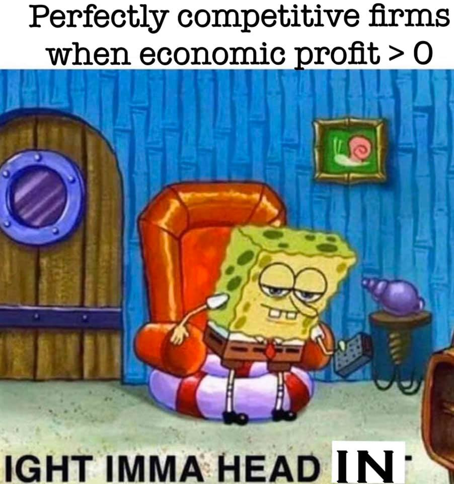

```{r setup, include=FALSE}
options(htmltools.dir.version = FALSE)
knitr::opts_chunk$set(echo=F,
                      message=F,
                      warning=F,
                      fig.retina = 3,
                      fig.align = "center")
library("tidyverse")
library("mosaic")
library("ggrepel")
library("fontawesome")
xaringanExtra::use_tile_view()
xaringanExtra::use_tachyons()
xaringanExtra::use_freezeframe()

update_geom_defaults("label", list(family = "Fira Sans Condensed"))
update_geom_defaults("text", list(family = "Fira Sans Condensed"))

set.seed(256)
```


class: title-slide

# 2.6 — Long Run Industry Equilibrium

## ECON 306 • Microeconomic Analysis • Spring 2023

### Ryan Safner<br> Associate Professor of Economics <br> <a href="mailto:safner@hood.edu"><i class="fa fa-paper-plane fa-fw"></i>safner@hood.edu</a> <br> <a href="https://github.com/ryansafner/microS23"><i class="fa fa-github fa-fw"></i>ryansafner/microS23</a><br> <a href="https://microS23.classes.ryansafner.com"> <i class="fa fa-globe fa-fw"></i>microS23.classes.ryansafner.com</a><br>

---

class: inverse

# Outline

### [Firm's *Long Run* Supply Decisions](#3)
### [Market Entry and Exit](#14)
### [Deriving the Industry Supply Curve](#20)
### [Economic Rents, Profits, & Competition](#29)
### [Supply Functions](#53)
### [Price Elasticity of Supply](#59)

---

class: inverse, center, middle

# Firm's *Long Run* Supply Decisions

---

# Firm Decisions in the Long Run I

.pull-left[

```{r, fig.retina=3}
mc<-function(x){2*x}
ac<-function(x){x+9/x}
avc<-function(x){x}


ggplot(data.frame(x=c(0,10)), aes(x=x))+
  stat_function(fun=mc, geom="line", size=2, color = "red")+
    geom_label(aes(x=9.5,y=mc(9.5)), color = "red", label="MC(q)", size = 4)+
  stat_function(fun=ac, geom="line", size=2, color = "orange")+
    geom_label(aes(x=9.5,y=ac(9.5)), color = "orange", label="AC(q)", size = 4)+
  stat_function(fun=avc, geom="line", size=2, color = "brown")+
    geom_label(aes(x=9.5,y=avc(9.5)), color = "brown", label="AVC(q)", size = 4)+
  # break even line
  geom_hline(yintercept=6, size=1, linetype="dashed")+
  geom_label(x=9,y=6, label="Break-even Price", size =5, color="orange")+
    scale_x_continuous(breaks=seq(0,10,1),
                     limits=c(0,10),
                     expand=expand_scale(mult=c(0,0.1)))+
  scale_y_continuous(breaks=seq(0,20,2),
                     labels=scales::dollar,
                     limits=c(0,20),
                     expand=expand_scale(mult=c(0,0.1)))+
  labs(x = "Output, q",
       y = "$/Unit")+
  theme_classic(base_family = "Fira Sans Condensed", base_size=20)

```

]

.pull-right[

- .orange[Minimum AC(q)]: market price of $6.00
  - Firms break even and earn .hi[“normal” economic profits] (of $0)

- At any market price **below** $6.00, firm earns **losses**
  - Short Run: firm shuts down only if $p<\color{brown}{AVC(q)}$

- At any market price **above** $6.00, firm earns .hi[“supernormal” profits] (>$0)

]

---

# Firm Supply Decisions in the Short Run vs. Long Run

.pull-left[
- .hi-purple[Short run]: firms that shut down $(q^*=0)$ are **stuck** in market, incur fixed costs $\pi=-f$
]


.pull-right[
.center[
]
]

---

# Firm Supply Decisions in the Short Run vs. Long Run

.pull-left[
- .hi-purple[Short run]: firms that shut down $(q^*=0)$ are **stuck** in market, incur fixed costs $\pi=-f$

- .hi-purple[Long run]: firms earning losses $(\pi < 0)$ can .hi[exit] the market and earn $\pi=0$
  - No more fixed costs, firms can sell/abandon $f$
]


.pull-right[
.center[

]
]

---

# Firm Supply Decisions in the Short Run vs. Long Run

.pull-left[
- .hi-purple[Short run]: firms that shut down $(q^*=0)$ are **stuck** in market, incur fixed costs $\pi=-f$

- .hi-purple[Long run]: firms earning losses $(\pi < 0)$ can .hi[exit] the market and earn $\pi=0$
  - No more fixed costs, firms can sell/abandon $f$

- Entrepreneurs not *currently* in market can .hi[enter] and produce, if entry would earn them $\pi>0$
]


.pull-right[
.center[


]
]

---

# Firm Supply Decisions in the Short Run vs. Long Run

.pull-left[
.center[

]

]

--

.pull-right[
.center[

]
]

---


# Firm's Long Run Supply: Visualizing

.pull-left[

```{r, fig.retina=3}
marginal<-function(x){3*x^2-8*x+8}
average<-function(x){x^2-4*x+8+10/x}
averagev<-function(x){x^2-4*x+8}
price1<-function(x){10}

ggplot(data.frame(x=c(0,10)), aes(x=x))+
  geom_rect(xmin=0, xmax=7, ymin=0, ymax=4, fill="red", alpha=0.3)+
  stat_function(fun=marginal, geom="line", size=2, color = "red")+
    geom_label(aes(x=3.25,y=marginal(3.5)), color = "red", label=expression(MC(q)), size = 3)+
  stat_function(fun=averagev, geom="line", size=2, color = "brown")+
    geom_label(aes(x=5,y=averagev(5)), color = "brown", label=expression(AVC(q)), size = 3)+
  stat_function(fun=average, geom="line", size=2, color = "orange")+
    geom_label(aes(x=5.5,y=average(5.5)), color = "orange", label=expression(AC(q)), size = 3)+
    scale_x_continuous(breaks=NULL,
                       limits=c(0,7),
                       expand=c(0,0))+
  scale_y_continuous(breaks=NULL,
                     limits=c(0,20),
                     expand=c(0,0))+
  #scale_colour_manual("Curves", values = line_colors, guide=F)+
  labs(x = "Output, q",
       y = "Per-Unit Costs ($)")+
  theme_classic(base_family = "Fira Sans Condensed", base_size=20)+
  
  geom_hline(yintercept=8, size=1, linetype="dashed")+
  geom_label(x=6,y=8, label="Break Even Price", size =5, color="orange")+
  geom_hline(yintercept=4, size=1, linetype="dashed")+
  geom_label(x=6,y=4, label="Shut Down Price", size =5, color="brown")+
  geom_segment(x=0,xend=0,y=0,yend=4, color="red", size=5)+
  geom_segment(x=0,xend=2,y=4,yend=4, color="red", size=3.5)+
  stat_function(fun=marginal, xlim=c(2,10), geom="line", size=3.5, color = "red")+
    geom_label(aes(x=3,y=marginal(3)), color = "red", label="SUPPLY", size = 5)
```
]

.pull-right[

.hi-red[When `\\(p<AVC\\)`]

- Profits are *negative*

- .hi-purple[Short run]: **shut down** production
  - Firm loses more $\pi$ by producing than by not producing

- .hi-purple[Long run]: firms in industry **exit** the industry
  - *No* new firms will *enter* this industry
]

---

# Firm's Long Run Supply: Visualizing

.pull-left[

```{r, fig.retina=3}
ggplot(data.frame(x=c(0,10)), aes(x=x))+
  geom_rect(xmin=0, xmax=7, ymin=0, ymax=4, fill="red", alpha=0.3)+
  geom_rect(xmin=0, xmax=7, ymin=4, ymax=8, fill="yellow", alpha=0.3)+
  stat_function(fun=marginal, geom="line", size=2, color = "red")+
    geom_label(aes(x=3.25,y=marginal(3.5)), color = "red", label=expression(MC(q)), size = 3)+
  stat_function(fun=averagev, geom="line", size=2, color = "brown")+
    geom_label(aes(x=5,y=averagev(5)), color = "brown", label=expression(AVC(q)), size = 3)+
  stat_function(fun=average, geom="line", size=2, color = "orange")+
    geom_label(aes(x=5.5,y=average(5.5)), color = "orange", label=expression(AC(q)), size = 3)+
    scale_x_continuous(breaks=NULL,
                       limits=c(0,7),
                       expand=c(0,0))+
  scale_y_continuous(breaks=NULL,
                     limits=c(0,20),
                     expand=c(0,0))+
  #scale_colour_manual("Curves", values = line_colors, guide=F)+
  labs(x = "Output, q",
       y = "Per-Unit Costs ($)")+
  theme_classic(base_family = "Fira Sans Condensed", base_size=20)+
  
  geom_hline(yintercept=8, size=1, linetype="dashed")+
  geom_label(x=6,y=8, label="Break Even Price", size =5, color="orange")+
  geom_hline(yintercept=4, size=1, linetype="dashed")+
  geom_label(x=6,y=4, label="Shut Down Price", size =5, color="brown")+
  geom_segment(x=0,xend=0,y=0,yend=4, color="red", size=5)+
  geom_segment(x=0,xend=2,y=4,yend=4, color="red", size=3.5)+
  stat_function(fun=marginal, xlim=c(2,10), geom="line", size=3.5, color = "red")+
    geom_label(aes(x=3,y=marginal(3)), color = "red", label="SUPPLY", size = 5)
```
]

.pull-right[

.hi-yellow[When `\\(AVC<p<AC\\)`]

- Profits are *negative*

- .hi-purple[Short run]: **continue** production
  - Firm loses *less* $\pi$ by producing than by *not* producing

- .hi-purple[Long run]: firms in industry **exit** the industry
  - *No* new firms will *enter* this industry
]

---

# Firm's Long Run Supply: Visualizing

.pull-left[

```{r, fig.retina=3}
ggplot(data.frame(x=c(0,10)), aes(x=x))+
  geom_rect(xmin=0, xmax=7, ymin=0, ymax=4, fill="red", alpha=0.3)+
  geom_rect(xmin=0, xmax=7, ymin=4, ymax=8, fill="yellow", alpha=0.3)+
  geom_rect(xmin=0, xmax=7, ymin=8, ymax=20, fill="green", alpha=0.3)+
  stat_function(fun=marginal, geom="line", size=2, color = "red")+
    geom_label(aes(x=3.25,y=marginal(3.5)), color = "red", label=expression(MC(q)), size = 3)+
  stat_function(fun=averagev, geom="line", size=2, color = "brown")+
    geom_label(aes(x=5,y=averagev(5)), color = "brown", label=expression(AVC(q)), size = 3)+
  stat_function(fun=average, geom="line", size=2, color = "orange")+
    geom_label(aes(x=5.5,y=average(5.5)), color = "orange", label=expression(AC(q)), size = 3)+
    scale_x_continuous(breaks=NULL,
                       limits=c(0,7),
                       expand=c(0,0))+
  scale_y_continuous(breaks=NULL,
                     limits=c(0,20),
                     expand=c(0,0))+
  #scale_colour_manual("Curves", values = line_colors, guide=F)+
  labs(x = "Output, q",
       y = "Per-Unit Costs ($)")+
  theme_classic(base_family = "Fira Sans Condensed", base_size=20)+
  
  geom_hline(yintercept=8, size=1, linetype="dashed")+
  geom_label(x=6,y=8, label="Break Even Price", size =5, color="orange")+
  geom_hline(yintercept=4, size=1, linetype="dashed")+
  geom_label(x=6,y=4, label="Shut Down Price", size =5, color="brown")+
  geom_segment(x=0,xend=0,y=0,yend=4, color="red", size=5)+
  geom_segment(x=0,xend=2,y=4,yend=4, color="red", size=3.5)+
  stat_function(fun=marginal, xlim=c(2,10), geom="line", size=3.5, color = "red")+
    geom_label(aes(x=3,y=marginal(3)), color = "red", label="SUPPLY", size = 5)
```
]

.pull-right[

.hi-green[When `\\(AC<p\\)`]

- Profits are *positive*

- .hi-purple[Short run]: **continue** production
  - Firm earning profits

- .hi-purple[Long run]: firms in industry **stay** in industry
  - **New** firms will **enter** this industry
]

---

# Production Rules, Updated:

.pull-left[
.smaller[
**1. Choose $q^*$ such that $MR(q)=MC(q)$**

**2. Profit $\pi=q[p-AC(q)]$**

**3. Shut down in _short run_ if $p<AVC(q)$**

.slate[**4. Exit in _long run_ if `\\(p<AC(q)\\)`**]

]
]

.pull-right[
.center[

]
]

---

class: inverse, center, middle

# Market Entry and Exit

---

# Exit, Entry, and Long Run Industry Equilibrium I

.pull-left[

- Now we must combine .hi-purple[optimizing] *individual* firms with *market-wide* adjustment to .hi-purple[equilibrium]

- Since $\pi = [p-AC(q)]q$, in the **long run**, profit-seeking firms will:
]

.pull-right[
]

---

# Exit, Entry, and Long Run Industry Equilibrium I

.pull-left[

- Now we must combine .hi-purple[optimizing] *individual* firms with *market-wide* adjustment to .hi-purple[equilibrium]

- Since $\pi = [p-AC(q)]q$, in the **long run**, profit-seeking firms will:
  - .hi-purple[Enter] markets where $p>AC(q)$
]

.pull-right[
.center[

]
]

---

# Exit, Entry, and Long Run Industry Equilibrium I

.pull-left[

- Now we must combine .hi-purple[optimizing] *individual* firms with *market-wide* adjustment to .hi-purple[equilibrium]

- Since $\pi = [p-AC(q)]q$, in the **long run**, profit-seeking firms will:
  - .hi-purple[Enter] markets where $p>AC(q)$
  - .hi-purple[Exit] markets where $p<AC(q)$
]

.pull-right[
.center[


]
]

---

# Exit, Entry, and Long Run Industry Equilibrium II

.pull-left[

- .hi-purple[Long-run equilibrium]: entry and exit ceases when .hi-purple[`\\(p=AC(q)\\)`] for all firms, implying .hi-purple[normal economic profits] of .hi-purple[`\\(\pi=0\\)`]

]

.pull-right[
.center[

]
]

---

# Exit, Entry, and Long Run Industry Equilibrium II

.pull-left[

- .hi-purple[Long-run equilibrium]: entry and exit ceases when .hi-purple[`\\(p=AC(q)\\)`] for all firms, implying .hi-purple[normal economic profits] of .hi-purple[`\\(\pi=0\\)`]

- More generally, .hi[no marginal firm can profitably enter] the industry

- .hi-turquoise[Long run economic profits for all firms in a _competitive_ industry are 0]

- Firms must earn an *accounting* profit to stay in business

]

.pull-right[
.center[


]
]

---

class: inverse, center, middle

# Deriving the Industry Supply Curve

---

# The Industry Supply Curve

- .hi[Industry supply curve]: horizontal sum of all individual firms' supply curves
  - recall: $(MC(q)$ curve above $AVC_{min})$ (shut down price)

- To keep it simple on the following slides:
  - assume no fixed costs, so $AC(q)=AVC(q)$
  - then industry supply curve is sum of individual $MC(q)$ curves above $AC(q)_{min}$

---

# Industry Supply Curves (Identical Firms)

.tri-left[

```{r, fig.retina=3, fig.height=4.5}
mc<-function(x){2*x}
ac<-function(x){x+9/x}
avc<-function(x){x}


industry_1<-ggplot(data.frame(x=c(0,10)), aes(x=x))+
  stat_function(fun=mc, geom="line", size=2, color = "red")+
    geom_label(aes(x=9.5,y=mc(9.5)), color = "red", label="MC(q)", size = 4)+
  stat_function(fun=ac, geom="line", size=2, color = "orange")+
    geom_label(aes(x=9.5,y=ac(9.5)), color = "orange", label="AC(q)", size = 4)+
  # break even line
  geom_hline(yintercept=6, size=1, linetype="dashed")+
  geom_label(x=9,y=6, label="Break-even Price", size =5, color="orange")+
    scale_x_continuous(breaks=seq(0,10,1),
                     limits=c(0,10),
                     expand=expand_scale(mult=c(0,0.1)))+
  scale_y_continuous(breaks=seq(0,20,2),
                     labels=scales::dollar,
                     limits=c(0,20),
                     expand=expand_scale(mult=c(0,0.1)))+
  labs(x = "Output, q",
       y = "$/Unit")+
  theme_classic(base_family = "Fira Sans Condensed", base_size=20)
industry_1+labs(title="Firm 1")
```
]

.tri-middle[
```{r, fig.retina=3, fig.height=4.5}
industry_1+labs(title="Firm 2")
```
]

.tri-right[
```{r, fig.retina=3, fig.height=4.5}
market_demand<-function(x){20-x}
market_supply<-function(x){x}

industry_tot<-ggplot(data.frame(x=c(0,10)), aes(x=x))+
  stat_function(fun=market_supply, xlim=c(6,20), geom="line", size=3, color = "red")+
  geom_segment(x=0,xend=0,y=0,yend=6, color="red", size=5)+
  geom_segment(x=0,xend=6,y=6,yend=6, color="red", size=3.5)+
  geom_label(aes(x=18,y=market_supply(18)), color = "red", label="Industry Supply", size = 4)+
      scale_x_continuous(breaks=seq(0,20,2),
                     limits=c(0,20),
                     expand=expand_scale(mult=c(0,0.1)))+
  scale_y_continuous(breaks=seq(0,20,2),
                     labels=scales::dollar,
                     limits=c(0,20),
                     expand=expand_scale(mult=c(0,0.1)))+
  labs(x = "Output, q",
       y = "$/Unit",
       title = "Industry")+
  theme_classic(base_family = "Fira Sans Condensed", base_size=20)
industry_tot
```

]

<br>
<br>
<br>
<br>
<br>
<br>
<br>
<br>

--

.smallest[
- .red[Industry supply curve] is the horizontal sum of all individual firm's supply curves
  - Which are each firm's marginal cost curve above its breakeven price
]

---

# Industry Supply Curves (Identical Firms)

.tri-left[

```{r, fig.retina=3, fig.height=4.5}
industry_1+
  geom_hline(yintercept=10, size=2, color="blue")+
  geom_label(x=9,y=10,label = "MR(q)", color="blue", size =4)+
  labs(title="Firm 1")
```
]

.tri-middle[
```{r, fig.retina=3, fig.height=4.5}
industry_1+
  geom_hline(yintercept=10, size=2, color="blue")+
  geom_label(x=9,y=10,label = "MR(q)", color="blue", size =4)+
  labs(title="Firm 2")
```
]

.tri-right[
```{r, fig.retina=3, fig.height=4.5}
industry_tot+
  stat_function(fun=market_demand, geom="line", size=3, color = "blue")+
    geom_label(aes(x=18,y=market_demand(18)), color = "blue", label="Industry Demand", size = 4)+
  geom_segment(x=10,xend=10,y=0,yend=10, size=1, linetype="dashed")+
  geom_segment(x=0,xend=10,y=10,yend=10, size=1, linetype="dashed")
```

]

<br>
<br>
<br>
<br>
<br>
<br>
<br>
<br>

.smallest[
- .blue[Industry demand curve] (where equal to supply) sets market price, demand for firms
]

---

# Industry Supply Curves (Identical Firms)

.tri-left[

```{r, fig.retina=3, fig.height=4.5}
industry_1+
  geom_hline(yintercept=10, size=2, color="blue")+
  geom_label(x=9,y=10,label = "MR(q)", color="blue", size =4)+
  geom_segment(x=5,xend=5,y=0,yend=10, size=1, linetype="dashed")+
  geom_segment(x=0,xend=5,y=7.30,yend=7.30, size=1, linetype="dashed")+
  geom_rect(xmin=0,xmax=5,ymin=7.3,ymax=10, fill="green", alpha=0.25)+
  labs(title="Firm 1")
```
]

.tri-middle[
```{r, fig.retina=3, fig.height=4.5}
industry_1+
  geom_hline(yintercept=10, size=2, color="blue")+
  geom_hline(yintercept=10, size=2, color="blue")+
  geom_label(x=9,y=10,label = "MR(q)", color="blue", size =4)+
  geom_segment(x=5,xend=5,y=0,yend=10, size=1, linetype="dashed")+
  geom_segment(x=0,xend=5,y=7.30,yend=7.30, size=1, linetype="dashed")+
  geom_rect(xmin=0,xmax=5,ymin=7.3,ymax=10, fill="green", alpha=0.25)+
  labs(title="Firm 2")
```
]

.tri-right[
```{r, fig.retina=3, fig.height=4.5}
industry_tot+
  stat_function(fun=market_demand, geom="line", size=3, color = "blue")+
    geom_label(aes(x=18,y=market_demand(18)), color = "blue", label="Industry Demand", size = 4)+
  geom_segment(x=10,xend=10,y=0,yend=10, size=1, linetype="dashed")+
  geom_segment(x=0,xend=10,y=10,yend=10, size=1, linetype="dashed")
```

]

<br>
<br>
<br>
<br>
<br>
<br>
<br>
<br>

.smallest[

- **Short Run**: each firm is earning .hi-green[profits] $p>AC(q)$

]
---

# Industry Supply Curves (Identical Firms)

.tri-left[

```{r, fig.retina=3, fig.height=4.5}
industry_1+
  geom_hline(yintercept=10, size=2, color="blue")+
  geom_label(x=9,y=10,label = "MR(q)", color="blue", size =4)+
  geom_segment(x=5,xend=5,y=0,yend=10, size=1, linetype="dashed")+
  geom_segment(x=0,xend=5,y=7.30,yend=7.30, size=1, linetype="dashed")+
  geom_rect(xmin=0,xmax=5,ymin=7.3,ymax=10, fill="green", alpha=0.25)+
  labs(title="Firm 1")
```
]

.tri-middle[
```{r, fig.retina=3, fig.height=4.5}
industry_1+
  geom_hline(yintercept=10, size=2, color="blue")+
  geom_hline(yintercept=10, size=2, color="blue")+
  geom_label(x=9,y=10,label = "MR(q)", color="blue", size =4)+
  geom_segment(x=5,xend=5,y=0,yend=10, size=1, linetype="dashed")+
  geom_segment(x=0,xend=5,y=7.30,yend=7.30, size=1, linetype="dashed")+
  geom_rect(xmin=0,xmax=5,ymin=7.3,ymax=10, fill="green", alpha=0.25)+
  labs(title="Firm 2")
```
]

.tri-right[
```{r, fig.retina=3, fig.height=4.5}
industry_tot+
  stat_function(fun=market_demand, geom="line", size=3, color = "blue")+
    geom_label(aes(x=18,y=market_demand(18)), color = "blue", label="Industry Demand", size = 4)+
  geom_segment(x=10,xend=10,y=0,yend=10, size=1, linetype="dashed")+
  geom_segment(x=0,xend=10,y=10,yend=10, size=1, linetype="dashed")
```

]

<br>
<br>
<br>
<br>
<br>
<br>
<br>
<br>

.smallest[

- **Short Run**: each firm is earning .hi-green[profits] $p>AC(q)$

- **Long run**: induces entry by firm 3, firm 4, $\cdots$, firm $n$
]
--
.smallest[
- .hi[Long run industry equilibrium]:
]

---

# Industry Supply Curves (Identical Firms)

.tri-left[

```{r, fig.retina=3, fig.height=4.5}
industry_1+
  geom_hline(yintercept=6, size=2, color="blue")+
  geom_label(x=9,y=6,label = "MR(q)", color="blue", size =4)+
  geom_segment(x=3,xend=3,y=0,yend=6, size=1, linetype="dashed")+
  labs(title="Firm 1")
```
]

.tri-middle[
```{r, fig.retina=3, fig.height=4.5}
industry_1+
  geom_hline(yintercept=6, size=2, color="blue")+
  geom_label(x=9,y=6,label = "MR(q)", color="blue", size =4)+
  geom_segment(x=3,xend=3,y=0,yend=6, size=1, linetype="dashed")+
  labs(title="Firm 2")
```
]

.tri-right[
```{r, fig.retina=3, fig.height=4.5}
market_supply_2<-function(x){0.5*x-1}

ggplot(data.frame(x=c(0,10)), aes(x=x))+
  stat_function(fun=market_supply_2, xlim=c(14,20), geom="line", size=3, color = "red")+
  geom_segment(x=0,xend=0,y=0,yend=6, color="red", size=5)+
  geom_segment(x=0,xend=14,y=6,yend=6, color="red", size=3.5)+
  geom_label(aes(x=18,y=market_supply_2(18)), color = "red", label="Industry Supply", size = 4)+
      scale_x_continuous(breaks=seq(0,20,2),
                     limits=c(0,20),
                     expand=expand_scale(mult=c(0,0.1)))+
  scale_y_continuous(breaks=seq(0,20,2),
                     labels=scales::dollar,
                     limits=c(0,20),
                     expand=expand_scale(mult=c(0,0.1)))+
  labs(x = "Output, q",
       y = "$/Unit",
       title = "Industry")+
  theme_classic(base_family = "Fira Sans Condensed", base_size=20)+
  stat_function(fun=market_demand, geom="line", size=3, color = "blue")+
    geom_label(aes(x=18,y=market_demand(18)), color = "blue", label="Industry Demand", size = 4)+
  geom_segment(x=14,xend=14,y=0,yend=6, size=1, linetype="dashed")
```

]

<br>
<br>
<br>
<br>
<br>
<br>
<br>
<br>

.smallest[
- **Short Run**: each firm is earning .hi-green[profits] $p>AC(q)$

- **Long run**: induces entry by firm 3, firm 4, $\cdots$, firm $n$

- .hi[Long run industry equilibrium]: $p=AC(q)_{min}$, $\pi=0$ at $p=$ $6; supply becomes more **elastic**
]
---

class: inverse, center, middle

# Economic Rents, Profits, & Competition

---

# Back to Zero Economic Profits

.pull-left[
- Recall, we’ve essentially defined a .hi-purple[firm] as a mere .hi[replicable recipe] (.hi[production function]) of transforming resources

$$q=f(L,K)$$

- **“Any idiot”** can enter market, buy required $(L,K)$ at prices $(w,r)$, produce $q^*$ at market price $p$ and earn the market rate of $\pi$

]

.pull-right[
.center[

]
]

---

# Back to Zero Economic Profits

.pull-left[

- Zero long run economic profit $\neq$ industry *disappears*, just **stops growing**

- Less attractive to entrepreneurs & start ups to enter than other, more profitable industries

- These are **mature** industries (again, often commodities), the backbone of the economy, just not *sexy*!

]

.pull-right[
.center[

]
]

---

# Back to Zero Economic Profits

.pull-left[

$$p=MC$$

- All factors are paid their market price
  - i.e. their .hi-purple[opportunity cost] — what they could earn *elsewhere* in economy

$$p=AC$$

- Firms earn .hi-purple[normal market rate of return]
  - No *excess* rewards (economic profits) to attract *new* resources into the industry, nor *losses* to push resources out of industry
  
]

.pull-right[
.center[

$$p=MC=AC$$
]
]

---

# Back to Zero Economic Profits

.pull-left[

- But we’ve so far been imagining a market where every firm is **identical**, just a recipe “any idiot” can copy

- What about if firms have **different** technologies or costs?
  
]

.pull-right[
.center[

]
]

---

# Industry Supply Curves (*Different* Firms) I

.pull-left[
.smaller[
- Firms have **.ul[different] technologies/costs** due to relative differences in:
  - Managerial talent
  - Worker talent
  - Location
  - First-mover advantage
  - Technological secrets/IP
  - License/permit access
  - Political connections
  - Lobbying

- Let's derive .hi-red[industry supply curve] again, and see how this may affect profits
]
]

.pull-right[
.center[

]
]

---

# Industry Supply Curves (*Different* Firms) II

.tri-left[

```{r, fig.retina=3, fig.height=4.5}
industry_1+labs(title="Firm 1 (Lower Cost)")
```
]

.tri-middle[
```{r, fig.retina=3, fig.height=4.5}
mc_worse<-function(x){2*x+4}
ac_worse<-function(x){x+9/x+4}

ggplot(data.frame(x=c(0,10)), aes(x=x))+
  stat_function(fun=mc_worse, geom="line", size=2, color = "red")+
    geom_label(aes(x=9.5,y=mc_worse(9.5)), color = "red", label="MC(q)", size = 4)+
  stat_function(fun=ac_worse, geom="line", size=2, color = "orange")+
    geom_label(aes(x=9.5,y=ac_worse(9.5)), color = "orange", label="AC(q)", size = 4)+
  # break even line
  geom_hline(yintercept=10, size=1, linetype="dashed")+
  geom_label(x=9,y=10, label="Break-even Price", size =5, color="orange")+
    scale_x_continuous(breaks=seq(0,10,1),
                     limits=c(0,10),
                     expand=expand_scale(mult=c(0,0.1)))+
  scale_y_continuous(breaks=seq(0,20,2),
                     labels=scales::dollar,
                     limits=c(0,20),
                     expand=expand_scale(mult=c(0,0.1)))+
  labs(x = "Output, q",
       y = "$/Unit",
       title = "Firm 2 (Higher Cost)")+
  theme_classic(base_family = "Fira Sans Condensed", base_size=20)
```
]

.tri-right[
```{r, fig.retina=3, fig.height=4.5}
market_demand_rents<-function(x){16-0.8*x}

market_supply_rents_points<-tribble(
  ~x, ~y,
  0,6,
  3,6,
  4,8,
  8,10,
  10,12,
  12,14,
  14,16,
  16,18,
  18,20
)

ggplot(data.frame(x=c(0,10)), aes(x=x))+
  geom_path(data=market_supply_rents_points, aes(x=x,y=y), size=3, color = "red")+
  geom_segment(x=0,xend=0,y=0,yend=6, color="red", size=5)+
  geom_label(x=16,y=18, color = "red", label="Industry Supply", size = 4)+
      scale_x_continuous(breaks=seq(0,20,2),
                     limits=c(0,20),
                     expand=expand_scale(mult=c(0,0.1)))+
  scale_y_continuous(breaks=seq(0,20,2),
                     labels=scales::dollar,
                     limits=c(0,20),
                     expand=expand_scale(mult=c(0,0.1)))+
  labs(x = "Output, q",
       y = "$/Unit",
       title = "Industry")+
  theme_classic(base_family = "Fira Sans Condensed", base_size=20)
```

]

<br>
<br>
<br>
<br>
<br>
<br>
<br>
<br>

--

- .red[Industry supply curve] is the horizontal sum of all individual firm's supply curves
  - Which are each firm's marginal cost curve above its breakeven price

---

# Industry Supply Curves (*Different* Firms) II

.tri-left[

```{r, fig.retina=3, fig.height=4.5}
industry_1+
  geom_hline(yintercept=10, size=2, color="blue")+
  geom_hline(yintercept=10, size=2, color="blue")+
  geom_label(x=9,y=10,label = "MR(q)", color="blue", size =4)+
  geom_segment(x=5,xend=5,y=0,yend=10, size=1, linetype="dashed")+
  geom_segment(x=0,xend=5,y=7.30,yend=7.30, size=1, linetype="dashed")+
  geom_rect(xmin=0,xmax=5,ymin=7.3,ymax=10, fill="green", alpha=0.25)+
  labs(title="Firm 1 (Lower Cost)")
```
]

.tri-middle[
```{r, fig.retina=3, fig.height=4.5}
mc_worse<-function(x){2*x+4}
ac_worse<-function(x){x+9/x+4}

ggplot(data.frame(x=c(0,10)), aes(x=x))+
  stat_function(fun=mc_worse, geom="line", size=2, color = "red")+
    geom_label(aes(x=9.5,y=mc_worse(9.5)), color = "red", label="MC(q)", size = 4)+
  stat_function(fun=ac_worse, geom="line", size=2, color = "orange")+
    geom_label(aes(x=9.5,y=ac_worse(9.5)), color = "orange", label="AC(q)", size = 4)+
  # break even line
  geom_hline(yintercept=10, size=1, linetype="dashed")+
  geom_label(x=9,y=10, label="Break-even Price", size =5, color="orange")+
  
geom_hline(yintercept=10, size=2, color="blue")+
  geom_hline(yintercept=10, size=2, color="blue")+
  geom_label(x=9,y=10,label = "MR(q)", color="blue", size =4)+
  geom_segment(x=3,xend=3,y=0,yend=10, size=1, linetype="dashed")+
 scale_x_continuous(breaks=seq(0,10,1),
                     limits=c(0,10),
                     expand=expand_scale(mult=c(0,0.1)))+
  scale_y_continuous(breaks=seq(0,20,2),
                     labels=scales::dollar,
                     limits=c(0,20),
                     expand=expand_scale(mult=c(0,0.1)))+
  labs(x = "Output, q",
       y = "$/Unit",
       title = "Firm 2 (Higher Cost)")+
  theme_classic(base_family = "Fira Sans Condensed", base_size=20)
```
]

.tri-right[
```{r, fig.retina=3, fig.height=4.5}
ggplot(data.frame(x=c(0,10)), aes(x=x))+
  geom_path(data=market_supply_rents_points, aes(x=x,y=y), size=3, color = "red")+
  geom_segment(x=0,xend=0,y=0,yend=6, color="red", size=5)+
  geom_label(x=16,y=18, color = "red", label="Industry Supply", size = 4)+
  stat_function(fun=market_demand_rents, geom="line", size=3, color = "blue")+
    geom_label(aes(x=18,y=market_demand_rents(18)), color = "blue", label="Industry Demand", size = 4)+
  geom_segment(x=8,xend=8,y=0,yend=10, size=1, linetype="dashed")+
  geom_segment(x=0,xend=8,y=10,yend=10, size=1, linetype="dashed")+
      scale_x_continuous(breaks=seq(0,20,2),
                     limits=c(0,20),
                     expand=expand_scale(mult=c(0,0.1)))+
  scale_y_continuous(breaks=seq(0,20,2),
                     labels=scales::dollar,
                     limits=c(0,20),
                     expand=expand_scale(mult=c(0,0.1)))+
  labs(x = "Output, q",
       y = "$/Unit",
       title = "Industry")+
  theme_classic(base_family = "Fira Sans Condensed", base_size=20)
```

]

<br>
<br>
<br>
<br>
<br>
<br>
<br>
<br>

--

.smallest[
- .blue[Industry demand curve] (where equal to supply) sets market price, demand for firms
]
--

.smallest[
- .hi[Long run industry equilibrium]: $p=AC(q)_{min}$, $\pi=0$ for .hi-purple[marginal (highest cost) firm] (Firm 2)
]

--

.smallest[
- Firm 1 (lower cost) appears to be earning .hi-green[profits]...(we’ll come back to this)
]

---

# Economic Rents and Zero Economic Profits I

.pull-left[
.center[

]
]

.pull-right[
- .hi-purple[**Long-run equilibrium** `\\(p=AC(q)_{min}\\)` of the _marginal (higher-cost)_ firm]

- .hi-purple[A marginal firm cannot profitably enter]
  - Otherwise, if $p>AC(q)$ for that firm, would induce *more* entry into industry!

]

---

# Economic Rents and Zero Economic Profits I

.pull-left[
.center[

]
]

.pull-right[
- .hi-purple[“Inframarginal” (lower-cost)] firms are using resources that earn .hi[economic rents]
  - returns **higher** than their opportunity cost (what is needed to bring them into *this* industry)

- Economic rents arise from **relative differences** between resources

]

---

# Economic Rent

.pull-left[
.center[

]
]

.pull-right[
- .hi[Economic rent]: a return or payment for a resource above its normal market return (opportunity cost)

- Has no allocative effect on resources, entirely “inframarginal”

- A windfall return that resource owners get for free

]

---

# Sources of Economic Rents 

.pull-left[
.center[

]
]

.pull-right[
- .hi-purple[Some factors are relatively scarce _in the whole economy_]
  - (talent, location, secrets, IP, licenses, being first, political favoritism)

]

---

# Firms Using Resources with Economic Rents 

.pull-left[
.center[

]
]

.pull-right[
- **Inframarginal** firms that employ these scarce factors gain a .hi-green[short-run profits] from having lower costs/higher productivity

- ...But what will happen to the prices for their scarce factors over time? 

]

---

# Economic Rents Examples

.pull-left[
.center[

]
]

.pull-right[
.center[

]
]

---

# Economic Rents and Zero Economic Profits

.pull-left[
.center[

]
]

.pull-right[
.smallest[
- In a competitive market, over the long run, **profits are dissipated through competition**
  - Rival firms willing to pay for the scarce factor to gain an advantage

- Competition over acquiring the scarce factors **pushes up their prices**
  - i.e. higher costs to firms of using the factor!

- .hi-purple[Rents are included in the opportunity cost (price) for inputs over long run]
  - Must pay a factor enough to keep it *out of other uses*
]

]

---

# Economic Rents and Zero Economic Profits

.pull-left[
.center[

]
]

.pull-right[

- From the firm’s perspective, over the long-run, .hi-purple[rents are included in the price (opportunity cost) of the scarce factor]
  - Must pay a factor enough to keep it out of other uses

- Firm .ul[does not earn the rents], it raises firm’s costs and squeezes profits to zero!

]

---

# Economic Rents Reduce Firms’ Profits Over Long Run

.tri-left[

```{r, fig.retina=3, fig.height=4.5}
industry_1+
  geom_hline(yintercept=10, size=2, color="blue")+
  geom_hline(yintercept=10, size=2, color="blue")+
  geom_label(x=9,y=10,label = "MR(q)", color="blue", size =4)+
  geom_segment(x=5,xend=5,y=0,yend=10, size=1, linetype="dashed")+
  geom_segment(x=0,xend=5,y=7.30,yend=7.30, size=1, linetype="dashed")+
  geom_rect(xmin=0,xmax=5,ymin=7.3,ymax=10, fill="green", alpha=0.25)+
  labs(title="Firm 1 (Lower Cost)")
```
]

.tri-middle[
```{r, fig.retina=3, fig.height=4.5}
mc_worse<-function(x){2*x+4}
ac_worse<-function(x){x+9/x+4}

ggplot(data.frame(x=c(0,10)), aes(x=x))+
  stat_function(fun=mc_worse, geom="line", size=2, color = "red")+
    geom_label(aes(x=9.5,y=mc_worse(9.5)), color = "red", label="MC(q)", size = 4)+
  stat_function(fun=ac_worse, geom="line", size=2, color = "orange")+
    geom_label(aes(x=9.5,y=ac_worse(9.5)), color = "orange", label="AC(q)", size = 4)+
  # break even line
  geom_hline(yintercept=10, size=1, linetype="dashed")+
  geom_label(x=9,y=10, label="Break-even Price", size =5, color="orange")+
  
geom_hline(yintercept=10, size=2, color="blue")+
  geom_hline(yintercept=10, size=2, color="blue")+
  geom_label(x=9,y=10,label = "MR(q)", color="blue", size =4)+
  geom_segment(x=3,xend=3,y=0,yend=10, size=1, linetype="dashed")+
 scale_x_continuous(breaks=seq(0,10,1),
                     limits=c(0,10),
                     expand=expand_scale(mult=c(0,0.1)))+
  scale_y_continuous(breaks=seq(0,20,2),
                     labels=scales::dollar,
                     limits=c(0,20),
                     expand=expand_scale(mult=c(0,0.1)))+
  labs(x = "Output, q",
       y = "$/Unit",
       title = "Firm 2 (Higher Cost)")+
  theme_classic(base_family = "Fira Sans Condensed", base_size=20)
```
]

.tri-right[
```{r, fig.retina=3, fig.height=4.5}
ggplot(data.frame(x=c(0,10)), aes(x=x))+
  geom_path(data=market_supply_rents_points, aes(x=x,y=y), size=3, color = "red")+
  geom_segment(x=0,xend=0,y=0,yend=6, color="red", size=5)+
  geom_label(x=16,y=18, color = "red", label="Industry Supply", size = 4)+
  stat_function(fun=market_demand_rents, geom="line", size=3, color = "blue")+
    geom_label(aes(x=18,y=market_demand_rents(18)), color = "blue", label="Industry Demand", size = 4)+
  geom_segment(x=8,xend=8,y=0,yend=10, size=1, linetype="dashed")+
  geom_segment(x=0,xend=8,y=10,yend=10, size=1, linetype="dashed")+
      scale_x_continuous(breaks=seq(0,20,2),
                     limits=c(0,20),
                     expand=expand_scale(mult=c(0,0.1)))+
  scale_y_continuous(breaks=seq(0,20,2),
                     labels=scales::dollar,
                     limits=c(0,20),
                     expand=expand_scale(mult=c(0,0.1)))+
  labs(x = "Output, q",
       y = "$/Unit",
       title = "Industry")+
  theme_classic(base_family = "Fira Sans Condensed", base_size=20)
```

]

<br>
<br>
<br>
<br>
<br>
<br>
<br>
<br>

.smallest[

- **Short Run**: firm that possesses scarce rent-generating factors has lower costs, perhaps .green[short-run profits]
]

---

# Economic Rents Reduce Firms’ Profits Over Long Run

.tri-left[

```{r, fig.retina=3, fig.height=4.5}
ac_worse_2<-function(x){x+6/(x-2.5)+2.75}

ggplot(data.frame(x=c(0,10)), aes(x=x))+
  stat_function(fun=mc, geom="line", size=2, color = "red")+
    geom_label(aes(x=9.5,y=mc(9.5)), color = "red", label="MC(q)", size = 4)+
  stat_function(fun=ac_worse_2, geom="line", size=2, color = "orange")+
    geom_label(aes(x=9.5,y=ac_worse_2(9.5)), color = "orange", label="AC(q)", size = 4)+
  # break even line
  geom_hline(yintercept=10, size=1, linetype="dashed")+
  geom_label(x=9,y=10, label="Break-even Price", size =5, color="orange")+
  
geom_hline(yintercept=10, size=2, color="blue")+
  geom_hline(yintercept=10, size=2, color="blue")+
  geom_label(x=9,y=10,label = "MR(q)", color="blue", size =4)+
  geom_segment(x=5,xend=5,y=0,yend=10, size=1, linetype="dashed")+
 scale_x_continuous(breaks=seq(0,10,1),
                     limits=c(0,10),
                     expand=expand_scale(mult=c(0,0.1)))+
  scale_y_continuous(breaks=seq(0,20,2),
                     labels=scales::dollar,
                     limits=c(0,20),
                     expand=expand_scale(mult=c(0,0.1)))+
  labs(x = "Output, q",
       y = "$/Unit",
       title = "Firm 1 (No Longer Lower Cost)")+
  theme_classic(base_family = "Fira Sans Condensed", base_size=20)
```
]

.tri-middle[
```{r, fig.retina=3, fig.height=4.5}
ggplot(data.frame(x=c(0,10)), aes(x=x))+
  stat_function(fun=mc_worse, geom="line", size=2, color = "red")+
    geom_label(aes(x=9.5,y=mc_worse(9.5)), color = "red", label="MC(q)", size = 4)+
  stat_function(fun=ac_worse, geom="line", size=2, color = "orange")+
    geom_label(aes(x=9.5,y=ac_worse(9.5)), color = "orange", label="AC(q)", size = 4)+
  # break even line
  geom_hline(yintercept=10, size=1, linetype="dashed")+
  geom_label(x=9,y=10, label="Break-even Price", size =5, color="orange")+
  
geom_hline(yintercept=10, size=2, color="blue")+
  geom_hline(yintercept=10, size=2, color="blue")+
  geom_label(x=9,y=10,label = "MR(q)", color="blue", size =4)+
  geom_segment(x=3,xend=3,y=0,yend=10, size=1, linetype="dashed")+
 scale_x_continuous(breaks=seq(0,10,1),
                     limits=c(0,10),
                     expand=expand_scale(mult=c(0,0.1)))+
  scale_y_continuous(breaks=seq(0,20,2),
                     labels=scales::dollar,
                     limits=c(0,20),
                     expand=expand_scale(mult=c(0,0.1)))+
  labs(x = "Output, q",
       y = "$/Unit",
       title = "Firm 2 (Higher Cost)")+
  theme_classic(base_family = "Fira Sans Condensed", base_size=20)
```
]

.tri-right[
```{r, fig.retina=3, fig.height=4.5}
market_supply_rents_GONE_points <- tribble(
  ~x, ~y,
  0, 10,
  8, 10,
  10, 12,
  12, 14,
  14, 16,
  16, 18,
  18, 20
)

ggplot(data.frame(x=c(0,10)), aes(x=x))+
  geom_path(data=market_supply_rents_GONE_points, aes(x=x,y=y), size=3, color = "red")+
  geom_segment(x=0,xend=0,y=0,yend=10, color="red", size=5)+
  geom_label(x=14,y=18, color = "red", label="Industry Supply", size = 4)+
  stat_function(fun=market_demand_rents, geom="line", size=3, color = "blue")+
    geom_label(aes(x=18,y=market_demand_rents(18)), color = "blue", label="Industry Demand", size = 4)+
  geom_segment(x=8,xend=8,y=0,yend=10, size=1, linetype="dashed")+
      scale_x_continuous(breaks=seq(0,20,2),
                     limits=c(0,20),
                     expand=expand_scale(mult=c(0,0.1)))+
  scale_y_continuous(breaks=seq(0,20,2),
                     labels=scales::dollar,
                     limits=c(0,20),
                     expand=expand_scale(mult=c(0,0.1)))+
  labs(x = "Output, q",
       y = "$/Unit",
       title = "Industry")+
  theme_classic(base_family = "Fira Sans Condensed", base_size=20)
```

]

<br>
<br>
<br>
<br>
<br>
<br>
<br>
<br>

.smallest[
- **Short Run**: firm that possesses scarce rent-generating factors has lower costs, perhaps .green[short-run profits]

- **Long run**: competition over those factors pushes up their prices, **raising costs to firm**, until its profits go to zero as well
  - Increase in *fixed* cost (scarce factor), raising .orange[AC(q)], which now includes rents (more info [in appendix](resources/appendices/2.6-appendix/#economic-rents))
]

---

# Economic Rents Go To Resource Owners

.pull-left[
.center[

]
]

.pull-right[

- .hi-purple[Owners of scarce factors] (workers, landowners, inventors, etc) .hi-purple[earn the rents as higher income for their services] (wages, land rent, interest, royalties, etc).

- Often induces competition to supply alternative factors, which *may* dissipate the rents (to zero)
  - More workers invest in becoming talented, try to create new inventions, build new land, etc. 

]

---

# Recall: Accounting vs. Economic Point of View

.pull-left[
.smallest[
- Recall .hi-purple[“economic point of view”]:

- Producing *your* product pulls scarce resources *out of other productive uses* in the economy

- .hi-turquoise[Profits attract resources]: pulled out of other (less valuable) uses

- .hi-turquoise[Losses repel resources]: pulled away to other (more valuable) uses

- .hi-turquoise[Zero profits keep resources where they are]
  - Implies .hi-purple[society is using resources optimally]
]
]

.pull-right[
.center[


]
]

---

class: inverse, center, middle

# Supply Functions

---

# Supply Function

.pull-left[

- .hi[Supply function] relates quantity to price

.bg-washed-green.b--dark-green.ba.bw2.br3.shadow-5.ph4.mt5[
.green[**Example**]: 
$$q=2p-4$$
]
- Not graphable (wrong axes)!

]

.pull-right[

```{r, fig.retina=3}
supply_graph=function(x){0.5*x+2}

empty<-ggplot(data.frame(x=c(0,10)), aes(x=x))+
  
    scale_x_continuous(breaks=seq(0,10,1),
                     limits=c(0,10),
                     expand=expand_scale(mult=c(0,0.1)))+
  scale_y_continuous(breaks=seq(0,10,1),
                     limits=c(0,10),
                     expand=expand_scale(mult=c(0,0.1)),
                     labels = function(x){paste("$", x, sep="")})+
  coord_cartesian(clip="off")+
  labs(x = "Quantity of x",
       y = "Price of x")+
  theme_classic(base_family = "Fira Sans Condensed", base_size=20)

s<-empty+stat_function(fun=supply_graph, geom="line", size=2, color = "red")+
  geom_label(aes(x=8,y=supply_graph(8)), color = "red", label="Supply", size = 6)
  
empty
```
]

---

# Inverse Supply Function

.pull-left[

- .hi[*Inverse* supply function] relates price to quantity
    - Take supply function, solve for $p$

.bg-washed-green.b--dark-green.ba.bw2.br3.shadow-5.ph4.mt5[
.green[**Example**]: 
$$p=2+0.5q$$
]
- Graphable (price on vertical axis)!

]

--

.pull-right[

```{r, fig.retina=3}
s
```
]

---

# Inverse Supply Function

.pull-left[

.bg-washed-green.b--dark-green.ba.bw2.br3.shadow-5.ph4.mt5[
.green[**Example**]: 
$$p=2+0.5q$$
]

- Slope: 0.5

- Vertical intercept called the .hi["Choke price"]: price where `\\(q_S=0\\)` ($2), just low enough to discourage *any* sales
  - Consider the shut-down price...

]


.pull-right[

```{r, fig.retina=3}
s
```
]

---

# Inverse Supply Function

.pull-left[

- Read two ways:

- Horizontally: at any given price, how many units firm wants to sell

- Vertically: at any given quantity, the .hi[minimum willingness to accept (WTA)] for that quantity

]


.pull-right[

```{r, fig.retina=3}
s
```
]

---

class: inverse, center, middle

# Price Elasiticity of Supply

---

# Price Elasticity of Supply

.pull-left[

- .hi[Price elasticity of supply] measures *how much* (in %) quantity supplied changes in response to a (1%) change in price

$$\varepsilon_{q_S,p} = \frac{\% \Delta q_S}{\% \Delta p}$$

]

.pull-right[
.center[

]

]

---

# Price Elasticity of Supply: Elastic vs. Inelastic

$$\varepsilon_{q_S,p} = \frac{\% \Delta q_S}{\% \Delta p}$$

.smallest[
|                 | .hi[“Elastic”] | “Unit Elastic” | .hi[“Inelastic”] |
|-----------------|-----------|----------------|------------|
| **Intuitively**:    | **Large** response | Proportionate response | **Little** response |
| **Mathematically**: | $\varepsilon_{q_s,p} > 1$ | $\varepsilon_{q_s,p} = 1$ | $\varepsilon_{q_s,p}  < 1$ |
|                 | Numerator $>$ Denominator | Numerator $=$ Denominator | Numerator $<$ Denominator |
| **1% change in $p$ causes** | **More than 1%** change in $q_s$ | **Exactly 1%** change in $q_s$ | **Less than 1%** change in $q_s$ | 

]

.footnote[Compare to [price elasticity of demand](https://microS23.classes.ryansafner.com/slides/1.7-slides#5)]
---

# Visualizing Price Elasticity of Supply

.center[
.smallest[
An identical 100% price increase on an: 
]
]

.pull-left[

.center[
.smallest[
“Inelastic” Supply Curve
]
]

```{r, fig.align="center", fig.height=5.5}
supply_i=function(x){4*x}

ggplot(data.frame(x=c(0,10)), aes(x=x))+
  stat_function(fun=supply_i, geom="line", size=2, color = "red")+
  #geom_label(aes(x=1,y=demand(1)), color = "blue", label="'Elastic' Demand", size = 6)+
    scale_x_continuous(breaks=seq(0,10,1),
                     limits=c(0,10),
                     expand=expand_scale(mult=c(0,0.1)))+
  scale_y_continuous(breaks=seq(0,10,1),
                     limits=c(0,10),
                     expand=expand_scale(mult=c(0,0.1)),
                     labels = function(x){paste("$", x, sep="")})+
  # line at 1,3 
  geom_segment(aes(x=0,xend=1, y=3, yend=3), linetype="dashed")+
  geom_segment(aes(x=1,xend=1, y=3, yend=0), linetype="dashed")+
  
  # line at 2,6
  geom_segment(aes(x=0,xend=1.5, y=6, yend=6), linetype="dashed")+
  geom_segment(aes(x=1.5,xend=1.5, y=6, yend=0), linetype="dashed")+
  
  #arrow up
  annotate("segment", x = 0.5, xend = 0.5, y = 3, yend = 6, colour = "purple", size=2, alpha=1, arrow=arrow(length=unit(0.5,"cm"), ends="last", type="closed"))+
  geom_label(aes(x=0.5, y=4.5), color="purple", label=expression(paste("+100%", Delta, "p")))+
  
  #arrow right
  annotate("segment", x = 1, xend = 1.5, y = 1.5, yend = 1.5, colour = "purple", size=2, alpha=1, arrow=arrow(length=unit(0.5,"cm"), ends="last", type="closed"))+
  coord_cartesian(clip="off")+
  labs(x = "Quantity of x",
       y = "Price of x")+
  theme_classic(base_family = "Fira Sans Condensed", base_size=20)
```
]

.pull-right[

.center[
.smallest[
“Elastic” Supply Curve
]
]

```{r, fig.align="center", fig.height=5.5}
supply_e=function(x){0.5*x+1}

ggplot(data.frame(x=c(0,10)), aes(x=x))+
  stat_function(fun=supply_e, geom="line", size=2, color = "red")+
  #geom_label(aes(x=1,y=demand(1)), color = "blue", label="'Elastic' Demand", size = 6)+
    scale_x_continuous(breaks=seq(0,10,1),
                     limits=c(0,10),
                     expand=expand_scale(mult=c(0,0.1)))+
  scale_y_continuous(breaks=seq(0,10,1),
                     limits=c(0,10),
                     expand=expand_scale(mult=c(0,0.1)),
                     labels = function(x){paste("$", x, sep="")})+
  # line at 4,3 
  geom_segment(aes(x=0,xend=4, y=3, yend=3), linetype="dashed")+
  geom_segment(aes(x=4,xend=4, y=3, yend=0), linetype="dashed")+
  
  # line at 10,6
  geom_segment(aes(x=0,xend=10, y=6, yend=6), linetype="dashed")+
  geom_segment(aes(x=10,xend=10, y=6, yend=0), linetype="dashed")+
  
  #arrow up
  annotate("segment", x = 2, xend = 2, y = 3, yend = 6, colour = "purple", size=2, alpha=1, arrow=arrow(length=unit(0.5,"cm"), ends="last", type="closed"))+
  geom_label(aes(x=2, y=4.5), color="purple", label=expression(paste("+100%", Delta, "p")))+
  
  #arrow right
  annotate("segment", x = 4, xend = 10, y = 1.5, yend = 1.5, colour = "purple", size=2, alpha=1, arrow=arrow(length=unit(0.5,"cm"), ends="last", type="closed"))+
  geom_label(aes(x=7, y=1.5), color="purple", label=expression(paste(">100%", Delta, "q")))+
  coord_cartesian(clip="off")+
  labs(x = "Quantity of x",
       y = "Price of x")+
  theme_classic(base_family = "Fira Sans Condensed", base_size=20)
```
]

---

# Price Elasticity of Supply Formula

.pull-left[

$$\color{red}{\varepsilon_{q,p} = \mathbf{\frac{1}{slope} \times \frac{p}{q}}}$$
- First term is the inverse of the slope of the inverse supply curve (that we graph)!

- To find the elasticity at any point, we need 3 things:
    1. The price
    2. The associated quantity supplied
    3. The slope of the (inverse) supply curve

]

.pull-right[
.center[

]

]

---

# Example

.bg-washed-green.b--dark-green.ba.bw2.br3.shadow-5.ph4.mt5[
.green[**Example**]: The supply of bicycle rentals in a small town is given by:

$$q_S=10p-200$$
]

1. Find the inverse supply function.

2. What is the price elasticity of supply at a price of $25.00?

3. What is the price elasticity of supply at a price of $50.00?


---

# Price Elasticity of Supply Changes Along the Curve

.pull-left[

```{r}
elasticity_points<-tribble(
  ~x, ~y, ~lab,
  0, 2, "E = ∞",
  2, 3, "E = 3",
  4, 4, "E = 2",
  6, 5, "E = 1.67",
  8, 6, "E = 1.5",
  10, 7, "E = 1.4"
)

ggplot(data.frame(x=c(0,10)), aes(x=x))+
  stat_function(fun=supply_graph, geom="line", size=2, color = "red")+
  geom_label(aes(x=9,y=supply_graph(9)), color = "red", label="Supply", size = 6)+
    scale_x_continuous(breaks=seq(0,10,1),
                     limits=c(0,10),
                     expand=expand_scale(mult=c(0,0.1)))+
  scale_y_continuous(breaks=seq(0,10,1),
                     limits=c(0,10),
                     expand=expand_scale(mult=c(0,0.1)),
                     labels = function(x){paste("$", x, sep="")})+
  geom_text_repel(data = elasticity_points,
                   aes(x=x, y=y, label=lab),
                   color="purple",
                   hjust = 0,
                   vjust = -0.7,
                  box.padding = 0.125,
                  seed = 1)+
  #coord_cartesian(clip="off")+
  labs(x = "Quantity",
       y = "Price")+
  theme_classic(base_family = "Fira Sans Condensed", base_size=20)
```
]

.pull-right[

$$\varepsilon_{q,p} = \mathbf{\frac{1}{slope} \times \frac{p}{q}}$$

- Elasticity $\neq$ slope (but they are related)!

- Elasticity changes along the supply curve

- Often gets *less* elastic as $\uparrow$ price $(\uparrow$ quantity)
  - Harder to supply more

]

---

# Determinants of Price Elasticity of Supply I

.pull-left[

.smallest[
.hi-purple[What determines how responsive your selling behavior is to a price change?]


- .hi[The faster (slower) costs increase with output] $\implies$ less (more) elastic supply
  - Mining for natural resources vs. automated manufacturing

- Smaller (larger) .hi[share of market for inputs] $\implies$ more (less) elastic
  - Will your suppliers raise the price much if you buy more?
  - How much competition is there in your input markets?
]
]

.pull-right[
.center[

]

]

---

# Determinants of Price Elasticity of Supply II

.pull-left[

.hi-purple[What determines how responsive your selling behavior is to a price change?]

- More (less) .hi[time to adjust] to price changes $\implies$ more (less) elastic
  - Supply of oil today vs. oil in 10 years

]

.pull-right[
.center[

]

]

---

# Price Elasticity of Supply: Examples

.pull-left[
.center[
[](https://reason.com/2020/03/31/america-could-import-countless-more-face-masks-if-federal-regulators-would-get-out-of-the-way/)
]
]

.pull-right[
.quitesmall[
<blockquote class="twitter-tweet"><p lang="en" dir="ltr">A report by <a href="https://twitter.com/PIIE?ref_src=twsrc%5Etfw">@PIIE</a> found an N-95 respirator mask still faces a 7% U.S. tariff. <br><br>Remaining US duties include<br>• 5% on hand sanitizer<br>• 4.5% on protective medical clothing<br>• 2.5% on goggles<br>• 6.4-8.3% on other medical headwear<br><br>By <a href="https://twitter.com/ABehsudi?ref_src=twsrc%5Etfw">@ABehsudi</a> 1/<a href="https://t.co/LcxE0FFlXO">https://t.co/LcxE0FFlXO</a></p>&mdash; Chad P. Bown (@ChadBown) <a href="https://twitter.com/ChadBown/status/1252602275098492928?ref_src=twsrc%5Etfw">April 21, 2020</a></blockquote> <script async src="https://platform.twitter.com/widgets.js" charset="utf-8"></script> 
]
]

---

# Price Elasticity of Supply: Examples

.pull-left[
.center[
[](https://reason.com/2020/04/02/the-fda-is-making-it-much-much-harder-for-distilleries-to-produce-hand-sanitizer/)
]
]

.pull-right[
.center[
[](https://www.flexport.com/blog/why-there-arent-enough-masks-and-how-to-get-more/)
]
]

---

# Price Elasticity of Supply: Examples

.pull-left[
.center[
[](https://marginalrevolution.com/marginalrevolution/2019/08/the-supply-of-housing-has-become-less-elastic.html)

]
]

.pull-right[
> “[T]he number of new building permits and housing starts has been lower than in the previous boom...if prices have gone up as much as before but quantity has not, it follows that the elasticity of supply has fallen.”

]


---

# Price Elasticity of Supply: Examples

.center[

]

.source[Source: Washington Post (Oct 2, 2021): [“Inside America’s Broken Supply Chain”](https://www.washingtonpost.com/business/interactive/2021/supply-chain-issues/)]

---

# Price Elasticity of Supply: Examples

.pull-left[
.center[
.smallest[
<blockquote class="twitter-tweet"><p lang="en" dir="ltr">Yesterday I rented a boat and took the leader of one of Flexport&#39;s partners in Long Beach on a 3 hour of the port complex. Here&#39;s a thread about what I learned.</p>&mdash; Ryan Petersen (@typesfast) <a href="https://twitter.com/typesfast/status/1451543776992845834?ref_src=twsrc%5Etfw">October 22, 2021</a></blockquote> <script async src="https://platform.twitter.com/widgets.js" charset="utf-8"></script> 
]
]
]

.pull-right[
.center[

]
]

---

# Price Elasticity of Supply: Examples

.center[

]

.source[Sources: [NY Times](https://www.nytimes.com/2022/05/29/opinion/biden-liberalism-infrastructure-building.html); [Vox](https://www.vox.com/2020/4/22/21228469/marc-andreessen-build-government-coronavirus); [Washington Post](https://www.washingtonpost.com/opinions/2022/06/15/mitch-landrieu-infrastructure-spending-challenge/); [Reason](https://reason.com/2022/03/01/why-cant-we-build-anything/)]