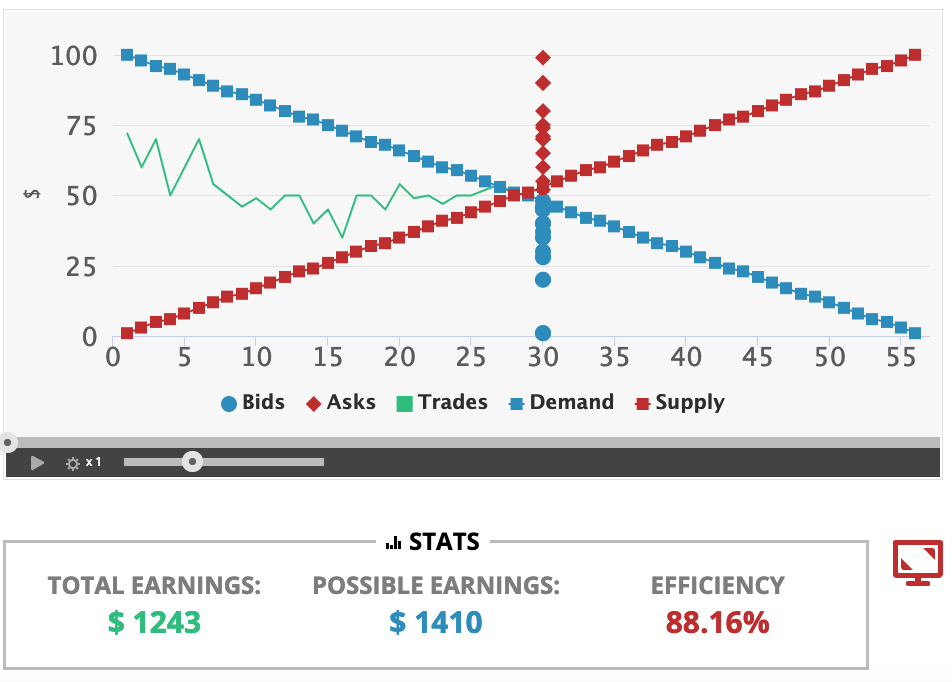
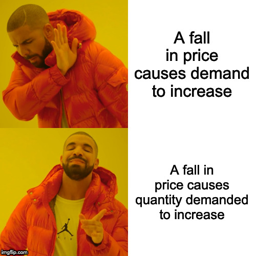
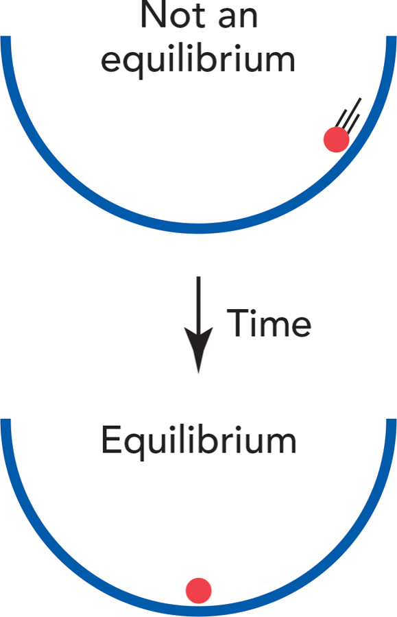

```{r setup, include=FALSE}
options(htmltools.dir.version = FALSE)
knitr::opts_chunk$set(echo=F,
                      message=F,
                      warning=F,
                      fig.retina = 3,
                      fig.align = "center")
library("tidyverse")
library("mosaic")
library("ggrepel")
library("fontawesome")
xaringanExtra::use_tile_view()
xaringanExtra::use_tachyons()
xaringanExtra::use_freezeframe()

update_geom_defaults("label", list(family = "Fira Sans Condensed"))
update_geom_defaults("text", list(family = "Fira Sans Condensed"))

set.seed(256)
```


class: title-slide

# 3.1 — The Supply and Demand Model

## ECON 306 • Microeconomic Analysis • Spring 2023

### Ryan Safner<br> Associate Professor of Economics <br> <a href="mailto:safner@hood.edu"><i class="fa fa-paper-plane fa-fw"></i>safner@hood.edu</a> <br> <a href="https://github.com/ryansafner/microS23"><i class="fa fa-github fa-fw"></i>ryansafner/microS23</a><br> <a href="https://microS23.classes.ryansafner.com"> <i class="fa fa-globe fa-fw"></i>microS23.classes.ryansafner.com</a><br>

---

class: inverse

# Outline

### [Equilibrium](#3)
### [Recall: Demand](#10)
### [Recall: Supply](#15)
### [Market Equilibrium](#21)
### [Why Markets Tend to Equilibrate](#23)
### [Comparative Statics](#31)

---

class: inverse, center, middle

# Equilibrium

---

# Recall: 2 Major Models of Economics as a “Science”

.pull-left[

## Optimization

- Agents have .hi[objectives] they value

- Agents face .hi[constraints]

- Make .hi[tradeoffs] to maximize objectives within constraints

.center[

]
]

--

.pull-right[

## Equilibrium

- Agents .hi[compete] with others over **scarce** resources

- Agents .hi[adjust] behaviors based on prices

- .hi[Stable outcomes] when adjustments stop

.center[

]

]

---

# Recall: Optimization and Equilibrium

.pull-left[
- If people can *learn* and *change* their behavior, they will always switch to a higher-valued option

- If there are no alternatives that are better, people are at an *optimum*

- If everyone is at an optimum, the system is in *equilibrium*
]

.pull-right[
.center[


]
]

---

# Equilibrium Analysis & Price Theory

.pull-left[

- Where do prices come from?

- *How* do they *change*?

- How consumers and producers to *respond* to changes?

- What *predictions* can we make about what we will see in the world?
]

.pull-right[
.center[

]
]

---

# Equilibrium Analysis

.pull-left[
- An .hi[equilibrium] is an allocation of resources such that no individual has an incentive to alter their behavior

- In markets: .hi-purple[“market-clearing”] prices where quantity supplied equals quantity demanded
]

.pull-right[
.center[

]
]

---

# *Partial*  Equilibrium Analysis

.pull-left[
.smallest[
- We will only look at .hi-purple[“*partial* equilibrium”] for a single market

- Changes in *one* market often affect *other* markets, affecting the .hi-purple[“*general* equilibrium”]
  - .hi-green[Example]: change in price of *corn* will affect the market for wheat, soybeans, flax, cereal, sugar, candy, ethanol, gasoline, automobiles, etc...
  - think of all of the *complements*, *substitutes*, upstream and downstream goods in production...
  - General equilibrium is too complicated for undergraduate courses...
]
]
.pull-right[
.center[

]
]

---

class: inverse, center, middle

# Recall: Demand

---

# Demand Function

.pull-left[

- .hi[Demand function] relates quantity to price

.bg-washed-green.b--dark-green.ba.bw2.br3.shadow-5.ph4.mt5[
.green[**Example**]: 
$$q=10-p$$
]
- Not graphable (wrong axes)!

]

.pull-right[

```{r, fig.retina=3}
library("mosaic")
demand=function(x){10-x}

d<-ggplot(data.frame(x=c(0,10)), aes(x=x))+
  stat_function(fun=demand, geom="line", size=2, color = "blue")+
  geom_label(aes(x=8,y=demand(8)), color = "blue", label="Demand", size = 6)+
    scale_x_continuous(breaks=seq(0,10,1),
                     limits=c(0,10),
                     expand=expand_scale(mult=c(0,0.1)))+
  scale_y_continuous(breaks=seq(0,10,1),
                     limits=c(0,10),
                     expand=expand_scale(mult=c(0,0.1)),
                     labels = function(x){paste("$", x, sep="")})+
  coord_cartesian(clip="off")+
  labs(x = "Quantity of x",
       y = "Price of x")+
  theme_classic(base_family = "Fira Sans Condensed", base_size=20)
d
```
]

---

# Inverse Demand Function

.pull-left[

- .hi[*Inverse* demand function] relates price to quantity
    - Take demand function and solve for $p$

.bg-washed-green.b--dark-green.ba.bw2.br3.shadow-5.ph4.mt5[
.green[**Example**]: 
$$p=10-q$$
]
- Graphable (price on vertical axis)!

]

---

# Inverse Demand Function

.pull-left[

- .hi[*Inverse* demand function] relates price to quantity
    - Take demand function and solve for $p$

.bg-washed-green.b--dark-green.ba.bw2.br3.shadow-5.ph4.mt5[
.green[**Example**]: 
$$p=10-q$$
]

- Vertical intercept (.hi-purple["Choke price"]): price where `\\(q_D=0\\)` ($10), just high enough to discourage *any* purchases

]


.pull-right[

```{r, fig.retina=3}
d
```
]

---

# Inverse Demand Function

.pull-left[

- Read two ways:

- Horizontally: at any given price, how many units person wants to buy

- Vertically: at any given quantity, the .hi[maximum willingness to pay (WTP)] for that quantity
    - This way will be very useful later

]


.pull-right[

```{r, fig.retina=3}
d
```
]

---

class: inverse, center, middle

# Recall: Supply

---

# Supply Function

.pull-left[

- .hi[Supply function] relates quantity to price

.bg-washed-green.b--dark-green.ba.bw2.br3.shadow-5.ph4.mt5[
.green[**Example**]: 
$$q=2p-8$$
]
- Not graphable (wrong axes)!

]

.pull-right[

```{r, fig.retina=3}
supply_graph=function(x){0.5*x+4}

empty<-ggplot(data.frame(x=c(0,10)), aes(x=x))+
  
    scale_x_continuous(breaks=seq(0,10,1),
                     limits=c(0,10),
                     expand=expand_scale(mult=c(0,0.1)))+
  scale_y_continuous(breaks=seq(0,10,1),
                     limits=c(0,10),
                     expand=expand_scale(mult=c(0,0.1)),
                     labels = function(x){paste("$", x, sep="")})+
  coord_cartesian(clip="off")+
  labs(x = "Quantity of x",
       y = "Price of x")+
  theme_classic(base_family = "Fira Sans Condensed", base_size=20)

s<-empty+stat_function(fun=supply_graph, geom="line", size=2, color = "red")+
  geom_label(aes(x=8,y=supply_graph(8)), color = "red", label="Supply", size = 6)
  
empty
```
]

---

# Inverse Supply Function

.pull-left[

- .hi[*Inverse* supply function] relates price to quantity
    - Take supply function, solve for $p$

.bg-washed-green.b--dark-green.ba.bw2.br3.shadow-5.ph4.mt5[
.green[**Example**]: 
$$p=4+0.5q$$
]
- Graphable (price on vertical axis)!

]

--

.pull-right[

```{r, fig.retina=3}
s
```
]

---

# Inverse Supply Function

.pull-left[

.bg-washed-green.b--dark-green.ba.bw2.br3.shadow-5.ph4.mt5[
.green[**Example**]: 
$$p=4+0.5q$$
]

- Slope: 0.5

- Vertical intercept called the .hi["Choke price"]: price where `\\(q_S=0\\)` ($4), just low enough to discourage *any* sales

]


.pull-right[

```{r, fig.retina=3}
s
```
]

---

# Inverse Supply Function

.pull-left[

- Read two ways:

- Horizontally: at any given price, how many units firm wants to sell

- Vertically: at any given quantity, the .hi[minimum willingness to accept (WTA)] for that quantity

]


.pull-right[

```{r, fig.retina=3}
s
```
]

---

class: inverse, center, middle

# Market Equilibrium

---

# Market Equilibrium

.pull-left[

.smallest[
- .hi-purple[Market-clearing (equilibrium) price] $\color{#6A5ACD}{(p^\star)}$: $6.00

- .hi-purple[Market-clearing (equilibrium) quantity exchanged] $\color{#6A5ACD}{(q^\star)}$: 4 units
]
]

.pull-right[
```{r, fig.retina=3, fig.height=5}
demand=function(x){10-x}
supply=function(x){0.5*x+4}

graph<-ggplot(data.frame(x=c(0,10)), aes(x=x))+
  stat_function(fun=demand, geom="line", size=2, color = "blue")+
    geom_label(aes(x=9,y=demand(9)), color = "blue", label="Demand = Max WTP", size = 5)+
  stat_function(fun=supply, geom="line", size=2, color = "red")+
    geom_label(aes(x=9,y=supply(9)), color = "red", label="Supply = Min WTA", size = 5)+
    scale_x_continuous(breaks=seq(0,10,1),
                     limits=c(0,10),
                     expand=expand_scale(mult=c(0,0.1)))+
  scale_y_continuous(breaks=seq(0,10,1),
                     limits=c(0,10),
                     expand=expand_scale(mult=c(0,0.1)),
                     labels = function(x){paste("$", x, sep="")})+
  labs(x = "Quantity (q)",
       y = "Price (p)")+
  theme_classic(base_family = "Fira Sans Condensed", base_size=20)

graph+
  geom_segment(x=4, xend=4, y=0, yend=6, size=1, linetype="dotted")+
  geom_segment(x=0, xend=4, y=6, yend=6, size=1, linetype="dotted")
```
]

---

class: inverse, center, middle

# Why Markets Tend to Equilibrate

---

# Excess Demand I

.pull-left[

.bg-washed-green.b--dark-green.ba.bw2.br3.shadow-5.ph4.mt5[
.smallest[
.green[**Example**]: Consider *any* price below $6, such as $5: 

- $\color{blue}{Q_d=5} \quad \color{red}{Q_s=2}$

- $\color{blue}{Q_d}>\color{red}{Q_s}$: .hi[excess demand]

- A .hi[shortage] of 3 units
]
]


]

.pull-right[
```{r, fig.retina=3, fig.height=5}
demand=function(x){10-x}
supply=function(x){0.5*x+4}

graph<-ggplot(data.frame(x=c(0,10)), aes(x=x))+
  stat_function(fun=demand, geom="line", size=2, color = "blue")+
    geom_label(aes(x=9,y=demand(9)), color = "blue", label="Demand = Max WTP", size = 5)+
  stat_function(fun=supply, geom="line", size=2, color = "red")+
    geom_label(aes(x=9,y=supply(9)), color = "red", label="Supply = Min WTA", size = 5)+
    scale_x_continuous(breaks=seq(0,10,1),
                     limits=c(0,10),
                     expand=expand_scale(mult=c(0,0.1)))+
  scale_y_continuous(breaks=seq(0,10,1),
                     limits=c(0,10),
                     expand=expand_scale(mult=c(0,0.1)),
                     labels = function(x){paste("$", x, sep="")})+
  labs(x = "Quantity (q)",
       y = "Price (p)")+
  theme_classic(base_family = "Fira Sans Condensed", base_size=20)

graph+
  geom_segment(x=0, xend=5, y=5, yend=5, size=1, linetype="dotted")+
  geom_segment(x=2, xend=2, y=0, yend=5, size=1, linetype="dotted")+
  geom_segment(x=0, xend=4, y=5, yend=5, size=1, linetype="dotted")+
  geom_segment(x=5, xend=5, y=0, yend=5, size=1, linetype="dotted")+
  annotate("segment", x = 2, xend = 5, y = 3, yend = 3, colour = "black", size=2, alpha=1, arrow=arrow(length=unit(0.5,"cm"), ends="both", type="closed"))+
  geom_label(x=3.5, y=3, label="Shortage")

```
]

---

# Excess Demand II

.pull-left[

.bg-washed-green.b--dark-green.ba.bw2.br3.shadow-5.ph4.mt5[
.smallest[
.green[**Example**]: Consider *any* price below $6, such as $5: 

- $\color{blue}{Q_d=5} \quad \color{red}{Q_s=2}$

- $\color{blue}{Q_d}>\color{red}{Q_s}$: .hi[excess demand]

- A .hi[shortage] of 3 units
]
]

.smallest[
- Sellers will not supply more than 2 units

- For 2 units, some buyers are willing to pay more than $5

]
]

.pull-right[
```{r, fig.retina=3, fig.height=5}
graph+
  geom_segment(x=0, xend=5, y=5, yend=5, size=1, linetype="dotted")+
  geom_segment(x=2, xend=2, y=0, yend=8, size=1, linetype="dotted")+ # wtp
  geom_segment(x=0, xend=2, y=8, yend=8, size=1, linetype="dotted")+ # wtp
  geom_segment(x=0, xend=4, y=5, yend=5, size=1, linetype="dotted")+
  geom_segment(x=5, xend=5, y=0, yend=5, size=1, linetype="dotted")+
  annotate("segment", x = 2, xend = 5, y = 3, yend = 3, colour = "black", size=2, alpha=1, arrow=arrow(length=unit(0.5,"cm"), ends="both", type="closed"))+
  geom_label(x=3.5, y=3, label="Shortage")
```
]

---

# Excess Demand II

.center[

]

---

# Excess Demand III

.pull-left[

.bg-washed-green.b--dark-green.ba.bw2.br3.shadow-5.ph4.mt5[
.smallest[
.green[**Example**]: Consider *any* price below $6, such as $5: 

- $\color{blue}{Q_d=5} \quad \color{red}{Q_s=2}$

- $\color{blue}{Q_d}>\color{red}{Q_s}$: .hi[excess demand]

- A .hi[shortage] of 3 units
]
]

.smallest[
- Buyers will **raise their bids** against one another, raising the price

- At higher prices, sellers willing to sell more!

- Until .hi-purple[equilibrium], no pressure for change, $\color{blue}{Q_d}=\color{red}{Q_s}$
]
]

.pull-right[
```{r, fig.retina=3, fig.height=5}
graph+
  geom_segment(x=0, xend=2, y=5, yend=5, size=1, linetype="dotted")+
  geom_segment(x=2, xend=2, y=0, yend=5, size=1, linetype="dotted")+
  geom_segment(x=0, xend=4, y=6, yend=6, size=1, linetype="dotted")+
  geom_segment(x=4, xend=4, y=0, yend=6, size=1, linetype="dotted")+
  annotate("segment", x = 2, xend = 4, y = 5, yend = 6, colour = "black", size=2, alpha=1, arrow=arrow(length=unit(0.5,"cm"), ends="last", type="closed"))
```
]

---

# Excess Supply I

.pull-left[

.bg-washed-green.b--dark-green.ba.bw2.br3.shadow-5.ph4.mt5[
.smallest[
.green[**Example**]: Consider *any* price above $6, such as $7: 

- $\color{blue}{Q_d=2} \quad \color{red}{Q_s=8}$

- $\color{blue}{Q_d}<\color{red}{Q_s}$: .hi[excess supply]

- A .hi[surplus] of 6 units
]
]


]

.pull-right[
```{r, fig.retina=3, fig.height=5}
graph+
  geom_segment(x=0, xend=8, y=8, yend=8, size=1, linetype="dotted")+
  geom_segment(x=2, xend=2, y=0, yend=8, size=1, linetype="dotted")+
  geom_segment(x=8, xend=8, y=0, yend=8, size=1, linetype="dotted")+
  annotate("segment", x = 2, xend = 8, y = 7, yend = 7, colour = "black", size=2, alpha=1, arrow=arrow(length=unit(0.5,"cm"), ends="both", type="closed"))+
  geom_label(x=5, y=7, label="Surplus")
```
]

---

# Excess Supply II

.pull-left[

.bg-washed-green.b--dark-green.ba.bw2.br3.shadow-5.ph4.mt5[
.smallest[
.green[**Example**]: Consider *any* price above $6, such as $7: 

- $\color{blue}{Q_d=2} \quad \color{red}{Q_s=8}$

- $\color{blue}{Q_d}<\color{red}{Q_s}$: .hi[excess supply]

- A .hi[surplus] of 6 units
]

]
.smallest[
- Buyers will not buy more than 2 units

- For 2 units, some sellers willing to accept less than $8

]
]

.pull-right[
```{r, fig.retina=3, fig.height=5}
graph+
  geom_segment(x=0, xend=8, y=8, yend=8, size=1, linetype="dotted")+
  geom_segment(x=2, xend=2, y=0, yend=8, size=1, linetype="dotted")+
  geom_segment(x=8, xend=8, y=0, yend=8, size=1, linetype="dotted")+
  #wta
  geom_segment(x=0, xend=2, y=5, yend=5, size=1, linetype="dotted")+
  annotate("segment", x = 2, xend = 8, y = 7, yend = 7, colour = "black", size=2, alpha=1, arrow=arrow(length=unit(0.5,"cm"), ends="both", type="closed"))+
  geom_label(x=5, y=7, label="Surplus")
```
]

---

# Excess Supply II

.center[

]

---

# Excess Supply III

.pull-left[

.bg-washed-green.b--dark-green.ba.bw2.br3.shadow-5.ph4.mt5[
.smallest[
.green[**Example**]: Consider *any* price above $6, such as $7: 

- $\color{blue}{Q_d=2} \quad \color{red}{Q_s=8}$

- $\color{blue}{Q_d}<\color{red}{Q_s}$: .hi[excess supply]

- A .hi[surplus] of 6 units
]
]
.smallest[
- Sellers will **lower their asking prices** against one another, lowering the price

- At lower prices, buyers willing to buy more!

- Until .hi-purple[equilibrium], no pressure for change, $\color{blue}{Q_d}=\color{red}{Q_s}$
]
]

.pull-right[
```{r, fig.retina=3, fig.height=5}
graph+
  geom_segment(x=0, xend=2, y=8, yend=8, size=1, linetype="dotted")+
  geom_segment(x=2, xend=2, y=0, yend=8, size=1, linetype="dotted")+
  geom_segment(x=0, xend=4, y=6, yend=6, size=1, linetype="dotted")+
  geom_segment(x=4, xend=4, y=0, yend=6, size=1, linetype="dotted")+
  annotate("segment", x = 2, xend = 4, y = 8, yend = 6, colour = "black", size=2, alpha=1, arrow=arrow(length=unit(0.5,"cm"), ends="last", type="closed"))
```
]

---

# Why Markets Tend to Equilibrate

.center[

]

---

class: inverse, center, middle

# Comparative Statics

---

# Ceterus Paribus I

.pull-left[
.smallest[
- Supply function and demand function *only* relate **quantity** (supplied or demanded) to **price**
  - Describes how buyers/sellers respond to changes in market price

- Certainly there are many *other* factors that influence how much a buyer or seller will purchase at a particular price!
  - income, preferences, prices of other goods, costs, expectations, etc.

- A supply or demand function (or graph) requires .hi[“ceterus paribus”] (all else equal)
]
]
.pull-right[
.center[

]

]

---

# Recall (for example), Demand I

.pull-left[
.smallest[
- A consumer's .hi[demand] (for good x) depends on current prices & income:

$$q_x^D = q_x^D(m, p_x, p_y)$$

- How does **demand for x** change?

1. .hi-purple[Income effects] $\left(\frac{\Delta q_x^D}{\Delta m}\right)$: how $q_x^D$ changes with changes in income
2. .hi-purple[Cross-price effects] $\left(\frac{\Delta q_x^D}{\Delta p_y}\right)$: how $q_x^D$ changes with changes in prices of *other* goods (e.g. $y)$
3. .hi-purple[(Own) Price effects] $\left(\frac{\Delta q_x^D}{\Delta p_x}\right)$: how $q_x^D$ changes with changes in price (of $x)$
]
]

.pull-right[
.center[

]
]

.source[See [Class 1.5](/content/1.5-content) for a reminder.]
---

# Recall (for example), Demand II

.pull-left[
.smallest[
- A change in one of the .hi-purple["determinants of demand"] will **shift** demand curve!
  - Change in **income** `\\(m\\)`
  - Change in **price of other goods** `\\(p_y\\)` (substitutes or complements)
  - Change in **preferences** or **expectations** about good `\\(x\\)`
  - Change in **number of buyers**

- Shows up in (inverse) demand function by a **change in intercept (choke price)**! 

- Again, see my [Visualizing Demand Shifters](https://ryansafner.shinyapps.io/Demand/)
]
.source[See [Class 1.5](/content/1.5-content) for a reminder.]
]

.pull-right[

```{r, fig.retina=3}
demand_2=function(x){8-x}
demand=function(x){10-x}

ggplot(data.frame(x=c(0,10)), aes(x=x))+
  stat_function(fun=demand, geom="line", size=2, color = "blue")+
  geom_label(aes(x=8,y=demand(8)), color = "blue", label="Demand (m=$20)", size = 6)+
    scale_x_continuous(breaks=seq(0,10,1),
                     limits=c(0,10),
                     expand=expand_scale(mult=c(0,0.1)))+
  scale_y_continuous(breaks=seq(0,10,1),
                     limits=c(0,10),
                     expand=expand_scale(mult=c(0,0.1)),
                     labels = function(x){paste("$", x, sep="")})+
  coord_cartesian(clip="off")+
  labs(x = "Quantity of x",
       y = "Price of x")+
  theme_classic(base_family = "Fira Sans Condensed", base_size=20)+
  stat_function(fun=demand_2, geom="line", size=2, color = "blue", linetype="dashed")+
  geom_label(aes(x=2,y=demand_2(2)), color = "blue", label="Demand (m=$10)", size = 6)

```

]


---

# Ceterus Paribus II

.pull-left[

- Consider our demand function:
$$q_D=10-p$$

- If the .hi-turquoise[market price changes] (perhaps because supply changes), that results in a .hi-turquoise[change in _quantity demanded_]
  - We move **along** the existing demand curve

- *Ceterus paribus* has not been violated

]

.pull-right[
.center[

]

]

---

# Ceterus Paribus III

.pull-left[

- Consider our demand function:
$$q_D=10-p$$

- If the .hi-turquoise[something *other* than price changes] (income, preferences, price of a complement, etc), that results in a .hi-turquoise[change in _demand_]
  - A whole *new* demand function/graph:

$$q_D=12-p$$

- *Ceterus paribus* has been violated

]

.pull-right[
.center[

]

]

---

# Ceterus Paribus IV

.pull-left[

- .hi-purple[There is a big difference between a change in "quantity demanded" and a change in "demand"!]

]

--

.pull-right[
.center[

]

]

---

# Increase in Demand

.pull-left[


]

.pull-right[

```{r, fig.retina=3}
demand_1=function(x){10-x}
supply_1=function(x){x}

changes<-ggplot(data.frame(x=c(0,10)), aes(x=x))+
  stat_function(fun=demand_1, geom="line", size=2, color = "blue")+
    geom_label(aes(x=9,y=demand_1(9)), color = "blue", label="Demand 1", size = 5)+
  stat_function(fun=supply_1, geom="line", size=2, color = "red")+
    geom_label(aes(x=9,y=supply_1(9)), color = "red", label="Supply 1", size = 5)+
  geom_segment(x=0, xend=5, y=5, yend=5, size=1, linetype="dotted")+
  geom_segment(x=5, xend=5, y=0, yend=5, size=1, linetype="dotted")+
    scale_x_continuous(breaks=seq(0,10,1),
                     limits=c(0,10),
                     expand=expand_scale(mult=c(0,0.1)))+
  scale_y_continuous(breaks=seq(0,10,1),
                     limits=c(0,10),
                     expand=expand_scale(mult=c(0,0.1)),
                     labels = function(x){paste("$", x, sep="")})+
  labs(x = "Quantity (q)",
       y = "Price (p)")+
  theme_classic(base_family = "Fira Sans Condensed", base_size=20)

changes

```

]

---

# Increase in Demand

.pull-left[
.smallest[
- More individuals want to buy more of the good at *every* price

- Entire demand curve shifts to the *right*
]
]

.pull-right[

```{r, fig.retina=3}
demand_up=function(x){12-x}

changes+
  stat_function(fun=demand_up, geom="line", size=2, color = "darkblue")+
    geom_label(aes(x=9,y=demand_up(9)), color = "darkblue", label="Demand 2", size = 5)
```

]

---

# Increase in Demand


.pull-left[
.smallest[
- More individuals want to buy more of the good at *every* price

- Entire demand curve shifts to the *right*

- At the original market price, a **shortage!** $(q_D > q_S)$
]
]

.pull-right[

```{r, fig.retina=3}
demand_up=function(x){12-x}

changes+
  stat_function(fun=demand_up, geom="line", size=2, color = "darkblue")+
    geom_label(aes(x=9,y=demand_up(9)), color = "darkblue", label="Demand 2", size = 5)+
  geom_segment(x=0, xend=7, y=5, yend=5, size=1, linetype="dotted")+
  geom_segment(x=7, xend=7, y=0, yend=5, size=1, linetype="dotted")+
  annotate("segment", x = 5, xend = 7, y = 5, yend = 5, colour = "black", size=2, alpha=1, arrow=arrow(length=unit(0.5,"cm"), ends="both", type="closed"))+
  geom_label(x=6, y=5, label="Shortage")
```

]

---

# Increase in Demand


.pull-left[
.smallest[
- More individuals want to buy more of the good at *every* price

- Entire demand curve shifts to the *right*

- At the original market price, a **shortage!** $(q_D > q_S)$

- Some buyers willing to pay more at this quantity
]
]
.pull-right[

```{r, fig.retina=3}
demand_up=function(x){12-x}

changes+
  stat_function(fun=demand_up, geom="line", size=2, color = "darkblue")+
    geom_label(aes(x=9,y=demand_up(9)), color = "darkblue", label="Demand 2", size = 5)+
  geom_segment(x=0, xend=7, y=5, yend=5, size=1, linetype="dotted")+
  geom_segment(x=7, xend=7, y=0, yend=5, size=1, linetype="dotted")+
  
  # higher wtp
  geom_segment(x=0, xend=5, y=7, yend=7, size=1, linetype="dotted")+
  geom_segment(x=5, xend=5, y=0, yend=7, size=1, linetype="dotted")+
  annotate("segment", x = 5, xend = 7, y = 5, yend = 5, colour = "black", size=2, alpha=1, arrow=arrow(length=unit(0.5,"cm"), ends="both", type="closed"))+
  geom_label(x=6, y=5, label="Shortage")
```

]

---

# Increase in Demand


.pull-left[
.smallest[
- More individuals want to buy more of the good at *every* price

- Entire demand curve shifts to the *right*

- At the original market price, a **shortage!** $(q_D > q_S)$

- Some buyers willing to pay more at this quantity

- Buyers raise bids, inducing sellers to sell more

- Reach new equilibrium with:
  - **higher market-clearing price**
  - **larger market-clearing quantity exchanged**
]
]
.pull-right[

```{r, fig.retina=3}
demand_up=function(x){12-x}

changes+
  stat_function(fun=demand_up, geom="line", size=2, color = "darkblue")+
    geom_label(aes(x=9,y=demand_up(9)), color = "darkblue", label="Demand 2", size = 5)+
  geom_segment(x=0, xend=6, y=6, yend=6, size=1, linetype="dotted")+
  geom_segment(x=6, xend=6, y=0, yend=6, size=1, linetype="dotted")+

  # higher wtp
  annotate("segment", x = 5, xend = 6, y = 5, yend = 6, colour = "black", size=2, alpha=1, arrow=arrow(length=unit(0.5,"cm"), ends="last", type="closed"))
```

]

---

# Decrease in Demand

.pull-left[


]

.pull-right[

```{r, fig.retina=3}
changes
```

]

---

# Decrease in Demand

.pull-left[
.smallest[
- Fewer individuals want to buy less of the good at *every* price

- Entire demand curve shifts to the *left*
]
]

.pull-right[

```{r, fig.retina=3}
demand_down=function(x){8-x}

changes+
  stat_function(fun=demand_down, geom="line", size=2, color = "darkblue")+
    geom_label(aes(x=7,y=demand_down(7)), color = "darkblue", label="Demand 2", size = 5)
```

]

---

# Decrease in Demand


.pull-left[
.smallest[
- Fewer individuals want to buy less of the good at *every* price

- Entire demand curve shifts to the *left*

- At the original market price, a **surplus!** $(q_D < q_S)$
]
]
.pull-right[

```{r, fig.retina=3}
changes+
  stat_function(fun=demand_down, geom="line", size=2, color = "darkblue")+
  geom_label(aes(x=7,y=demand_down(7)), color = "darkblue", label="Demand 2", size = 5)+
  geom_segment(x=0, xend=3, y=5, yend=5, size=1, linetype="dotted")+
  geom_segment(x=3, xend=3, y=0, yend=5, size=1, linetype="dotted")+
  annotate("segment", x = 3, xend = 5, y = 5, yend = 5, colour = "black", size=2, alpha=1, arrow=arrow(length=unit(0.5,"cm"), ends="both", type="closed"))+
  geom_label(x=4, y=5, label="Surplus")
```

]

---

# Decrease in Demand


.pull-left[
.smallest[
- Fewer individuals want to buy less of the good at *every* price

- Entire demand curve shifts to the *left*

- At the original market price, a **surplus!** $(q_D < q_S)$

- Some sellers willing to accept less at this quantity
]
]

.pull-right[

```{r, fig.retina=3}
changes+
  stat_function(fun=demand_down, geom="line", size=2, color = "darkblue")+
  geom_label(aes(x=7,y=demand_down(7)), color = "darkblue", label="Demand 2", size = 5)+
  geom_segment(x=0, xend=3, y=5, yend=5, size=1, linetype="dotted")+
  geom_segment(x=3, xend=3, y=0, yend=5, size=1, linetype="dotted")+
  annotate("segment", x = 3, xend = 5, y = 5, yend = 5, colour = "black", size=2, alpha=1, arrow=arrow(length=unit(0.5,"cm"), ends="both", type="closed"))+
  geom_label(x=4, y=5, label="Surplus")+
  
  # lower wta
  geom_segment(x=0, xend=3, y=3, yend=3, size=1, linetype="dotted")
```

]

---

# Decrease in Demand


.pull-left[
.smallest[
- Fewer individuals want to buy less of the good at *every* price

- Entire demand curve shifts to the *left*

- At the original market price, a **surplus!** $(q_D < q_S)$

- Some sellers willing to accept less at this quantity

- Sellers lower asks, inducing buyers to buy more

- Reach new equilibrium with:
  - **lower market-clearing price**
  - **smaller market-clearing quantity exchanged**
]
]

.pull-right[

```{r, fig.retina=3}
changes+
  stat_function(fun=demand_down, geom="line", size=2, color = "darkblue")+
  geom_label(aes(x=7,y=demand_down(7)), color = "darkblue", label="Demand 2", size = 5)+
  geom_segment(x=0, xend=4, y=4, yend=4, size=1, linetype="dotted")+
  geom_segment(x=4, xend=4, y=0, yend=4, size=1, linetype="dotted")+
  annotate("segment", x = 5, xend = 4, y = 5, yend = 4, colour = "black", size=2, alpha=1, arrow=arrow(length=unit(0.5,"cm"), ends="last", type="closed"))
```

]

---

# Increase in Supply

.pull-left[


]

.pull-right[

```{r, fig.retina=3}
changes
```

]

---

# Increase in Supply

.pull-left[
.smallest[
- More individuals want to sell more of the good at *every* price

- Entire supply curve shifts to the *right*
]
]

.pull-right[

```{r, fig.retina=3}
supply_up=function(x){-2+x}

changes+
  stat_function(fun=supply_up, geom="line", size=2, color = "darkred")+
    geom_label(aes(x=9,y=supply_up(9)), color = "darkred", label="Supply 2", size = 5)
```

]

---

# Increase in Supply

.pull-left[
.smallest[
- More individuals want to sell more of the good at *every* price

- Entire supply curve shifts to the *right*

- At the original market price, a **surplus!** $(q_D < q_S)$
]
]

.pull-right[

```{r, fig.retina=3}
changes+
  stat_function(fun=supply_up, geom="line", size=2, color = "darkred")+
    geom_label(aes(x=9,y=supply_up(9)), color = "darkred", label="Supply 2", size = 5)+
  geom_segment(x=0, xend=7, y=5, yend=5, size=1, linetype="dotted")+
  geom_segment(x=7, xend=7, y=0, yend=5, size=1, linetype="dotted")+
  annotate("segment", x = 5, xend = 7, y = 5, yend = 5, colour = "black", size=2, alpha=1, arrow=arrow(length=unit(0.5,"cm"), ends="both", type="closed"))+
  geom_label(x=6, y=5, label="Surplus")
```

]

---

# Increase in Supply

.pull-left[
.smallest[
- More individuals want to sell more of the good at *every* price

- Entire supply curve shifts to the *right*

- At the original market price, a **surplus!** $(q_D < q_S)$

- Some sellers willing to accept less at this quantity
]
]
.pull-right[

```{r, fig.retina=3}
changes+
  stat_function(fun=supply_up, geom="line", size=2, color = "darkred")+
    geom_label(aes(x=9,y=supply_up(9)), color = "darkred", label="Supply 2", size = 5)+
  geom_segment(x=0, xend=7, y=5, yend=5, size=1, linetype="dotted")+
  geom_segment(x=7, xend=7, y=0, yend=5, size=1, linetype="dotted")+
  
  # higher wtp
  geom_segment(x=0, xend=5, y=3, yend=3, size=1, linetype="dotted")+
  geom_segment(x=5, xend=5, y=0, yend=3, size=1, linetype="dotted")+
  annotate("segment", x = 5, xend = 7, y = 5, yend = 5, colour = "black", size=2, alpha=1, arrow=arrow(length=unit(0.5,"cm"), ends="both", type="closed"))+
  geom_label(x=6, y=5, label="Surplus")
```

]

---

# Increase in Supply

.pull-left[
.smallest[
- More individuals want to sell more of the good at *every* price

- Entire supply curve shifts to the *right*

- At the original market price, a **surplus!** $(q_D < q_S)$

- Some sellers willing to accept less at this quantity

- Sellers lower asks, inducing buyers to buy more

- Reach new equilibrium with:
  - **lower market-clearing price**
  - **larger market-clearing quantity exchanged**
]
]
.pull-right[

```{r, fig.retina=3}
changes+
  stat_function(fun=supply_up, geom="line", size=2, color = "darkred")+
    geom_label(aes(x=9,y=supply_up(9)), color = "darkred", label="Supply 2", size = 5)+
  geom_segment(x=6, xend=6, y=0, yend=4, size=1, linetype="dotted")+
  geom_segment(x=0, xend=6, y=4, yend=4, size=1, linetype="dotted")+
  # higher wtp
  annotate("segment", x = 5, xend = 6, y = 5, yend = 4, colour = "black", size=2, alpha=1, arrow=arrow(length=unit(0.5,"cm"), ends="last", type="closed"))
```

]

---

# Decrease in Supply

.pull-left[


]

.pull-right[

```{r, fig.retina=3}
changes
```

]

---

# Decrease in Supply

.pull-left[
.smallest[
- Fewer individuals want to sell less of the good at *every* price

- Entire supply curve shifts to the *left*
]
]

.pull-right[

```{r, fig.retina=3}
supply_down=function(x){x+2}

changes+
  stat_function(fun=supply_down, geom="line", size=2, color = "darkred")+
    geom_label(aes(x=7,y=supply_down(7)), color = "darkred", label="Supply 2", size = 5)
```

]

---

# Decrease in Supply

.pull-left[
.smallest[
- Fewer individuals want to sell less of the good at *every* price

- Entire supply curve shifts to the *left*

- At the original market price, a **shortage!** $(q_D > q_S)$
]
]
.pull-right[

```{r, fig.retina=3}
changes+
  stat_function(fun=supply_down, geom="line", size=2, color = "darkred")+
    geom_label(aes(x=7,y=supply_down(7)), color = "darkred", label="Supply 2", size = 5)+
  geom_segment(x=0, xend=3, y=5, yend=5, size=1, linetype="dotted")+
  geom_segment(x=3, xend=3, y=0, yend=5, size=1, linetype="dotted")+
  annotate("segment", x = 3, xend = 5, y = 5, yend = 5, colour = "black", size=2, alpha=1, arrow=arrow(length=unit(0.5,"cm"), ends="both", type="closed"))+
  geom_label(x=4, y=5, label="Shortage")
```

]

---

# Decrease in Supply

.pull-left[
.smallest[
- Fewer individuals want to sell less of the good at *every* price

- Entire supply curve shifts to the *left*

- At the original market price, a **shortage!** $(q_D > q_S)$

- Some buyers willing to pay more at this quantity
]
]
.pull-right[

```{r, fig.retina=3}
changes+
  stat_function(fun=supply_down, geom="line", size=2, color = "darkred")+
    geom_label(aes(x=7,y=supply_down(7)), color = "darkred", label="Supply 2", size = 5)+
  geom_segment(x=0, xend=3, y=5, yend=5, size=1, linetype="dotted")+
  geom_segment(x=3, xend=3, y=0, yend=7, size=1, linetype="dotted")+
  annotate("segment", x = 3, xend = 5, y = 5, yend = 5, colour = "black", size=2, alpha=1, arrow=arrow(length=unit(0.5,"cm"), ends="both", type="closed"))+
  geom_label(x=4, y=5, label="Shortage")+
  
  # lower wta
  geom_segment(x=0, xend=3, y=7, yend=7, size=1, linetype="dotted")
```

]

---

# Decrease in Supply

.pull-left[
.smallest[
- Fewer individuals want to sell less of the good at *every* price

- Entire supply curve shifts to the *left*

- At the original market price, a **shortage!** $(q_D > q_S)$

- Some buyers willing to pay more at this quantity

- Buyers raise bids, inducing sellers to sell more

- Reach new equilibrium with:
  - **higher market-clearing price**
  - **smaller market-clearing quantity exchanged**
]
]
.pull-right[

```{r, fig.retina=3}
changes+
  stat_function(fun=supply_down, geom="line", size=2, color = "darkred")+
    geom_label(aes(x=7,y=supply_down(7)), color = "darkred", label="Supply 2", size = 5)+
  geom_segment(x=0, xend=4, y=6, yend=6, size=1, linetype="dotted")+
  geom_segment(x=4, xend=4, y=0, yend=6, size=1, linetype="dotted")+
  annotate("segment", x = 5, xend = 4, y = 5, yend = 6, colour = "black", size=2, alpha=1, arrow=arrow(length=unit(0.5,"cm"), ends="last", type="closed"))
```

]

---

# Equilibrium Tendencies

.pull-left[
.center[



]
]

.pull-right[

- Equilibrium is a *tendency* we can *predict* with our models

- Buyers and sellers raise and lower their bids and asks to adjust to competition from other buyers and sellers, moving the market price

- *Ceterus paribus*, market prices will settle on an equilibrium given existing conditions

- But conditions are always changing (and so are prices)!
]