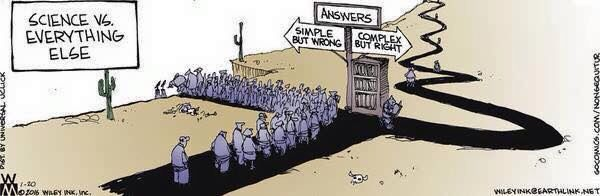
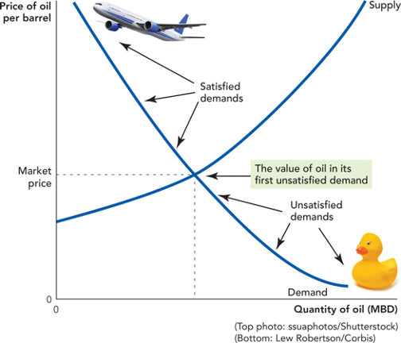

```{r setup, include=FALSE}
options(htmltools.dir.version = FALSE)
knitr::opts_chunk$set(echo=F,
                      message=F,
                      warning=F,
                      fig.retina = 3,
                      fig.align = "center")
library("tidyverse")
library("mosaic")
library("ggrepel")
library("fontawesome")
xaringanExtra::use_tile_view()
xaringanExtra::use_tachyons()
xaringanExtra::use_freezeframe()

update_geom_defaults("label", list(family = "Fira Sans Condensed"))
update_geom_defaults("text", list(family = "Fira Sans Condensed"))

set.seed(256)
```


class: title-slide

# 3.5 — The *Dynamic* Benefits of Markets

## ECON 306 • Microeconomic Analysis • Spring 2023

### Ryan Safner<br> Associate Professor of Economics <br> <a href="mailto:safner@hood.edu"><i class="fa fa-paper-plane fa-fw"></i>safner@hood.edu</a> <br> <a href="https://github.com/ryansafner/microS23"><i class="fa fa-github fa-fw"></i>ryansafner/microS23</a><br> <a href="https://microS23.classes.ryansafner.com"> <i class="fa fa-globe fa-fw"></i>microS23.classes.ryansafner.com</a><br>

---

class: inverse

# Outline

### [Why Markets Tend to Equilibrate, Redux](#7)
### [The Social Functions of Market Prices](#23)
### [Uncertainty and Profits](#37)

---

# The Model is Not the Reality I

.pull-left[
.center[

]
]

.pull-right[

> *“All models are wrong, but some are useful.”*

.smallest[
- This course is about economic modeling and formal theory

- Lots of applications beyond this course

- Models help us *understand* reality, but they *are not* reality!
  - Don't mistake the map for the territory itself


]
]

---

# The Model is Not the Reality II

.pull-left[
.center[

]
]

.pull-right[
.smallest[
- Our models so far have given us interesting results: 
  - Markets reach equilibrium
  - Economic profits are zero in the long run in competitive markets

- Both are **fictional**!

- But the models **still** show us useful insights about how a market economy works

- Some readings in today’s readings page to help you understand

]
]

---

# The Model is Not the Reality III

.center[


.source[
Source: [SMBC](https://www.smbc-comics.com/comic/2013-09-19)

“Shame on the three of you who enjoyed this joke”
]
]

---

# The Model is Not the Reality III

.center[

]

---

class: inverse, center, middle

# Why Markets Tend to Equilibrate, Redux

---

# The Law of One Price I


.pull-left[
- .hi[Law of One Price]: *all* units of the *same* good exchanged on the market will tend to have the same market price (the market-clearing price, $p^*)$
]

.pull-right[

```{r, fig.retina=3}
library("mosaic")
library("ggrepel")
update_geom_defaults("label", list(family = "Fira Sans Condensed"))

Demand=function(x){10-x}
Supply=function(x){x}

eq<-tribble(
  ~letter, ~x, ~y,
  "A", 5, 5
)

ggplot(data.frame(x=c(0,10)), aes(x=x))+
  stat_function(fun=Demand, geom="line", size=2, color = "blue")+
  stat_function(fun=Supply, geom="line", size=2, color = "red")+
  geom_label(aes(x=9,y=Demand(9)), color = "blue", label="Demand", size = 6)+
  geom_label(aes(x=9,y=Supply(9)), color = "red", label="Supply", size = 6)+
  geom_segment(aes(x=0, xend=5, y=5, yend=5),size=1, linetype="dotted")+
  geom_segment(aes(x=5, xend=5, y=5, yend=0),size=1, linetype="dotted")+
  geom_point(data = eq,
             mapping=aes(x=x, y=y),
             size = 4)+
  geom_text_repel(data = eq,
             mapping=aes(x=x, y=y,
             label = letter),
             size = 6)+
    scale_x_continuous(breaks=seq(0,10,1),
                     limits=c(0,10),
                     expand=expand_scale(mult=c(0,0.1)))+
  scale_y_continuous(breaks=seq(0,10,1),
                     limits=c(0,10),
                     expand=expand_scale(mult=c(0,0.1)))+
  coord_cartesian(clip="off")+
  labs(x = "Quantity",
       y = "Price")+
  theme_classic(base_family = "Fira Sans Condensed", base_size=20)

```

]

---

# The Law of One Price II

.pull-left[
.center[

]
]

.pull-right[
.smaller[
- Consider if there are *multiple* different prices for *same* good:

- .hi-purple[Arbitrage] opportunities: optimizing individuals recognize **profit opportunity**:
    - Buy at low price, resell at high price!
    - There are possible gains from trade or gains from innovation to be had
    
- .hi-purple[Entrepreneurship]: recognizing profit opportunities and entering a market as a seller to try to capture gains from trade/innovation
]
]


---

# Arbitrage and Entrepreneurship I

.center[

]

---

# Arbitrage and Entrepreneurship II

.center[
<iframe width="980" height="550" src="https://www.youtube.com/embed/HiB9L3dG-Aw" frameborder="0" allow="accelerometer; autoplay; encrypted-media; gyroscope; picture-in-picture" allowfullscreen></iframe>
]

---

# Arbitrage and Entrepreneurship III

.center[
<iframe width="980" height="550" src="https://www.youtube.com/embed/yGf6LNWY9AI" frameborder="0" allow="accelerometer; autoplay; encrypted-media; gyroscope; picture-in-picture" allowfullscreen></iframe>
]

---

# Uncertainty vs. Risk

.center[

<iframe width="980" height="550" src="https://www.youtube.com/embed/GiPe1OiKQuk" frameborder="0" allow="accelerometer; autoplay; encrypted-media; gyroscope; picture-in-picture" allowfullscreen></iframe>

]

---

# Uncertainty vs. Risk

.left-column[
.center[

]
]

.right-column[

- **“Known knowns”**: .hi-purple[perfect information]

- **“Known unknowns”**: .hi-purple[risk]
  - We know the probability distribution of states that *could* happen
  - We just don't know *which* state will be realized
  - We can estimate probabilities, maximize expected value, minimize variance, etc.

]

---

# Uncertainty vs. Risk

.left-column[
.center[

]
]

.right-column[

- **“Unknown unknowns”**: .hi[uncertainty]
  - We don’t even know the probability distribution of states that *could* happen
  - *No model to optimize* in a world of uncertainty!
]

---

# The Role of Entrepreneurial Judgment

.left-column[
.center[


]
]

.right-column[

- Under true .hi[uncertainty], it’s not that we can’t assign probabilities to each outcome; we do not even have the knowledge necessary to list all possible outcomes!

- Requires .hi-purple[entrepreneurial judgment] to *both*:
  1. estimate possible actions *and*
  2. estimate the likelihood of their success

- .hi[Entrepreneur] is central player, earns pure profits (a residual) for *bearing uncertainty*

.source[For more, see Knight 1920 in [today’s readings](/content/3.4-content/#readings).]

]

---

# Entrepreneurial Judgment

.left-column[
.center[

.smallest[
Henry Ford

1863-1947
]
]

]

.right-column[

> “If I had asked people what they wanted, they would have said **faster horses**.” - Henry Ford

]

---

# Entrepreneurial Judgment

.pull-left[
.center[

]
]

.pull-right[

> “It's really hard to design products by focus groups. A lot of times, **people don't know what they want until you show it to them**.” - Steve Jobs
]

---

# Uncertainty and Entrepreneurship

.left-column[
.center[


Mark Zuckerberg

1984-
]
]

.right-column[

> "Why were we the ones to build [Facebook]? We were just students. We had way fewer resources than big companies. If they had focused on this problem, they could have done it. 
The only answer I can think of is: **we just cared more**. 
**While some doubted** that connecting the world was actually important, **we were building**. While others doubted that this would be sustainable, **we were forming lasting connections**."
]


---

# How Markets Get to Equilibrium I

.pull-left[
.center[

]
]

.pull-right[
.smaller[
- .hi-turquoise[Nobody knows “the right price” for things]

- Each buyer and seller only know **their own** reservation prices

- Buyers and sellers adjust their bids/asks 

- Markets do not *start* competitive, but *become* competitive!

- New entrepreneurs enter to try to capture gains from trade/innovation

- As these gains are exhausted, prices converge to equilibrium 
]
]


---

# How Markets Get to Equilibrium II

.pull-left[
.center[

]

.source[For more, see Hayek 1945 in [today’s readings](/content/3.4-content/#readings).]

]

.pull-right[
.smallest[
- Errors and imperfect information

> $\implies$ multiple prices

> $\implies$ arbitrage opportunities

> $\implies$ entrepreneurship

> $\implies$ correcting mistakes

> $\implies$ people update their behavior & expectations  

- Markets are .hi-purple[discovery processes] that *discover* the right prices, the optimal uses of resources, and cheapest production methods, none of which can be known in advance!
]


]

---

# How Markets Get to Equilibrium III

.pull-left[
.center[

]
]


.pull-right[
.smallest[
- Economy as a .hi[cat]-and-.hi-purple[mouse] game between:
  - .hi-purple[Mouse]: preferences, technologies, alternative uses of resources
  - .hi[Cat]: market prices, least-cost technologies

- .hi[Cat] always chasing .hi-purple[mouse]
  - .hi-purple[Mouse] *always* moving
  - Any time .hi[cat] hasn’t caught .hi-purple[mouse]: profit opportunities

- **IF** .hi-purple[mouse] *froze*, market would rest at equilibrium 
]

]

---

class: inverse, center, middle

# The Social Functions of Market Prices

---

# Prices are Signals I

.center[

]

---

# Prices are Signals II

.pull-left[
.center[

]
]

.pull-right[
.smallest[
- .hi-purple[Markets are social *processes* that generate information via prices]

- .hi-purple[Prices are never “given”], prices .hi-purple[emerge] dynamically from negotiation and market decisions of entrepreneurs and consumers

- **Competition**: is a .hi-purple[discovery process] which *discovers* what consumer preferences are and what technologies are lowest cost, and how to allocate resources accordingly

]

.source[For more, see Hayek 1945 in [today’s readings](/content/3.4-content/#readings).]

]

---

# The Social Functions of Prices I

.pull-left[

.center[

]
]

.pull-right[
.smaller[
A relatively high price:

- .hi-purple[Conveys information]: good is relatively scarce

- .hi-purple[Creates incentives for]:
  - **Buyers**: conserve use of this good, seek substitutes
  - **Sellers**: produce more of this good
  - **Entrepreneurs**: find substitutes and innovations to satisfy this unmet need
]
]

---

# The Social Functions of Prices II

.pull-left[

]

.pull-right[

.smaller[
A relatively low price

- .hi-purple[Conveys information]: good is relatively abundant

- .hi-purple[Creates incentives for]:
  - **Buyers**: substitute away from expensive goods towards this good
  - **Sellers**: Produce less of this good, talents better served elsewhere
  - **Entrepreneurs**: talents better served elsewhere: find more severe unmet needs

]
]

---

# The Social Functions of Prices III

.pull-left[
.center[

]
]

.pull-right[

.smaller[
- .hi-purple[Prices tell us how to allocate scarce resources among competing uses]

- Think of diminishing marginal utility:
  - allocate scarce good to highest-valued use first
  - as supply becomes more plentiful (price falls), can allocate more units of the good to lower-valued uses (higher-valued uses already satisfied)
]
]

---

class: inverse, center, middle

# Uncertainty and Profits

---

# Uncertainty, Tacit Information, and Profit I

.pull-left[

- **Economic theory**: in a perfectly competitive market, in the long run, economic profit $\rightarrow$ to zero

- **Real world**: there *are* often economic profits

- Our blackboard models assume perfect information

- In reality we have to deal with .hi-purple[uncertainty]


]

.pull-right[
.center[

]
]

---

# Uncertainty, Tacit Information, and Profit II

.pull-left[
.smaller[
- Imperfect information: mispricing and multiple prices $\rightarrow$ arbitrage/profit opportunities
  - Some people recognize opportunities ($20 bills) that others do not see

- .hi-purple[In a world of certainty, there would be no profit]
  - The model world of perfect competition is a fictional world of certainty
  - The real world, *because* it’s uncertain, *has* profit opportunities!

]
]
.pull-right[
.center[

]
]

---

# Uncertainty, Tacit Information, and Profit III

.pull-left[
.smallest[
- Firms don’t actually *maximize* profits 😨, just a convenient assumption! 
  - In a world of uncertainty (unlike mere risk), there’s no way to *maximize* anything!

- Real world is *not* a mere constrained maximization problem!

- Better to think in **evolutionary** terms:
  - Firms that *best* adapt to market circumstances will *survive* and earn profit...whether by skill & talent or just dumb luck!
]
]
.pull-right[
.center[

]
]

.source[For more, see Alchian 1950, Gigerenzer, 2012, and Smith, 2003 in [today’s readings](/content/3.4-content/#readings).]

---

# Uncertainty, Tacit Information, and Profit IV

.center[
<iframe width="980" height="550" src="https://www.youtube.com/embed/KUxMY77i0q4" frameborder="0" allow="accelerometer; autoplay; encrypted-media; gyroscope; picture-in-picture" allowfullscreen></iframe>
]

---

# Reminder: Profits and Entrepreneurship

.pull-left[

.center[

]
]

.pull-right[
.smaller[
- In markets, production faces .hi[profit-test]:
  - <span class="hi-purple">Is consumer's willingness to pay $>$ opportunity cost of inputs?</span>

- Profits are an indication that **value is being created for society**

- Losses are an indication that **value is being destroyed for society**

- Survival for sellers in markets *requires* firms continually create value and earn profits or die
]
]

---

# Why We Need Prices, Profits, and Losses I

.pull-left[

.center[

]
]

.pull-right[
.smaller[
- People often confuse the .hi[economic problem] with a .hi-purple[technological problem]

- .hi-purple[Technological problem]: how to allocate scarce resources to accomplish a particular goal
    - e.g. buy the right combination of goods to maximize utility
    - e.g. buy the right combination of inputs and produce output to maximize profits 
    - given stable prices, preferences, and technologies, **a computer can solve this problem**

]

.source[For more, see Hayek 1945 in [today’s readings](/content/3.4-content/#readings).]

]

---

# Why We Need Prices, Profits, and Losses II

.pull-left[

.center[

]
]

.pull-right[

- .hi[Economic calculation problem]: how to determine which of the infinite technologically-feasible options are *economically* viable?

- .hi-purple[How to best make use of dispersed knowledge to coordinate conflicting plans of individuals for their own ends?]

- ONLY can be **discovered** through competition, prices, profits & losses

.source[For more, see Hayek 1945 in [today’s readings](/content/3.4-content/#readings).
]
]


---

# What if there Were No Prices? I

.center[
<iframe width="980" height="550" src="https://www.youtube.com/embed/zkPGfTEZ_r4" frameborder="0" allow="accelerometer; autoplay; encrypted-media; gyroscope; picture-in-picture" allowfullscreen></iframe>
]

---

# What if there Were No Prices? II

.center[
<iframe width="980" height="550" src="https://www.youtube.com/embed/QwqnRYPcrl0" frameborder="0" allow="accelerometer; autoplay; encrypted-media; gyroscope; picture-in-picture" allowfullscreen></iframe>
]

---

# For More On The Socialist Calculation Debate

.pull-left[
.center[

]
]

.pull-right[

See lesson 4.2 in my History of Economic Thought Course: [The Socialist Calculation Debate](https://thoughtf20.classes.ryansafner.com/schedule)
]

---

# And How Did The Soviet Union “Work” For So Long?

.pull-left[
.center[

]
]

.pull-right[

See lesson 12 in my Economics of Development Course: [Russia and the Post-Communist Transition](https://devf19.classes.ryansafner.com/schedule)
]