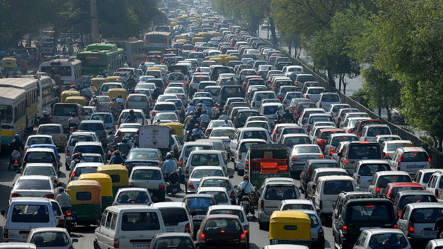
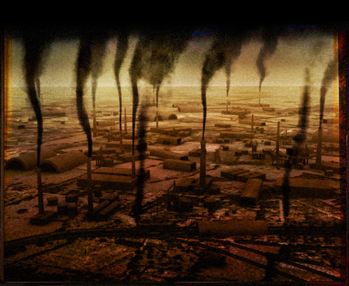

```{r setup, include=FALSE}
options(htmltools.dir.version = FALSE)
knitr::opts_chunk$set(echo=F,
                      message=F,
                      warning=F,
                      fig.retina = 3,
                      fig.align = "center")
library("tidyverse")
library("mosaic")
library("ggrepel")
library("fontawesome")
xaringanExtra::use_tile_view()
xaringanExtra::use_tachyons()
xaringanExtra::use_freezeframe()

update_geom_defaults("label", list(family = "Fira Sans Condensed"))
update_geom_defaults("text", list(family = "Fira Sans Condensed"))

set.seed(256)
```


class: title-slide

# 3.5 — Introduction to Political Economy

## ECON 306 • Microeconomic Analysis • Fall 2022

### Ryan Safner<br> Associate Professor of Economics <br> <a href="mailto:safner@hood.edu"><i class="fa fa-paper-plane fa-fw"></i>safner@hood.edu</a> <br> <a href="https://github.com/ryansafner/microF22"><i class="fa fa-github fa-fw"></i>ryansafner/microF22</a><br> <a href="https://microF22.classes.ryansafner.com"> <i class="fa fa-globe fa-fw"></i>microF22.classes.ryansafner.com</a><br>

---

class: inverse

# Outline

### [Policies That Raise Transaction Costs & Prevent Equilibrium](#3)
### [An Example: *Some* Economic Impacts of Covid](#9)
### [Making Fair Comparison](#37)

---

# Welfare Economics, Reminder

.pull-left[
.smallest[
- **Markets are great when:**
  1. They are .hi-purple[Competitive]: many buyers and many sellers
  2. They reach .hi-purple[equilibrium] (.hi-purple[prices are free to adjust]): absence of transactions costs or policies *preventing prices from adjusting* to meet supply and demand
  3. .hi-purple[There are no externalities]<sup>.magenta[†]</sup>: costs & benefits are fully internalized by the parties to transactions

- .hi[Market failure]: if these conditions are not met
  - May be role for governments, other institutions, or entrepreneurs to fix

]

]

.pull-right[
.center[

]

.footnote[<sup>.magenta[†]</sup> Or public goods, or asymmetric information. But I treat these as special cases of more common externalities.]

]

---

class: inverse, center, middle

# Policies That Raise Transaction Costs & Prevent Equilibrium

---

# Dis-equilibrated Markets

.pull-left[

.smallest[
- The .hi-purple[static benefits] of markets all come from markets .hi-purple[being in *equilibrium*] ([class 3.3](/content/3.3-content)):
  - allocative efficiency (.blue[CS]+.red[PS])
  - Pareto efficiency
  - productive efficiency

- But don’t forget the .hi-purple[dynamic benefits] of markets as a .hi-purple[discovery *process*]! ([class 3.4](/content/3.4-content))
  - *discovery* of better allocations of resources
  - creation & elimination of profit opportunities
  - entrepreneurship & innovation
]
]
.pull-right[
```{r}
Demand=function(x){10-x}
Supply=function(x){x}
cs<-tribble(
  ~x, ~y,
  0, 10,
  0, 5,
  5, 5
)
ps<-tribble(
  ~x, ~y,
  0, 0,
  0, 5,
  5, 5
)

ggplot(data.frame(x=c(0,10)), aes(x=x))+
  geom_polygon(data=cs, aes(x=x,y=y), fill="blue", alpha=0.5)+
  geom_polygon(data=ps, aes(x=x,y=y), fill="red", alpha=0.5)+
  stat_function(fun=Demand, geom="line", size=2, color = "blue")+
  stat_function(fun=Supply, geom="line", size=2, color = "red")+
  geom_label(aes(x=9,y=Demand(9)), color = "blue", label="Demand", size = 6)+
  geom_label(aes(x=9,y=Supply(9)), color = "red", label="Supply", size = 6)+
  geom_segment(aes(x=0, xend=5, y=5, yend=5),size=1, linetype="dotted")+
  geom_segment(aes(x=5, xend=5, y=5, yend=0),size=1, linetype="dotted")+
  scale_x_continuous(breaks=NULL,
                     limits=c(0,10),
                     expand=expand_scale(mult=c(0,0.1)))+
  scale_y_continuous(breaks=NULL,
                     limits=c(0,10),
                     expand=expand_scale(mult=c(0,0.1)))+
  coord_cartesian(clip="off")+
  labs(x = "Quantity",
       y = "Price")+
  theme_classic(base_family = "Fira Sans Condensed", base_size=16)
```
]

---

# Dis-equilibrated Markets

.pull-left[
.smaller[
- To *reach* equilibrium, market prices need to be able to adjust
  - **Shortage** $(\color{red}{Q_s}<\color{blue}{Q_d})$: price needs to rise
  - **Surplus** $(\color{red}{Q_s}>\color{blue}{Q_d})$: price needs to fall

- There are .b[*unrealized* gains from trade] that exist in disequilibrium (shaded)
  - .blue[Buyers] & .red[sellers] both can be made better off if they can adjust the price
]
]

.pull-right[
```{r}
dwl<-tribble(
  ~x, ~y,
  3, 3,
  3, 7,
  5, 5
)
dwlp<-ggplot(data.frame(x=c(0,10)), aes(x=x))+
  geom_polygon(data=dwl, aes(x=x,y=y), fill="black", alpha=0.5)+
  stat_function(fun=Demand, geom="line", size=2, color = "blue")+
  stat_function(fun=Supply, geom="line", size=2, color = "red")+
  geom_label(aes(x=9,y=Demand(9)), color = "blue", label="Demand", size = 6)+
  geom_label(aes(x=9,y=Supply(9)), color = "red", label="Supply", size = 6)+
  geom_segment(aes(x=0, xend=7, y=3, yend=3),size=1, linetype="dotted")+
  geom_segment(aes(x=0, xend=7, y=7, yend=7),size=1, linetype="dotted")+
  geom_segment(aes(x=3, xend=3, y=7, yend=0),size=1, linetype="dotted")+
  geom_segment(aes(x=7, xend=7, y=7, yend=0),size=1, linetype="dotted")+
  scale_x_continuous(breaks=NULL,
                     limits=c(0,10),
                     expand=expand_scale(mult=c(0,0.1)))+
  scale_y_continuous(breaks=NULL,
                     limits=c(0,10),
                     expand=expand_scale(mult=c(0,0.1)))+
  coord_cartesian(clip="off")+
  labs(x = "Quantity",
       y = "Price")+
  theme_classic(base_family = "Fira Sans Condensed", base_size=16)
dwlp
```
]

---

# Dis-equilibrated Markets

.pull-left[
.quitesmall[
- If market prices are *prevented* from adjusting, shortage/surplus becomes *permanent*

- Lost .blue[CS] and/or .red[PS]: .b[Deadweight loss (DWL)]
  - **inefficiency** created by (permanent) diseq.

- Various government policies can prevent markets from equilibrating & create DWL:
  - .hi-purple[Price regulations] (price ceiling like rent control, price floor like minimum wage)
  - .hi-purple[Taxes, subsidies, tariffs, quotas]<sup>.magenta[†]</sup>
  - These should have been covered in Principles (see my [slides](https://publics20.classes.ryansafner.com/slides/4.4-slides#1) on taxation from ECON 410)
]

.tiny[<sup>.magenta[†]</sup> Some may be necessary (taxes fund government), but create market inefficiencies.]
]

.pull-right[
```{r}
dwl<-tribble(
  ~x, ~y,
  3, 3,
  3, 7,
  5, 5
)
dwlp<-ggplot(data.frame(x=c(0,10)), aes(x=x))+
  geom_polygon(data=dwl, aes(x=x,y=y), fill="black", alpha=0.5)+
  stat_function(fun=Demand, geom="line", size=2, color = "blue")+
  stat_function(fun=Supply, geom="line", size=2, color = "red")+
  geom_label(aes(x=9,y=Demand(9)), color = "blue", label="Demand", size = 6)+
  geom_label(aes(x=9,y=Supply(9)), color = "red", label="Supply", size = 6)+
  geom_segment(aes(x=0, xend=7, y=3, yend=3),size=1, linetype="dotted")+
  geom_segment(aes(x=0, xend=7, y=7, yend=7),size=1, linetype="dotted")+
  geom_segment(aes(x=3, xend=3, y=7, yend=0),size=1, linetype="dotted")+
  geom_segment(aes(x=7, xend=7, y=7, yend=0),size=1, linetype="dotted")+
  scale_x_continuous(breaks=NULL,
                     limits=c(0,10),
                     expand=expand_scale(mult=c(0,0.1)))+
  scale_y_continuous(breaks=NULL,
                     limits=c(0,10),
                     expand=expand_scale(mult=c(0,0.1)))+
  coord_cartesian(clip="off")+
  labs(x = "Quantity",
       y = "Price")+
  theme_classic(base_family = "Fira Sans Condensed", base_size=16)
dwlp
```
]

---

class: inverse, center, middle

# An Example: *Some* Economic Impacts of Covid

---

# An Example: *Some* Economic Impacts of Covid

.pull-left[
.center[


.quitesmall[The toilet paper aisle of my Giant grocery store, March 2020]
]
]

.pull-right[

- Where did all of the ... go?
  - Toilet paper
  - Hand sanitizer
  - Masks
  - PPE
  - Ventilators

- Three major issues:
  - price elasticity of supply
  - price gouging laws
  - restrictions & regulations on supply
]

---

# Increase in Demand

.pull-left[
- Consider a market for a good in equilibrium, $P_1$

]

.pull-right[

```{r, fig.retina=3}
demand_1=function(x){10-x}
supply_1=function(x){x}

ggplot(data.frame(x=c(0,10)), aes(x=x))+
  stat_function(fun=demand_1, geom="line", size=2, color = "blue")+
    geom_label(aes(x=9,y=demand_1(9)), color = "blue", label="Demand = Max WTP", size = 3)+
  stat_function(fun=supply_1, geom="line", size=2, color = "red")+
    geom_label(aes(x=9,y=supply_1(9)), color = "red", label="Supply = Min WTA", size = 3)+
  geom_segment(x=0, xend=5, y=5, yend=5, size=1, linetype="dotted")+
  geom_segment(x=5, xend=5, y=0, yend=5, size=1, linetype="dotted")+
    scale_x_continuous(breaks=c(0,5),
                       labels=c(0,expression(Q[1])),
                       limits=c(0,10),
                       expand=expand_scale(mult=c(0,0.1)))+
  scale_y_continuous(breaks=c(0,5),
                     limits=c(0,20),
                     labels=c(0,expression(P[1])),
                     expand=expand_scale(mult=c(0,0.1)))+
  labs(x = "Quantity",
       y = "Price ($)")+
  theme_classic(base_family = "Fira Sans Condensed", base_size=20)

```

]

---

# Increase in Demand

.pull-left[
.smallest[
- More individuals want to buy more of the good at *every* price

- Demand *increases*, becomes *less elastic*
]
]

.pull-right[

```{r, fig.retina=3}
demand_up=function(x){20-1.75*x}

ggplot(data.frame(x=c(0,10)), aes(x=x))+
  stat_function(fun=demand_1, geom="line", size=2, color = "blue")+
    geom_label(aes(x=9,y=demand_1(9)), color = "blue", label="Demand = Max WTP", size = 3)+
  stat_function(fun=demand_up, geom="line", size=2, color = "darkblue")+
    geom_label(aes(x=9,y=demand_up(9)), color = "darkblue", label="Demand 2", size = 3)+
  stat_function(fun=supply_1, geom="line", size=2, color = "red")+
    geom_label(aes(x=9,y=supply_1(9)), color = "red", label="Supply = Min WTA", size = 3)+
  geom_segment(x=0, xend=5, y=5, yend=5, size=1, linetype="dotted")+
  geom_segment(x=5, xend=5, y=0, yend=5, size=1, linetype="dotted")+
    scale_x_continuous(breaks=c(0,5),
                       labels=c(0,expression(Q[1])),
                       limits=c(0,10),
                       expand=expand_scale(mult=c(0,0.1)))+
  scale_y_continuous(breaks=c(0,5),
                     limits=c(0,20),
                     labels=c(0,expression(P[1])),
                     expand=expand_scale(mult=c(0,0.1)))+
  labs(x = "Quantity",
       y = "Price ($)")+
  theme_classic(base_family = "Fira Sans Condensed", base_size=20)

```

]

---

# Increase in Demand

.pull-left[
.smallest[
- More individuals want to buy more of the good at *every* price

- Demand *increases*, becomes *less elastic*

- At the original market price, a .hi-purple[shortage!] $(\color{blue}{q_D} > \color{red}{q_S})$
]
]

.pull-right[

```{r, fig.retina=3}
ggplot(data.frame(x=c(0,10)), aes(x=x))+
  stat_function(fun=demand_1, geom="line", size=2, color = "blue")+
    geom_label(aes(x=9,y=demand_1(9)), color = "blue", label="Demand = Max WTP", size = 3)+
  stat_function(fun=demand_up, geom="line", size=2, color = "darkblue")+
    geom_label(aes(x=9,y=demand_up(9)), color = "darkblue", label="Demand 2", size = 3)+
  stat_function(fun=supply_1, geom="line", size=2, color = "red")+
    geom_label(aes(x=9,y=supply_1(9)), color = "red", label="Supply = Min WTA", size = 3)+
  geom_segment(x=0, xend=8.57, y=5, yend=5, size=1, linetype="dotted")+
  geom_segment(x=5, xend=5, y=0, yend=5, size=1, linetype="dotted")+
  
  geom_segment(x=8.57, xend=8.57, y=0, yend=5, size=1, linetype="dotted")+

  annotate("segment", x = 5, xend = 8.57, y = 5, yend = 5, colour = "purple", size=2, alpha=1, arrow=arrow(length=unit(0.5,"cm"), ends="both", type="closed"))+
  geom_label(x=7, y=5, label="Shortage", color="purple")+

    scale_x_continuous(breaks=c(0,5,8.57),
                       labels=c(0,expression(Q[1]),expression(Q[D])),
                       limits=c(0,10),
                       expand=expand_scale(mult=c(0,0.1)))+
  scale_y_continuous(breaks=c(0,5),
                     limits=c(0,20),
                     labels=c(0,expression(P[1])),
                     expand=expand_scale(mult=c(0,0.1)))+
  labs(x = "Quantity",
       y = "Price ($)")+
  theme_classic(base_family = "Fira Sans Condensed", base_size=20)
```

]

---

# Increase in Demand

.pull-left[
.smallest[
- More individuals want to buy more of the good at *every* price

- Demand *increases*, becomes *less elastic*

- At the original market price, a .hi-purple[shortage!] $(\color{blue}{q_D} > \color{red}{q_S})$

- .red[Sellers] are supplying $Q_1$, but some .blue[buyers] willing to pay more for $Q_1$
]
]
.pull-right[

```{r, fig.retina=3}
ggplot(data.frame(x=c(0,10)), aes(x=x))+
  stat_function(fun=demand_1, geom="line", size=2, color = "blue")+
    geom_label(aes(x=9,y=demand_1(9)), color = "blue", label="Demand = Max WTP", size = 3)+
  stat_function(fun=demand_up, geom="line", size=2, color = "darkblue")+
    geom_label(aes(x=9,y=demand_up(9)), color = "darkblue", label="Demand 2", size = 3)+
  stat_function(fun=supply_1, geom="line", size=2, color = "red")+
    geom_label(aes(x=9,y=supply_1(9)), color = "red", label="Supply = Min WTA", size = 3)+
  geom_segment(x=0, xend=8.57, y=5, yend=5, size=1, linetype="dotted")+
  geom_segment(x=5, xend=5, y=0, yend=5, size=1, linetype="dotted")+
  
  geom_segment(x=8.57, xend=8.57, y=0, yend=5, size=1, linetype="dotted")+

    # higher wtp
  geom_segment(x=0, xend=5, y=demand_up(5), yend=demand_up(5), size=1, linetype="dotted")+
  geom_segment(x=5, xend=5, y=5, yend=demand_up(5), size=1, linetype="dotted")+

  
  annotate("segment", x = 5, xend = 8.57, y = 5, yend = 5, colour = "purple", size=2, alpha=1, arrow=arrow(length=unit(0.5,"cm"), ends="both", type="closed"))+
  geom_label(x=7, y=5, label="Shortage", color="purple")+

    scale_x_continuous(breaks=c(0,5,8.57),
                       labels=c(0,expression(Q[1]),expression(Q[D])),
                       limits=c(0,10),
                       expand=expand_scale(mult=c(0,0.1)))+
  scale_y_continuous(breaks=c(0,5, demand_up(5)),
                     limits=c(0,20),
                     labels=c(0,expression(P[1]), expression(P[D])),
                     expand=expand_scale(mult=c(0,0.1)))+
  labs(x = "Quantity",
       y = "Price ($)")+
  theme_classic(base_family = "Fira Sans Condensed", base_size=20)

```

]

---

# Increase in Demand


.pull-left[
.smallest[
- More individuals want to buy more of the good at *every* price

- Demand *increases*, becomes *less elastic*

- At the original market price, a .hi-purple[shortage!] $(\color{blue}{q_D} > \color{red}{q_S})$

- .red[Sellers] are supplying $Q_1$, but some .blue[buyers] willing to pay more for $Q_1$

- .blue[Buyers] raise bids, inducing .red[sellers] to sell more

- Reach new equilibrium with:
  - **higher market-clearing price** $(P_2)$
  - **larger market-clearing q. exchanged** $(Q_2)$
]
]
.pull-right[

```{r, fig.retina=3}
ggplot(data.frame(x=c(0,10)), aes(x=x))+
  stat_function(fun=demand_1, geom="line", size=2, color = "blue")+
    geom_label(aes(x=9,y=demand_1(9)), color = "blue", label="Demand = Max WTP", size = 3)+
  stat_function(fun=demand_up, geom="line", size=2, color = "darkblue")+
    geom_label(aes(x=9,y=demand_up(9)), color = "darkblue", label="Demand 2", size = 3)+
  stat_function(fun=supply_1, geom="line", size=2, color = "red")+
    geom_label(aes(x=9,y=supply_1(9)), color = "red", label="Supply = Min WTA", size = 3)+
  geom_segment(x=0, xend=8.57, y=5, yend=5, size=1, linetype="dotted")+
  geom_segment(x=5, xend=5, y=0, yend=5, size=1, linetype="dotted")+
  
  geom_segment(x=8.57, xend=8.57, y=0, yend=5, size=1, linetype="dotted")+

    # higher wtp
  geom_segment(x=0, xend=5, y=demand_up(5), yend=demand_up(5), size=1, linetype="dotted")+
  geom_segment(x=5, xend=5, y=5, yend=demand_up(5), size=1, linetype="dotted")+

    # new eq
  geom_segment(x=0, xend=7.27, y=7.27, yend=7.27, size=1, linetype="dotted")+
  geom_segment(x=7.27, xend=7.27, y=0, yend=7.27, size=1, linetype="dotted")+

  
  annotate("segment", x = 5, xend = 7.27, y = 5, yend = 7.27, colour = "black", size=2, alpha=1, arrow=arrow(length=unit(0.5,"cm"), ends="last", type="closed"))+

    scale_x_continuous(breaks=c(0,5,7.27,8.57),
                       labels=c(0,expression(Q[1]),expression(Q[2]),expression(Q[D])),
                       limits=c(0,10),
                       expand=expand_scale(mult=c(0,0.1)))+
  scale_y_continuous(breaks=c(0,5, 7.27, demand_up(5)),
                     limits=c(0,20),
                     labels=c(0,expression(P[1]), expression(P[2]),expression(P[D])),
                     expand=expand_scale(mult=c(0,0.1)))+
  labs(x = "Quantity",
       y = "Price ($)")+
  theme_classic(base_family = "Fira Sans Condensed", base_size=20)
```

]

---

# One Possibility: Inelastic Supply

.pull-left[
.smallest[
- It might that .red[supply] is very *inelastic*
  - Here: *perfectly* inelastic (for convenience)

- Suppliers can’t produce and sell more units even if they want to at very high price demanded
  - sudden shock to inventories (short run)
  - rising production costs
  - government regulations & restrictions

- Thus, the new high price is an equilibrium that will persist for a while
  - no “inefficiency,” just a fixed supply of goods we cannot easily change
]
]

.pull-right[

```{r, fig.retina=3}
inelastic<-ggplot(data.frame(x=c(0,10)), aes(x=x))+
  stat_function(fun=demand_1, geom="line", size=2, color = "blue")+
    geom_label(aes(x=9,y=demand_1(9)), color = "blue", label="Demand = Max WTP", size = 3)+
  stat_function(fun=demand_up, geom="line", size=2, color = "darkblue")+
    geom_label(aes(x=9,y=demand_up(9)), color = "darkblue", label="Demand 2", size = 3)+
  geom_vline(xintercept = 5, size = 2, color = "red")+
    geom_label(aes(x=5,y=19), color = "red", label="Supply = Min WTA", size = 3)+
  geom_segment(x=0, xend=5, y=demand_up(5), yend=demand_up(5), size=1, linetype="dotted")+
  geom_segment(x=0, xend=5, y=5, yend=5, size=1, linetype="dotted")+
    scale_x_continuous(breaks=c(0,5),
                       labels=c(0,expression(Q[1])),
                       limits=c(0,10),
                       expand=expand_scale(mult=c(0,0.1)))+
  scale_y_continuous(breaks=c(0,5, demand_up(5)),
                     limits=c(0,20),
                     labels=c(0,expression(P[1]), expression(P[2])),
                     expand=expand_scale(mult=c(0,0.1)))+
  labs(x = "Quantity",
       y = "Price ($)")+
  theme_classic(base_family = "Fira Sans Condensed", base_size=16)
inelastic
```

]

---

# One Possibility: Inelastic Supply

.pull-left[
.center[
[](https://www.flexport.com/blog/why-there-arent-enough-masks-and-how-to-get-more/)
]

]

.pull-right[

```{r, fig.retina=3}
inelastic
```

]

---

# Price Gouging Laws

.pull-left[

- Additionally, government has .hi-purple[anti-price-gouging laws], a .hi-purple[price ceiling] at the original price, $P_1$

- $\color{blue}{Q_d}>\color{red}{Q_s}$: .hi-purple[excess demand], a .hi-purple[shortage]!

- Sellers will not supply more than $Q_1$ at price $\bar{P_1}$

]

.pull-right[

```{r, fig.retina=3}
ggplot(data.frame(x=c(0,10)), aes(x=x))+
  geom_hline(yintercept=5, size=2.5)+
  geom_label(x=2,y=5, label="Price Ceiling", size =3)+
  stat_function(fun=demand_1, geom="line", size=2, color = "blue")+
    geom_label(aes(x=9,y=demand_1(9)), color = "blue", label="Demand = Max WTP", size = 3)+
  stat_function(fun=demand_up, geom="line", size=2, color = "darkblue")+
    geom_label(aes(x=9,y=demand_up(9)), color = "darkblue", label="Demand 2", size = 3)+
  stat_function(fun=supply_1, geom="line", size=2, color = "red")+
    geom_label(aes(x=9,y=supply_1(9)), color = "red", label="Supply = Min WTA", size = 3)+
  geom_segment(x=5, xend=5, y=0, yend=5, size=1, linetype="dotted")+
  
  geom_segment(x=8.57, xend=8.57, y=0, yend=5, size=1, linetype="dotted")+

  annotate("segment", x = 5, xend = 8.57, y = 5, yend = 5, colour = "purple", size=2, alpha=1, arrow=arrow(length=unit(0.5,"cm"), ends="both", type="closed"))+
  geom_label(x=7, y=5, label="Shortage", color="purple")+

    scale_x_continuous(breaks=c(0,5,8.57),
                       labels=c(0,expression(Q[1]),expression(Q[D])),
                       limits=c(0,10),
                       expand=expand_scale(mult=c(0,0.1)))+
  scale_y_continuous(breaks=c(0,5),
                     limits=c(0,20),
                     labels=c(0,expression(bar(P[1]))),
                     expand=expand_scale(mult=c(0,0.1)))+
  labs(x = "Quantity",
       y = "Price ($)")+
  theme_classic(base_family = "Fira Sans Condensed", base_size=20)
```

]

---

# Price Gouging Laws

.pull-left[

- Additionally, government has .hi-purple[anti-price-gouging laws], a .hi-purple[price ceiling] at the original price, $P_1$

- $\color{blue}{Q_d}>\color{red}{Q_s}$: .hi-purple[excess demand], a .hi-purple[shortage]!

- Sellers will not supply more than $Q_1$ at price $\bar{P_1}$

- For $Q_1$ units, buyers are willing to pay $P_D$!

]

.pull-right[
```{r, fig.retina=3}
ggplot(data.frame(x=c(0,10)), aes(x=x))+
    geom_hline(yintercept=5, size=2.5)+
  geom_label(x=2,y=5, label="Price Ceiling", size =3)+

  stat_function(fun=demand_1, geom="line", size=2, color = "blue")+
    geom_label(aes(x=9,y=demand_1(9)), color = "blue", label="Demand = Max WTP", size = 3)+
  stat_function(fun=demand_up, geom="line", size=2, color = "darkblue")+
    geom_label(aes(x=9,y=demand_up(9)), color = "darkblue", label="Demand 2", size = 3)+
  stat_function(fun=supply_1, geom="line", size=2, color = "red")+
    geom_label(aes(x=9,y=supply_1(9)), color = "red", label="Supply = Min WTA", size = 3)+
  geom_segment(x=5, xend=5, y=0, yend=5, size=1, linetype="dotted")+
  
  geom_segment(x=8.57, xend=8.57, y=0, yend=5, size=1, linetype="dotted")+

    # higher wtp
  geom_segment(x=0, xend=5, y=demand_up(5), yend=demand_up(5), size=1, linetype="dotted")+
  geom_segment(x=5, xend=5, y=5, yend=demand_up(5), size=1, linetype="dotted")+

  
  annotate("segment", x = 5, xend = 8.57, y = 5, yend = 5, colour = "purple", size=2, alpha=1, arrow=arrow(length=unit(0.5,"cm"), ends="both", type="closed"))+
  geom_label(x=7, y=5, label="Shortage", color="purple")+

    scale_x_continuous(breaks=c(0,5,8.57),
                       labels=c(0,expression(Q[1]),expression(Q[D])),
                       limits=c(0,10),
                       expand=expand_scale(mult=c(0,0.1)))+
  scale_y_continuous(breaks=c(0,5, demand_up(5)),
                     limits=c(0,20),
                     labels=c(0,expression(bar(P[1])), expression(P[D])),
                     expand=expand_scale(mult=c(0,0.1)))+
  labs(x = "Quantity",
       y = "Price ($)")+
  theme_classic(base_family = "Fira Sans Condensed", base_size=20)
```
]

---

# Price Gouging Laws

.pull-left[

- .hi-purple[If prices were allowed to adjust]: buyers would bid higher prices to get the scarce $Q_s$ goods

- Sellers would respond to rising willingness to pay, and produce and sell more

- .hi-purple[But the price is not allowed to rise above `\\(\bar{P_1}\\)`]!

]

.pull-right[
```{r, fig.retina=3}
ggplot(data.frame(x=c(0,10)), aes(x=x))+
    geom_hline(yintercept=5, size=2.5)+
  geom_label(x=2,y=5, label="Price Ceiling", size =3)+

  stat_function(fun=demand_1, geom="line", size=2, color = "blue")+
    geom_label(aes(x=9,y=demand_1(9)), color = "blue", label="Demand = Max WTP", size = 3)+
  stat_function(fun=demand_up, geom="line", size=2, color = "darkblue")+
    geom_label(aes(x=9,y=demand_up(9)), color = "darkblue", label="Demand 2", size = 3)+
  stat_function(fun=supply_1, geom="line", size=2, color = "red")+
    geom_label(aes(x=9,y=supply_1(9)), color = "red", label="Supply = Min WTA", size = 3)+
  geom_segment(x=5, xend=5, y=0, yend=5, size=1, linetype="dotted")+
  
  geom_segment(x=8.57, xend=8.57, y=0, yend=5, size=1, linetype="dotted")+

    # higher wtp
  geom_segment(x=0, xend=5, y=demand_up(5), yend=demand_up(5), size=1, linetype="dotted")+
  geom_segment(x=5, xend=5, y=5, yend=demand_up(5), size=1, linetype="dotted")+

  
  annotate("segment", x = 5, xend = 8.57, y = 5, yend = 5, colour = "purple", size=2, alpha=1, arrow=arrow(length=unit(0.5,"cm"), ends="both", type="closed"))+
  geom_label(x=7, y=5, label="Shortage", color="purple")+

    scale_x_continuous(breaks=c(0,5,8.57),
                       labels=c(0,expression(Q[1]),expression(Q[D])),
                       limits=c(0,10),
                       expand=expand_scale(mult=c(0,0.1)))+
  scale_y_continuous(breaks=c(0,5, demand_up(5)),
                     limits=c(0,20),
                     labels=c(0,expression(bar(P[1])), expression(P[D])),
                     expand=expand_scale(mult=c(0,0.1)))+
  labs(x = "Quantity",
       y = "Price ($)")+
  theme_classic(base_family = "Fira Sans Condensed", base_size=20)
```
]

---

# Price Gouging Laws

.pull-left[
.smallest[
- Official price is $\over{P_1}$, sellers gain .green[monetary revenues]

]
]

.pull-right[
```{r, fig.retina=3}
ggplot(data.frame(x=c(0,10)), aes(x=x))+
  geom_rect(xmin=0, xmax=5, ymin=0, ymax=5, fill="green", alpha=0.5)+
    geom_hline(yintercept=5, size=2.5)+
  geom_label(x=2,y=5, label="Price Ceiling", size =3)+

  stat_function(fun=demand_1, geom="line", size=2, color = "blue")+
    geom_label(aes(x=9,y=demand_1(9)), color = "blue", label="Demand = Max WTP", size = 3)+
  stat_function(fun=demand_up, geom="line", size=2, color = "darkblue")+
    geom_label(aes(x=9,y=demand_up(9)), color = "darkblue", label="Demand 2", size = 3)+
  stat_function(fun=supply_1, geom="line", size=2, color = "red")+
    geom_label(aes(x=9,y=supply_1(9)), color = "red", label="Supply = Min WTA", size = 3)+
  geom_segment(x=5, xend=5, y=0, yend=5, size=1, linetype="dotted")+
  
  geom_segment(x=8.57, xend=8.57, y=0, yend=5, size=1, linetype="dotted")+

    # higher wtp
  geom_segment(x=0, xend=5, y=demand_up(5), yend=demand_up(5), size=1, linetype="dotted")+
  geom_segment(x=5, xend=5, y=5, yend=demand_up(5), size=1, linetype="dotted")+

  geom_label(x=2.5, y=3, label="Official Cost", color="green", size =5)+

  annotate("segment", x = 5, xend = 8.57, y = 5, yend = 5, colour = "purple", size=2, alpha=1, arrow=arrow(length=unit(0.5,"cm"), ends="both", type="closed"))+
  geom_label(x=7, y=5, label="Shortage", color="purple")+

    scale_x_continuous(breaks=c(0,5,8.57),
                       labels=c(0,expression(Q[1]),expression(Q[D])),
                       limits=c(0,10),
                       expand=expand_scale(mult=c(0,0.1)))+
  scale_y_continuous(breaks=c(0,5, demand_up(5)),
                     limits=c(0,20),
                     labels=c(0,expression(bar(P[1])), expression(P[D])),
                     expand=expand_scale(mult=c(0,0.1)))+
  labs(x = "Quantity",
       y = "Price ($)")+
  theme_classic(base_family = "Fira Sans Condensed", base_size=20)
```
]

---

# Price Gouging Laws

.pull-left[
.smallest[
- Official price is $\over{P_1}$, sellers gain .green[monetary revenues]

- Competition exists between buyers to obtain scarce $Q_s$ goods
  - Buyers willing to pay $P_D$ *unofficially*

- Goods are distributed by non-market means:
  - Queuing
  - Black markets
  - Political connections, favors, corruption

- **Economic rents**: excess returns (above opp. cost) to those who own the scarce goods
]
]

.pull-right[
```{r, fig.retina=3}
ggplot(data.frame(x=c(0,10)), aes(x=x))+
  geom_rect(xmin=0, xmax=5, ymin=0, ymax=5, fill="green", alpha=0.5)+
  geom_rect(xmin=0, xmax=5, ymin=5, ymax=demand_up(5), fill="black", alpha=0.5)+
    geom_hline(yintercept=5, size=2.5)+
  geom_label(x=2,y=5, label="Price Ceiling", size =3)+

  stat_function(fun=demand_1, geom="line", size=2, color = "blue")+
    geom_label(aes(x=9,y=demand_1(9)), color = "blue", label="Demand = Max WTP", size = 3)+
  stat_function(fun=demand_up, geom="line", size=2, color = "darkblue")+
    geom_label(aes(x=9,y=demand_up(9)), color = "darkblue", label="Demand 2", size = 3)+
  stat_function(fun=supply_1, geom="line", size=2, color = "red")+
    geom_label(aes(x=9,y=supply_1(9)), color = "red", label="Supply = Min WTA", size = 3)+
  geom_segment(x=5, xend=5, y=0, yend=5, size=1, linetype="dotted")+
  
  geom_segment(x=8.57, xend=8.57, y=0, yend=5, size=1, linetype="dotted")+

    # higher wtp
  geom_segment(x=0, xend=5, y=demand_up(5), yend=demand_up(5), size=1, linetype="dotted")+
  geom_segment(x=5, xend=5, y=5, yend=demand_up(5), size=1, linetype="dotted")+

  geom_label(x=2.5, y=3, label="Official Cost", color="green", size =5)+
  geom_label(x=2.5, y=8, label="Rents", color="black", size =5)+

  annotate("segment", x = 5, xend = 8.57, y = 5, yend = 5, colour = "purple", size=2, alpha=1, arrow=arrow(length=unit(0.5,"cm"), ends="both", type="closed"))+
  geom_label(x=7, y=5, label="Shortage", color="purple")+

    scale_x_continuous(breaks=c(0,5,8.57),
                       labels=c(0,expression(Q[1]),expression(Q[D])),
                       limits=c(0,10),
                       expand=expand_scale(mult=c(0,0.1)))+
  scale_y_continuous(breaks=c(0,5, demand_up(5)),
                     limits=c(0,20),
                     labels=c(0,expression(bar(P[1])), expression(P[D])),
                     expand=expand_scale(mult=c(0,0.1)))+
  labs(x = "Quantity",
       y = "Price ($)")+
  theme_classic(base_family = "Fira Sans Condensed", base_size=20)
```
]

---

# Forms of Rents

.pull-left[
.center[
[](https://www.nytimes.com/2020/03/14/technology/coronavirus-purell-wipes-amazon-sellers.html)
]
]

.pull-right[
.center[
[](https://www.washingtonpost.com/nation/2020/04/26/long-lines-coronavirus/?arc404=true)
]
]

---

# (Temporarily) Raising Prices Can Solve the Shortage

.pull-left[

.center[

]
]

.pull-right[
.smaller[
A relatively high price:

- .hi-purple[Conveys information]: good is relatively scarce

- .hi-purple[Creates incentives for]:
  - **Buyers**: conserve use of this good, seek substitites
  - **Sellers**: produce more of this good
  - **Entrepreneurs**: find substitutes and innovations to satisfy this unmet need
]
]

---

# (Temporarily) Raising Prices Can Solve the Shortage

.pull-left[
.center[
[](https://www.aier.org/article/why-no-shortages-in-canada-as-compared-with-the-u-s/)
]
]

.pull-right[
.smallest[
"The *Canadian National Post*, citing the Canadian Food Inspection Agency, says that 'There are no shortages or disruptions to [food] production, importation or export,' and that 'the shelves remain stocked.' ... 'A price surge as a result of natural market forces is not something that is regulated by Canadian competition laws or otherwise. Canada’s competition laws generally don’t interfere with the free market.' ... Canadians will have enough food to eat. But it will be more expensive.

]
]

---

# (Temporarily) Raising Prices Can Solve the Shortage

.center[
<blockquote class="twitter-tweet"><p lang="en" dir="ltr">A supermarket in Denmark got tired of people hoarding hand sanitizer, so came up with their own way of stopping it.<br><br>1 bottle kr40 (€5.50)<br>2 bottles kr1000 (€134.00) each bottle.<br><br>Hoarding stopped!<a href="https://twitter.com/hashtag/COVID19?src=hash&amp;ref_src=twsrc%5Etfw">#COVID19</a> <a href="https://twitter.com/hashtag/Hoarding?src=hash&amp;ref_src=twsrc%5Etfw">#Hoarding</a> <a href="https://t.co/eKTabEjScc">pic.twitter.com/eKTabEjScc</a> (via <a href="https://twitter.com/_schuermann?ref_src=twsrc%5Etfw">@_schuermann</a>) cc <a href="https://twitter.com/svenseele?ref_src=twsrc%5Etfw">@svenseele</a></p>&mdash; Birger (@Birger_s) <a href="https://twitter.com/Birger_s/status/1240163073928953856?ref_src=twsrc%5Etfw">March 18, 2020</a></blockquote> <script async src="https://platform.twitter.com/widgets.js" charset="utf-8"></script> 
]

---

# Supply-Side Restrictions & Regulatory Burden

.pull-left[
.center[
[](https://www.theatlantic.com/ideas/archive/2020/04/coronavirus-strikes-blow-economic-liberty/610015/?utm_source=feed)
]
]

.pull-right[
.smallest[
"As the nation’s economy and health-care system struggle to adjust to the pandemic, more and more states are reexamining some of their oldest occupational and business regulations—rules that, although couched as protecting consumers, do far more to limit competition...While some states have ordered their occupational-licensing boards to speed up the licensure of new health-care practitioners, others...are granting immediate licensing reciprocity to any practitioner licensed in any state...Even Florida, which has long jealously guarded its occupational-licensing regime to prevent semiretired snowbirds from poaching on the locals’ turf, [is] allowing out-of-state health-care providers to practice telemedicine in the state without a license."
]
]
---

# Supply-Side Restrictions & Regulatory Burden

.pull-left[
.center[
[](https://www.theatlantic.com/ideas/archive/2020/04/coronavirus-strikes-blow-economic-liberty/610015/?utm_source=feed)
]
]

.pull-right[
.smallest[
"Illinois has waived licensure fees for retired medical practitioners who wish to resume practice. Oklahoma and Massachusetts have eliminated restrictions that required doctors to have a preexisting doctor-patient relationship before they could offer telemedicine services."
]
]
---

# Supply-Side Restrictions & Regulatory Burden

.pull-left[
.center[
[](https://www.theatlantic.com/ideas/archive/2020/04/coronavirus-strikes-blow-economic-liberty/610015/?utm_source=feed)
]
]

.pull-right[
.smallest[
"Also being reexamined are state certificate-of-need, or CON, laws. A product of 1970s-era economic regulation, CON laws require health-care providers to prove that new services are “needed” before they may purchase certain large equipment, open new or expanded facilities, or—as is crucial now—offer home health-care services. Often, these laws give an effective veto power to existing medical providers, allowing them to torpedo new competition for their own benefit...Basic economics predicts that competition reduces prices for consumers, and occupational licensing works directly to stifle competition."
]
]

---

# Supply-Side Restrictions & Regulatory Burden

.pull-left[
.center[
[](https://www.theatlantic.com/ideas/archive/2020/04/coronavirus-strikes-blow-economic-liberty/610015/?utm_source=feed)
]
]

.pull-right[
.smallest[
"The University of Minnesota economist Morris Kleiner, a leading researcher on occupational licensing, estimates that licensing costs consumers nearly $200 billion annually. This might be justifiable if licensing produced substantial improvements in quality, yet most research has failed to find a connection between licensure and service quality or safety."
]
]

---
# Supply-Side Restrictions & Regulatory Burden

.pull-left[
.center[
[](https://reason.com/2020/04/03/fda-will-lift-restrictions-on-face-mask-imports-toppling-another-pointless-regulation/)
]
]

.pull-right[
.center[
[](https://reason.com/2020/03/31/los-angeles-bureaucrats-barbara-ferrer-shut-down-restaurants-for-selling-groceries-without-a-permit/)
]
]

---

# Supply-Side Restrictions & Regulatory Burden

.pull-left[
.center[
[](https://reason.com/2020/03/31/america-could-import-countless-more-face-masks-if-federal-regulators-would-get-out-of-the-way/)
]
]

.pull-right[
.center[
[](https://fee.org/articles/a-look-at-the-fdas-process-for-approving-surgical-masks/)
]
]

---

# Supply-Side Restrictions & Regulatory Burden

.pull-left[
.center[
[](https://www.nbcnews.com/health/health-care/many-private-labs-want-do-coronavirus-tests-they-re-facing-n1156006)
]
]

.pull-right[
.center[
[](https://reason.com/2020/03/24/america-needs-billions-of-new-masks-to-combat-coronavirus-federal-regulators-say-itll-take-months-to-approve-new-mask-making-facilities/)
]
]

---

# Supply-Side Restrictions & Regulatory Burden

.pull-left[
.center[
[](https://thedispatch.com/p/timeline-the-regulationsand-regulatorsthat)
]
]

.pull-right[
.smallest[
How did the U.S. government only manage to produce a fraction as many testing kits as its peer countries? There have been three major regulatory barriers so far to scaling up testing by public labs and private companies: 1) obtaining an Emergency Use Authorization (EUA); 2) being certified to perform high-complexity testing consistent with requirements under Clinical Laboratory Improvement Amendments (CLIA);...
]
]

---

# Supply-Side Restrictions & Regulatory Burden

.pull-left[
.center[
[](https://thedispatch.com/p/timeline-the-regulationsand-regulatorsthat)
]
]

.pull-right[
.smallest[
...and 3) complying with the Health Insurance Portability and Accountability Act (HIPAA) Privacy Rule and the Common Rule related to the protection of human research subjects. On the demand side, narrow restrictions on who qualified for testing prevented the U.S. from adequately using what capacity it did have.
]
]

---

# Supply-Side Restrictions & Regulatory Burden

<blockquote class="twitter-tweet"><p lang="en" dir="ltr">Honestly, I’m not sure people completely understand how small distilleries, generally with VERY little capital on hand, are changing their business models in just a week. We appreciate the outpouring of love. We’re working like crazy to get what we need to make more sanitizer.</p>&mdash; Skip Tognetti (@togneter) <a href="https://twitter.com/togneter/status/1242853822445182976?ref_src=twsrc%5Etfw">March 25, 2020</a></blockquote> <script async src="https://platform.twitter.com/widgets.js" charset="utf-8"></script> 

---

# Supply-Side Restrictions & Regulatory Burden

<blockquote class="twitter-tweet"><p lang="en" dir="ltr">There is literally no medical reason to denature. Taxation. That’s it. <br><br>In WA, that means if I sell a liter for $10, which I’m barely covering my costs on, the tax owed between state and federal governments is EIGHT DOLLARS AND TWENTY THREE CENTS.<br><br>And yet...</p>&mdash; Skip Tognetti (@togneter) <a href="https://twitter.com/togneter/status/1242853835602710529?ref_src=twsrc%5Etfw">March 25, 2020</a></blockquote> <script async src="https://platform.twitter.com/widgets.js" charset="utf-8"></script> 

---

class: inverse, center, middle

# Making Fair Comparisons

---

# Government Failure & Market Failure

.pull-left[
.smallest[
- We've talked about .hi[market failure] under certain conditions

- However there is also .hi[government failure]
  - corruption, rent-seeking, voter ignorance, voter irrationality, special interest groups, regulatory capture

- So stop comparing *ideal* institutions in theory and see how *they work in practice*

- Learn more in my [Public Economics](https://publics22.classes.ryansafner.com) course

]

.center[

]
]

.pull-right[
.center[

]
]

---

# Economic Theory *Assumes* Good Institutions

.pull-left[
.smallest[
- Markets & price theory: how consumers & producers specialize, produce, & exchange within .hi-purple[given, well-functioning markets (& politics)]

- **Assumes** existence of "good" economic & political institutions that facilitate market exchange
  - low transaction costs
  - clear and enforced property rights
  - rule of law
  - contract enforcement
  - capable, high-capacity, non-corrupt government
  - dispute resolution
  - high level of social trust
]
]

.pull-right[
.center[

]
]

---

# Two Fundamental Problems of Political Economy

- All societies face two fundamental problems, which institutions emerge (or are created) to address:

.content-box-red[
.red[**The Knowledge Problem**]: How to coordinate the *tacit*, *fragmented* knowledge of opportunities and conditions *dispersed* across millions of individuals (and accessible to none in total) in order to maximize the ability of individuals to achieve their goals
]

--

.content-box-red[
.red[**The Incentives Problem**]: How to structure incentives that individuals face in a way that maximizes cooperative behavior (voluntary exchange and association) and minimizes non-cooperative behavior (cheating, opportunism, exploitation, violence, rent-seeking)
]

---

# Robust Political Economy

.pull-left[
.quitesmall[
- .hi-purple[No system is perfect]

- We need to find arrangements that are .hi[robust] to knowledge & incentive problems

- .hi-turquoise[Easy (unpersuasive) case]: perfect information & pure benevolence
  - every system works *in theory!*

- .hi-turquoise[Hard (persuasive) case]: uncertainty & selfish behavior
  - what works best *in practice*?
  
- Treat people as they are: sometimes good, bad, smart, stupid, opportunistic, altruistic, *depending on the institutions they face!*

]
]

.pull-right[
.center[

]
]
---

# Robust Political Economy

.center[

]

---

# A Bad Argument for Markets

.center[
<iframe width="980" height="550" src="https://www.youtube.com/embed/PF_iorX_MAw" frameborder="0" allow="accelerometer; autoplay; encrypted-media; gyroscope; picture-in-picture" allowfullscreen></iframe>
]


---

# A Better, Comparative, Argument for Markets

.center[
<iframe width="980" height="550" src="https://www.youtube.com/embed/RWsx1X8PV_A" title="YouTube video player" frameborder="0" allow="accelerometer; autoplay; clipboard-write; encrypted-media; gyroscope; picture-in-picture" allowfullscreen></iframe>
]

---

# Robust Political Economy

.pull-left[
.smaller[
- People often recommend optimal policies as if they could be installed by a .hi-purple[benevolent dictator]
  - A dispassionate ruler with .hi-turquoise[total control], .hi-turquoise[perfect information], and .hi-turquoise[selfless incentives] to implement optimal policy
  - A “1<sup>st</sup>-best solution”

- In reality, 1<sup>st</sup>-best policies are distorted by the knowledge problem, the incentives problem, and politics
  - Real world: 2<sup>nd</sup>-to-*n*<sup>th</sup>-best outcomes
]
]
.pull-right[
.center[

]
]


---

# Comparative Institutional Analysis

.pull-left[
.smallest[
- Compare imperfections of *feasible* and *relevant* *alternative* systems
  - .hi[The “Nirvana Fallacy”]: comparing an imperfect system in reality with an ideal system in theory

- Economics: *think on the margin!* 
  - One system's “failure” does not automatically imply another will be “successful”!
  - Real world requires .hi-turquoise[tradeoffs]
  - “economics puts parameters on people's utopias”
  - “compared to what?”
]
]

.pull-right[
.center[

]
]

---

# Institutions: Operationalizing Adam Smith 

.left-column[
.center[


Adam Smith

1723-1790
]
]

.right-column[

> “[Though] he intends only his own gain, and he is in this, as in many other cases, led by an invisible hand to promote an end which was no part of his intention...By pursuing his own interest he frequently promotes that of the society more effectually than when he really intends to promote it,” (Book IV, Chapter 2.9).
]

.source[Smith, Adam, 1776, [*An Enquiry into the Nature and Causes of the Wealth of Nations*](https://www.econlib.org/library/Smith/smWN.html)]

---

# Self-Interest Doesn’t *Always* Benefit Society 

.pull-left[
.center[

]
]

.pull-right[
.center[

]
]

---

# Institutions: Operationalizing Adam Smith 

.pull-left[

```{r, fig.align = "center", fig.retina = 3}
plot_eqs <- tibble(x = c(1,3),
                 y = c(1,1),
                 lab = c("Good Equilibrium", "Bad Equilibrium"))

plot_opt <- tibble(x = c(2),
                 y = c(3),
                 lab = c("Self Interest"))


plot_shock <- tibble(x = c(2),
                 y = c(1),
                 lab = c("Institutions"))

ggplot(plot_eqs, aes(x = x,
                   y = y))+
  geom_point(data = plot_eqs, shape = 22, size = 45, fill = "limegreen")+ # shape for equilibria
  geom_text(data = plot_eqs, mapping = aes(label = lab), color = "white")+ # text for equilibria

  # self interest
  geom_point(data = plot_opt, shape = 21, size = 28, fill = "lightblue")+ # shape for self
  geom_text(data = plot_opt, mapping = aes(label = lab), color = "white")+ # text for self
  
  scale_x_continuous(expand = c(0.125,0.125))+
  scale_y_continuous(limits = c(0, 4), expand = c(0,0))+
  
  # arrow from self to eqs
  annotate("segment", x = 2, xend = 1.25, y = 2.5, yend = 1.5, colour = "#000000", size=0.5, linetype = 2, alpha=1, arrow=arrow(length=unit(0.25,"cm"), ends="last", type="closed"))+
  annotate("segment", x = 2, xend = 2.75, y = 2.5, yend = 1.5, colour = "#000000", size=0.5, linetype = 2, alpha=1, arrow=arrow(length=unit(0.25,"cm"), ends="last", type="closed"))+
  theme_void(base_family = "Fira Sans Condensed", base_size=20)

```
]

.pull-right[

> “[Though] .hi-blue[he intends only his own gain], and he is in this, as in many other cases, led by an invisible hand to promote an end which was no part of his intention...By pursuing his own interest he frequently .hi-green[promotes that of the society] more effectually than when he really intends to promote it,” (Book IV, Chapter 2.9).
]

.source[Smith, Adam, 1776, [*An Enquiry into the Nature and Causes of the Wealth of Nations*](https://www.econlib.org/library/Smith/smWN.html)]

---

# Institutions: Operationalizing Adam Smith 

.pull-left[

```{r, fig.align = "center", fig.retina = 3}
plot_eqs <- tibble(x = c(1,3),
                 y = c(1,1),
                 lab = c("Good Equilibrium", "Bad Equilibrium"))

plot_opt <- tibble(x = c(2),
                 y = c(3),
                 lab = c("Self Interest"))


plot_shock <- tibble(x = c(2),
                 y = c(1),
                 lab = c("Institutions"))

ggplot(plot_eqs, aes(x = x,
                   y = y))+
  geom_point(data = plot_eqs, shape = 22, size = 45, fill = "limegreen")+ # shape for equilibria
  geom_point(data = plot_shock, shape = 24, size = 26, fill = "firebrick2")+ # shape for shock
  geom_text(data = plot_eqs, mapping = aes(label = lab), color = "white")+ # text for equilibria
  geom_text(data = plot_shock, mapping = aes(label = lab), color = "white")+ # text for shock
  
  # self interest
  geom_point(data = plot_opt, shape = 21, size = 28, fill = "lightblue")+ # shape for self
  geom_text(data = plot_opt, mapping = aes(label = lab), color = "white")+ # text for self
  
  scale_x_continuous(expand = c(0.125,0.125))+
  scale_y_continuous(limits = c(0, 4), expand = c(0,0))+
  
  # arrow from self to eqs
  annotate("segment", x = 2, xend = 2, y = 2.5, yend = 1.5, colour = "#000000", size=0.5, linetype = 2, alpha=1, arrow=arrow(length=unit(0.25,"cm"), ends="last", type="closed"))+

    annotate("segment", x = 1.25, xend = 1.75, y = 1, yend = 1, colour = "#000000", size=0.5, linetype = 2, alpha=1, arrow=arrow(length=unit(0.25,"cm"), ends="first", type="closed"))+
  annotate("segment", x = 2.25, xend = 2.75, y = 1, yend = 1, colour = "#000000", size=0.5, linetype = 2, alpha=1, arrow=arrow(length=unit(0.25,"cm"), ends="last", type="closed"))+
  theme_void(base_family = "Fira Sans Condensed", base_size=20)
```
]

.pull-right[

> "[Though] .hi-blue[he intends only his own gain], and he is in this, as in many other cases, .hi-red[led by an invisible hand] to promote an end which was no part of his intention...By pursuing his own interest he frequently .hi-green[promotes that of the society] more effectually than when he really intends to promote it," (Book IV, Chapter 2.9).
]

.source[Smith, Adam, 1776, [*An Enquiry into the Nature and Causes of the Wealth of Nations*](https://www.econlib.org/library/Smith/smWN.html)]

---

# A Logical Framework for Political Economy

.pull-left[

```{r, fig.align = "center", fig.retina = 3}
plot_blocks <- tibble(x = c(1,2,3,4),
                 y = c(1,1,1,1),
                 lab = factor(c("Ideas", "Institutions", "Incentives", "Outcomes"),
                              levels=c("Ideas", "Institutions", "Incentives", "Outcomes")))

insts_plot<-ggplot(plot_eqs, aes(x = x,
                   y = y))+
  geom_point(data = plot_blocks, shape = 22, size = 45, aes(fill = lab))+ # shape for equilibria
  geom_text(data = plot_blocks, mapping = aes(label = lab), color = "white", size = 5)+ # text for equilibria
  scale_x_continuous(expand = c(0.125,0.125))+
  scale_y_continuous(limits = c(0, 2), expand = c(0,0))+
  scale_fill_brewer()+
  guides(fill = F)+
  # arrow from self to eqs
  annotate("segment", x = c(1.375, 2.375, 3.375), xend = c(1.625, 2.625, 3.625), y = c(1,1,1), yend = c(1,1,1), colour = "#000000", size=0.5, linetype = 1, alpha=1, arrow=arrow(length=unit(0.25,"cm"), ends="last", type="closed"))+
  theme_void(base_family = "Fira Sans Condensed", base_size=20)
insts_plot
```

]

.pull-right[

.smallest[
- **Outcomes**:
  - relative level of wealth or poverty
  - relative level of equality or inequality
  - stability of politics, finance, macroeconomy
]
]

---


# A Logical Framework for Political Economy

.pull-left[

```{r, fig.align = "center", fig.retina = 3}
insts_plot
```

]

.pull-right[

.smallest[
- **Outcomes**:
  - relative level of wealth or poverty
  - relative level of equality or inequality
  - stability of politics, finance, macroeconomy
- ...are determined by **Incentives**:
  - relative prices or costs of various choices
  - profits and losses
  - information
]
]

---

# A Logical Framework for Political Economy

.pull-left[

```{r, fig.align = "center", fig.retina = 3}
insts_plot
```

]

.pull-right[

.smallest[
- **Outcomes**:
  - relative level of wealth or poverty
  - relative level of equality or inequality
  - stability of politics, finance, macroeconomy
- ...are determined by **Incentives**:
  - relative prices or costs of various choices
  - profits and losses
  - information
- ...are determined by **Institutions**:
  - allocation of rights, property, & power
  - (in)equality before the law or corruption
  - constraints on politics and economics
]
]

---

# A Logical Framework for Political Economy

.pull-left[

```{r, fig.align = "center", fig.retina = 3}
insts_plot
```

]

.pull-right[

.smallest[
- **Outcomes**:
  - relative level of wealth or poverty
  - relative level of equality or inequality
  - stability of politics, finance, macroeconomy
- ...are determined by **Incentives**:
  - relative prices or costs of various choices
  - profits and losses
  - information
- ...are determined by **Institutions**:
  - allocation of rights, property, & power
  - (in)equality before the law or corruption
  - constraints on politics and economics
- ...are determined by **Ideas**:
  - political and social worldview -"isms"
  - which groups (should) have status
  - moral and social norms
]
]

---

# What are Institutions?

.left-column[
.center[


.smallest[
Douglass C. North

1920-2015

Economics Nobel 1993
]
]
]
.right-column[

> “Institutions are the humanly devised constraints that structure political economic and social interaction. They consist of both informal constraints (sanctions, taboos, customs, traditions, and codes of conduct), and formal rules (constitutions, laws, property rights),” (p.10)

> “Institutions are the rules of the game in a society,” (p.1).

]

.source[North, Douglass C, (1991), "Institutions," *Journal of Economic Perspectives* 5(1): 97-112.

North, Douglass C, (1990), *Institutions, Institutional Change, and Economic Performance*]

---

# Incentives are Structured by Institutions

.left-column[
.center[

]
]

.right-column[

> “Who needs this nail?”

> “Don't worry about it! The main thing is that we immediately fulfilled the plan for nails!”

]

---

# Institutions Channel Entrepreneurship

.left-column[
.center[


William Baumol

1922-2017
]
]

.right-column[

.smallest[
> "If entrepreneurs are defined, simply, to be persons who are ingenious and creative in finding ways that add to their own wealth, power, and prestige, then it is to be expected that not all of them will be overly concerned with whether an activity that achieves these goals adds...to the social product," (pp.897-898). 

> "The rules of the game that determine the relative payoffs to different entrepreneurial activities do change dramatically from one time and place to another.
Entrepreneurial behavior changes direction from one economy to another in a manner that corresponds to the variations in the rules of the game," (p.898).

]

.source[Baumol, William J, (1990), "Entrepreneurship: Productive, Unproductive, and Destructive," *Journal of Political Economy* 98(5): 893-921]
]
---

# Profit Seeking and Rent Seeking

.pull-left[
.center[


**Productive entrepreneurship**

Profits from serving customers
]
]

.pull-right[
.pull-left[
.center[


**Unproductive entrepreneurship**

Rents from political privileges

]
]

.pull-right[
.center[


**Destructive entrepreneurship**

Loot from theft and violence

]
]

]

---

# For More

.pull-left[
.center[


[ECON 410 — Public Economics](https://publics22.classes.ryansafner.com)

]
]
.pull-right[
.pull-left[
.center[


[ECON 317 — Economics of Development](https://devf21.classes.ryansafner.com)
]
]

.pull-right[
.center[


[ECON 315 — Economics of the Law](https://laws20.classes.ryansafner.com)
]
]
]

---

# A Parting Note on Political Economy

.left-column[
.center[


Thomas Sowell

1972-
]
]

.right-column[

> “The first lesson of economics is scarcity: There is never enough of anything to satisfy all those who want it. The first lesson of politics is to disregard the first lesson of economics.” 

> “There are no solutions, there are only tradeoffs.”

]
