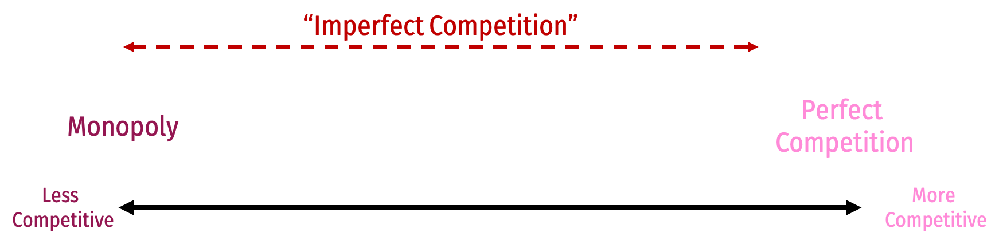
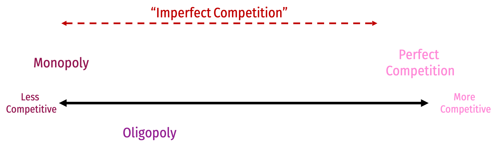
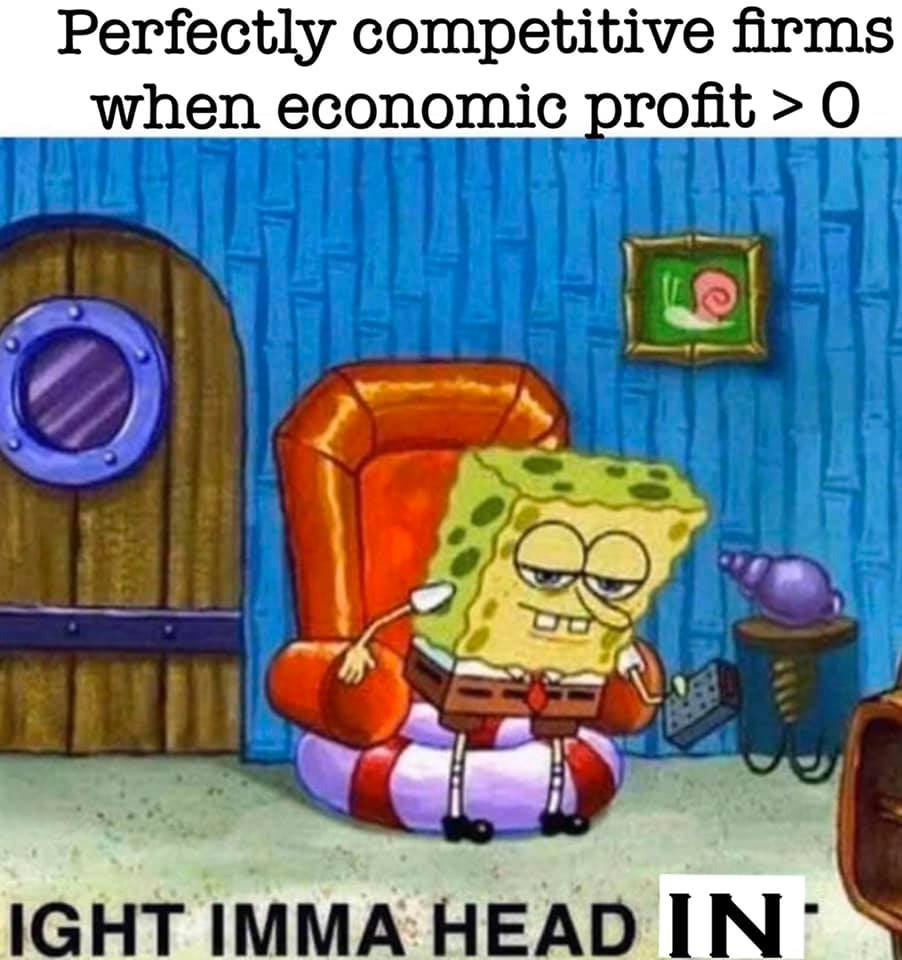

```{r setup, include=FALSE}
options(htmltools.dir.version = FALSE)
knitr::opts_chunk$set(echo=F,
                      message=F,
                      warning=F,
                      fig.retina = 3,
                      fig.align = "center")
library("tidyverse")
library("mosaic")
library("ggrepel")
library("fontawesome")
xaringanExtra::use_tile_view()
xaringanExtra::use_tachyons()
xaringanExtra::use_freezeframe()

update_geom_defaults("label", list(family = "Fira Sans Condensed"))
update_geom_defaults("text", list(family = "Fira Sans Condensed"))

set.seed(256)
```


class: title-slide

# 4.1 — Modeling Market Power

## ECON 306 • Microeconomic Analysis • Fall 2022

### Ryan Safner<br> Associate Professor of Economics <br> <a href="mailto:safner@hood.edu"><i class="fa fa-paper-plane fa-fw"></i>safner@hood.edu</a> <br> <a href="https://github.com/ryansafner/microF22"><i class="fa fa-github fa-fw"></i>ryansafner/microF22</a><br> <a href="https://microF22.classes.ryansafner.com"> <i class="fa fa-globe fa-fw"></i>microF22.classes.ryansafner.com</a><br>

---

class: inverse

# Outline

### [Market Power](#3)

### [Marginal Revenue](#14)

### [Price Elasticity & Price Mark Up](#30)

### [Profit Maximization Rules, Redux](#35)

---

class: inverse, center, middle

# Market Power

---

# Imperfect Competition

.center[

]

---

# Imperfect Competition

.center[

]

---

# Imperfect Competition

.center[

]

---

# Imperfect Competition

.center[

]

---

# Competitive Markets, Recap

.pull-left[
.smallest[
- For competitive markets, modeled firms as .hi[“price-takers”]: so many of them selling identical products, no one could affect price $p$
  - $p^\star$ must be market price, but **choose $q^\star$ to maximize $\pi$**

- (Long-run) Equilibrium: .hi-purple[Marginal cost pricing] for all firms, which is .hi-purple[allocatively efficient] for *society*
  - $p=MC$
  - $MSB=MSC$

- Over long-run, .hi[free entry and exit] push prices to equal (average & marginal) costs and pushed economic profits to zero
]
]

.pull-right[
.center[

]
]

---

# Market Power

.left-column[
.center[

.smallest[
Adam Smith

1723-1790
]
]
]
.right-column[

.smaller[
> “People of the same trade seldom meet together, even for merriment and diversion, but the conversation ends in a conspiracy against the public, or in some contrivance to raise prices. It is impossible indeed to prevent such meetings, by any law which either could be executed, or would be consistent with liberty and justice. But though the law cannot hinder people of the same trade from sometimes assembling together, it ought to do nothing to facilitate such assemblies; much less to render them necessary.” (Book I, Chapter X Part II).

]

.source[Smith, Adam, 1776, [*An Enquiry into the Nature and Causes of the Wealth of Nations*](https://www.econlib.org/library/Smith/smWN.html)]

]

---

# Market Power vs. Competition

.pull-left[
.smaller[
- All sellers *would like to* raise prices and extract more revenue from consumers

- .hi-purple[Competition] from other sellers (and potential .hi-purple[entrants]) drives prices to equal costs & economic profits to zero
  - Firm in competitive market raising $p>MC(q)$ would lose *all* of its customers!

- .hi[Market power]: ability to raise $p>MC(q)$ (and *not* lose *all* customers)
]
]
.pull-right[
.center[

]
]

---

# Market Power vs. Competition

.left-column[
.center[

.smallest[
Adam Smith

1723-1790
]
]
]
.right-column[

.smaller[
> “The pretence that [monopolies] are necessary for the better government of the trade, is without any foundation. The real and effectual discipline which is exercised over a [producer], is not that of his [monopoly], but that of his customers. It is the fear of losing their employment which restrains his frauds and corrects his negligence. An exclusive [monopoly] necessarily weakens the force of this discipline,” (Book I, Chapter X Part II).

]

.source[Smith, Adam, 1776, [*An Enquiry into the Nature and Causes of the Wealth of Nations*](https://www.econlib.org/library/Smith/smWN.html)]

]

---
# Modeling Firms with Market Power

.pull-left[

- Firms with market power behave *differently* than firms in a competitive market
  - **Today**: understanding how to model that different behavior

- Start with simple assumption of a *single* seller: .hi[monopoly] (easiest to model)

- **Next class:**
  - *causes* of market power
  - *consequences* of market power

]

.pull-right[
.center[

]
]

---

# Modeling Firms with Market Power

.pull-left[
.smallest[
- A firm with market power is a .hi-purple[“price-searcher”]
  - Firms with market power **search** for **both** $(q^\star,p^\star)$ that **maximizes** $\pi$

- With a .hi[monopoly] model, we can safely ignore the effects that *other* sellers have on one firm’s behavior
  - A convenient starting point
  - Later, will need .hi-purple[game theory] to deal with other firms’ interactions
]
]
.pull-right[
.center[

]
]

---

# The Monopolist's Problem

.pull-left[

- The .hi[*monopolist’s* profit maximization problem]:

1. **Choose:** .blue[ < output and price: `\\((q^\star, p^\star)\\)` >]

2. **In order to maximize:** .green[< profits: `\\(\pi\\)` >]
]

.pull-right[
.center[

]
]

---

class: inverse, center, middle

# Marginal Revenues

---

# Market Power and Revenues I

.pull-left[
```{r, fig.retina=3}
demand=function(x){20-2*x}

graph<-ggplot(data.frame(x=c(0,10)), aes(x=x))+
  stat_function(fun=demand, geom="line", size=2, color = "blue")+
    geom_label(aes(x=9,y=demand(9)), color = "blue", label="Demand = Max WTP", size = 5)+
    scale_x_continuous(breaks=seq(0,10,1),
                     limits=c(0,10),
                     expand=expand_scale(mult=c(0,0.1)))+
  scale_y_continuous(breaks=seq(0,20,2),
                     limits=c(0,20),
                     expand=expand_scale(mult=c(0,0.1)),
                     labels = function(x){paste("$", x, sep="")})+
  labs(x = "Quantity (q)",
       y = "Price (p)")+
  theme_classic(base_family = "Fira Sans Condensed", base_size=20)
graph
```
]

.pull-right[

- Firms are constrained by relationship between quantity and price that consumers are willing to pay

- .hi-blue[Market (inverse) demand] describes maximum price consumers are willing to pay for a given quantity

- Implications:
  - Even a monopoly can’t set a price “as high as it wants”
  - Even a monopoly can still earn losses!

]

---

# Market Power and Revenues II

.pull-left[
```{r, fig.retina=3}

graph+
  geom_rect(xmin=0, xmax=2, ymin=0, ymax=16, fill="blue", alpha =0.4)+
  geom_segment(x=0, xend=2, y=16, yend=16, size=1, linetype="dotted")+
  geom_segment(x=2, xend=2, y=16, yend=0, size=1, linetype="dotted")+
  geom_segment(x=0, xend=3, y=14, yend=14, size=1, linetype="dotted")+
  geom_segment(x=3, xend=3, y=14, yend=0, size=1, linetype="dotted")
```
]

.pull-right[

- As firm chooses to produce more $q$, must lower the price on *all* units to sell them

]

---

# Market Power and Revenues II

.pull-left[
```{r, fig.retina=3}

graph+
  geom_rect(xmin=0, xmax=2, ymin=0, ymax=14, fill="blue", alpha =0.4)+
  geom_rect(xmin=0, xmax=2, ymin=14, ymax=16, fill="red", alpha=0.4)+
  geom_segment(x=0, xend=2, y=16, yend=16, size=1, linetype="dotted")+
  geom_segment(x=2, xend=2, y=16, yend=0, size=1, linetype="dotted")+
  geom_segment(x=0, xend=3, y=14, yend=14, size=1, linetype="dotted")+
  geom_segment(x=3, xend=3, y=14, yend=0, size=1, linetype="dotted")+
  annotate("segment", x = 1, xend = 1, y = 16, yend = 14, colour = "black", size=2, alpha=1, arrow=arrow(length=unit(0.5,"cm"), ends="last", type="closed"))
```
]

.pull-right[

- As firm chooses to produce more $q$, must lower the price on *all* units to sell them

- .red[Price effect `\\((q \Delta p)\\)`]: lost revenue from lowering price on all sales .red[`\\((\$2 \times -2)\\)`]

]

---

# Market Power and Revenues II

.pull-left[
```{r, fig.retina=3}

graph+
  geom_rect(xmin=0, xmax=2, ymin=0, ymax=14, fill="blue", alpha =0.4)+
  geom_rect(xmin=0, xmax=2, ymin=14, ymax=16, fill="red", alpha=0.4)+
  geom_rect(xmin=2, xmax=3, ymin=0, ymax=14, fill="green", alpha=0.4)+
  geom_segment(x=0, xend=2, y=16, yend=16, size=1, linetype="dotted")+
  geom_segment(x=2, xend=2, y=16, yend=0, size=1, linetype="dotted")+
  geom_segment(x=0, xend=3, y=14, yend=14, size=1, linetype="dotted")+
  geom_segment(x=3, xend=3, y=14, yend=0, size=1, linetype="dotted")+
  annotate("segment", x = 1, xend = 1, y = 16, yend = 14, colour = "black", size=2, alpha=1, arrow=arrow(length=unit(0.5,"cm"), ends="last", type="closed"))+
  annotate("segment", x = 2, xend = 3, y = 7, yend = 7, colour = "black", size=2, alpha=1, arrow=arrow(length=unit(0.5,"cm"), ends="last", type="closed"))
```
]

.pull-right[

- As firm chooses to produce more $q$, must lower the price on *all* units to sell them

- .red[Price effect `\\((q \Delta p)\\)`]: lost revenue from lowering price on all sales .red[`\\((\$2 \times -2)\\)`]

- .green[Output effect `\\((p \Delta q)\\)`]: gained revenue from increase in sales .green[`\\((\$14 \times 1)\\)`]

]

---

# Market Power and Revenues II

.pull-left[
```{r, fig.retina=3}

graph+
  geom_rect(xmin=0, xmax=2, ymin=0, ymax=14, fill="blue", alpha =0.4)+
  geom_rect(xmin=0, xmax=2, ymin=14, ymax=16, fill="red", alpha=0.4)+
  geom_rect(xmin=2, xmax=3, ymin=0, ymax=14, fill="green", alpha=0.4)+
  geom_segment(x=0, xend=2, y=16, yend=16, size=1, linetype="dotted")+
  geom_segment(x=2, xend=2, y=16, yend=0, size=1, linetype="dotted")+
  geom_segment(x=0, xend=3, y=14, yend=14, size=1, linetype="dotted")+
  geom_segment(x=3, xend=3, y=14, yend=0, size=1, linetype="dotted")+
  annotate("segment", x = 1, xend = 1, y = 16, yend = 14, colour = "black", size=2, alpha=1, arrow=arrow(length=unit(0.5,"cm"), ends="last", type="closed"))+
  annotate("segment", x = 2, xend = 3, y = 7, yend = 7, colour = "black", size=2, alpha=1, arrow=arrow(length=unit(0.5,"cm"), ends="last", type="closed"))
```
]

.pull-right[

- As firm chooses to produce more $q$, must lower the price on *all* units to sell them

- .red[Price effect `\\((q \Delta p)\\)`]: lost revenue from lowering price on all sales .red[`\\((\$2 \times -2)\\)`]

- .green[Output effect `\\((p \Delta q)\\)`]: gained revenue from increase in sales .green[`\\((\$14 \times 1)\\)`]

.smallest[
| q | p | R(q) | Change |
|---:|---:|---:|---:|
| 2 | $16 | $32 |    |
| 3 | $14 | $42 | +$10 |
]
]

---


# Marginal Revenue I

- If a firm increases output, $\Delta q$,  revenues would change by:

.center[

$\Delta R(q)=$.green[`\\(p \Delta q\\)`] $+$ .red[`\\(q \Delta p\\)`]

]

--

- .green[Output effect]: increases number of units sold $(\Delta q)$ times price $p$ per unit

--

- .red[Price effect]: lowers price per unit $(\Delta p)$ on *all* units sold $(q)$

--

- Divide both sides by $\Delta q$ to get .hi-purple[Marginal Revenue, `\\(MR(q)\\)`]:

$$\frac{\Delta R(q)}{\Delta q}=\color{#6A5ACD}{MR(q)=p+\frac{\Delta p}{\Delta q}q}$$

--

.small[
- Compare: demand for a **competitive** firm is perfectly elastic: $\color{#6A5ACD}{\frac{\Delta p}{\Delta q}=0}$, so we saw $\color{#6A5ACD}{MR(q)=p}$!
]

---

# Marginal Revenue II

.smallest[
- If we have a linear inverse demand function of the form
$$\color{#e64173}{p=a+bq}$$
  - $a$ is the choke price (intercept)
  - $b$ is the slope
]

--

.smallest[
- Marginal revenue again is defined as:
$$MR(q)=p+\color{#44C1C4}{\frac{\Delta p}{\Delta q}}q$$
]

--

.smallest[
- Recognize that $\color{#44C1C4}{\frac{\Delta p}{\Delta q}} = \left(\frac{rise}{run} \right)$ is the slope, $b$, 

]

--

.smallest[
$$\begin{align*}
MR(q)&=p+(\color{#44C1C4}{b})q\\
MR(q)&=(\color{#e64173}{a+bq})+bq\\
\mathbf{\color{#6A5ACD}{MR(q)}}&=\color{#6A5ACD}{\mathbf{a+2bq}}\\
\end{align*}$$

]

---

# Marginal Revenue III

.pull-left[

```{r, fig.retina=3}
MR=function(x){20-4*x}

#q_choke<-(a/b)
#MR_choke<-(a/(2*b))

ggplot(data.frame(x=c(0,10)), aes(x=x))+
  stat_function(fun=demand, geom="line", size=2, color="blue")+
  geom_label(x=2.5,y=demand(2.5), label="Demand \n slope=b", color="blue")+
  stat_function(fun=MR, geom="line", size=2, color="purple")+
  geom_label(x=2.5,y=MR(2.5), label="MR(q) \n slope=2b", color="purple")+
    scale_x_continuous(breaks = c(0,5,10),
                       labels = c(0,expression(a/2*b),expression(a/b)),
                       expand=expand_scale(mult=c(0,0.1)))+
  scale_y_continuous(breaks=c(0,20),
                     labels=c(0,expression(a)),
                     limits=c(0,20),
                     expand=expand_scale(mult=c(0,0.1)))+
  labs(x = "Quantity (q)",
       y = "Price (p)")+
  theme_classic(base_family = "Fira Sans Condensed", base_size=20)
```
]

.pull-right[

$$\begin{align*}
\color{#0047AB}{p(q)}&\color{#0047AB}{=a+bq}\\
\color{#6A5ACD}{MR(q)}&\color{#6A5ACD}{=a+2bq}\\
\end{align*}$$

- **Marginal revenue starts at same intercept as Demand $(a)$ with twice the slope $(2b)$**

- Don’t forget the slopes $(b)$ are always negative!
]

---

# Marginal Revenue: Example

.bg-washed-green.b--dark-green.ba.bw2.br3.shadow-5.ph4.mt5[
.green[**Example**]: Suppose the market demand is given by:

$$q=12.5-0.25p$$
]

1. Find the function for a monopolist’s marginal revenue curve.

2. Calculate the monopolist’s marginal revenue if the firm produces 6 units, and 7 units.

---

class: inverse, center, middle

# Price Elasticity & Price Mark Up

---

# Revenues and Price Elasticity of Demand

.pull-left[

.smallest[
| Demand Price Elasticity | .purple[MR(q)] | .green[R(q)] |
|------------------|---------|--------|
| $\vert \epsilon \vert >1$ Elastic | Positive | Increasing |
| $\vert \epsilon \vert =1$ Unity | 0 | Maximized |
| $\vert \epsilon \vert <1$ Inelastic | Negative | Decreasing |

- Strong relationship between .hi-purple[price elasticity of demand] and revenues

- .hi-turquoise[Monopolists *only* produce where demand is elastic, with positive MR(q)!]
  - See appendix in [today’s appendix](/resources/appendices/4.1-appendix/#monopolists-only-produce-where-demand-is-elastic-proof) for a proof

]

]

.pull-right[

```{r, fig.retina=3, fig.height=3, fig.align="center"}
demand=function(x){10-x}
mr=function(x){10-2*x}

ggplot(data.frame(x=c(0,10)), aes(x=x))+
  stat_function(fun=demand, geom="line", size=2, color = "blue")+
  geom_label(aes(x=8,y=demand(8)), color = "blue", label="Demand", size = 5)+
  stat_function(fun=mr, geom="line", size=2, color = "purple")+
  geom_label(aes(x=4,y=mr(4)), color = "purple", label="MR(q)", size = 5)+
  geom_text(aes(x=2.5,y=9), color = "black", label="Elastic", size = 4)+
  geom_text(aes(x=7.5,y=4), color = "black", label="Inelastic", size = 4)+
  geom_text(aes(x=5.75,y=5.75), color = "black", label="Unit Elastic", size = 4)+
    scale_x_continuous(breaks=seq(0,10,1),
                     limits=c(0,10),
                     expand=expand_scale(mult=c(0,0.1)))+
  scale_y_continuous(breaks=seq(0,10,1),
                     limits=c(0,10),
                     expand=expand_scale(mult=c(0,0.1)),
                     labels = function(x){paste("$", x, sep="")})+
  # line at 5,5 
  geom_segment(aes(x=0,xend=5, y=5, yend=5), linetype="dashed")+
  geom_segment(aes(x=5,xend=5, y=5, yend=0), linetype="dashed")+
  
  labs(x = "Quantity",
       y = "Price")+
  theme_classic(base_family = "Fira Sans Condensed", base_size=16)
```

```{r, fig.retina=3, fig.height=3, fig.align="center"}
tr=function(x){10*x-x^2}

ggplot(data.frame(x=c(0,10)), aes(x=x))+
  stat_function(fun=tr, geom="line", size=2, color = "green")+
  geom_label(aes(x=8,y=tr(8)), color = "green", label="R(q)", size = 5)+
    scale_x_continuous(breaks=seq(0,10,1),
                     limits=c(0,10),
                     expand=expand_scale(mult=c(0,0.1)))+
  scale_y_continuous(breaks=seq(0,25,5),
                     limits=c(0,25),
                     expand=expand_scale(mult=c(0,0.1)),
                     labels = function(x){paste("$", x, sep="")})+
  # line at 5,5 
  geom_segment(aes(x=0,xend=5, y=25, yend=25), linetype="dashed")+
  geom_segment(aes(x=5,xend=5, y=25, yend=0), linetype="dashed")+
  
  geom_label(aes(x=5, y=25), color="green", label=expression(paste(R[max])))+
  #coord_cartesian(clip="off")+
  labs(x = "Quantity",
       y = "Revenues")+
  theme_classic(base_family = "Fira Sans Condensed", base_size=16)
```
]

---

# Market Power and Mark Up

.pull-left[
.smallest[
- Perfect competition: $p=MC(q)$ (.hi[allocatively efficient])

- .hi[Market power] defined as firm(s)’ ability to .hi-purple[mark up] $p>MC(q)$
  - (Even a monopolist’s market power is constrained by market demand!)

- .hi-purple[Size of markup depends on **price elasticity of demand**]
  - $\downarrow$ price elasticity: $\uparrow$ markup

> i.e. the *less* responsive to prices consumers are, the *higher* the price the firm can charge

]
]

.pull-right[
.center[

]
]

---

# The Lerner Index and Inverse Elasticity Rule I

.pull-left[
.smaller[
- .hi[Lerner Index] measures market power as % of firm's price that is .hi-purple[markup] above $MC(q)$

$$L=\frac{p-MC(q)}{p} = -\frac{1}{\epsilon}$$
  - i.e. $L \times 100\%$ of firm’s price is markup

- $L=0 \implies$ perfect competition
  - 0% of price is markup, since $p=MC(q)$
- As $L\rightarrow 1 \implies$ more market power
  - 100% of price is markup

]

]

.pull-right[
.center[

]

.footnote[See [today's appendix](/resources/appendices/4.1-appendix/#derivation-of-the-lerner-index) for the derivation.]

]

---

# The Lerner Index and Inverse Elasticity Rule II

.center[
.smallest[
.hi-purple[The more (less) elastic a good, the less (more) the optimal markup]: $L=\frac{p-MC(q)}{p}=-\frac{1}{\epsilon}$
]
]
.pull-left[

.center[
.smallest[
Demand *Less* Elastic at $p^*$
]
]

```{r, fig.align="center", fig.height=5.5}
demand_i=function(x){20-2*x}
mr_i=function(x){20-4*x}

ggplot(data.frame(x=c(0,10)), aes(x=x))+
  geom_hline(yintercept=2, size=2, color="red")+
  geom_label(x=6,y=2, color = "red", label="MC(q)")+
  stat_function(fun=demand_i, geom="line", size=2, color = "blue")+
  geom_label(x=6,y=demand_i(6), color = "blue", label="Demand")+
  stat_function(fun=mr_i, geom="line", size=2, color = "purple")+
  geom_label(x=3,y=mr_i(3), color = "purple", label="MR(q)")+
    scale_x_continuous(breaks=seq(0,10,1),
                     limits=c(0,10),
                     expand=expand_scale(mult=c(0,0.1)))+
  scale_y_continuous(breaks=seq(0,20,2),
                     limits=c(0,20),
                     expand=expand_scale(mult=c(0,0.1)),
                     labels = function(x){paste("$", x, sep="")})+
  # line at 4,6 
  geom_segment(aes(x=0,xend=4.5, y=11, yend=11), linetype="dashed")+
  geom_segment(aes(x=4.5,xend=4.5, y=11, yend=0), linetype="dashed")+
  
  ggrepel::geom_text_repel(
    data = point_i<-tibble(x = 4.5,
                           y = 11.5),
    aes(x=x,y=y), label = expression(epsilon == -1.22),
    color = "black",
    seed = 2,
    nudge_x=0.5,
    nudge_y=0.5
  )+
  #arrow down
  annotate("segment", x = 1, xend = 1, y = 2, yend = 11, colour = "black", size=2, alpha=1, arrow=arrow(length=unit(0.5,"cm"), ends="last", type="closed"))+
  geom_label(aes(x=1, y=6), color="black", label="82% of Price \n is Markup")+
  coord_cartesian(clip="off")+
  labs(x = "Quantity",
       y = "Price")+
  theme_classic(base_family = "Fira Sans Condensed", base_size=20)
```
]

.pull-right[

.center[
.smallest[
Demand *More* Elastic at $p^*$
]
]

```{r, fig.align="center", fig.height=5.5}
demand_e=function(x){10-x}
mr_e=function(x){10-2*x}

ggplot(data.frame(x=c(0,10)), aes(x=x))+
  geom_hline(yintercept=2, size=2, color="red")+
  geom_label(x=6,y=2, color = "red", label="MC(q)")+
  stat_function(fun=demand_e, geom="line", size=2, color = "blue")+
  geom_label(x=6,y=demand_e(6), color = "blue", label="Demand")+
  stat_function(fun=mr_e, geom="line", size=2, color = "purple")+
  geom_label(x=3,y=mr_e(3), color = "purple", label="MR(q)")+
    scale_x_continuous(breaks=seq(0,10,1),
                     limits=c(0,10),
                     expand=expand_scale(mult=c(0,0.1)))+
  scale_y_continuous(breaks=seq(0,20,2),
                     limits=c(0,20),
                     expand=expand_scale(mult=c(0,0.1)),
                     labels = function(x){paste("$", x, sep="")})+
  # line at 4,6 
  geom_segment(aes(x=0,xend=4, y=6, yend=6), linetype="dashed")+
  geom_segment(aes(x=4,xend=4, y=6, yend=0), linetype="dashed")+
  
  ggrepel::geom_text_repel(
    data = point_i<-tibble(x = 4,
                           y = 6),
    aes(x=x,y=y), label = expression(epsilon == -1.5),
    color = "black",
    seed = 2,
    nudge_x=0.5,
    nudge_y=0.5
  )+
  #arrow down
  annotate("segment", x = 1, xend = 1, y = 2, yend = 6, colour = "black", size=2, alpha=1, arrow=arrow(length=unit(0.5,"cm"), ends="last", type="closed"))+
  geom_label(aes(x=1, y=4), color="black", label="67% of Price \n is Markup")+
  labs(x = "Quantity",
       y = "Price")+
  theme_classic(base_family = "Fira Sans Condensed", base_size=20)
```
]

---

class: inverse, center, middle

# Profit Maximization Rules, Redux

---

# Visualizing Total Profit As R(q)-C(q)


.pull-left[

- $\color{green}{\pi(q)}=\color{blue}{R(q)}-\color{red}{C(q)}$

]

.pull-right[

```{r}
revenues<-function(x){20*x-x^2}
costs<-function(x){x^2+x+10}
profit<-function(x){revenues(x)-costs(x)}

total_plot<-ggplot(data.frame(x=c(0,10)), aes(x=x))+
  stat_function(fun=revenues, geom="line", size=2, color = "blue")+
    geom_label(aes(x=9.5,y=revenues(9.5)), color = "blue", label="R(q)", size = 4)+
  stat_function(fun=costs, geom="line", size=2, color = "red")+
    geom_label(aes(x=9.5,y=costs(9.5)), color = "red", label="C(q)", size = 4)+
    scale_x_continuous(breaks=seq(0,10,1),
                     limits=c(0,10),
                     expand=expand_scale(mult=c(0,0.1)))+
  scale_y_continuous(breaks=seq(0,120,10),
                     labels=scales::dollar,
                     limits=c(0,120),
                     expand=expand_scale(mult=c(0,0.1)))+
  labs(x = "Output, q",
       y = "$")+
  theme_classic(base_family = "Fira Sans Condensed", base_size=20)
total_plot
```

]


---

# Visualizing Total Profit As R(q)-C(q)


.pull-left[

- $\color{green}{\pi(q)}=\color{blue}{R(q)}-\color{red}{C(q)}$

]

.pull-right[

```{r}
total_plot+
  stat_function(fun=profit, geom="line", size=2, color = "green")+
    geom_label(aes(x=7,y=profit(7)), color = "green", label=expression(pi(q)==R(q)-C(q)), size = 4)
```

]

---

# Visualizing Total Profit As R(q)-C(q)

.pull-left[

- $\color{green}{\pi(q)}=\color{blue}{R(q)}-\color{red}{C(q)}$

- Graph: find $q^*$ to max $\pi \implies q^*$ where max distance between $R(q)$ and $C(q)$

]

.pull-right[

```{r, fig.retina=3}
total_plot+
  stat_function(fun=profit, geom="line", size=2, color = "green")+
  geom_label(aes(x=7,y=profit(7)), color = "green", label=expression(pi(q)==R(q)-C(q)), size = 4)+
  geom_segment(x=5,xend=5,y=0,yend=revenues(5),size=1,linetype="dotted")
```
]

---

# Visualizing Total Profit As R(q)-C(q)

.pull-left[

- $\color{green}{\pi(q)}=\color{blue}{R(q)}-\color{red}{C(q)}$

- Graph: find $q^*$ to max $\pi \implies q^*$ where max distance between $R(q)$ and $C(q)$

- Slopes must be equal:
$$\color{blue}{MR(q)}=\color{red}{MC(q)}$$


]

.pull-right[

```{r, fig.retina=3}
total_plot+
  stat_function(fun=profit, geom="line", size=2, color = "green")+
  geom_label(aes(x=7,y=profit(7)), color = "green", label=expression(pi(q)==R(q)-C(q)), size = 4)+
  geom_segment(x=5,xend=5,y=0,yend=revenues(5),size=1,linetype="dotted")+
  # slope lines
  geom_segment(x=3, xend=7, y=20, yend=60, size=1, linetype="dashed")+
  geom_segment(x=3, xend=7, y=55, yend=95, size=1, linetype="dashed")
```
]

---

# Visualizing Total Profit As R(q)-C(q)

.pull-left[

- $\color{green}{\pi(q)}=\color{blue}{R(q)}-\color{red}{C(q)}$

- Graph: find $q^*$ to max $\pi \implies q^*$ where max distance between $R(q)$ and $C(q)$

- Slopes must be equal:
$$\color{blue}{MR(q)}=\color{red}{MC(q)}$$

.smallest[
- At $q^*=5$:
  - $\color{blue}{R(q)=75}$
  - $\color{red}{C(q)=40}$
  - $\color{green}{\pi(q)=35}$
]
]

.pull-right[

```{r, fig.retina=3}
total_plot+
  stat_function(fun=profit, geom="line", size=2, color = "green")+
  geom_label(aes(x=7,y=profit(7)), color = "green", label=expression(pi(q)==R(q)-C(q)), size = 4)+
  geom_segment(x=5,xend=5,y=0,yend=revenues(5),size=1,linetype="dotted")+
  # slope lines
  geom_segment(x=3, xend=7, y=20, yend=60, size=1, linetype="dashed")+
  geom_segment(x=3, xend=7, y=55, yend=95, size=1, linetype="dashed")+
  
  # dotted lines
  geom_segment(x=0, xend=5, y=revenues(5), yend=revenues(5), size=1, linetype="dotted", color = "blue")+
  geom_segment(x=0, xend=5, y=costs(5), yend=costs(5), size=1, linetype="dotted", color = "red")+
  geom_segment(x=0, xend=5, y=profit(5), yend=profit(5), size=1, linetype="dotted", color = "green")
```
]

---

# Visualizing Marginal Profit As MR(q)-MC(q)

.pull-left[

- At low output $q<q^*$, can increase $\pi$ by producing *more*

- $\color{#6A5ACD}{MR(q)}>\color{#D7250E}{MC(q)}$

]

.pull-right[

```{r, fig.retina=3}
d<-function(x){20-x}
mr<-function(x){20-2*x}
mc<-function(x){2*x}

marginal_plot<-ggplot(data.frame(x=c(0,10)), aes(x=x))+
  stat_function(fun=d, geom="line", size=2, color = "blue", linetype = "dashed", alpha = 0.5)+
    geom_label(aes(x=9.5,y=d(9.5)), color = "blue", label="Demand", size = 4)+
  stat_function(fun=mr, geom="line", size=2, color = "purple")+
    geom_label(aes(x=9.5,y=mr(9.5)), color = "purple", label="MR(q)", size = 4)+
  stat_function(fun=mc, geom="line", size=2, color = "red")+
    geom_label(aes(x=9.5,y=mc(9.5)), color = "red", label="MC(q)", size = 4)+
  
    scale_x_continuous(breaks=seq(0,10,1),
                     limits=c(0,10),
                     expand=expand_scale(mult=c(0,0.1)))+
  scale_y_continuous(breaks=seq(0,20,2),
                     labels=scales::dollar,
                     limits=c(0,20),
                     expand=expand_scale(mult=c(0,0.1)))+
  labs(x = "Output, q",
       y = "$/Unit")+
  theme_classic(base_family = "Fira Sans Condensed", base_size=20)

marginal_plot+
  annotate("segment", x = 0.5, xend = 4.5, y = 10, yend = 10, color = "green", size=2, alpha=0.9, arrow=arrow(length=unit(0.5,"cm"), ends="last", type="closed"))

```
]

---

# Visualizing Marginal Profit As MR(q)-MC(q)

.pull-left[

- At high output $q>q^*$, can increase $\pi$ by producing *less*

- $\color{#6A5ACD}{MR(q)}<\color{#D7250E}{MC(q)}$

]

.pull-right[

```{r, fig.retina=3}
marginal_plot+
  annotate("segment", x = 9.5, xend = 5.5, y = 10, yend = 10, color = "green", size=2, alpha=0.9, arrow=arrow(length=unit(0.5,"cm"), ends="last", type="closed"))

```
]

---

# Visualizing Marginal Profit As MR(q)-MC(q)

.pull-left[

- $\pi$ is *maximized* where $\color{#6A5ACD}{MR(q)}=\color{#D7250E}{MC(q)}$

]

.pull-right[

```{r, fig.retina=3}
marginal_plot+
  geom_segment(x=5, xend=5, y=0, yend=10, size=1, linetype="dotted")
```
]

---

# Profit-Maximizing Price and Quantity (Graph)

.pull-left[
```{r, fig.retina=3}
MC=function(x){20*x+200}
AC=function(x){10*x+200+(1000/x)}
AVC=function(x){10*x+200}
Demand=function(x){500-5*x}
MR=function(x){500-10*x}

ggplot(data.frame(x=c(0,12)), aes(x=x))+
  stat_function(fun=MC, geom="line", color="red", size=2)+
  geom_label(x=5,y=MC(5), color = "red", label="MC(q)")+
  stat_function(fun=AC, geom="line", color="orange", size=2)+
  geom_label(x=2.5,y=AC(2.5), color = "orange", label="AC(q)")+
  stat_function(fun=AVC, geom="line", color="brown", size=2)+
  geom_label(x=5,y=AVC(5), color = "brown", label="AVC(q)")+
  stat_function(fun=Demand, geom="line", color="blue", size=2)+
  geom_label(x=18,y=Demand(18), color = "blue", label="Demand")+
  stat_function(fun=MR, geom="line", color="purple", size=2)+
  geom_label(x=18,y=MR(18), color = "purple", label="MR(q)")+
  geom_segment(aes(x=10,y=0),xend=10,yend=400,linetype=3, size=1)+

  scale_x_continuous(breaks=seq(0,20,2),
                     limits=c(0,20),
                     expand=c(0,0))+
  scale_y_continuous(breaks=seq(0,700,100),
                     limits=c(0,700),
                     expand=c(0,0),
                     labels=scales::dollar)+
  labs(x = "Quantity (q)",
       y = "Price (p)")+
  theme_classic(base_family = "Fira Sans Condensed", base_size=20)

```
]

.pull-right[

- Profit-maximizing quantity is always $q^\star$ where .purple[`\\(MR(q)\\)`] $=$ .red[`\\(MC(q)\\)`]

]

---

# Profit-Maximizing Price and Quantity (Graph)

.pull-left[
```{r, fig.retina=3}
ggplot(data.frame(x=c(0,12)), aes(x=x))+
  stat_function(fun=MC, geom="line", color="red", size=2)+
  geom_label(x=5,y=MC(5), color = "red", label="MC(q)")+
  stat_function(fun=AC, geom="line", color="orange", size=2)+
  geom_label(x=2.5,y=AC(2.5), color = "orange", label="AC(q)")+
  stat_function(fun=AVC, geom="line", color="brown", size=2)+
  geom_label(x=5,y=AVC(5), color = "brown", label="AVC(q)")+
  stat_function(fun=Demand, geom="line", color="blue", size=2)+
  geom_label(x=18,y=Demand(18), color = "blue", label="Demand")+
  stat_function(fun=MR, geom="line", color="purple", size=2)+
  geom_label(x=18,y=MR(18), color = "purple", label="MR(q)")+
  geom_segment(aes(x=10,y=0),xend=10,yend=450,linetype=3, size=1)+
  geom_segment(aes(x=0,y=450),xend=10,yend=450, linetype=3, size=1)+

  scale_x_continuous(breaks=seq(0,20,2),
                     limits=c(0,20),
                     expand=c(0,0))+
  scale_y_continuous(breaks=seq(0,700,100),
                     limits=c(0,700),
                     expand=c(0,0),
                     labels=scales::dollar)+
  labs(x = "Quantity (q)",
       y = "Price (p)")+
  theme_classic(base_family = "Fira Sans Condensed", base_size=20)

```
]

.pull-right[

- Profit-maximizing quantity is always $q^\star$ where .purple[`\\(MR(q)\\)`] $=$ .red[`\\(MC(q)\\)`]

- But monopolist faces *entire* .blue[market demand]
  - Can charge as high $p^\star$ as consumers are WTP .blue[Market Demand]

]
---

# Profit-Maximizing Price and Quantity (Graph)

.pull-left[
```{r, fig.retina=3}
ggplot(data.frame(x=c(0,12)), aes(x=x))+
  stat_function(fun=MC, geom="line", color="red", size=2)+
  geom_label(x=5,y=MC(5), color = "red", label="MC(q)")+
  stat_function(fun=AC, geom="line", color="orange", size=2)+
  geom_label(x=2.5,y=AC(2.5), color = "orange", label="AC(q)")+
  stat_function(fun=AVC, geom="line", color="brown", size=2)+
  geom_label(x=5,y=AVC(5), color = "brown", label="AVC(q)")+
  stat_function(fun=Demand, geom="line", color="blue", size=2)+
  geom_label(x=18,y=Demand(18), color = "blue", label="Demand")+
  stat_function(fun=MR, geom="line", color="purple", size=2)+
  geom_label(x=18,y=MR(18), color = "purple", label="MR(q)")+
  geom_segment(aes(x=10,y=0),xend=10,yend=450,linetype=3, size=1)+
  geom_segment(aes(x=0,y=450),xend=10,yend=450, linetype=3, size=1)+
  
  geom_hline(yintercept=400, size=1, linetype="dashed")+
  geom_label(x=3,y=400, label="Break-even price", size =5, color="orange")+

  scale_x_continuous(breaks=seq(0,20,2),
                     limits=c(0,20),
                     expand=c(0,0))+
  scale_y_continuous(breaks=seq(0,700,100),
                     limits=c(0,700),
                     expand=c(0,0),
                     labels=scales::dollar)+
  labs(x = "Quantity (q)",
       y = "Price (p)")+
  theme_classic(base_family = "Fira Sans Condensed", base_size=20)

```
]

.pull-right[

- Profit-maximizing quantity is always $q^\star$ where .purple[`\\(MR(q)\\)`] $=$ .red[`\\(MC(q)\\)`]

- But monopolist faces *entire* .blue[market demand]
  - Can charge as high $p^\star$ as consumers are WTP .blue[Market Demand]

- .orange[Break even price] $p=AC(q)_{min}$

]

---

# Profit-Maximizing Price and Quantity (Graph)

.pull-left[
```{r, fig.retina=3}
ggplot(data.frame(x=c(0,12)), aes(x=x))+
  stat_function(fun=MC, geom="line", color="red", size=2)+
  geom_label(x=5,y=MC(5), color = "red", label="MC(q)")+
  stat_function(fun=AC, geom="line", color="orange", size=2)+
  geom_label(x=2.5,y=AC(2.5), color = "orange", label="AC(q)")+
  stat_function(fun=AVC, geom="line", color="brown", size=2)+
  geom_label(x=5,y=AVC(5), color = "brown", label="AVC(q)")+
  stat_function(fun=Demand, geom="line", color="blue", size=2)+
  geom_label(x=18,y=Demand(18), color = "blue", label="Demand")+
  stat_function(fun=MR, geom="line", color="purple", size=2)+
  geom_label(x=18,y=MR(18), color = "purple", label="MR(q)")+
  geom_segment(aes(x=10,y=0),xend=10,yend=450,linetype=3, size=1)+
  geom_segment(aes(x=0,y=450),xend=10,yend=450, linetype=3, size=1)+
  
  geom_hline(yintercept=400, size=1, linetype="dashed")+
  geom_label(x=3,y=400, label="Break-even price", size =5, color="orange")+
  geom_hline(yintercept=200, size=1, linetype="dashed")+
  geom_label(x=16,y=200, label="Shut-down price", size =5, color="brown")+

  scale_x_continuous(breaks=seq(0,20,2),
                     limits=c(0,20),
                     expand=c(0,0))+
  scale_y_continuous(breaks=seq(0,700,100),
                     limits=c(0,700),
                     expand=c(0,0),
                     labels=scales::dollar)+
  labs(x = "Quantity (q)",
       y = "Price (p)")+
  theme_classic(base_family = "Fira Sans Condensed", base_size=20)

```
]

.pull-right[

- Profit-maximizing quantity is always $q^\star$ where .purple[`\\(MR(q)\\)`] $=$ .red[`\\(MC(q)\\)`]

- But monopolist faces *entire* .blue[market demand]
  - Can charge as high $p^\star$ as consumers are WTP .blue[Market Demand]

- .orange[Break even price] $p=AC(q)_{min}$

- .brown[Shut-down price] $p=AVC(q)_{min}$

]

---

# Summing Up Monopolist’s Supply Decisions

1. Produce the optimal amount of output $q^*$ where $MR(q)=MC(q)$

--

2. **Raise price to maximum consumers are WTP: $p^*=Demand(q^*)$**

--

3. Calculate profit with average cost: $\pi=[p-AC(q)]q$

--

4. Shut down in the *short run* if $p<AVC(q)$
  - Minimum of AVC curve where $MC(q)=AVC(q)$

--

5. Exit in the *long run* if $p<AC(q)$
  - Minimum of AC curve where $MC(q)=AC(q)$

---

# The Profit Maximizing Quantity & Price: Example

.bg-washed-green.b--dark-green.ba.bw2.br3.shadow-5.ph4.mt5[
.green[**Example**]: Consider the market for iPhones. Suppose Apple's costs are:

$$\begin{align*}
	C(q)&=2.5q^2+25,000\\
	MC(q)&=5q\\
	\end{align*}$$
	
The demand for iPhones is given by (quantity is in millions of iPhones):

$$q=300-0.2p$$
]

.smallest[
1. Find Apple's profit-maximizing quantity and price.
2. How much total profit does Apple earn?
3. How much of Apple's price is markup over (marginal) cost?
4. What is the price elasticity of demand at Apple's profit-maximizing output?
]