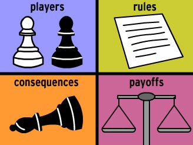
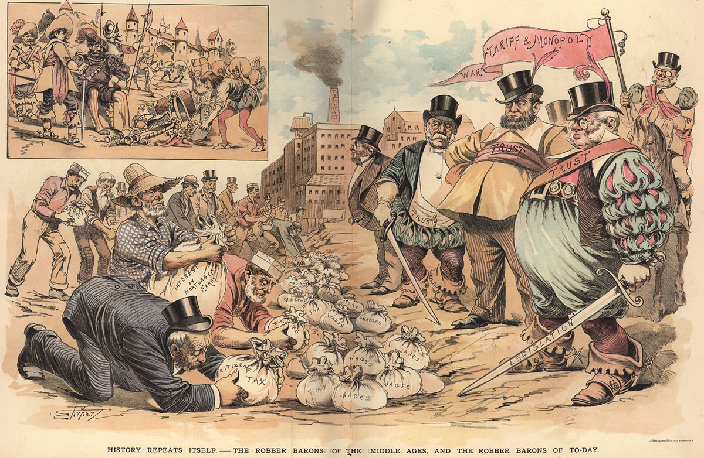
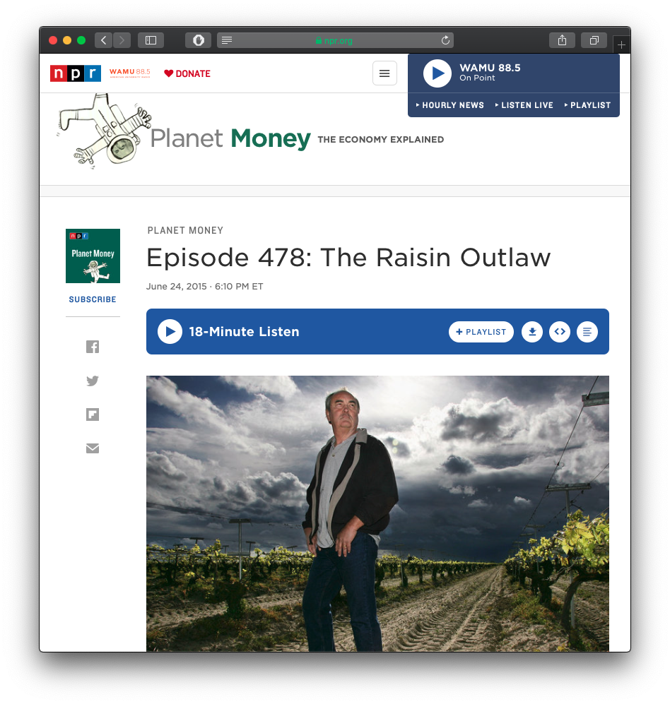
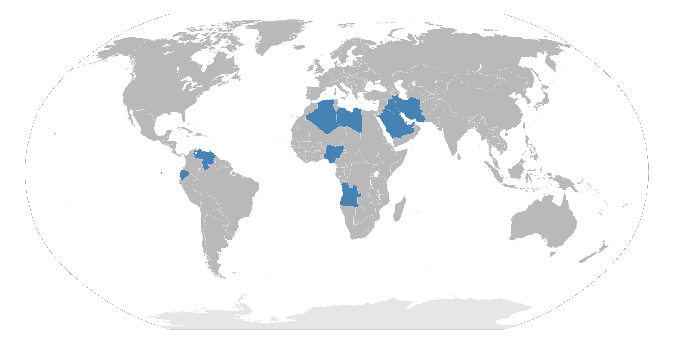

```{r setup, include=FALSE}
options(htmltools.dir.version = FALSE)
knitr::opts_chunk$set(echo=F,
                      message=F,
                      warning=F,
                      fig.retina = 3,
                      fig.align = "center")
library("tidyverse")
library("mosaic")
library("ggrepel")
library("fontawesome")
xaringanExtra::use_tile_view()
xaringanExtra::use_tachyons()
xaringanExtra::use_freezeframe()

update_geom_defaults("label", list(family = "Fira Sans Condensed"))
update_geom_defaults("text", list(family = "Fira Sans Condensed"))

set.seed(256)
```


class: title-slide

# 4.4 — Imperfect Competition

## ECON 306 • Microeconomic Analysis • Fall 2022

### Ryan Safner<br> Associate Professor of Economics <br> <a href="mailto:safner@hood.edu"><i class="fa fa-paper-plane fa-fw"></i>safner@hood.edu</a> <br> <a href="https://github.com/ryansafner/microF22"><i class="fa fa-github fa-fw"></i>ryansafner/microF22</a><br> <a href="https://microF22.classes.ryansafner.com"> <i class="fa fa-globe fa-fw"></i>microF22.classes.ryansafner.com</a><br>

---

class: inverse

# Outline

### [Monopolistic Competition](#4)

### [Oligopoly](#17)

---

# Reminder: Imperfect Competition

.center[

]

---

class: inverse, center, middle

# Monopolistic Competition

---

# Monopolistic Competition

.pull-left[

- .hi[Monopolistic competition]: **each firm has _some_ market power**, but, the industry has .hi-purple[free entry and exit] (**no barriers to entry**)
  - Each firm faces its own downward-sloping demand
  - Firms are price-searchers

- Model as a hybrid of monopoly and perfect competition models

]

.pull-right[
.center[

]
]

---

# Monopolistic Competition: Product Differentiation

.pull-left[

- .hi[Product differentiation]: firms’ products are .hi-purple[imperfect substitutes]

- Consumers recognize **non-price differences** between sellers’ goods
  - Brand name & reputation
  - Customer service
  - Product features, shape, color, etc.
  - Marketing
  - Location, convenience
]

.pull-right[
.center[

]
]

---

# Monopolistic Competition: Residual Demand

.pull-left[
.smallest[
- Each firm faces own downward-sloping .hi-blue[“residual” demand] for each firm’s products
  - Firm faces market demand (for broad product) *leftover* from all other firms’ sales

- .hi-green[Example]: demand for *Lenovo* laptops $\approx$ demand for *laptops* minus laptops supplied by Acer, Asus, Apple, Dell, etc.
]
]

.pull-right[
```{r, fig.retina=3}

Demand_total = function(x){100-x}
Demand_resid=function(x){60-3*x}

ggplot(data.frame(x=c(0,12)), aes(x=x))+
  stat_function(fun=Demand_total, geom="line", color="darkblue", size=3)+
  geom_label(x=70,y=Demand_total(70), color = "darkblue", label="Total \n Market Demand")+
  stat_function(fun=Demand_resid, geom="line", color="lightblue", size=2)+
  geom_label(x=10,y=Demand_resid(10), color = "lightblue", label="Firm's \n Residual Demand")+
  
  annotate("segment", x = 75, xend = 15, y = 20, yend = 20, colour = "purple", size=2, alpha=1, arrow=arrow(length=unit(0.5,"cm"), ends="both", type="closed"))+
  geom_label(x=45,y=20, color = "purple", label="Demand for all \n other firms' products")+
  labs(x = "Quantity (q)",
       y = "Price (p)",
       title = "Total Market")+
  scale_x_continuous(breaks=NULL,
                     limits=c(0,100),
                     expand=c(0,0))+
  scale_y_continuous(breaks=NULL,
                     limits=c(0,100),
                     expand=c(0,0))+
  theme_classic(base_family = "Fira Sans Condensed", base_size=18)
```
]

---

# Monopolistic Competition Model: Short Run

.pull-left[
```{r, fig.retina=3}
MC=function(x){3*x^2-8*x+9}
AC=function(x){x^2-4*x+10+10/x}
AVC=function(x){10*x+200}
Demand=function(x){20-2.5*x}
MR=function(x){20-5*x}


mc_plot<-ggplot(data.frame(x=c(0,12)), aes(x=x))+
  stat_function(fun=MC, geom="line", color="red", size=2)+
  geom_label(x=3.5,y=MC(3.5), color = "red", label="MC(q)")+
  stat_function(fun=AC, geom="line", color="orange", size=2)+
  geom_label(x=4.5,y=AC(4.5), color = "orange", label="AC(q)")+
  stat_function(fun=Demand, geom="line", color="blue", size=2)+
  geom_label(x=4.5,y=Demand(4.5), color = "blue", label="Demand")+
  stat_function(fun=MR, geom="line", color="purple", size=2)+
  geom_label(x=3.5,y=MR(3.5), color = "purple", label="MR(q)")+
  geom_segment(aes(x=10,y=0),xend=10,yend=450,linetype=3, size=2)+
  geom_segment(aes(x=0,y=450),xend=10,yend=450, linetype=3, size=2)+
  labs(x = "Quantity (q)",
       y = "Price (p)",
       title = "Firm")+
  theme_classic(base_family = "Fira Sans Condensed", base_size=18)

mc_plot+
  scale_x_continuous(breaks=NULL,
                     limits=c(0,5),
                     expand=c(0,0))+
  scale_y_continuous(breaks=NULL,
                     limits=c(0,20),
                     expand=c(0,0))
```
]

.pull-right[

- **Short Run**: model firm as a price-searching monopolist:
]

---

# Monopolistic Competition Model: Short Run

.pull-left[
```{r, fig.retina=3}
mc_plot+
  geom_segment(x=2.48, xend=2.48, y=0, yend=8, size = 1, linetype="dotted")+
  scale_x_continuous(breaks=c(0,2.48),
                     labels=c(0,expression(q^"*")),
                     limits=c(0,5),
                     expand=c(0,0))+
  scale_y_continuous(breaks=NULL,
                     limits=c(0,20),
                     expand=c(0,0))
```
]

.pull-right[

- **Short Run**: model firm as a price-searching monopolist:

- $q^*$: where $\color{purple}{MR(q)}=\color{red}{MC(q)}$
]

---

# Monopolistic Competition Model: Short Run

.pull-left[
```{r, fig.retina=3}
mc_plot+
  geom_segment(x=2.48, xend=2.48, y=0, yend=Demand(2.48), size = 1, linetype="dotted")+
  geom_segment(x=0, xend=2.48, y=Demand(2.48), yend=Demand(2.48), size = 1, linetype="dotted")+
  scale_x_continuous(breaks=c(0,2.48),
                     labels=c(0,expression(q^"*")),
                     limits=c(0,5),
                     expand=c(0,0))+
  scale_y_continuous(breaks=c(0,Demand(2.48)),
                     labels=c(0,expression(p^"*")),
                     limits=c(0,20),
                     expand=c(0,0))
```
]

.pull-right[

- **Short Run**: model firm as a price-searching monopolist:

- $q^*$: where $\color{purple}{MR(q)}=\color{red}{MC(q)}$
- $p^*$: at .blue[market demand] for $q^*$
]

---

# Monopolistic Competition Model: Short Run

.pull-left[
```{r, fig.retina=3}
mc_plot+
  geom_rect(xmin=0, xmax=2.48, ymin=AC(2.48), ymax=Demand(2.48), fill="green", alpha=0.4)+
  geom_segment(x=2.48, xend=2.48, y=0, yend=Demand(2.48), size = 1, linetype="dotted")+
  geom_segment(x=0, xend=2.48, y=Demand(2.48), yend=Demand(2.48), size = 1, linetype="dotted")+
  geom_segment(x=0, xend=2.48, y=AC(2.48), yend=AC(2.48), size = 1, linetype="dotted")+
  scale_x_continuous(breaks=c(0,2.48),
                     labels=c(0,expression(q^"*")),
                     limits=c(0,5),
                     expand=c(0,0))+
  scale_y_continuous(breaks=c(0,AC(2.48),Demand(2.48)),
                     labels=c(0,expression(AC(q^"*")),expression(p^"*")),
                     limits=c(0,20),
                     expand=c(0,0))
```
]

.pull-right[

- **Short Run**: model firm as a price-searching monopolist:

- $q^*$: where $\color{purple}{MR(q)}=\color{red}{MC(q)}$
- $p^*$: at .blue[market demand] for $q^*$
- Earns $\color{green}{\pi} = [\color{blue}{p^*}-\color{orange}{AC(q^*)}]q^*$
]

---

# Monopolistic Competition Model: Long Run

.pull-left[
```{r, fig.retina=3}
mc_plot+
  geom_rect(xmin=0, xmax=2.48, ymin=AC(2.48), ymax=Demand(2.48), fill="green", alpha=0.4)+
  geom_segment(x=2.48, xend=2.48, y=0, yend=Demand(2.48), size = 1, linetype="dotted")+
  geom_segment(x=0, xend=2.48, y=Demand(2.48), yend=Demand(2.48), size = 1, linetype="dotted")+
  geom_segment(x=0, xend=2.48, y=AC(2.48), yend=AC(2.48), size = 1, linetype="dotted")+
  scale_x_continuous(breaks=c(0,2.48),
                     labels=c(0,expression(q^"*")),
                     limits=c(0,5),
                     expand=c(0,0))+
  scale_y_continuous(breaks=c(0,AC(2.48),Demand(2.48)),
                     labels=c(0,expression(AC(q^"*")),expression(p^"*")),
                     limits=c(0,20),
                     expand=c(0,0))

```
]

.pull-right[

- **Long Run**: market becomes competitive (**no barriers to entry!**)

- $\color{green}{\pi > 0}$ attracts **entry** into industry

]

---

# Monopolistic Competition Model: Long Run

.pull-left[
```{r, fig.retina=3}
mc_plot+
  geom_rect(xmin=0, xmax=2.48, ymin=AC(2.48), ymax=Demand(2.48), fill="green", alpha=0.4)+
  geom_segment(x=2.48, xend=2.48, y=0, yend=Demand(2.48), size = 1, linetype="dotted")+
  geom_segment(x=0, xend=2.48, y=Demand(2.48), yend=Demand(2.48), size = 1, linetype="dotted")+
  geom_segment(x=0, xend=2.48, y=AC(2.48), yend=AC(2.48), size = 1, linetype="dotted")+
  scale_x_continuous(breaks=c(0,2.48),
                     labels=c(0,expression(q^"*")),
                     limits=c(0,5),
                     expand=c(0,0))+
  scale_y_continuous(breaks=c(0,AC(2.48),Demand(2.48)),
                     labels=c(0,expression(AC(q^"*")),expression(p^"*")),
                     limits=c(0,20),
                     expand=c(0,0))+
  annotate("segment", x = 2, xend = 2, y = Demand(2), yend = (Demand(2)-2), colour = "black", size=2, alpha=1, arrow=arrow(length=unit(0.5,"cm"), ends="last", type="closed"))+
  annotate("segment", x = 4, xend = 4, y = Demand(4), yend = (Demand(4)-2), colour = "black", size=2, alpha=1, arrow=arrow(length=unit(0.5,"cm"), ends="last", type="closed"))

```
]

.pull-right[

- **Long Run**: market becomes competitive (**no barriers to entry!**)

- $\color{green}{\pi > 0}$ attracts **entry** into industry

- .blue[Residual demand] for each firm’s product:
  - **decreases** (more output by other firms)
  - become more **elastic** (more substitutes from new competitors)
  - until...

]

---

# Monopolistic Competition Model: Long Run

.pull-left[
```{r, fig.retina=3}
Demand2=function(x){15-2*x}
MR2=function(x){15-4.5*x}


mc_plot2<-ggplot(data.frame(x=c(0,12)), aes(x=x))+
  stat_function(fun=MC, geom="line", color="red", size=2)+
  geom_label(x=3.5,y=MC(3.5), color = "red", label="MC(q)")+
  stat_function(fun=AC, geom="line", color="orange", size=2)+
  geom_label(x=4.5,y=AC(4.5), color = "orange", label="AC(q)")+
  stat_function(fun=Demand2, geom="line", color="blue", size=2)+
  geom_label(x=4.5,y=Demand2(4.5), color = "blue", label="Demand (LR)")+
  stat_function(fun=MR2, geom="line", color="purple", size=2)+
  geom_label(x=3.25,y=MR2(3.25), color = "purple", label="MR(q) (LR)")+
  geom_segment(aes(x=10,y=0),xend=10,yend=450,linetype=3, size=2)+
  geom_segment(aes(x=0,y=450),xend=10,yend=450, linetype=3, size=2)+
  labs(x = "Quantity (q)",
       y = "Price (p)")+
  theme_classic(base_family = "Fira Sans Condensed", base_size=18)

mc_plot2+
  
  # old 
  stat_function(fun=Demand, geom="line", color="blue", size=2, alpha=0.25)+
  stat_function(fun=MR, geom="line", color="purple", size=2, alpha=0.25)+

  geom_segment(x=2.125, xend=2.125, y=0, yend=Demand2(2.125), size = 1, linetype="dotted")+
  geom_segment(x=0, xend=2.125, y=Demand2(2.125), yend=Demand2(2.125), size = 1, linetype="dotted")+
  scale_x_continuous(breaks=c(0,2.125),
                     labels=c(0,expression(q[LR])),
                     limits=c(0,5),
                     expand=c(0,0))+
  scale_y_continuous(breaks=c(0,Demand2(2.125)),
                     labels=c(0,expression(p[LR]==AC(q[LR]))),
                     limits=c(0,20),
                     expand=c(0,0))

```

.tiny[<sup>.magenta[†]</sup> Note it is *not* at the *minimum* of AC(q)!]

]

.pull-right[

- **Long Run**: market becomes competitive (**no barriers to entry!**)

- $\color{green}{\pi > 0}$ attracts **entry** into industry

- .blue[Residual demand] for each firm’s product:
  - **decreases** (more output by other firms)
  - become more **elastic** (more substitutes from new competitors)

- .hi-purple[Long run equilibrium]: firms earn $\color{green}{\pi=0}$ where $\color{blue}{p}=\color{orange}{AC(q)}$

]

---

# Monopolistic Competition vs. Perfect Competition

.pull-left[
```{r, fig.height = 5}
demand<-function(x){10-x}
supply<-function(x){x}
demand_firm<-function(x){10}
mc_cc<-function(x){3*x^2-8*x+9}
ac_cc<-function(x){x^2-4*x+10+10/x}

firm<-ggplot(data.frame(x=c(0,10)), aes(x=x))+
  stat_function(fun=demand_firm, geom="line", size=2, color = "blue")+
  geom_label(aes(x=4.5,y=demand_firm(4.5)), color = "blue", label="Demand", size = 5)+
    stat_function(fun=mc_cc, geom="line", size=2, color = "red")+
  geom_label(aes(x=3.5,y=mc_cc(3.5)), color = "red", label="MC(q)", size = 5)+
    stat_function(fun=ac_cc, geom="line", size=2, color = "orange")+
  geom_label(aes(x=4.5,y=ac_cc(4.5)), color = "orange", label="AC(q)", size = 5)+
  geom_segment(x=2.8, xend=2.8, y=0, yend=10, size=1, linetype="dotted")+
    scale_x_continuous(breaks=NULL,
                     limits=c(0,5),
                     expand=expand_scale(mult=c(0,0.1)))+
  scale_y_continuous(breaks=NULL,
                     limits=c(0,20),
                     expand=expand_scale(mult=c(0,0.1)))+
  guides(fill=F)+
  labs(title = "Representative Firm",
       x = "Quantity",
       y = "Price")+
  theme_classic(base_family = "Fira Sans Condensed", base_size=14)

cs_1<-tribble(
  ~x, ~y,
  0, 10,
  0, 5,
  5, 5
)
ps_1<-tribble(
  ~x, ~y,
  0, 0,
  0, 5,
  5, 5
)

industry<-ggplot(data.frame(x=c(0,10)), aes(x=x))+
  geom_polygon(data=cs_1, aes(x=x,y=y), fill="blue", alpha=0.5)+
  geom_polygon(data=ps_1, aes(x=x,y=y), fill="red", alpha=0.5)+
  stat_function(fun=demand, geom="line", size=2, color = "blue")+
    geom_label(aes(x=9,y=demand(9)), color = "blue", label="Demand", size = 5)+
  stat_function(fun=supply, geom="line", size=2, color = "red")+
    geom_label(aes(x=9,y=supply(9)), color = "red", label="Supply", size = 5)+
  geom_segment(x=5, xend=5, y=0, yend=5, size=1, linetype="dotted")+
  geom_segment(x=0, xend=5, y=5, yend=5, size=1, linetype="dotted")+
  
  # point A
  geom_point(x = 5, y = 5, size=3)+
  geom_text(x = 5, y = 5.5, label = "A", size=5)+
  
    scale_x_continuous(breaks=NULL,
                     limits=c(0,10),
                     expand=expand_scale(mult=c(0,0.1)))+
  scale_y_continuous(breaks=NULL,
                     limits=c(0,10),
                     expand=expand_scale(mult=c(0,0.1)))+
  guides(fill=F)+
  labs(title = "Industry",
       x = "Quantity",
       y = "Price")+
  theme_classic(base_family = "Fira Sans Condensed", base_size=14)

library(patchwork)
firm | industry

```
]


.pull-right[

.smaller[
- .hi[Perfect competition] $(q_c, p_c)$

- $q_c$ where $\color{blue}{P}=\color{red}{MC(q)}$

- $\color{blue}{p_c} = \color{orange}{AC(q)_{min}}$, .hi-orange[productively efficient]
  - Production at lowest average cost

- $\color{blue}{p_c} = \color{red}{MC(q)}$, .hi-purple[allocatively efficient]
  - Production until .blue[MB] = .red[MC]
  - Maximum .blue[consumer surplus] (and .red[producer surplus])
  - No **DWL**

]]


---

# Monopolistic Competition vs. Perfect Competition

.pull-left[
```{r, fig.retina=3}
cs_mc<-tribble(
  ~x, ~y,
  0, Demand2(0),
  0, Demand2(2.125),
  2.125, Demand2(2.125)
)

dwl<-tribble(
  ~x, ~y,
  2.125, Demand2(2.125),
  2.125, MC(2.125),
  2.75, Demand2(2.75)
)

mc_plot2+
  geom_polygon(data=cs_mc, aes(x=x,y=y), fill="blue",alpha=0.5)+
  geom_polygon(data=dwl, aes(x=x,y=y), fill="black",alpha=0.5)+
  geom_segment(x=2.125, xend=2.125, y=0, yend=Demand2(2.125), size = 1, linetype="dotted")+
  geom_segment(x=0, xend=2.125, y=Demand2(2.125), yend=Demand2(2.125), size = 1, linetype="dotted")+
  
  # pc
  geom_segment(x=2.75, xend=2.75, y=0, yend=Demand2(2.75), size = 1, linetype="dotted")+
  geom_segment(x=0, xend=2.75, y=Demand2(2.75), yend=Demand2(2.75), size = 1, linetype="dotted")+
  
  scale_x_continuous(breaks=c(0,2.125, 2.75),
                     labels=c(0,expression(q[m]), expression(q[c])),
                     limits=c(0,5),
                     expand=c(0,0))+
  scale_y_continuous(breaks=c(0,Demand2(2.125), Demand2(2.75)),
                     labels=c(0,expression(p[m]), expression(p[c])),
                     limits=c(0,20),
                     expand=c(0,0))

```

]

.pull-right[
.smaller[
- .hi[Monopolistic competition] $(q_m, p_m)$

- $q_c > q_m$, where $\color{purple}{MR(q)}=\color{red}{MC(q)}$

- $\color{blue}{p_m} = \color{orange}{AC(q)}$
  - but not $\color{orange}{AC_{min}}$, so some .hi-orange[productive .ul[inefficiency]]

- $\color{blue}{p_m} > \color{red}{MC(q)}$, .hi-purple[allocative .ul[inefficiency]]
  - Less .blue[Consumer Surplus]
  - Some **Deadweight loss**
  
]
]
---

# Monopolistic Competition vs. Perfect Competition

.pull-left[
```{r, fig.retina=3}
cs_mc<-tribble(
  ~x, ~y,
  0, Demand2(0),
  0, Demand2(2.125),
  2.125, Demand2(2.125)
)

dwl<-tribble(
  ~x, ~y,
  2.125, Demand2(2.125),
  2.125, MC(2.125),
  2.75, Demand2(2.75)
)

mc_plot2+
  geom_polygon(data=cs_mc, aes(x=x,y=y), fill="blue",alpha=0.5)+
  geom_polygon(data=dwl, aes(x=x,y=y), fill="black",alpha=0.5)+
  geom_segment(x=2.125, xend=2.125, y=0, yend=Demand2(2.125), size = 1, linetype="dotted")+
  geom_segment(x=0, xend=2.125, y=Demand2(2.125), yend=Demand2(2.125), size = 1, linetype="dotted")+
  
  # pc
  geom_segment(x=2.75, xend=2.75, y=0, yend=Demand2(2.75), size = 1, linetype="dotted")+
  geom_segment(x=0, xend=2.75, y=Demand2(2.75), yend=Demand2(2.75), size = 1, linetype="dotted")+
  
  scale_x_continuous(breaks=c(0,2.125, 2.75),
                     labels=c(0,expression(q[m]), expression(q[c])),
                     limits=c(0,5),
                     expand=c(0,0))+
  scale_y_continuous(breaks=c(0,Demand2(2.125), Demand2(2.75)),
                     labels=c(0,expression(p[m]), expression(p[c])),
                     limits=c(0,20),
                     expand=c(0,0))

```

]

.pull-right[

- Like a monopoly, produces less $q$ at a higher $p$ than competition, some **DWL**

- But like perfect competition, still **no $\pi$ in the long run**!

- Outcome is *between* perfect competition & monopoly in terms of efficiency & social welfare
]

---

class: inverse, center, middle

# Oligopoly

---

# Oligopoly

.pull-left[
.center[

]
]

.pull-right[

- .hi[Oligopoly]: industry with a few large sellers with market power

- Other features can vary
  - May sell similar or different goods
  - May have barriers to entry

- Key: Firms make .hi-purple[strategic choices], interdependent on one another

- For modeling simplicity: 
  - .hi-purple[Duopoly]: a market with 2 sellers 
]


---

# Oligopoly: Modeling

.pull-left[
.center[

]
.footnote[<sup>.magenta[†]</sup> See Unit II of my [Game Theory course](https://gamef21.classes.ryansafner.com/schedule/) to learn more.]

]

.pull-right[

.smallest[
- Unlike perfect competition or monopoly, no single “theory of oligopoly”

- Depends heavily on assumptions made about interactions and choice variables (FYI):<sup>.magenta[†]</sup>
  - .hi[“Bertrand competition:”] firms compete on **price**
  - .hi[“Cournot competition:”] firms **simultaneously** compete on **quantity**
  - .hi[“Stackelberg competition:”] firms **sequentially** compete on **quantity**

- One certainty: oligopoly is a .hi-purple[strategic interaction] between few firms

]

]


---

# Game Theory

.pull-left[
.center[

]
]

.pull-right[

- .hi[Game theory]: a set of tools that model .hi-purple[strategic interactions] (.hi-purple[“games”]) between rational agents, 3 elements:
    1. **Players**
    2. **Strategies** that each player can choose from
    3. **Payoffs** to each player that are *jointly-determined* from combination of all players’ strategies 

]


---

# Game Theory vs. Decision Theory Models I

.pull-left[
.center[

]
]

.pull-right[

- Traditional economic models are often called .hi[“Decision theory”]:

- .hi-purple[Optimization models] **ignore all other agents** and just focus on how can **you** maximize **your** objective within **your** constraints
  - Consumers max utility; firms max profit, etc.

- **Outcome**: .hi-purple[optimum]: decision where *you* have no better alternatives

]


---

# Game Theory vs. Decision Theory Models I

.pull-left[

.center[

]
]

.pull-right[

- Traditional economic models are often called .hi[“Decision theory”]:

- .hi-purple[Equilibrium models] assume that there are **so many agents** that **no agent’s decision can affect the outcome**
  - Firms are price-takers or the *only* buyer or seller
  - **Ignores all other agents’ decisions**!

- **Outcome**: .hi-purple[equilibrium]: where *nobody* has any better alternative

]


---

# Game Theory vs. Decision Theory Models III

.pull-left[
.center[

]
]

.pull-right[

- .hi[Game theory models] directly confront .hi-purple[strategic interactions] between players
  - How each player would optimally respond to a strategy chosen by other player(s)
  - Lead to a stable outcome where everyone has considered and chosen mutual best responses

- **Outcome**: .hi-purple[Nash equilibrium]: where *nobody* has a better strategy **given the strategies everyone else is playing**

]


---

# Equilibrium in Oligopoly


.pull-left[
.center[

]
]

.pull-right[

- What does .hi-purple[“equilibrium”] mean in an *oligopoly*?

- In competition or monopoly, a unique $(q^*,p^*)$ for industry such that **nobody has incentives to change price**

]

---

# Equilibrium in Oligopoly

.pull-left[
.center[

]
]

.pull-right[

- Oligopoly: use game-theoretic .hi-purple[Nash Equilibrium]: 
  - no player wants to change their strategy **given all other players’ strategies**
  - each player is playing a **best response** against other players’ strategies

]

---

# As a Prisoner's Dilemma I

.pull-left[
.center[


]
]

.pull-right[

- .hi-green[Example]: suppose we have a simple **duopoly** between .hi-red[Apple] and .hi-blue[Google]

- Each is planning to launch a new tablet, and choose to sell it at a **High Price** or a **Low Price**

]


---

# As a Prisoner's Dilemma I

.pull-left[

- Payoff matrix represents profits to each firm
  - First number in each box goes to .hi-red[Row player (Apple)]
  - Second number in each box goes to .hi-blue[Column player (Google)]
]

.pull-right[
.center[

]
]
---

# As a Prisoner's Dilemma II

.pull-left[

- From .hi-red[Apple's] perspective:
  - .hi-red[Low Price] is a .hi-purple[dominant strategy] for .hi-red[Apple]

]

.pull-right[
.center[


.red[Apple]'s best responses
]
]

---

# As a Prisoner's Dilemma II

.pull-left[

- From .hi-blue[Google's] perspective:
  - .hi-blue[Low Price] is a .hi-purple[dominant strategy] for .hi-blue[Google]

]

.pull-right[
.center[


.blue[Google]'s best responses
]
]

---

# As a Prisoner's Dilemma II

.pull-left[

- .hi-purple[Nash equilibrium]: (.hi-red[Low Price], .hi-blue[Low Price])
  - neither player has an incentive to change price, *given the other's price*

]

.pull-right[
.center[


Nash equilibrium
]
]

---

# As a Prisoner's Dilemma III

.pull-left[

- .hi-purple[Nash equilibrium]: (.hi-red[Low Price], .hi-blue[Low Price])
  - neither player has an incentive to change price, *given the other's price*
  
- A possible **Pareto improvement**: (.hi-red[High Price], .hi-blue[High Price])
  - Both players are better off, nobody worse off!
  - Is it a Nash Equilibrium?

]

.pull-right[
.center[


]
]

---

class: inverse, center, middle

# Cartels

---

# As a Prisoner's Dilemma IV

.pull-left[

- Google and Apple could .hi-purple[collude] with one another and agree to both raise prices

- .hi[Cartel]: group of sellers coordinate to raise prices to act like a collective monopoly and split the profits	

]

.pull-right[

.center[

]
]

---

# Instability of Cartels

.pull-left[

- Cartels often **unstable**:

- Incentive for each member to cheat is too strong

- Entrants (non-cartel members) can threaten lower prices

- Difficult to monitor whether firms are upholding agreement

- Cartels are illegal, must be discrete 

]

.pull-right[
.center[

]
]

---

# Attempts to Sustain Collusion I

.pull-left[
.center[

]
]

.pull-right[

Archer Daniels Midland (USA), Ajinomoto (Japan), Koywa Hakko Kogyo (Japan), Sewon American Inc (South Korea) held secret meetings to fix the price of lysine, a food additive to animal feed in the 1990s.


]

---

# Attempts to Sustain Collusion I 

.pull-left[
.center[

]
]

.pull-right[

Archer Daniels Midland (USA), Ajinomoto (Japan), Koywa Hakko Kogyo (Japan), Sewon American Inc (South Korea) held secret meetings to fix the price of lysine, a food additive to animal feed in the 1990s.

An internal FBI informant brought the cartel down.

]

---


# Attempts to Sustain Collusion II

.pull-left[
.center[

]
]

.pull-right[

- 1950s market for turbines (for electric utility companies)

- A triopoly by market share:
  - GE: 60%
  - Westinghouse: 30%
  - Allied-Chalmers: 10%

- Maintained this equilibrium with clever coordination
]

---

# Attempts to Sustain Collusion II

.pull-left[
.center[

]
]

.pull-right[

- Utility companies solicit bids to build turbines:

- If bid comes on day 1-17 on *lunar* calendar
  - Westinghouse & A-C bid prohibitively high
  - Ensures GE won
]

---

# Attempts to Sustain Collusion II

.pull-left[
.center[

]
]

.pull-right[

- Utility companies solicit bids to build turbines:

- If bid comes on day 18-25 on *lunar* calendar
  - GE & A-C bid prohibitively high
  - Ensures Westinghouse won
]

---

# Attempts to Sustain Collusion II

.pull-left[
.center[

]
]

.pull-right[

- Utility companies solicit bids to build turbines:

- If bid comes on day 26-28 on *lunar* calendar
  - GE & Westinghouse bid prohibitively high
  - Ensures Allied-Chalmers won
]

---

# Attempts to Sustain Collusion II

.pull-left[
.center[

]
]

.pull-right[

- Utility companies released their bids randomly, not according to lunar calendar
  - Ensures the 60%-30%-10% distribution

- Cheating by one of the 3 firms easily monitored by other 2

- Nobody thought about the lunar calendar, until antitrust authorities caught on
]

---

# Attempts to Sustain Collusion III

.pull-left[
.center[

]
]

.pull-right[

- FCC Spectrum License auctions 1996-1997

- Firm seeking a license in particular location (and willing to fight for it) signals to other firms via ending its bid in the **telephone area code** digits
  - e.g. $50,100,**202** for Washington DC (area code 202)

- Other firms let it win (in exchange for tacit agreement to do the same)
]

---

# Government-Sanctioned Cartels I

.pull-left[

- Like monopolies, some cartels exist because they are *supported* by governments or regulators, possibly by rent-seeking

- National Recovery Administration (1933-1935)
  - cartelized most industries to artificially raise prices of goods
  - found unconstitutional in *Schechter Poultry Corp. v. United States* (1935)

]

.pull-right[
.center[

]
]

---

# Government-Sanctioned Cartels II

.center[

]

---

# Government-Sanctioned Cartels II

.left-column[
.center[


]
]

.right-column[

> “[B]ecause of their inability to maintain their cartels [prior to the ICC], railroads were big supporters of the [Interstate Commerce Act] because the newly-formed ICC could coordinate cartel prices...Using the new law as authority, the railroads revamped their freight classification, raised rates, eliminated passes and fare reductions, and revised less than carload rates on all types of goods, including groceries.”

.source[Kolko, Gabriel, 1963, *The Triumph of Conservatism: A Reinterpretation of American History, 1900-1916*]
]

---

# Government-Sanctioned Cartels III

.pull-left[
.center[


Source: [NPR Planet Money](https://www.npr.org/sections/money/2015/06/24/417187957/episode-478-the-raisin-outlaw)
]
]

.pull-right[

> “Marvin Horne was known as the raisin outlaw. His crime: Selling 100% of his raisin crop, against the wishes of the Raisin Administrative Committee, a group of farmers that regulates the national raisin supply.
> He took the case all the way to the Supreme Court, which issued its final ruling this week.”

]

---

# Government-Sanctioned Cartels IV

.pull-left[
.center[

]
]

.pull-right[
.center[

]
]

---

# Cartels: In Fiction I

.center[
<iframe width="980" height="550" src="https://www.youtube.com/embed/hGo5bxWy21g" frameborder="0" allow="accelerometer; autoplay; encrypted-media; gyroscope; picture-in-picture" allowfullscreen></iframe>
]

---

# Cartels: In Fiction II

.center[
<iframe width="980" height="550" src="https://www.youtube.com/embed/aT7TxMaZ4eM" frameborder="0" allow="accelerometer; autoplay; encrypted-media; gyroscope; picture-in-picture" allowfullscreen></iframe>

]

---

# Industrial Organization in a Nutshell

.quitesmall[
| Industry | Firms | Entry | Price (LR Eq.) | Output | Profits (LR) | Cons. Surplus | DWL |
|----------|-------|-------|--------|--------|--------------|---------------|-----|
| **Perfect competition** | Very many | Free | Lowest $(MC)$ | Highest | 0 | Highest | None |
| **Monopolistic competition** | Many | Free | Higher $(p>MC)$ | Lower | 0 | Lower | Some |
| **Oligopoly** (non-cooperative) | Few | Barriers? | Higher | Lower | Some | Lower | Some |
| **Monopoly**<sup>.magenta[†]</sup> (or cartel)<sup>.magenta[‡]</sup> | 1 | Barriers | Highest | Lowest | Highest | Lowest | Largest |
]

.tiny[<sup>.magenta[†]</sup> *Without* price-discrimination. Price-discrimination will increase output, increase profits, decrease consumer surplus, decrease deadweight loss

<sup>.magenta[‡]</sup> A cartel is $n$ firms that *act* as a joint monopolist, but each gets (for simplicity)  $\frac{1}{n}$ of the total profits.]

.smallest[
You may find [this visualization](https://ryansafner.shinyapps.io/cournot_n_firms/) (for ECON 326) useful (interpret “Bertrand” as perfect competition and “Cournot” as oligopoly)
]